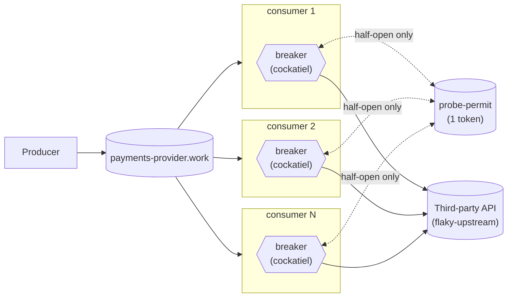

# One probe at a time

One producer, one broker, a fleet of competing-consumer daemons, each with
its own [cockatiel](https://github.com/connor4312/cockatiel) circuit
breaker. This is the third step in a circuit-breaker article series, built
on `article/02-in-process-breaker`. That branch's own incident report
surfaced a concrete problem on top of the already-known "five independent
verdicts" one: a successful half-open probe on *one* replica can burst up to
`maxInFlight` concurrent requests at a third party that's been back up for
milliseconds, and the five replicas' half-open windows aren't coordinated
either — so the fleet-wide worst case approaches `maxInFlight × replica
count`. This branch fixes that specific burst. It does **not** make the five
breakers agree — that's still open, see below.



Each replica's breaker is still its own `CircuitBreakerPolicy` instance —
the subgraphs are still the point. `probe-permit` is new: a single shared
token every replica's breaker reaches for, but only while it's in
`HalfOpen`. Closed and Open traffic never touches it.

## The permit

`packages/consumer/src/Breaker.ts`'s module doc has the full reasoning; the
short version:

Master's original design for this problem (a dedicated `@egress/aggregator`
publishing a canonical verdict, with a `probe-trigger`
single-active-consumer queue for electing which daemon does the actual
probing) is real prior art in this repo's own history, but it's three
separable concerns bundled into one system — an aggregator, a broadcast
verdict, and HA for the aggregator itself. This branch takes the smallest
piece: **stop the burst, without unifying the verdict.**

A bare RabbitMQ `x-single-active-consumer` queue doesn't fit here on its
own — it promotes a new active consumer on *disconnect*, not on "my own
backoff timer just elapsed and I want to try a probe," and there's no
aggregator in this branch to relay a remote probe's result back to whichever
replica asked for it. What does fit: a queue declared with `x-max-length: 1`
and `x-overflow: reject-publish`, seeded with one token by every replica at
startup — RabbitMQ keeps the first publish and rejects the rest with a nack
on the publisher's own confirm. Measured, not assumed: an earlier version of
this branch expected the rejection to be silent and crash-looped four of
five replicas on boot when it wasn't. `seedPermit`
(`packages/consumer/src/Breaker.ts`) swallows that nack deliberately — four
replicas losing this race is the successful outcome, not a failure.

When a replica's own breaker reaches `HalfOpen`, it does a non-blocking
`Rmq.get` against that queue before making the real call:

- **Gets the token** → makes the real call, then hands the token back
  (`nack`, requeuing the same message) regardless of outcome, so the next
  replica whose own backoff elapses can compete for it.
- **Queue was empty** → someone else is mid-probe. Fails immediately with
  `Breaker.NoPermit`, no network call. cockatiel treats this exactly like a
  failed probe: it reopens with the *next* backoff step, and this replica
  tries again next time its own clock elapses.

Closed and Open behavior are unchanged from article 2. This only changes
what a replica does during its own half-open window.

## The breaker

`packages/consumer/src/Breaker.ts` wraps every third-party call in a
cockatiel `CircuitBreakerPolicy`, one instance per process, created once and
reused for the process's whole life (cockatiel's own docs are explicit that
a breaker only works if the same instance sees every execution — a fresh one
per call would never accumulate a failure count).

- **Trip condition**: `ConsecutiveBreaker(BREAKER_THRESHOLD)` — opens after
  `BREAKER_THRESHOLD` (default 5) calls fail in a row. This is the direct
  in-code version of "a threshold on recent failures, never a single
  failure" from Part 1 of the article series.
- **Re-open timing**: `ExponentialBackoff` from `BREAKER_INITIAL_DELAY_MS`
  (default 1000ms) up to `BREAKER_MAX_DELAY_MS` (default 30000ms), doubling
  each time a half-open probe still fails. cockatiel's default backoff
  generator is already decorrelated-jitter — "exponential backoff and
  jitter" is what `new ExponentialBackoff()` gives you without extra
  configuration, not something layered on top.
- **Three outcomes, not two**: `"ok"` (accept), `"failed"` (a real call was
  attempted and failed, requeue), and `"open"` (no call reached the third
  party — either the breaker rejected it outright, or this replica's own
  half-open probe lost the fleet-wide permit race; see below). Both `"open"`
  cases requeue after a short jittered hold.

That hold (100–400ms, `OPEN_REQUEUE_DELAY_MIN_MS`/`MAX_MS` in
`consumer.ts`) exists because an open breaker rejects instantly — with no
hold, a rejected message goes straight back onto the queue and straight back
to the same consumer, which can spin against its own in-memory breaker at
whatever rate the broker will redeliver. The third party stops being
hammered; without the hold, the *broker* takes its place. Same shape as the
100–400ms jittered hold the pre-breaker daemon this series later removed
used for a shed `429`.

## What this still doesn't fix

**The five breakers still don't agree.** This branch stops them from
*recovering* in an uncoordinated burst; it does nothing about them
*tripping* and *staying open* on independent schedules. They still trip at
different moments, and still briefly disagree about whether the same third
party is up — watch the "Breaker state per replica" panel on the dashboard
during an incident, or read `infra/incident.mjs`'s own `breaker agreement`
line at the end of a run. Coordinating that into one fleet-wide verdict is
still a different, harder problem than this branch takes on.

**A replica that keeps losing the permit race backs off longer, whether or
not the third party is actually still down.** cockatiel has no way to tell
"my probe failed because the third party is unhealthy" apart from "my probe
never got the permit" — both call `recordHalfOpenFailure` and grow the same
backoff. A replica unlucky enough to lose every race for a while ends up
waiting far longer than `BREAKER_MAX_DELAY_MS` would suggest, for a third
party that might have been healthy the whole time.

**Still nothing outside a single process learns any of this.** Same
limitation article 1 and 2 both named: no alert, no webhook, no paging —
only Prometheus/Grafana, and only if someone's watching.

## Running it

```bash
pnpm install
docker compose up -d
docker compose up -d --scale rmq-consumer=12   # resize the fleet, no restart needed
```

- RabbitMQ management UI: <http://localhost:15672> (guest/guest) — watch
  `payments-provider.work`'s depth and `payments-provider.work.dead`'s
  growth.
- Grafana: <http://localhost:3000/d/in-process-breaker/in-process-breaker-e28094-five-not-one>
  — still article 2's dashboard, unchanged: this branch adds no new metric
  (there's nothing to chart about a permit fetch that the existing "calls by
  outcome" panel doesn't already show as `"open"`). Anonymous viewer access,
  no login needed. (Plain `:3000` lands on
  Grafana's own "Welcome" screen, not this dashboard — Grafana 13's
  anonymous Viewer role can't be granted the permission a *default home
  dashboard* needs, so there's no way to make `:3000` redirect here without
  requiring login. Use the direct link, or `Dashboards` in the left nav.)
  Panels: breaker state per replica, work-queue depth, dead-letter-queue
  depth, calls by outcome, breaker trips, active consumers.
- Grafana's own nav bar fires two calls (`/api/user/teams`,
  `/api/user/stars`) that need a real signed-in user and 401 for an
  anonymous session — a known rough edge in Grafana's anonymous-auth mode,
  not something this compose file controls. It shows as a stray toast on
  first load; the dashboard and its data are unaffected.
- Prometheus: <http://localhost:9090>.

## Injecting a failure

`flaky-upstream` stands in for the third party. Every field is optional and a
POST replaces the whole behaviour, so `{}` restores health:

```bash
curl -X POST localhost:8080/__fail -d '{"rate":1.0}'                # 503s
curl -X POST localhost:8080/__fail -d '{"rate":1.0,"mode":"hang"}'  # never answers
curl -X POST localhost:8080/__fail -d '{"rate":1.0,"mode":"reset"}' # drops the connection
curl -X POST localhost:8080/__fail -d '{"delayMs":1500}'            # slow, still correct
curl -X POST localhost:8080/__fail -d '{}'                          # healthy again
```

## The incident script

```bash
pnpm run incident
MODE=hang node infra/incident.mjs
```

Injects a full failure, watches the work queue and dead-letter queue for a
fixed window, restores the third party, and reports peak backlog, total
dead-lettered, time to drain, and a processed/duplicate count from
`flaky-upstream`'s own audit trail — same as article 1's version, plus one
thing this branch actually has to measure: at every poll tick it also reads
each replica's `egress_consumer_breaker_state` from Prometheus
(`PROMETHEUS`, default `http://localhost:9090`) and reports what fraction of
ticks saw every replica in the *same* state, and the peak number open at
once. That's the concrete, measured version of "five independent breakers
disagree" — produced by this branch's own run, not asserted.

## Load

The producer's rate is configurable and never reacts to anything:

```bash
RATE_PER_SECOND=500 docker compose up -d rmq-producer
```

Combine with `--scale rmq-consumer=N` and `infra/incident.mjs`'s `RATE`/
`WINDOW_MS` env vars to drive a specific incident shape.

## Layout

```
packages/
  config/      @egress/config — settings declared once, decoded at boot
  rmq/         @egress/rmq — Effect wrapper over amqplib, plus the generic
               work-queue naming/options a producer and a consumer fleet
               share. `get` (src/Client.ts) is new this branch: a
               non-blocking basic.get, what the probe-permit queue runs on.
  rmq-producer/  the load: a steady stream onto <apiId>.work, never backing off
  consumer/    the competing-consumer fleet, each with its own in-process
               breaker (src/Breaker.ts) — now sharing one probe-permit queue
               across the fleet during half-open only; see src/consumer.ts
               for what that still doesn't coordinate
  tracing/     the /metrics HTTP route every process serves; OpenTelemetry
               tracing is wired but off unless OTEL_EXPORTER_OTLP_ENDPOINT is set
infra/
  flaky-upstream.mjs   the fake third party: configurable failures, an audit trail
  rabbitmq.conf        the broker's flow-control watermark
  incident.mjs         drives one incident, reports what happened including
                        whether the fleet's breakers agreed with each other
  monitoring/          Prometheus scrape config and the Grafana dashboard
docker-compose.yml     the whole stack
```

Built on **Effect 4 (4.0.0-rc.115)**, same as the full system this branch was
pruned from — see `AGENTS.md` for why that version matters when writing
Effect code here. No build step: every package runs straight off its
`src/*.ts` through Node's built-in type stripping.

## Verification

```bash
pnpm run check       # typecheck + unit tests, including Breaker.test.ts against the real library
pnpm run test:rmq    # optional — needs Docker: AMQP behaviour against a real broker
```
