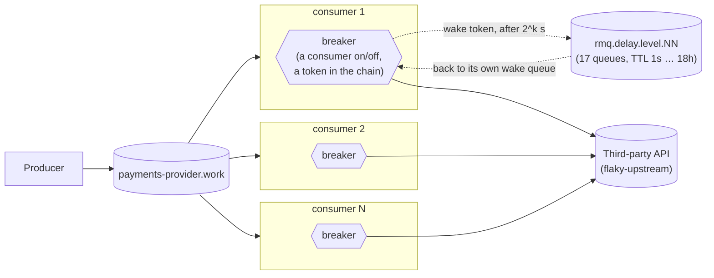

# In-process breaker, held by RabbitMQ — five, not one

One producer, one broker, a fleet of competing-consumer daemons — each one
wrapping its calls to the third party in its own circuit breaker. This is the
RabbitMQ-only variant of the second step in a circuit-breaker article series,
built on the `article/01-base-scenario` branch (no breaker at all). Where
`article/02-in-process-breaker` keeps the breaker in memory with
[cockatiel](https://github.com/connor4312/cockatiel), here **no breaker state is
in the process**: "open" is a consumer that isn't consuming, and the timer that
ends it is a message the broker holds. Still deliberately incomplete: five
replicas mean five breakers, and nothing here makes them agree with each other.



## The breaker

`packages/consumer/src/Breaker.ts` is a three-phase machine, and each phase is a
fact about the broker rather than a variable:

| phase | in the broker | leaves when |
| --- | --- | --- |
| **closed** | a work consumer at full prefetch (`MAX_IN_FLIGHT`) | `BREAKER_THRESHOLD` (5) calls fail **in a row** — the one thing a process still counts |
| **open** | *no* consumer; a wake token is in the delay chain, addressed to this replica | the token comes back after its hold |
| **half-open** | a consumer with `prefetch: 1` — the first message it gets is the probe | probe succeeds → closed; fails → open again with a longer hold |

- **Open is silence, not rejection.** Tripping drains the consumer (in-flight
  calls settle, nothing is handed back to be re-run) and stops. No delivery
  reaches the replica, so no call is made, nothing is requeued, and nothing
  spins — the work waits in the queue, which is what a queue is for. The
  in-process version had to reject each message locally and hold it 100–400ms
  before requeueing, and every rejection spent one of the message's three
  delivery attempts (see *Measured* below).
- **The hold is a message.** `packages/rmq/src/DelayedDelivery.ts` is the
  NServiceBus-style delay chain
  ([Particular's delayed delivery](https://docs.particular.net/transports/rabbitmq/delayed-delivery)):
  a queue per bit, level *n* with a TTL of exactly 2<sup>n</sup> seconds,
  dead-lettering into level *n−1*; a delay is its binary digits in the routing
  key, and each level either holds the message for its bit or passes it down.
  17 levels count to 131,071 s (36 h), so a **24-hour hold is one ordinary
  message** — no consumer, no unacked slot, no timer — and it survives a broker
  restart because the levels are durable quorum queues. Resolution is one
  second; a 5-second delay measured 5.21 s end to end.
- **The token carries the attempt.** Each failed probe re-sends the token with
  `attempt + 1`, and the hold is `initial · 2^attempt`, capped at
  `BREAKER_MAX_DELAY_SECONDS` (default 86,400) and jittered into its upper half
  so replicas that tripped together don't come back together. A closed breaker
  forgets: the next outage starts from the first hold.
- **Failures that are the third party's are `release`d, not `requeue`d.** A
  failed probe, and any failure that follows another on the same replica, says
  something about the third party, not about the message that happened to be
  carrying it. The queue's three-attempt budget is for messages, so charging it
  here dead-lettered 2–3 healthy messages per outage in the first chaos run —
  the breaker needs five failures to open and its consumer takes a round trip
  to stop, and in that window the same few messages are redelivered again and
  again. A failure that stands alone (a poison message between successes) is
  still charged and still parked.
- **What a process still knows**: the consecutive-failure counter while closed,
  and which token it is waiting for. A replica that restarts starts closed and
  its old wake queue expires on its own (`x-expires`, 10 minutes after its
  consumer is gone).

### Measured

The same 20-second total outage (`pnpm run incident`, 5 replicas, the default
producer rate), before and after, against the live stack:

| | in-process (cockatiel) | held by RabbitMQ |
| --- | --- | --- |
| dead-lettered by the outage | **2,745** | **0** |
| calls that reached the failing third party | 50 | 55 |
| peak work-queue backlog | 1,973 | 4,020 (all of it kept) |
| every breaker closed, after restore | 23.0 s | 9.0 s |

Fifty real failures cannot account for 2,745 dead letters. The rest are
messages that never got a call: an open cockatiel breaker rejects locally and
requeues with `reject`, which counts against the queue's `x-delivery-limit`
(see `settle` in `packages/rmq/src/Client.ts`), so three rejections
dead-lettered a message. That is the mechanism the numbers point to; I did not
instrument the old build to count rejections per message. A 70-second outage on the new build: 67 calls
reached the third party across five replicas, nothing dead-lettered, holds grew
1 → 2 → 4 → 8 → … → 62 s, and the last breaker closed 55.9 s after restore. Both
tables are one run each — a single incident, not a distribution.

### The price of a long hold

A hold of *h* seconds means a replica notices the recovery up to *h* seconds
late. With a 24-hour ceiling, a day-long outage can leave a replica dark for
most of another. The ceiling is a statement of how late you can tolerate finding
out, not just how gently you want to probe. Also: if a token were lost — the
wake queue deleted by hand, say — the replica would stay open until restarted;
nothing re-sends it.

### Chaos

`node infra/chaos-breaker.mjs` injects real faults under a 200 → 1,000/s spike
and judges each on correctness (per message: nothing lost, dead-letter queue
not grown) and then on the breaker: an outage, a hanging third party, a
`docker kill` of a replica while it is open, a broker restart with five tokens
in the chain, and a 100 s delay across a broker restart. All five graded
scenarios pass after the `release` fix, about 45,000 messages each; the write-up,
with the run that found the fix and screenshots of the incident, is
[docs/rabbitmq-held-breaker.md](docs/rabbitmq-held-breaker.md). Runs are saved
under `history/runs/` (git-ignored; the two the article cites are kept in
`docs/runs/`). `infra/capture-incident.mjs` records the dashboard
through an incident (it needs `playwright-core`, which this repo does not
depend on).

## What this still doesn't fix

Five consumers means five breakers, each formed only from the calls that one
process happened to make. They will trip at different moments, recover at
different moments, and briefly disagree about whether the same third party
is up — watch the "Breaker state per replica" panel on the dashboard during
an incident, or read `infra/incident.mjs`'s own `breaker agreement` line at
the end of a run. Now that the state lives in the broker, coordinating it into
one fleet-wide verdict is a smaller step — one token instead of five — but it is
a different problem, and the next branch in this series, not this one.

## Running it

```bash
pnpm install
docker compose up -d
docker compose up -d --scale rmq-consumer=12   # resize the fleet, no restart needed
```

- RabbitMQ management UI: <http://localhost:15672> (guest/guest) — watch
  `payments-provider.work`'s depth and `payments-provider.work.dead`'s
  growth.
- Grafana: <http://localhost:3000/d/in-process-breaker/in-process-breaker-e28094-five-not-one>
  — anonymous viewer access, no login needed. (Plain `:3000` lands on
  Grafana's own "Welcome" screen, not this dashboard — Grafana 13's
  anonymous Viewer role can't be granted the permission a *default home
  dashboard* needs, so there's no way to make `:3000` redirect here without
  requiring login. Use the direct link, or `Dashboards` in the left nav.)
  Panels: breaker state per replica, work-queue depth, dead-letter-queue
  depth, calls by outcome, breaker trips, active consumers.
- Grafana's own nav bar fires two calls (`/api/user/teams`,
  `/api/user/stars`) that need a real signed-in user and 401 for an
  anonymous session — a known rough edge in Grafana's anonymous-auth mode,
  not something this compose file controls. It shows as a stray toast on
  first load; the dashboard and its data are unaffected.
- Prometheus: <http://localhost:9090>.

## Injecting a failure

`flaky-upstream` stands in for the third party. Every field is optional and a
POST replaces the whole behaviour, so `{}` restores health:

```bash
curl -X POST localhost:8080/__fail -d '{"rate":1.0}'                # 503s
curl -X POST localhost:8080/__fail -d '{"rate":1.0,"mode":"hang"}'  # never answers
curl -X POST localhost:8080/__fail -d '{"rate":1.0,"mode":"reset"}' # drops the connection
curl -X POST localhost:8080/__fail -d '{"delayMs":1500}'            # slow, still correct
curl -X POST localhost:8080/__fail -d '{}'                          # healthy again
```

## The incident script

```bash
pnpm run incident
MODE=hang node infra/incident.mjs
```

Injects a full failure, watches the work queue and dead-letter queue for a
fixed window, restores the third party, and reports peak backlog, total
dead-lettered, time to drain, and a processed/duplicate count from
`flaky-upstream`'s own audit trail — same as article 1's version, plus one
thing this branch actually has to measure: at every poll tick it also reads
each replica's `egress_consumer_breaker_state` from Prometheus
(`PROMETHEUS`, default `http://localhost:9090`) and reports what fraction of
ticks saw every replica in the *same* state, and the peak number open at
once. That's the concrete, measured version of "five independent breakers
disagree" — produced by this branch's own run, not asserted.

## Load

The producer's rate is configurable and never reacts to anything:

```bash
RATE_PER_SECOND=500 docker compose up -d rmq-producer
```

Combine with `--scale rmq-consumer=N` and `infra/incident.mjs`'s `RATE`/
`WINDOW_MS` env vars to drive a specific incident shape.

## Layout

```
packages/
  config/      @egress/config — settings declared once, decoded at boot
  rmq/         @egress/rmq — Effect wrapper over amqplib, the generic
               work-queue naming/options a producer and a consumer fleet share,
               and DelayedDelivery.ts: the delay chain a breaker's hold is made of
  rmq-producer/  the load: a steady stream onto <apiId>.work, never backing off
  consumer/    the competing-consumer fleet, each with its own breaker whose
               state is the broker's (src/Breaker.ts) — see src/consumer.ts
               for what that still doesn't coordinate
  tracing/     the /metrics HTTP route every process serves; OpenTelemetry
               tracing is wired but off unless OTEL_EXPORTER_OTLP_ENDPOINT is set
infra/
  flaky-upstream.mjs   the fake third party: configurable failures, an audit trail
  rabbitmq.conf        the broker's flow-control watermark
  incident.mjs         drives one incident, reports what happened including
                        whether the fleet's breakers agreed with each other
  monitoring/          Prometheus scrape config and the Grafana dashboard
docker-compose.yml     the whole stack
```

Built on **Effect 4 (4.0.0-rc.115)**, same as the full system this branch was
pruned from — see `AGENTS.md` for why that version matters when writing
Effect code here. No build step: every package runs straight off its
`src/*.ts` through Node's built-in type stripping.

## Verification

```bash
pnpm run check       # typecheck + unit tests, including Breaker.test.ts against a fake world
pnpm run test:rmq    # optional — needs Docker: AMQP behaviour against a real broker,
                     # including the delay chain's timing and graceful consumer drain
```
