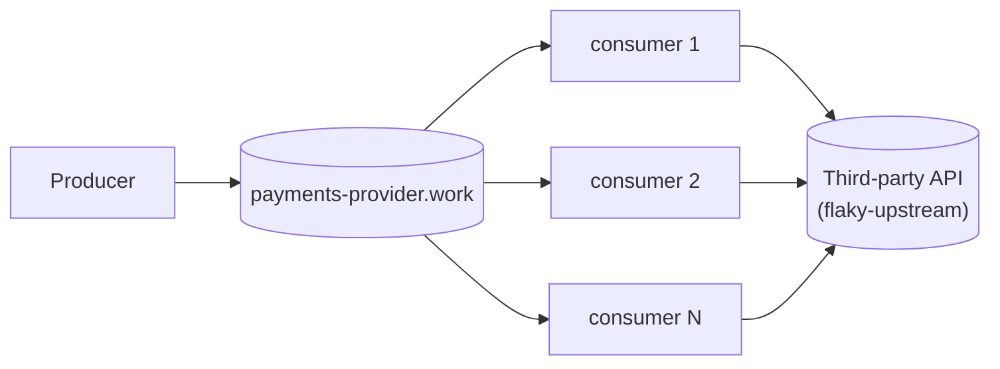

# Abstracting over the circuit breaker

"Add a circuit breaker" usually means adding a library to every service that calls
the flaky dependency. Written that way, the breaker looks like one thing. It is
really four answers that a library happens to give together:

- **What counts as a failure.** A `503` is the third party failing. A `429` is it
  asking you to slow down. A `422` is it refusing this one request.
- **Where the state lives.** In each process's memory, in something the fleet
  shares, or in a control plane.
- **What "open" does.** It rejects calls locally, or it stops taking work at all.
- **Who decides to try again.** A timer in every replica, or one probe the whole
  fleet agrees on.

With the four pulled apart, each can be given a better answer than the default.
This series does that one step at a time on the same system: a producer, a
RabbitMQ work queue and a fleet of competing consumers calling a flaky third
party:

Each step is a branch with its own code and measurements, and each link below
opens that branch's README, which holds its diagram.

> **A note on the rabbit hole.** Each branch digs one level deeper into the
> breaker, and most of the digging is into RabbitMQ: delivery limits, one-token
> queues, single active consumers, messages that expire into other queues. It is
> easy to keep going past the point where it pays, so you don't have to read to
> the bottom. Articles 3 and 4 are where most consumer fleets can stop; article 5
> is for when the verdict has to leave the fleet.

| | Where the state lives | What open does | Measured in an outage |
| --- | --- | --- | --- |
| [01 · No breaker](../../blob/article/01-base-scenario/README.md) | nowhere | nothing: every message spends its 3 attempts | ≈ 4,000 dead-lettered in 20 s |
| [02 · A breaker in every process](../../blob/article/02-in-process-breaker/README.md) | each replica's memory | rejects locally, spending the message's attempts | 1,577–2,246 dead-lettered in 15 s; ~27 openings for one outage |
| [03 · Coordinated through the broker](../../blob/article/03-rabbitmq-coordination/README.md) | each replica, plus a shared probe permit | releases the message without spending an attempt | 0 dead-lettered in 40 s; one probe at a time instead of 6 |
| [04 · Held by the broker](../../blob/article/04-rabbitmq-only-breaker/README.md) | RabbitMQ: a consumer on or off, a token in a delay chain | stops consuming; the work waits in the queue | 0 dead-lettered where cockatiel lost 2,745 |
| [05 · A platform control plane](../../blob/article/05-platform-control-plane/README.md) | Envoy per replica, and one verdict per API in an aggregator | Envoy ejects hosts; the fleet stops consuming | 0 lost, 0 dead-lettered across ten chaos faults |

Two things carry through the steps:

- **The breaker gets simpler, not bigger.** By article 4 the breaker keeps no
  state of its own. The broker already holds messages durably, delays them and
  elects one consumer among many, and the breaker is built from those.
- **Most of the loss came from what open did, not from the outage.** In article
  2, 52–59 real failures cost 1,577–2,246 dead letters, because every call an
  open breaker turned away still spent one of the message's delivery attempts.

Article 5 moves the breaker to platform level: Envoy enforces, and an aggregator
publishes one verdict per API as events. It costs about three times the code of
article 3, and pays only when other systems act on the verdict.

## About the code

Every branch is TypeScript on [Effect 4](https://effect.website) (a release
candidate: rc.116 on articles 1–3, rc.117 on 4–5), talking to RabbitMQ through
`amqplib`. There is no build step: Node 26 runs the `.ts` sources directly, so
`pnpm run check` (typecheck and unit tests) is the only compile the code gets.
Effect 4 renamed and reshaped much of Effect 3, which most examples online
still use, so each branch vendors the exact Effect source it runs against in
`repos/effect`. Each branch's README says how to start its stack with
`docker compose`.
