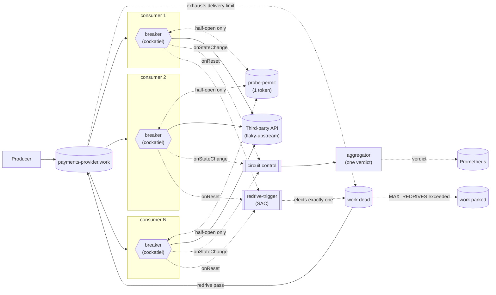

# Every dead letter earned it

One producer, one broker, a fleet of competing-consumer daemons, each with
its own [cockatiel](https://github.com/connor4312/cockatiel) circuit
breaker, a shared probe permit, a single aggregator publishing one
fleet-wide verdict, and a way for dead-lettered work to come back — plus,
new this branch, a fix to what "dead-lettered" even means. This is the
sixth step in a circuit-breaker article series, built on
`article/05-dead-letter-redrive`. Every report in this series has named the
same standing problem, since article 1: a message can be dead-lettered
without the third party ever seeing it. This branch is what finally stops
that from happening.

Same pattern as every branch before it: checked `master` for real prior
art rather than designing from scratch, and this time also checked this
series' own history — `consumer.ts`'s `decide()` function already carried a
doc comment defending the exact behavior this branch reverses, on the
grounds that it was "a telemetry fact, not a settlement fact." It turns out
to be both. See "Counted attempts" below for what changed and why the
earlier reasoning was wrong.



Each replica's breaker is still its own `CircuitBreakerPolicy` instance —
nothing draws a line *between* the subgraphs, same as before. `circuit.control`
is a one-way, off-the-hot-path fan-in: every replica publishes to it, only
the aggregator reads it, and nothing reads back from the aggregator into any
consumer subgraph. `redrive-trigger` is a third, unrelated fan-in with the
same one-way shape: every replica may publish to it, but RabbitMQ delivers
to exactly one bound consumer at a time, so only one replica's redrive
passes ever touch `work.dead`.

## Counted attempts

The change is one line in `packages/consumer/src/consumer.ts`'s `decide()`:

```ts
// before (articles 1–5)
outcome === "ok" ? "accept" : "requeue"
// after (this branch)
outcome === "ok" ? "accept" : outcome === "open" ? "release" : "requeue"
```

`WORK_DELIVERY_LIMIT` is 3. Before this branch, every non-`"ok"` outcome —
whether a real call was attempted and failed, or the local breaker rejected
the message with no network attempt at all — settled as `"requeue"`, which
counts toward that limit. A sustained outage opens the breaker almost
immediately, and every message after that gets the `"open"` outcome purely
locally. Three redeliveries landing on an open breaker — plausible within
milliseconds of each other — dead-lettered a message that had never once
reached the third party.

The fix was already sitting unused: `@egress/rmq/Client.ts`'s `Settlement`
type has a `"release"` outcome whose own doc comment names this exact
case — *"a local 503 from a concurrency limiter is the case this
exists for"* — and its `settle()` implementation's nack-with-requeue is
one this same file's comments already confirm RabbitMQ 4.3 doesn't count
toward a quorum queue's `x-delivery-limit`. Master's own
`packages/rmq-consumer/src/Attempts.ts` draws exactly this line: a
`"shed"` outcome (never reached the third party) releases; a `"failed"`
one (a real call, failed) republishes with an incremented attempts count.
`"failed"` still `"requeue"`s here, unchanged — a real call was made and
did fail, which is exactly what the budget is for.

**Measured live, not assumed:** a 40-second sustained outage (`rate=1.0`,
every call fails) that would have dead-lettered roughly 1,785 messages in
its first 15 seconds under article 5's behavior instead kept
`payments-provider.work.dead` at **zero for the entire outage**. Nothing
was lost that was never tried. The trade is real, not free: the work queue
itself grew unbounded instead — 6,800 messages backlogged by the 40-second
mark and still climbing — because a message rejected locally now cycles
between the queue and an uncounted release for as long as the breaker
stays open, at whatever rate `OPEN_REQUEUE_DELAY_MIN_MS`/`MAX_MS` allows,
rather than escaping to `work.dead` after three quick tries. See "what
this still doesn't fix" for what that trade costs.

## The redrive

`packages/consumer/src/Redrive.ts` plus wiring in `consumer.ts`. The
problem this closes: every article since 1 has measured real messages
piling up in `<api>.work.dead` with nothing ever reading them back —
1,975 in one 15s outage in article 3's report, 1,777 in article 4's.

Checked `master`'s own prior art first
(`packages/rmq-consumer/src/Redrive.ts`): one daemon per API, elected by a
`x-single-active-consumer` trigger queue, runs bounded passes moving
messages from the dead-letter queue back onto the work queue, incrementing
a redrive-count header each time and parking anything that's failed
`MAX_REDRIVES` (5) times as poison rather than replaying it forever. The
election itself needs no code of this project's own — the same broker
guarantee article 3's permit queue already leaned on, just applied to a
different problem: RabbitMQ promotes a new active consumer automatically if
the elected one disconnects.

Two scope choices, made explicitly rather than defaulted into:

- **What gates a pass.** Master gates on the elected daemon's own local
  breaker being closed. The alternative — gate on `@egress/aggregator`'s
  published fleet verdict instead — would have finally given that verdict
  something to act on, closing article 4's own "the verdict doesn't gate
  anything" finding. This branch keeps master's original choice: the
  elected replica's own local view. Lower risk, proven design — the
  verdict-gating idea is a documented option not taken, not a rejected one.
- **How much of master's Redrive.ts to port.** Master's dead-letter queue
  is shared with malformed messages from its own SAC trigger queues, so it
  carries origin-queue/origin-reason attribution logic to tell real work
  apart from that. In this repo's topology the trigger queue never carries
  a payload of consequence — nothing is ever published to it but the
  trigger itself — so `work.dead` can only ever hold real dead-lettered
  work. That whole defensive layer has nothing to guard against here and is
  left out.

A pass (`Redrive.runPass`) drains `work.dead` with the same non-blocking
`rmq.get` article 3's permit queue uses — a natural fit, since "replay
what's there, stop when it's empty" needs no idle timer the way a
long-lived `consume` subscription would. Each iteration re-checks the gate
fresh, publishes to `work` or `work.parked` before acking the original
(never the reverse — a crash between the two redelivers a duplicate;
acking first would lose the message outright), and stops at 200 messages
per pass so one pass can't hog the queue's single active-consumer slot
indefinitely. A trigger is published on every `onReset` (this replica's own
breaker just closed — "the outage might be over" first becomes true here)
and once at startup, so a backlog already sitting in `work.dead` when a
replica restarts closed doesn't wait for a fresh trip.

**Measured live, not assumed:** redrive only progresses on a breaker
transition, not continuously. Driving an incident and watching afterward,
`work.dead` dropped from ~1,480 to 1,225 over the first 30 seconds after
recovery, then sat at exactly 1,225 for the next 20+ seconds with every
replica already closed — nothing left to trigger another pass. Publishing
manual triggers by hand resumed it immediately, in the same ~200-message
steps, confirming the mechanism itself was never stuck, only untriggered.
A second thing manual triggering surfaced: a trigger that arrives while a
pass is already running is silently dropped, not queued, so firing several
in quick succession doesn't parallelize or speed anything up — most of them
are simply wasted. Both are real limits of this branch's design, not bugs;
see "what this still doesn't fix."

**Since resolved:** checked against `master`'s own ADR for this
(`docs/decisions/016-*.md`, `master`-only), which names this exact stall —
"messages dead-letter while `CLOSED` too... nothing would ever replay them
until the breaker happened to open and close again, which might not happen
for a long time" — and fixes it with a periodic sweep on top of the
transition trigger, not instead of it. `consumer.ts` now does the same:
every 30 seconds, if this replica's own breaker is closed, it fires the same
`triggerRedrive()` a reset would. A message that dead-letters with no
breaker ever moving now waits at most 30s for a pass to find it, not
indefinitely.

## The aggregator

Checked `master`'s own design essay for how it justified this piece, and
it states the reasoning directly: **protecting the request path and
telling the rest of the system about an outage are different problems
with different correct answers.** Sharing breaker state across replicas
*before* deciding whether to call is the tempting fix and the wrong one —
it puts a network round trip and a shared failure domain in the hot path
of the one component whose job is surviving other people's failures. So
the aggregator computes its verdict from events published *after* each
replica has already decided for itself, off the hot path, and publishes it
for anyone who wants to know — never back into any replica's own breaker.

`packages/aggregator` is a small, single-instance service — no scaling, no
leader election, no persistence, a real SPOF this branch names rather than
hides (see "what this still doesn't fix"). Its job, in full:

- Bind one queue to `circuit.control` with routing key `circuit.*` — every
  API this deployment ever runs, not hardcoded to one.
- On each event (`{apiId, instance, state, at}`, published by
  `consumer.ts`'s `onStateChange`), update an in-memory
  `Map<apiId, Map<instance, {state, at}>>`, pruning any instance not heard
  from in `STALENESS_MS` (default 60s) — otherwise a scaled-down or crashed
  replica's last vote would count forever, permanently biasing the fraction
  toward whatever it last reported.
- Compute `openFraction` — the pruned registry's share currently `open` or
  `half_open` (half-open still isn't serving normal traffic, so it counts
  the same as open) — and a verdict: `open` once that fraction reaches
  `VERDICT_THRESHOLD` (default 0.5), else `closed`. Both the fraction and
  the verdict (`packages/aggregator/src/Verdict.ts`) are pure functions,
  unit-tested with no broker involved — same "pull the decision out" shape
  as `consumer.ts`'s own `decide`.
- Publish `egress_fleet_verdict_state` and `egress_fleet_open_fraction` to
  Prometheus, and log every verdict transition.

Restarting the aggregator starts it from "no data yet": the registry is
pure memory, and it repopulates within a few replicas' worth of
transitions. That's an explicit trade for staying single-instance this
branch, not an oversight.

## The permit

`packages/consumer/src/Breaker.ts`'s module doc has the full reasoning; the
short version:

Master's original design for this problem (a dedicated `@egress/aggregator`
publishing a canonical verdict, with a `probe-trigger`
single-active-consumer queue for electing which daemon does the actual
probing) is real prior art in this repo's own history, but it's three
separable concerns bundled into one system — an aggregator, a broadcast
verdict, and HA for the aggregator itself. This branch takes the smallest
piece: **stop the burst, without unifying the verdict.**

A bare RabbitMQ `x-single-active-consumer` queue doesn't fit here on its
own — it promotes a new active consumer on *disconnect*, not on "my own
backoff timer just elapsed and I want to try a probe," and there's no
aggregator in this branch to relay a remote probe's result back to whichever
replica asked for it. What does fit: a queue declared with `x-max-length: 1`
and `x-overflow: reject-publish`, seeded with one token by every replica at
startup — RabbitMQ keeps the first publish and rejects the rest with a nack
on the publisher's own confirm. Measured, not assumed: an earlier version of
this branch expected the rejection to be silent and crash-looped four of
five replicas on boot when it wasn't. `seedPermit`
(`packages/consumer/src/Breaker.ts`) swallows that nack deliberately — four
replicas losing this race is the successful outcome, not a failure.

When a replica's own breaker reaches `HalfOpen`, it does a non-blocking
`Rmq.get` against that queue before making the real call:

- **Gets the token** → makes the real call, then hands the token back
  (`nack`, requeuing the same message) regardless of outcome, so the next
  replica whose own backoff elapses can compete for it.
- **Queue was empty** → someone else is mid-probe. Fails immediately with
  `Breaker.NoPermit`, no network call. cockatiel treats this exactly like a
  failed probe: it reopens with the *next* backoff step, and this replica
  tries again next time its own clock elapses.

Closed and Open behavior are unchanged from article 2. This only changes
what a replica does during its own half-open window.

## The breaker

`packages/consumer/src/Breaker.ts` wraps every third-party call in a
cockatiel `CircuitBreakerPolicy`, one instance per process, created once and
reused for the process's whole life (cockatiel's own docs are explicit that
a breaker only works if the same instance sees every execution — a fresh one
per call would never accumulate a failure count).

- **Trip condition**: `ConsecutiveBreaker(BREAKER_THRESHOLD)` — opens after
  `BREAKER_THRESHOLD` (default 5) calls fail in a row. This is the direct
  in-code version of "a threshold on recent failures, never a single
  failure" from Part 1 of the article series.
- **Re-open timing**: `ExponentialBackoff` from `BREAKER_INITIAL_DELAY_MS`
  (default 1000ms) up to `BREAKER_MAX_DELAY_MS` (default 30000ms), doubling
  each time a half-open probe still fails. cockatiel's default backoff
  generator is already decorrelated-jitter — "exponential backoff and
  jitter" is what `new ExponentialBackoff()` gives you without extra
  configuration, not something layered on top.
- **Three outcomes, not two**: `"ok"` (accept), `"failed"` (a real call was
  attempted and failed, requeue), and `"open"` (no call reached the third
  party — either the breaker rejected it outright, or this replica's own
  half-open probe lost the fleet-wide permit race; see below). Both `"open"`
  cases requeue after a short jittered hold.

That hold (100–400ms, `OPEN_REQUEUE_DELAY_MIN_MS`/`MAX_MS` in
`consumer.ts`) exists because an open breaker rejects instantly — with no
hold, a rejected message goes straight back onto the queue and straight back
to the same consumer, which can spin against its own in-memory breaker at
whatever rate the broker will redeliver. The third party stops being
hammered; without the hold, the *broker* takes its place. Same shape as the
100–400ms jittered hold the pre-breaker daemon this series later removed
used for a shed `429`.

## What this still doesn't fix

**An outage the third party never recovers from grows the work queue
without bound.** This branch's own trade, measured above: a message
rejected locally no longer escapes to `work.dead` after three tries, so a
genuinely permanent third-party failure — not a transient outage, a real
one — now backlogs forever instead of eventually being parked somewhere a
human would look. `x-delivery-limit` was, among other things, an accidental
circuit-breaker on backlog growth; this branch removes it for exactly the
messages it used to catch, without replacing it with anything else.

~~Redrive only progresses on a breaker transition, not continuously~~ —
resolved (see "The redrive"'s "Since resolved" note): a 30s clock-driven
sweep now triggers a pass independently of any transition, matching
`master`'s own ADR 016 fix. A very large backlog still recovers in
~200-message chunks per pass, just no longer gated on the fleet
transitioning to produce one.

**A trigger arriving mid-pass is dropped, not queued.** Only one pass runs
at a time per elected replica; anything that arrives while it's running is
a silent no-op. Firing several triggers in quick succession — by hand, or
from several replicas resetting close together — wastes most of them
rather than queuing follow-up work.

**Redrive timing is tied to whichever replica happens to be SAC-elected,
not to the fleet's fastest or its published verdict.** The same
local-view tradeoff the probe permit already made, applied to a new
problem: if the elected replica is the last one to close, the whole
fleet's dead letters wait on that one replica's own backoff clock — up to
`BREAKER_MAX_DELAY_MS` (30s) after the third party is already healthy
again — even while every other replica, and the aggregator's own verdict,
has already said `closed`. Gating on the verdict instead was a considered
option (see "The redrive"); this branch didn't take it.

**The registry's denominator is "replicas that have ever transitioned," not
"the actual fleet."** A replica that's stayed `closed` the whole time has
never published to `circuit.control` at all — `onStateChange` only fires on
a real transition — so it's invisible to the aggregator, not counted as a
healthy vote. Measured live: with 5 replicas all starting closed, the
moment the *first two* tripped open, the registry only knew about those
two, so `openFraction` was 2/2 = 100% and the verdict opened instantly —
0.0s measured lag — rather than waiting for something closer to half the
real fleet. The verdict is honest about what it's heard, not about the
fleet's actual size.

Checked against `master`'s own ADR for this exact hazard (`docs/decisions/
009-*.md`, `master`-only): its decision wasn't to fix the arithmetic —
there's no way to know the real fleet size without inventing a heartbeat
this branch doesn't have — but to make the denominator's movement loud
rather than silent. This branch now does the same: `egress_fleet_known_
replicas` exposes the pruned registry's size per `apiId` next to
`openFraction`, and a replica dropped for staleness is logged
(`Effect.logWarning`) at the moment it's dropped. The 2/2-vs-5-replica gap
above is still real and still not solved — now it's at least visible on
the same dashboard as the fraction it's the denominator of.

**The verdict doesn't gate anything.** No consumer reads
`egress_fleet_verdict_state` — that's the point, per the design essay
quoted above, but it means a real subscriber (a status page, an alert, a
dependent service) still has to exist for this to matter. Right now the
verdict's only reader is Prometheus and whoever looks at Grafana.

**The aggregator is an unreplicated single point of failure.** One
instance, no leader election, no persistence. If it's down, every
replica's own breaker keeps protecting itself exactly as before — but the
fleet has zero published opinion until it's back, and its in-memory
registry starts over from nothing when it is.

**A dropped `circuit.control` publish is silently lost.** `consumer.ts`
logs and moves on rather than retrying — an honest simplification, not
master's `AmqpControlPlaneSink` (bounded retry, a dead-letter buffer for
inspection). A replica whose one publish attempt fails during a network
blip can leave the aggregator believing it's still in whatever state it
last successfully reported, until its next transition.

**The staleness window and the threshold are both heuristics, not measured
constants.** 60 seconds and 50% are defaults that happened to work for this
scenario's timings; nothing here tunes them against a real distribution of
replica counts or outage shapes.

**A replica that keeps losing the permit race backs off longer, whether or
not the third party is actually still down.** Unchanged from article 3:
cockatiel has no way to tell "my probe failed because the third party is
unhealthy" apart from "my probe never got the permit" — both call
`recordHalfOpenFailure` and grow the same backoff.

~~A message can still be dead-lettered without ever reaching the third
party~~ — resolved this branch (see "Counted attempts"), with its own new
limit above: nothing dead-letters that was never tried, but nothing bounds
the work queue's growth during a genuinely permanent failure either.
~~Dead-lettered work still has no way back~~ — resolved article 5, with
its own limits further above.

## Running it

```bash
pnpm install
docker compose up -d
docker compose up -d --scale rmq-consumer=12   # resize the fleet, no restart needed
```

- RabbitMQ management UI: <http://localhost:15672> (guest/guest) — watch
  `payments-provider.work`'s depth and `payments-provider.work.dead`'s
  growth.
- Grafana: <http://localhost:3000/d/in-process-breaker/in-process-breaker-e28094-five-not-one>
  — same dashboard as articles 2–4, two new panels at the bottom: "Parked
  queue depth" (should stay at 0 — a nonzero value means genuine poison,
  not just an outage) and "Redrives" (moved vs. parked, by rate — only ever
  nonzero on whichever replica is currently SAC-elected).
  Anonymous viewer access, no login needed. (Plain `:3000` lands on
  Grafana's own "Welcome" screen, not this dashboard — Grafana 13's
  anonymous Viewer role can't be granted the permission a *default home
  dashboard* needs, so there's no way to make `:3000` redirect here without
  requiring login. Use the direct link, or `Dashboards` in the left nav.)
  Panels: fleet verdict, breaker state per replica, work-queue depth,
  dead-letter-queue depth, calls by outcome, breaker trips, active
  consumers, parked-queue depth, redrives.
- Grafana's own nav bar fires two calls (`/api/user/teams`,
  `/api/user/stars`) that need a real signed-in user and 401 for an
  anonymous session — a known rough edge in Grafana's anonymous-auth mode,
  not something this compose file controls. It shows as a stray toast on
  first load; the dashboard and its data are unaffected.
- Prometheus: <http://localhost:9090>.

## Injecting a failure

`flaky-upstream` stands in for the third party. Every field is optional and a
POST replaces the whole behaviour, so `{}` restores health:

```bash
curl -X POST localhost:8080/__fail -d '{"rate":1.0}'                # 503s
curl -X POST localhost:8080/__fail -d '{"rate":1.0,"mode":"hang"}'  # never answers
curl -X POST localhost:8080/__fail -d '{"rate":1.0,"mode":"reset"}' # drops the connection
curl -X POST localhost:8080/__fail -d '{"delayMs":1500}'            # slow, still correct
curl -X POST localhost:8080/__fail -d '{}'                          # healthy again
```

## The incident script

```bash
pnpm run incident
MODE=hang node infra/incident.mjs
```

Injects a full failure, watches the work queue and dead-letter queue for a
fixed window, restores the third party, and reports peak backlog, total
dead-lettered, time to drain, and a processed/duplicate count from
`flaky-upstream`'s own audit trail — same as article 1's version, plus one
thing this branch actually has to measure: at every poll tick it also reads
each replica's `egress_consumer_breaker_state` from Prometheus
(`PROMETHEUS`, default `http://localhost:9090`) and reports what fraction of
ticks saw every replica in the *same* state, and the peak number open at
once. That's the concrete, measured version of "five independent breakers
disagree" — produced by this branch's own run, not asserted.

Since article 4, it also reads `egress_fleet_verdict_state` and reports how
many seconds the published verdict lagged behind the first replica to
individually notice the outage (or, if the threshold happens to trip on a
sparser sample before every replica's own state is visible again, how many
seconds it led — that's a polling artifact of two separate Prometheus
queries per tick, not a claim the aggregator somehow knew first).

New this branch: after the work queue drains, it keeps polling the
dead-letter and parked queues until they go idle (`REDRIVE_WAIT_MS`,
default 40s — generous on purpose, since redrive only starts once the
SAC-elected replica's own breaker closes, which can trail recovery by up
to that replica's own backoff) and reports how many of the incident's
dead-lettered messages actually came back onto the work queue versus were
parked as poison versus are still sitting dead-lettered when the script
gives up.

## Load

The producer's rate is configurable and never reacts to anything:

```bash
RATE_PER_SECOND=500 docker compose up -d rmq-producer
```

Combine with `--scale rmq-consumer=N` and `infra/incident.mjs`'s `RATE`/
`WINDOW_MS` env vars to drive a specific incident shape.

## Chaos testing

`infra/incident.mjs` drives one clean, single-fault scenario — the kind
each article's own report is built on. `infra/chaos-load.mjs` is different:
process and flaky-service faults injected under sustained load, judged
first on whether any confirmed message ever actually goes missing, and
only then on whether the breakers/aggregator behaved as documented. Every
component this series has introduced gets run through it, not just the
one it was added for.

```bash
node infra/chaos-load.mjs --list
node infra/chaos-load.mjs                                    # every fault
node infra/chaos-load.mjs --faults=kill-one-consumer
node infra/chaos-load.mjs --rate=500 --spike=3000 --fault-seconds=25
```

All traffic during a run comes from one forked publisher
(`infra/chaos-publisher.mjs`, unmodified from master — it already speaks
this repo's exact wire format); the compose producer is stopped for the
run's duration. Correctness is per-message, not from broker counters:
every bit the publisher's own confirmed-bitmap sets must show up either in
`flaky-upstream`'s processed-bitmap or still physically sitting in
`work`/`work.dead`/`work.parked` — anything else is a genuine loss and
stops the run. Five faults exist today: `kill-one-consumer`,
`kill-all-consumers`, `kill-aggregator`, `kill-broker` (SIGKILLs the
RabbitMQ container itself — `master`'s own decisive fault for its ADR 016
measurement), and `flaky-storm` (cycles `error`→`hang`→`reset`→healthy
under one spike).

First full run (2026-09-19, light and heavy load profiles, ~350k confirmed
messages total): all four faults that existed then passed with zero
unaccounted messages. Two things worth knowing, neither a correctness bug:

- A mixed-mode outage can leave a breaker open for well over 90 seconds
  after the upstream is fully healthy again — cycling through three
  failure modes back to back lets `ExponentialBackoff` climb close to its
  30s ceiling before the storm even ends. It does close eventually.
- The redriver never fired in any run — `work.dead` stayed at 0 throughout.
  Article 6's fix means only a message unlucky enough to be in flight in
  the narrow window *before* a replica's breaker trips can still
  dead-letter, so real dead-lettering under chaos has gotten genuinely
  rare. Exercising the redriver under chaos would need a fault purpose-built
  to force that narrow case — not built yet.

`kill-broker` was added checking this harness against `master`'s own ADRs
rather than only this branch's components — `kill-one-consumer` through
`flaky-storm` never touch the broker itself, and master's ADR 016 was
decided from exactly that fault. Adding it needed `queueDepth` to survive
the broker being briefly unreachable (it now returns `undefined` rather
than throwing, matching `breakerStates`/`fleetVerdict`'s existing style);
without that fix the settle loop crashed the whole run the instant the
fault killed the broker mid-poll. Passed clean at the light profile: zero
unaccounted messages, settled in ~7s, no breaker ever opened (an AMQP
reconnect isn't an upstream call failure).

## Layout

```
packages/
  config/      @egress/config — settings declared once, decoded at boot
  rmq/         @egress/rmq — Effect wrapper over amqplib, plus the generic
               work-queue naming/options a producer and a consumer fleet
               share, the circuit.control naming convention, and (as of
               this branch) the redrive-trigger/parked-queue naming
               (ControlPlane.ts). `get` (src/Client.ts, article 3, now also
               carrying message headers for article 5's redrive-count
               check) is what both the probe-permit queue and a redrive
               pass run on.
  rmq-producer/  the load: a steady stream onto <apiId>.work, never backing off
  consumer/    the competing-consumer fleet, each with its own in-process
               breaker (src/Breaker.ts) sharing one probe-permit queue
               during half-open, publishing every transition to
               circuit.control, redriving work.dead when SAC-elected to
               (src/Redrive.ts), and (as of this branch) only spending
               x-delivery-limit's budget on calls actually attempted —
               see src/consumer.ts's decide() for how the pieces fit
               together
  aggregator/  @egress/aggregator — single instance, folds circuit.control
               into one published verdict per apiId (src/Verdict.ts is the
               pure, unit-tested decision; src/aggregator.ts wires it to
               the broker and Prometheus)
  tracing/     the /metrics HTTP route every process serves; OpenTelemetry
               tracing is wired but off unless OTEL_EXPORTER_OTLP_ENDPOINT is set
infra/
  flaky-upstream.mjs   the fake third party: configurable failures, an audit trail
  rabbitmq.conf        the broker's flow-control watermark
  incident.mjs         drives one incident, reports what happened including
                        whether the fleet's breakers agreed, how the
                        published verdict's timing compared, and how much
                        of the incident's dead-lettered backlog actually
                        redrove back onto the work queue
  chaos-publisher.mjs  the chaos harness's load generator, forked by
                        chaos-load.mjs — survived article 1's pruning
                        unmodified, already speaks this repo's wire format
  chaos-load.mjs       process/flaky-service faults injected under load,
                        judged first on per-message correctness — see
                        "Chaos testing" above
  monitoring/          Prometheus scrape config and the Grafana dashboard
docker-compose.yml     the whole stack
```

Built on **Effect 4 (4.0.0-rc.115)**, same as the full system this branch was
pruned from — see `AGENTS.md` for why that version matters when writing
Effect code here. No build step: every package runs straight off its
`src/*.ts` through Node's built-in type stripping.

## Verification

```bash
pnpm run check       # typecheck + unit tests, including Breaker.test.ts against the real library
pnpm run test:rmq    # optional — needs Docker: AMQP behaviour against a real broker
```
