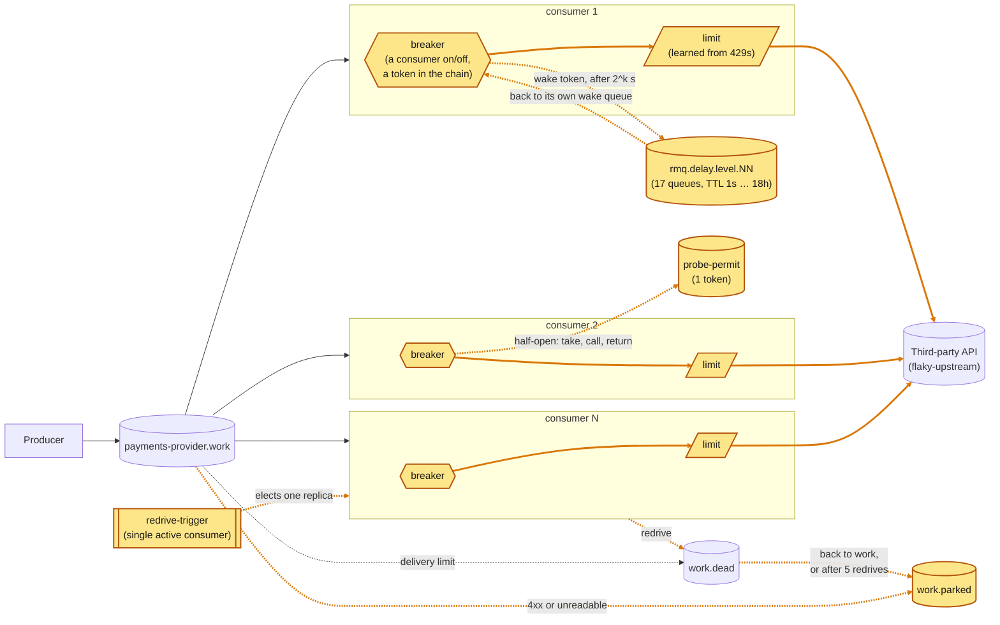
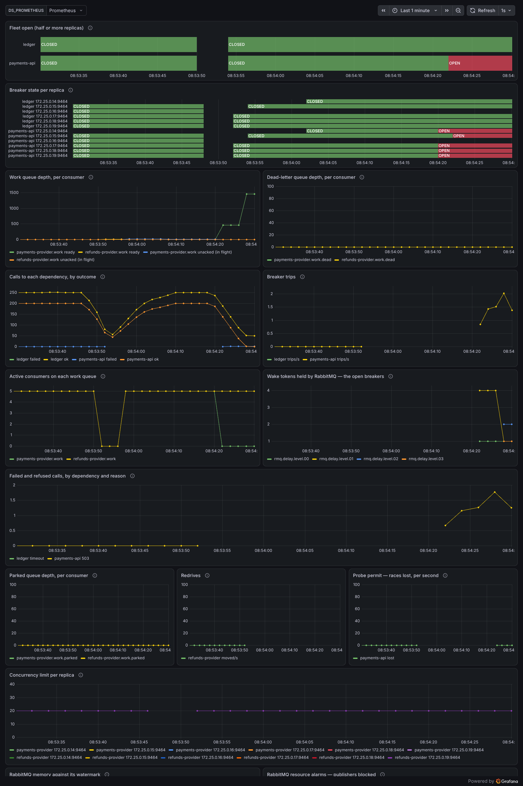
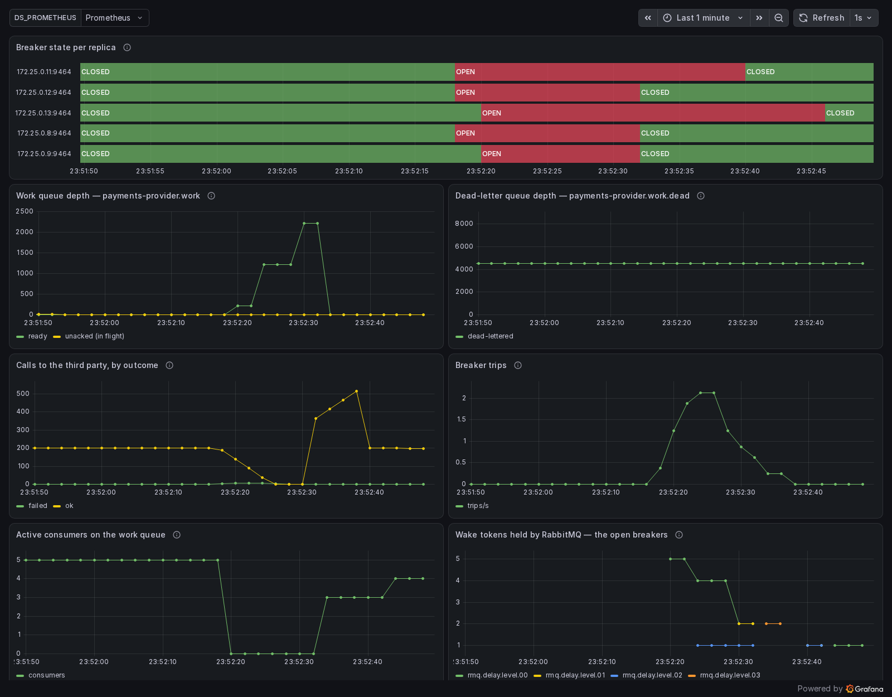

# In-process breaker, held by RabbitMQ — five, not one

One producer, one broker, a fleet of competing-consumer daemons — each one
wrapping its calls to the third party in its own circuit breaker. Where
`article/02-in-process-breaker` keeps the breaker in memory with
[cockatiel](https://github.com/connor4312/cockatiel), here **no breaker state is
in the process**: "open" is a consumer that isn't consuming, and the timer that
ends it is a message the broker holds. The idea is inspired by
[NServiceBus's delayed delivery on RabbitMQ](https://docs.particular.net/transports/rabbitmq/delayed-delivery),
which builds any delay out of queue TTLs and dead-lettering; here the delayed
message is the breaker's wake-up. The full write-up is
[docs/rabbitmq-held-breaker.md](docs/rabbitmq-held-breaker.md).

Four things are added on top, the same four
`article/03-rabbitmq-coordination` adds on top of cockatiel: one **probe
permit** for the whole fleet, so recovery is probed one call at a time, a
**redrive** that brings `work.dead` back, run by one replica RabbitMQ elects,
a **fleet view** of the third party, as a Prometheus rule, and a `429`
treated as **backpressure**, with a concurrency limit each replica learns from
it.



<sub>Amber: new on this branch.</sub>

## The breaker

`packages/rmq-consumer/src/Breaker.ts` is a three-phase machine, and each phase is a
fact about the broker rather than a variable:

| phase | in the broker | leaves when |
| --- | --- | --- |
| **closed** | a work consumer at full prefetch (`MAX_IN_FLIGHT`) | `BREAKER_THRESHOLD` (5) calls fail **in a row** — the one thing a process still counts |
| **open** | *no* consumer; a wake token is in the delay chain, addressed to this replica | the token comes back after its hold |
| **half-open** | a consumer with `prefetch: 1` — the first message it gets is the probe | probe succeeds → closed; fails → open again with a longer hold |

- **What counts as a failure.** `classify` in `Breaker.ts` reads the HTTP
  status (`Upstream.ts` only reports it, unjudged): a 2xx is `ok`; a 4xx other
  than 408 and 429 is `client_error` — the third party is up and refused this
  request, so it counts as a breaker success and never trips or reopens
  anything; everything else (5xx, 408, 429, a timeout, a dropped connection) is
  `failed`, and is what the phase table above means by "calls fail".
- **A `client_error` is parked at once, not released or requeued.**
  Repeating a refused request gets the same answer, so `decide()`
  (`consumer.ts`) sends it straight to `work.parked` on its first delivery,
  stamped `x-egress-parked-reason: refused-<status>`, skipping the
  release/requeue distinction below entirely. A delivery the consumer cannot
  read (wrong format, not a work message, no `message_id`) is parked the same
  way, as `unreadable-<reason>`. Through `work.dead` either would be redriven
  five times for the same answer. The catch: a 4xx that is really ours to
  fix — expired credentials (401, 403), a wrong path (404) — refuses every
  message the same way, and every one is parked on its first call. Nothing here stops that;
  `egress_consumer_calls_total`'s `status` label shows it, and a refused
  message is logged, at most once a second, with its status and `message_id`.
- **Open is silence, not rejection.** Tripping drains the consumer (in-flight
  calls settle, nothing is handed back to be re-run) and stops. No delivery
  reaches the replica, so no call is made, nothing is requeued, and nothing
  spins — the work waits in the queue, which is what a queue is for. The
  in-process version had to reject each message locally and hold it 100–400ms
  before requeueing, and every rejection spent one of the message's three
  delivery attempts (see *Measured* below).
- **The hold is a message.** `packages/rmq/src/DelayedDelivery.ts` is the
  delay chain borrowed from NServiceBus
  ([Particular's delayed delivery](https://docs.particular.net/transports/rabbitmq/delayed-delivery)),
  with 17 levels instead of 28:
  a queue per bit, level *n* with a TTL of exactly 2<sup>n</sup> seconds,
  dead-lettering into level *n−1*; a delay is its binary digits in the routing
  key, and each level either holds the message for its bit or passes it down.
  17 levels count to 131,071 s (36 h), so a **24-hour hold is one ordinary
  message** — no consumer, no unacked slot, no timer — and it survives a broker
  restart because the levels are durable quorum queues. Resolution is one
  second; a 5-second delay measured 5.21 s end to end.
- **The token carries the attempt.** Each failed probe re-sends the token with
  `attempt + 1`, and the hold is `initial · 2^attempt`, capped at
  `BREAKER_MAX_DELAY_SECONDS` (default 86,400) and jittered into its upper half
  so replicas that tripped together don't come back together. A closed breaker
  forgets: the next outage starts from the first hold.
- **Failures that are the third party's are `release`d, not `requeue`d.** A
  `failed` probe, and any `failed` call that follows another on the same
  replica, says something about the third party, not about the message that
  happened to be carrying it. The queue's three-attempt budget is for messages, so charging it
  here dead-lettered 2–3 healthy messages per outage in the first chaos run —
  the breaker needs five failures to open and its consumer takes a round trip
  to stop, and in that window the same few messages are redelivered again and
  again. A failure that stands alone (a poison message between successes) is
  still charged and still parked.
- **What a process still knows**: the consecutive-failure counter while closed,
  and which token it is waiting for. A replica that restarts starts closed and
  its old wake queue expires on its own (`x-expires`, 10 minutes after its
  consumer is gone).

### Measured

The same 20-second total outage (`pnpm run incident`, 5 replicas, the default
producer rate), before and after, against the live stack:

| | in-process (cockatiel) | held by RabbitMQ |
| --- | --- | --- |
| dead-lettered by the outage | **2,745** | **0** |
| calls that reached the failing third party | 50 | 55 |
| peak work-queue backlog | 1,973 | 4,020 (all of it kept) |
| every breaker closed, after restore | 23.0 s | 9.0 s |

Fifty real failures cannot account for 2,745 dead letters. The rest are
messages that never got a call: an open cockatiel breaker rejects locally and
requeues with `reject`, which counts against the queue's `x-delivery-limit`
(see `settle` in `packages/rmq/src/Client.ts`), so three rejections
dead-lettered a message. That is the mechanism the numbers point to; I did not
instrument the old build to count rejections per message. A 70-second outage on the new build: 67 calls
reached the third party across five replicas, nothing dead-lettered, holds grew
1 → 2 → 4 → 8 → … → 62 s, and the last breaker closed 55.9 s after restore. Both
tables are one run each — a single incident, not a distribution. A later re-run
of the 20-second outage on a rebuilt stack gave the same shape: nothing
dead-lettered, 55 calls reached the third party, 25 breaker openings, peak
backlog 4,040, and every breaker closed 12.0 s after restore (9.0 s above).

### The price of a long hold

A hold of *h* seconds means a replica notices the recovery up to *h* seconds
late. With a 24-hour ceiling, a day-long outage can leave a replica dark for
most of another. The ceiling is a statement of how late you can tolerate finding
out, not just how gently you want to probe. Also: if a token were lost — the
wake queue deleted by hand, say — the replica would stay open until restarted;
nothing re-sends it.

### Chaos

`node infra/chaos-breaker.mjs` injects real faults under a 200 → 1,000/s spike
and judges each on correctness (per message: nothing lost, dead-letter queue
back where it started, exactly one probe permit left) and then on the breaker:
an outage, a hanging third party, a `docker kill` of a replica while it is
open, a broker restart with five tokens in the chain, a 100 s delay across a
broker restart, a `docker kill` of the replica holding the probe permit, and
600 dead letters with the elected redriver killed mid-redrive. All seven graded
scenarios pass, about 45,000 messages each: 0 lost, 0 dead-lettered, one
duplicate in one run (a replica killed with a call in flight; at-least-once
permits it), 600 of 600 redriven messages processed, 2026-09-24
(`docs/runs/chaos-breaker-permit-redrive.json` and `…-rerun.json`; the second
repeats the two new scenarios after a fix to how the harness counts across a
killed replica). With the 429 work in, a new `overload` scenario (a third
party serving 20 at once at 100ms, under the spike) passed with 899 calls
answered `429`, no breaker trip and nothing dead-lettered. `outage`,
`partial`, `kill-open-replica`, `restart-during-probe` and `redrive-failover`
passed again alongside it (`docs/runs/chaos-breaker-429.json`). Runs are saved
under `history/runs/` (git-ignored;
the runs behind the article are kept in `docs/runs/`).
`infra/capture-incident.mjs` records the dashboard through an incident (it needs
`playwright-core`, which this repo does not depend on).



The dashboard 12 seconds into a 24s total outage, recorded 2026-09-24
([recording](docs/media/incident.webm)):
- The fleet view flips to open at the first scrape.
- The consumer count on the work queue is the fleet's state, and the wake
  tokens in the delay chain are the open breakers.
- The permit panel shows races lost while the holds are still 1–2s.
- The dead-letter line stays at zero through the outage.
- The concurrency limit (bottom) stays at 20: a `503` outage sends no
  `429`s, so the limit has nothing to learn from.



After the restore, every breaker had closed within 4s (0.2 to 3.5s, by the
replicas' logs), because their holds happened to end just after it. The
fleet view closed with them.

## Shared through the broker

Two things the replicas share, the same two `article/03-rabbitmq-coordination`
puts on top of cockatiel. Neither needs new infrastructure.

### One probe at a time: the permit

`packages/rmq-consumer/src/Permit.ts`: a queue with `x-max-length: 1` and
`x-overflow: reject-publish`. Every replica seeds a token at startup; RabbitMQ
keeps one and nacks the rest, which counts as success. A half-open replica's
probe message is delivered as before, but the call needs the token: a
non-blocking `get` first.

- **Token** → make the call, then hand the token back.
- **No token** → no call; the message is released (not charged), and the
  breaker goes back to its hold **at the same attempt**. Unlike a failed probe,
  losing the race says nothing about the third party. Cockatiel can't tell the
  two apart, so article 3's backoff grows on a lost race; this machine can.

The permit is held for the call only, not while the probe consumer waits for a
message.

**The token goes back as a publish, then an ack, never a requeue.**
`x-max-length` counts only *ready* messages, so a seed published while a probe
holds the token is accepted, and the fleet has two. Measured on RabbitMQ 4.3
(and pinned by a test in `packages/rmq/test/integration/Client.test.ts`): a
second seed is refused while the token is ready, and accepted while it is held.
A quorum queue is worse: its limit let a second seed in with the first still
ready. Returning the token by publishing first means the publish is refused
while a duplicate is ready, so a duplicate disappears on its next return. A
crash between the publish and the ack leaves two tokens, never zero.

**Measured**: every replica open against a hanging third party (so each call
holds for the 2s timeout), each replica's in-flight gauge polled every 100 ms
for 90 s:

| | before | with the permit |
| --- | --- | --- |
| samples with every replica open or half-open | 802 | 801 |
| peak calls to the third party in flight at once | **5** | **1** |
| samples with all five probing together | 56 | 0 |

### A way back from `work.dead`: the redrive

`packages/rmq-consumer/src/Redrive.ts`, ported from article 3:

- **Election**: a `redrive-trigger` queue with `x-single-active-consumer`.
  RabbitMQ delivers to one replica and promotes another if it goes.
- **A pass** `get`s from `work.dead` and publishes each message back to `work`,
  keeping its `message_id` (the idempotency key) and bumping
  `x-egress-redrive-count`. Past 5 redrives it goes to `work.parked` instead.
  Then it acks. A crash in between duplicates, never loses. At most 200 per
  pass.
- **Gate**: the elected replica's own breaker is closed, re-read before every
  message.
- **Triggers**: this replica closing (startup included), and a 30 s sweep while
  it is closed. A message can dead-letter while no breaker moves.

What still reaches `work.dead` here is mostly a message that kept failing
with a 5xx, or one caught between successes in a partial failure. The
RabbitMQ-held breaker already keeps an outage's messages out of it (see
*Measured* above).

**Measured**: a message put straight into `work.dead` with every breaker
closed was back on `work` 20.5 s later (the sweep), and one carrying a redrive
count of 5 was parked. Both ran on one replica. The chaos run's 60%-failure
scenario dead-lettered 6 messages and redrove all 6. The write-up's earlier run
of it left 11 parked.

## The fleet view: a Prometheus rule

`infra/monitoring/rules.yml`, the same as article 3's:

- `egress:fleet_open_fraction` is the share of replicas whose breaker is open
  or half-open. Only samples under 10s old count.
- `egress:fleet_open` is 1 when half or more are open.
- The alert `EgressThirdPartyDown` fires after 30s of that.

It needs no extra process and no heartbeat: a replica counts while Prometheus
scrapes it, and nothing in the fleet reads the rule back. The freshness filter
is there because a removed container's last sample stays visible for
Prometheus's 5-minute lookback. Article 3 measured six series for five
replicas after a rebuild, which diluted a full outage to 5/6. The dashboard's
top panel is `egress:fleet_open`.

**Measured** on this fleet, in a 45s full outage polled every 4s:

- The fraction read 1.0 at the first poll.
- The alert went pending, then fired 32s in.
- It cleared at the first poll below half, about 4s after restore.
- The fraction returned to 0 57s after restore. The last replica was still in
  a long hold (see *The price of a long hold*).

## A 429 is backpressure

A third party that is full rather than broken answers `429` to the calls
beyond what it can serve, and serves the rest. Ported from article 3, where
the reasoning and the failure-rate experiment are written up:

- **Classify it as `throttled`, not `failed`.** A throttled call never counts
  toward tripping, so a full third party opens no breaker. The message is
  released, uncharged, after a 100–400ms hold.
- **Learn a concurrency limit from it** (`Limiter.ts`, AIMD). A `429`
  multiplies the replica's limit by 0.7, and each success adds `1/limit`.
  It starts at `MAX_IN_FLIGHT`, with a floor of `LIMIT_MIN` (1). A `429` keeps
  its slot through the hold, or the next message spends it on another `429`.
- `ADAPTIVE_LIMIT=false` turns both off: a `429` is then a plain failure.

**Measured on this design**, 2026-09-24. The third party serves 5 at once at
100ms each (a 50/s ceiling) and is offered 400/s for 30s, against 5
replicas, three runs each. Goodput comes from the third party's own audit.

| configuration | goodput | calls answered `429` | breaker openings | fleet open (ticks) | peak backlog |
| --- | --- | --- | --- | --- | --- |
| `429` is a failure (`ADAPTIVE_LIMIT=false`) | **13 · 15 · 14 /s** | 1,136 · 1,346 · 1,171, counted as failed | 105 · 112 · 103 | 26 · 27 · 26 of 30 | 11,731 · 11,666 · 11,692 |
| `429` throttled, limit fixed at 20 (`LIMIT_MIN=20`) | **49 /s** each | 11,340 · 11,402 · 11,382 | 0 | 0 | 10,499 · 10,495 · 10,495 |
| `429` throttled, adaptive limit (default) | **47 /s** each | **738 · 749 · 743** | 0 | 0 | 10,571 · 10,567 · 10,571 |

The same shape as article 3's cockatiel fleet (11–14, 49 and 47/s; about
11,500 and 740 `429`s). The classification is most of the win. The limit
makes the fleet polite, with 94% fewer `429`s for 2/s of goodput, and doesn't
shrink the backlog. The fleet's summed limit averaged 8.6–10.1 in the later
half of the fault, against a third party that serves 5.

## Against article 3, on the same harness

Article 3 has the same three additions on top of cockatiel. Both designs
were run through the same `chaos-breaker.mjs` scenarios, against the same
broker and third party, on 2026-09-24. Each ran with its own branch's image
and compose file, one run per scenario. The harness detects which design is
running. It also voids a run if the host was suspended during it; none was.

Both passed every graded scenario, and `partial` too: nothing lost, no net
dead letters, and exactly one probe permit afterwards. 600 of 600 redriven
messages were processed with the redriver killed. The differences:

| scenario | failed calls reaching the third party (cockatiel · held) | refused locally | breaker openings | all closed after restore | redriven |
| --- | --- | --- | --- | --- | --- |
| outage | 32 · 26 | 22,070 · **0** | 34 · 37 | 28s · 25s | 1 · 0 |
| outage-hang | 111 · 40 | 21,736 · **0** | 34 · 74 | 32s · 9s | 0 · 0 |
| partial (60%) | 863 · 565 | 18,922 · **0** | 97 · 57 | 26s · 26s | **68 · 3** |
| kill-open-replica | 72 · 45 | 21,907 · **0** | 36 · 34 | 22s · 23s | 4 · 0 |
| kill-broker-while-open | 50 · 52 | 21,437 · **0** | 34 · 36 | 28s · 30s | 0 · 0 |
| restart-during-probe | 152 · 186 | 17,586 · **0** | 40 · 57 | 24s · 16s | 0 · 0 |

- **The held breaker never refuses a message it was handed.** Cockatiel's
  open breaker still consumes. Each delivery is rejected locally, held
  100–400ms, and released back to the broker: about 20,000 round trips per
  40s outage. The held breaker isn't consuming, so the broker simply keeps
  the work.
- **Fewer messages reach the dead-letter queue in a partial failure** (3
  against 68, all redriven either way). The held design releases a failure
  that follows another one, instead of charging it to the message.
- **Similar load on the failing third party, and similar recovery.** The
  held design sent fewer failed calls in four scenarios and more in two.
  Recovery was faster in two, slower in two, and level in one. With one run
  each, differences of a few seconds or a few dozen calls are noise.
  Long holds (up to 24h) are the held design's recovery risk, and a 40s
  outage doesn't reach them.
- **What the held design pays for this:** a 17-queue delay chain for its
  timer, and its own breaker machine instead of a library.

Runs: `docs/runs/compare-article3-cockatiel.json` and
`docs/runs/compare-held.json`.

## What this still doesn't fix

- **Five breakers still don't agree.** Each is formed only from the calls that
  one process happened to make. They trip at different moments, recover at
  different moments, and briefly disagree about whether the same third party
  is up. Watch the "Breaker state per replica" panel, or `infra/incident.mjs`'s
  `breaker agreement` line. The permit serialises probes, and the fleet view
  is a verdict for people and alerts: no replica acts on it.
- **The redrive waits on the elected replica's breaker**, which can be open
  while the rest of the fleet is closed. A pass is up to 30 s late.
- **A trigger that arrives mid-pass is dropped**; the next sweep picks up the
  rest.
- **A lost permit is a stuck fleet.** If the permit queue is purged, every
  probe loses the race, so every breaker that opens stays open until some
  replica restarts and reseeds.
- **Only a `429` teaches the limit.** A third party that sheds by slowing
  down or with `503`s gets no help.
- **The limit paces the excess; it doesn't remove it.** The backlog is the
  same with or without it, and it is unbounded. The replicas also learn
  independently, and their floors can sum above the third party's ceiling.

## Running it

The compose file bind-mounts config from the repo through
`HOST_WORKSPACE_FOLDER`. It defaults to `.`, so on Linux and Windows there is
nothing to set. On macOS, where Docker runs in a VM, set it to this repo's path
*on the Mac* (inside a devcontainer, that is not the path you see).

```bash
pnpm install
docker compose up -d
docker compose up -d --scale rmq-consumer=12   # resize the fleet, no restart needed
```

- RabbitMQ management UI: <http://localhost:15672> (guest/guest) — watch
  `payments-provider.work`'s depth and `payments-provider.work.dead`'s
  growth.
- Grafana: <http://localhost:3000/d/in-process-breaker>
  Panels: breaker state per replica, work-queue depth, dead-letter-queue depth,
  calls by outcome, failed and refused calls by status, breaker trips, active
  consumers on the work queue, the wake tokens RabbitMQ holds (the open
  breakers), parked-queue depth, redrives, probe-permit races lost, and the
  concurrency limit per replica, with
  "Fleet open" (see *The fleet view*) at the top. Plain `:3000` lands on
  Grafana's Welcome screen, not this dashboard — use the direct link, or
  `Dashboards` in the left nav.
- Prometheus: <http://localhost:9090>.

## Injecting a failure

`flaky-upstream` stands in for the third party. Every field is optional and a
POST replaces the whole behaviour, so `{}` restores health:

```bash
curl -X POST localhost:8080/__fail -d '{"rate":1.0}'                # 503s
curl -X POST localhost:8080/__fail -d '{"rate":1.0,"status":422}'   # 422s: refused, not down — no trip, no backlog
curl -X POST localhost:8080/__fail -d '{"rate":1.0,"mode":"hang"}'  # never answers
curl -X POST localhost:8080/__fail -d '{"rate":1.0,"mode":"reset"}' # drops the connection
curl -X POST localhost:8080/__fail -d '{"delayMs":1500}'            # slow, still correct
curl -X POST localhost:8080/__fail -d '{"delayMs":100,"capacity":5}' # full, not broken: 5 at once (50/s), 429 beyond
curl -X POST localhost:8080/__fail -d '{}'                          # healthy again
```

Every call answered 200 is recorded by its idempotency key (`<run>:<n>`), so you
can check what got through: `curl 'localhost:8080/__audit?run=*'` for totals, or
`?run=<id>` for one run's processed and duplicate counts.

## The incident script

```bash
pnpm run incident
MODE=hang node infra/incident.mjs
RATE_PER_SECOND=400 docker compose up -d rmq-producer && CAPACITY=5 DELAY_MS=100 node infra/incident.mjs
```

Injects a full failure, watches the work and dead-letter queues (over AMQP,
straight from the broker), restores the third party, and reports peak backlog,
total dead-lettered, time to drain, and a processed/duplicate count from
`flaky-upstream`'s audit trail. It keeps watching until every breaker has closed
again, and reports what this branch has to measure: how many times the fleet's
breakers opened, the fraction of poll ticks in which every replica was in the
*same* state, the peak number open at once, and how long after restore the last
one closed. With `CAPACITY` set it also reports goodput, the calls answered
`429`, the fleet's summed limit and how often the fleet read open. Replica
states are read from Prometheus (`PROMETHEUS`, default
`http://localhost:9090`).

## Load

The producer's rate is configurable and never reacts to anything:

```bash
RATE_PER_SECOND=500 docker compose up -d rmq-producer
```

Combine with `--scale rmq-consumer=N` and `infra/incident.mjs`'s `RATE`/
`WINDOW_MS` env vars to drive a specific incident shape.

## Layout

```
packages/
  config/      @egress/config — settings declared once, decoded at boot
  rmq/         @egress/rmq — Effect wrapper over amqplib, the generic
               work-queue naming/options a producer and a consumer fleet share,
               and DelayedDelivery.ts: the delay chain a breaker's hold is made of
  rmq-producer/  the load: a steady stream onto <apiId>.work in confirmed batches,
                 never backing off
  rmq-consumer/  the competing-consumer fleet, each with its own breaker whose
                 state is the broker's (src/Breaker.ts), the fleet's one probe
                 permit (src/Permit.ts), the dead-letter redrive
                 (src/Redrive.ts) and the concurrency limit learned from 429s
                 (src/Limiter.ts), wired together in src/consumer.ts
  tracing/     the /metrics HTTP route every process serves; OpenTelemetry
               tracing is wired but off unless OTEL_EXPORTER_OTLP_ENDPOINT is set
infra/
  flaky-upstream.mjs   the fake third party: configurable failures, an audit trail
  rabbitmq.conf        the broker's flow-control watermark
  incident.mjs         drives one incident, reports what happened including
                       whether the fleet's breakers agreed with each other
  chaos-breaker.mjs    real faults under a load spike, graded per message
  chaos-publisher.mjs  its load generator: remembers which messages were confirmed
  capture-incident.mjs records the dashboard through an incident
  monitoring/          Prometheus scrape config, the fleet-view rule (rules.yml)
                       and the Grafana dashboard
docs/                  the write-up, its screenshots and recording, saved chaos runs
docker-compose.yml     the whole stack
```

Built on **Effect 4 (4.0.0-rc.116)** — see `AGENTS.md` for why that version
matters when writing Effect code here. No build step: every package runs
straight off its `src/*.ts` through Node's built-in type stripping.

## Verification

```bash
pnpm run check       # vendored-version check, typecheck, unit tests (Breaker.test.ts runs against a fake world)
pnpm run test:rmq    # optional — needs Docker: AMQP behaviour against a real broker,
                     # including the delay chain's timing and graceful consumer drain
```
