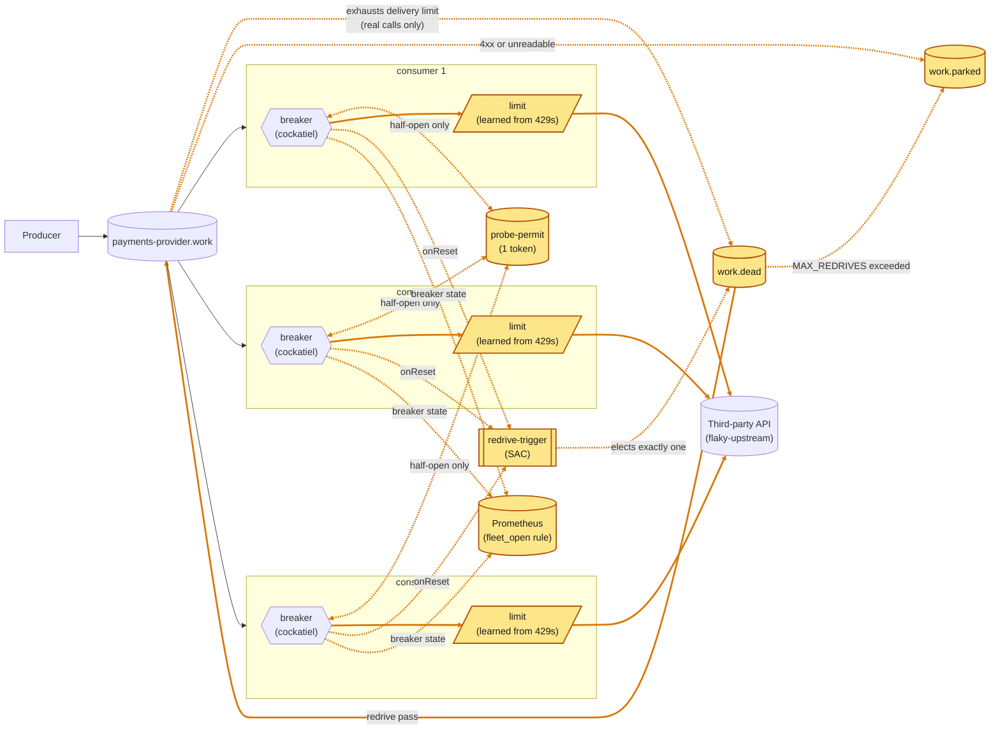

# RabbitMQ does the coordinating

A fleet of competing consumers, each with its own
[cockatiel](https://github.com/connor4312/cockatiel) breaker as in
`article/02-in-process-breaker`, coordinated through the broker it already
uses: a one-token queue as a **probe permit**, a settlement that doesn't spend
the delivery budget, a single-active-consumer **redrive** of `work.dead`, a
**fleet view** as a Prometheus rule, and a `429` treated as **backpressure**. No
new infrastructure. `article/04-rabbitmq-only-breaker` moves the breaker's own
state into the broker; `article/05-platform-control-plane` is the design at
platform level.

Article 2 left three problems for coordination to solve: a successful probe can
burst `maxInFlight` calls on every replica at once, a message can be
dead-lettered without the third party seeing it (1,975 in one 15 s outage), and
nothing brings dead letters back.



<sub>Amber: new or changed on this branch.</sub>


30 s of `503`s, then 10 s of `422`s, 5 replicas (5.79× real time,
[full recording](docs/media/dead-letter-redrive-incident.webm)): the
dead-letter queue stays at 0 through the outage and recovery; the price is
backlog, 6,920 at peak. Only the `422`s park, 1,985 in 10 s, each on its first
delivery.

## What the broker hardens

Most of the reliability here is RabbitMQ 4.3 behaviour, configured rather than
coded (`ControlPlane.ts`, `Client.ts`, `infra/rabbitmq.conf`). The system
leans on each of these:

| RabbitMQ feature | what it buys | since |
| --- | --- | --- |
| quorum queues, persistent messages | work survives a broker restart (`kill-broker`: 0 unaccounted) | 01 |
| publisher confirms, `mandatory` | a message counts as sent only once the broker holds it; an unroutable one fails the publish instead of vanishing | 01 |
| manual acks, `prefetch` = `MAX_IN_FLIGHT` | nothing leaves the queue until settled; a dead replica's deliveries go back; prefetch is the concurrency limit | 01 |
| `x-delivery-limit` (3) | the attempt budget lives on the queue, so it survives a message moving between replicas | 01 |
| dead-lettering, `at-least-once` with `x-overflow: reject-publish` | exhausted work lands in `work.dead` and is never dropped in transit; `x-delivery-limit: -1` there, since the default 20 would drop at its cap | 01 |
| requeuing `nack` isn't counted, `reject` is | `release` for work never tried, `requeue` for a real failed call | **03** |
| `x-max-length: 1` + `reject-publish` | a one-token queue as the fleet-wide probe permit | **03** |
| `x-single-active-consumer` | leader election for the redrive, with failover on disconnect | **03** |
| 1 s heartbeat | a one-sided partition is noticed in seconds, not the 60 s default | 01 |
| a fixed memory watermark (1 GiB of 2), `connection.blocked` | flow control refuses publishes before the OOM killer takes the broker; publishing and consuming use separate connections, so an alarm doesn't stall acks | 01 |

## The breaker

As in article 2: 5 failures in a row trip it; half-open after a 1–30 s
exponential backoff. `classify` in `Breaker.ts`:

| outcome | when | message |
| --- | --- | --- |
| `ok` | 2xx | accepted |
| `throttled` | `429` | released after a 100–400 ms hold |
| `client_error` | a 4xx other than 408/429 | parked at once |
| `failed` | 5xx, 408, no answer, no connection | requeued, counted |
| `open` | breaker open or permit lost: no call made | released after a 100–400 ms hold |

A 4xx that is ours to fix (401, 403, 404) parks every message it touches; the
`status` label on `egress_consumer_calls_total` shows it.

## Shared through the broker

### The probe permit

A queue with `x-max-length: 1` and `x-overflow: reject-publish`, seeded by every
replica: the broker keeps the first and *nacks* the rest, which `seedPermit`
treats as success (assuming the rejection was silent crash-looped four replicas
on boot). A half-open replica `get`s first: with the token it calls, then hands
the token back; without it, `Breaker.NoPermit` fails the probe with no call.

- **It has to gate the real caller.** 20 concurrent `withPermit` calls let
  exactly one through, but the fleet wasn't using it: cockatiel moves Open →
  HalfOpen inside `execute()`, and `consumer.ts` checked the state before it,
  so the token was never taken in 616,643 polls. The check now runs inside
  `execute()`, pinned by a test. Every replica open against a hanging third
  party, sampled every 100 ms for 90 s:

  | | before the fix | after |
  | --- | --- | --- |
  | peak probes in flight at once | 6 | **1** |
  | samples with 5 or more | 15 of 814 | 0 of 815 |

- **The token goes back as a publish, then an ack**, never a requeuing `nack`:
  `x-max-length` counts only ready messages, so a seed while a probe holds the
  token made a second one. The return publish is refused while a duplicate is
  ready, collapsing it; a crash between publish and ack leaves two, never none.
- A single-active-consumer queue doesn't fit: it hands over on disconnect, not
  when a replica's backoff elapses.

### Counted attempts: release, don't requeue

`decide()` *releases* `open`: RabbitMQ 4.3 doesn't count a release toward
`x-delivery-limit` (3), but does count a requeue, so three deliveries onto open
breakers used to dead-letter a message the third party never saw. `failed`
still requeues: a real call spends the budget. **Measured:** 1,785
dead-lettered in a 15 s outage before; **0** in a 40 s outage after, with the
work queue growing instead (6,800 at 40 s).

### The redrive

`Redrive.ts`: a trigger queue with `x-single-active-consumer` elects one replica
(another is promoted if it disconnects), which moves `work.dead` back to `work`
while its own breaker is closed, keeping `message_id` and counting
`x-egress-redrive-count`; past `MAX_REDRIVES` (5), to `work.parked`. At most 200
per pass, on `onReset`, startup and a 30 s sweep (without the sweep,
`work.dead` sat at 1,225 for 20 s+ with every breaker closed). A crash mid-pass
duplicates, never loses.

- **Poison skips the dead-letter queue**: a refused (4xx) or unreadable message
  goes straight to `work.parked` with `x-egress-parked-reason`, rather than
  being redriven five times for the same answer.

## The fleet view

`infra/monitoring/rules.yml`: `egress:fleet_open_fraction` is the share of
replicas open or half-open, `egress:fleet_open` is 1 at half or more, and
`EgressThirdPartyDown` fires after 30 s of it. No replica reads it back.

- **Only samples under 10 s old count**: a removed container's last sample
  lingers for Prometheus's 5-minute lookback, which read six series for five
  replicas after a rebuild.
- **Measured:** a full outage read 1.0 and fired after 30 s; 0 again after
  restore.

## A 429 is backpressure

- **`throttled`, not `failed`**: released uncounted after a 100–400 ms hold that
  keeps its slot, and never trips (`master`'s ADR 010: a shed treated as a
  failure dead-lettered 22,226 healthy messages).
- **An AIMD limit** (`Limiter.ts`, pure, sizing a `Semaphore` in
  `consumer.ts`): × 0.7 per `429`, + 1/limit per success, from `MAX_IN_FLIGHT`
  down to `LIMIT_MIN` (1). Only a `429` teaches it. `ADAPTIVE_LIMIT=false` turns
  off both.

Against a third party serving 5 at once (50/s), offered 400/s for 30 s, three
runs each (`CAPACITY=5 DELAY_MS=100 WINDOW_MS=30000`, producer at 400/s):

| configuration | goodput | calls answered `429` | refused locally | open at peak | peak backlog |
| --- | --- | --- | --- | --- | --- |
| `429` is a failure | **11–14 /s** | 510–578 | ~12,000 | 5 of 5 | 9,086–9,457 |
| throttled, limit fixed at 20 | **49 /s** | ~11,500 | 0 | 0 | 8,000–8,175 |
| throttled, adaptive (default) | **47 /s** | **739–750** | 0 | 0 | 7,983–8,485 |

- **The classification is most of the win**; the limit is politeness, 94% fewer
  `429`s for 2/s of goodput, and doesn't shrink the backlog.
- **The fleet's summed limit settles above the ceiling**: 9.1–9.3 on average,
  low of 6–7, against 5.
- **Holding the slot through the hold matters**: an earlier build that freed it
  first got 6,067–6,778 `429`s, the next message spending it on another `429`.


The overload recorded (4.38× real time, [full recording](docs/media/429-backpressure-incident.webm);
the limit panel spliced under the queues): 46–50 calls/s succeed against the
50/s ceiling, 764 answered `429`, the summed limit falls from 100 to 7–12 and
recovers 4 s after restore; no breaker opens, nothing dead-letters.

### A failure-rate rule doesn't pay

Tried and removed: cockatiel's `SamplingBreaker` beside the streak rule, opening
at a 0.25 failure rate over 10 s. A 30 s injected failure, the 30% rows three
times:

| injected | rate rule | fleet open (ticks) | failed calls | refused locally | peak backlog |
| --- | --- | --- | --- | --- | --- |
| 10% | off / 0.25 | 0 / 0 | 704 / 649 | 0 / 0 | 7 / 0 |
| 30% | off | **0** of 39–50 | ~2,600 | 734–1,846 | 23–51 |
| 30% | 0.25 | **20–26** of 45–47 | ~1,875 | 8,929–9,983 | 1,069–1,718 |
| 60% | off / 0.25 | 32 / 29 | 774 / 685 | ~12,700 | ~4,400 |

At 30% it avoided ~750 failing calls at the cost of 7,000–9,000 refused calls
that mostly would have succeeded, a 20–70× deeper backlog and a flapping
breaker. A per-replica breaker cannot shed only the share that would fail.

## What it cannot overcome

- **Five breakers still don't agree**: the permit stops the recovery burst, not
  independent tripping.
- **Losing the permit race grows the backoff** like a failed probe; cockatiel
  can't tell them apart.
- **A lost permit token** fails every half-open probe until a restart reseeds it.
- **Redrive waits on the elected replica's breaker**, up to 30 s after the rest
  of the fleet has closed; a trigger arriving mid-pass is dropped.
- **A long outage grows the work queue without bound**; pacing a full third
  party doesn't shrink it either (8,000–8,500 with or without the limit).
- **Only a `429` teaches the limit**; one that sheds by slowing down or with
  `503`s gets no help (expected, not measured). Five replicas at `LIMIT_MIN` 1
  sum past a ceiling of 5, and nothing but the dashboard sees the fleet's limit.
- **A load-independent partial failure has no good answer**: the streak breaker
  misses it, and a rate rule sheds the good traffic too.

## Running it

```bash
pnpm install
docker compose up -d                              # HOST_WORKSPACE_FOLDER: this repo's path on the host (macOS)
docker compose up -d --scale rmq-consumer=12      # resize the fleet
RATE_PER_SECOND=500 docker compose up -d rmq-producer
```

From the devcontainer, by service name (from the host, `localhost`; a gitignored
`.env.local` with the service names is read by `pnpm run incident`):
- RabbitMQ <http://rabbitmq:15672> (guest/guest)
- Grafana <http://grafana:3000/d/in-process-breaker> (two 401 toasts on first load are harmless)
- Prometheus <http://prometheus:9090>

`flaky-upstream` is the third party; a POST replaces its behaviour, `{}`
restores it, and `/__audit?run=*` counts what it answered 200:

```bash
curl -X POST flaky-upstream:8080/__fail -d '{"rate":1.0}'                  # 503s
curl -X POST flaky-upstream:8080/__fail -d '{"rate":1.0,"status":422}'     # refused, not down
curl -X POST flaky-upstream:8080/__fail -d '{"rate":1.0,"mode":"hang"}'    # never answers
curl -X POST flaky-upstream:8080/__fail -d '{"delayMs":100,"capacity":5}'  # full: 429 beyond 5 at once
curl -X POST flaky-upstream:8080/__fail -d '{}'                            # healthy
```

`pnpm run incident` drives one outage and reports backlog, dead letters, drain
time, breaker agreement, fleet-open timing and what redrive moved or parked; it
ends with a `422` phase unless `STATUS` or `CAPACITY` is set (`MODE=hang`,
`STATUS=422`, `CAPACITY=5 DELAY_MS=100` shape it).

**Chaos**: `node infra/chaos-load.mjs` (`--list`, `--faults=…`, `--rate`,
`--spike`) injects `kill-one-consumer`, `kill-all-consumers`, `kill-broker`,
`flaky-storm` and `upstream-overload` under load, and fails if a confirmed
message is neither processed nor queued. The first four passed with zero
unaccounted across ~350k messages; `upstream-overload` passes only with the
adaptive limit (10,585 confirmed, 0 unaccounted).
`work.dead` stayed at 0, so the redriver never fired under chaos, and after
`flaky-storm` a breaker can stay open 90 s+ at its backoff cap.

## Layout

```
packages/
  config/        settings declared once, decoded at boot
  rmq/           amqplib in Effect (Client.ts); shared queue names, options, schemas (ControlPlane.ts)
  rmq-producer/  the load, in confirmed batches, message_id as idempotency key
  rmq-consumer/  Breaker.ts (breaker + permit), Limiter.ts, Redrive.ts,
                 Upstream.ts (the HTTP call), consumer.ts (wiring, decide())
  tracing/       /metrics, and OpenTelemetry when OTEL_EXPORTER_OTLP_ENDPOINT is set
infra/
  flaky-upstream.mjs                   the fake third party, with an audit trail
  incident.mjs, chaos-load.mjs         one incident; faults under load (chaos-publisher.mjs its load)
  capture-incident.mjs                 records the dashboard (needs playwright-core)
  monitoring/, rabbitmq.conf           scrape config, rules, dashboard; the broker's watermark
```

**Effect 4 (4.0.0-rc.117)**; see `AGENTS.md`. No build step: Node runs the
`src/*.ts` directly.

```bash
pnpm run check       # vendored version, typecheck, unit tests
pnpm run test:rmq    # needs Docker: against a real broker
```
