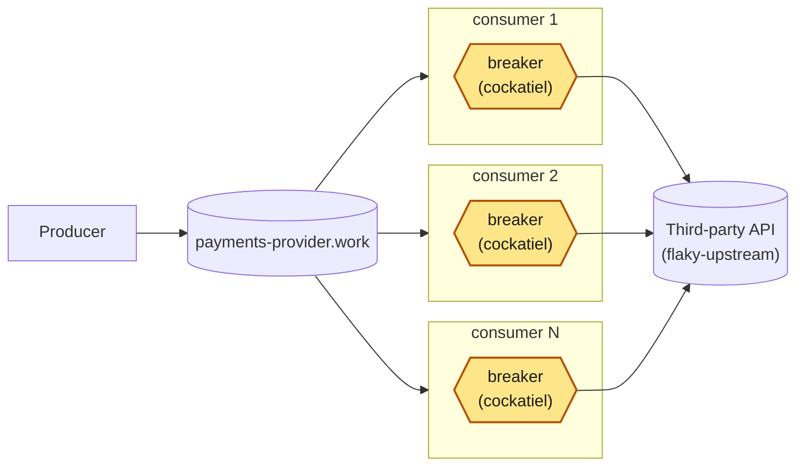

# In-process breaker — five, not one

One producer, one broker, a fleet of competing-consumer daemons — each one
wrapping its calls to the third party in its own
[cockatiel](https://github.com/connor4312/cockatiel) circuit breaker.



<sub>Amber: new on this branch.</sub>

Each replica's breaker is its own `CircuitBreakerPolicy` instance — the
subgraphs are the point: nothing here draws a line *between* them.

## The breaker

`packages/rmq-consumer/src/Breaker.ts` wraps every third-party call in a cockatiel
`CircuitBreakerPolicy`, one instance per process, created once and reused for
the process's whole life (a breaker only works if the same instance sees every
execution; a fresh one per call would never accumulate a failure count).

- **Trip condition**: `ConsecutiveBreaker(BREAKER_THRESHOLD)` — opens after
  `BREAKER_THRESHOLD` (default 5) calls fail in a row.
- **Re-open timing**: `ExponentialBackoff` from `BREAKER_INITIAL_DELAY_MS`
  (default 1000ms) up to `BREAKER_MAX_DELAY_MS` (default 30000ms), doubling each
  time a half-open probe still fails. cockatiel's default generator already
  includes decorrelated jitter.
- **What counts as a failure**: a call that throws or comes back `failed`. A
  `client_error` counts as a success: the third party answered.
- **Four outcomes**, decided by the HTTP status. `Upstream.ts` only reports the
  status; `classify` in `Breaker.ts` is the policy's verdict on it:

  | Outcome | When | Breaker | Message |
  | --- | --- | --- | --- |
  | `ok` | 2xx | success | accepted |
  | `client_error` | a 4xx other than 408 and 429 | success | dead-lettered at once |
  | `failed` | 5xx, 408, 429, or a 1xx/3xx nobody expects; no answer in 2s (`timeout`); a connection that failed or dropped (`network`) | failure | requeued |
  | `open` | the breaker turned the call away, so **no call reached the third party** | none | requeued after a short jittered hold |

That hold (`OPEN_REQUEUE_DELAY_MIN_MS` 100 plus up to `OPEN_REQUEUE_DELAY_SPREAD_MS`
300, in `consumer.ts`) exists because an open breaker rejects instantly. With no
hold, a rejected message goes straight back onto the queue and to the same
consumer, which can spin against its own in-memory breaker at whatever rate the
broker will redeliver: the third party stops being hammered, and the *broker*
takes its place.

A `client_error` is dead-lettered on its first call, not after the delivery
budget, because repeating a refused request gets the same answer; and it does
not count against the breaker, because a third party that says no to one request
is not down. The catch: a 4xx that is really ours to fix, expired credentials
(401, 403) or a wrong path (404), is refused for every message, and every message
is dead-lettered on its first call. Nothing here stops that; `status` shows it.

`egress_consumer_calls_total` carries the HTTP status as `status` (`timeout`,
`network` and `none` where there is none), so the split by code is one query,
and a panel on the dashboard: `sum by (status) (rate(egress_consumer_calls_total{outcome=~"failed|client_error"}[1m]))`.
A refused message is also logged, at most once a second, with its status and
`message_id`.

## Running it

The compose file bind-mounts config from the repo through
`HOST_WORKSPACE_FOLDER`. It defaults to `.`, so on Linux and Windows there is
nothing to set. On macOS, where Docker runs in a VM, set it to this repo's path
*on the Mac* (inside a devcontainer, that is not the path you see).

```bash
pnpm install
docker compose up -d
docker compose up -d --scale rmq-consumer=12   # resize the fleet, no restart needed
```

- RabbitMQ management UI: <http://localhost:15672> (guest/guest) — watch
  `payments-provider.work`'s depth and `payments-provider.work.dead`'s growth.
- Grafana: <http://localhost:3000/d/in-process-breaker>
  Panels: breaker state per replica, work-queue depth, dead-letter-queue depth,
  calls by outcome, failed and refused calls by status, breaker trips, active
  consumers. Plain `:3000` lands on Grafana's Welcome screen, not this
  dashboard — use the direct link, or `Dashboards` in the left nav.
- Prometheus: <http://localhost:9090>.

## Injecting a failure

`flaky-upstream` stands in for the third party. Every field is optional and a
POST replaces the whole behaviour, so `{}` restores health:

```bash
curl -X POST localhost:8080/__fail -d '{"rate":1.0}'                # 503s
curl -X POST localhost:8080/__fail -d '{"rate":1.0,"status":422}'   # 422s: refused, not down
curl -X POST localhost:8080/__fail -d '{"rate":1.0,"mode":"hang"}'  # never answers
curl -X POST localhost:8080/__fail -d '{"rate":1.0,"mode":"reset"}' # drops the connection
curl -X POST localhost:8080/__fail -d '{"delayMs":1500}'            # slow, still correct
curl -X POST localhost:8080/__fail -d '{}'                          # healthy again
```

Every call answered 200 is recorded by its idempotency key (`<run>:<n>`), so you
can check what got through: `curl 'localhost:8080/__audit?run=*'` for totals, or
`?run=<id>` for one run's processed and duplicate counts.

## The incident script

```bash
pnpm run incident
MODE=hang node infra/incident.mjs
```

Injects a full failure, watches the work and dead-letter queues (over AMQP,
straight from the broker), restores the third party, and reports peak backlog,
total dead-lettered, time to drain, and a processed/duplicate count from
`flaky-upstream`'s audit trail. It keeps watching until every breaker has closed
again, and reports what this branch has to measure: how many times the fleet's
breakers opened (`egress_consumer_breaker_trips_total`), the fraction of poll
ticks in which every replica was in the *same* state, the peak number open at
once, and how long after restore the last one closed. Replica states are read
from Prometheus (`PROMETHEUS`, default `http://localhost:9090`).

### What it measured

A 15s error-mode outage at 200 msg/s, five consumers, five breakers, recorded
2026-09-24 (3.71× real time, also as [video](docs/media/incident-in-process-breaker.webm)):
all five breakers open within 2s of each other, the work queue peaks at 1,449
and 1,826 messages are dead-lettered, and after restore the replicas close
out of step over about 7s.


| Thirteen recorded runs | Range |
| --- | ---: |
| Breaker openings across the fleet | 26 – 28 (median 27) |
| Ticks with all five replicas in one state | 32 – 78% (median 56%) |
| All replicas closed, after restore | 10.5 – 29.4s (median 22s) |
| Peak ready in the work queue | 1,458 – 1,496 |
| Dead-lettered | 1,577 – 2,246 |
| Calls that reached the third party and failed | 52 – 59 |
| Attempts turned away by an open breaker | 7,600 – 10,500 |

A later re-run on a rebuilt stack gave 25 openings, 79% agreement, all closed
8.9s after restore, 1,472 peak ready, 1,703 dead-lettered, 52 failed calls and
7,518 turned away. Peak ready, dead-lettered and failed calls are inside the
ranges; openings, agreement, closing time and turned-away attempts sit just
outside them, so read the ranges as a spread, not as bounds.

The breaker does its one job: each replica stops calling the dead third party
after five consecutive failures, and a failed probe costs one more call before
it opens again — about 11 failed calls per replica across the whole incident.
Five of five were open at the same instant in every run. What it cannot do is
make the five agree: they trip and recover on their own clocks, and one outage
costs about 27 openings, not one.

### What this branch cannot overcome

Each limit below follows from having five independent breakers; none is a bug
in `Breaker.ts`.

1. **No coordination between breakers.** Each `CircuitBreakerPolicy` is private
   to its process and formed only from the calls that process happened to make.
   They open within seconds of each other but not together, and recovery is
   looser still: the fleet took 9–29s to be fully closed again.
2. **A message is dead-lettered without ever reaching the third party.**
   `WORK_DELIVERY_LIMIT` is 3 (`packages/rmq/src/ControlPlane.ts`), and
   `decide()` maps both `"failed"` and `"open"` to the same counted `"requeue"`.
   1,577–2,246 messages were dead-lettered per incident, while only 52–59 calls
   failed at the third party. A dead-lettered message needs three deliveries, so
   at most 59 of them had seen a real failure: **at least 96%** were killed by
   their own replica's breaker, and look exactly like three genuine failures in
   the dead-letter queue.
3. **Recovery is as uncoordinated as tripping.** Each replica's half-open probe
   fires on its own `ExponentialBackoff` clock, so one replica can be closed
   while another is still open for the same third party. A probe that lands in a
   still-flaky moment resets one replica's backoff without telling the other four.
4. **A successful probe can start a thundering herd** *(from cockatiel's source,
   not measured)*. `Breaker.ts` never sets `halfOpenSampling`, so cockatiel lets
   exactly one trial call through. But with `maxInFlight` 20, up to 19 other
   messages are already in flight through that breaker, and cockatiel makes them
   wait for the trial's outcome rather than rejecting them. If the probe
   succeeds they all fire in the same batch; across the fleet the worst case
   approaches `maxInFlight × replica count`.
5. **Turned-away volume scales with fleet size, not health.** Each breaker keeps
   taking its share of the queue and rejecting it after a 100–400ms hold, rather
   than the fleet stepping back together: 7,518 · 7,637 · 8,123 · 8,519 · 9,637 ·
   10,457 attempts turned away in six measured incidents.
6. **Dead-lettered work has no way back.** Nothing redrives
   `payments-provider.work.dead` once the third party recovers.
7. **Nothing announces the outage.** Breaker state is on Prometheus and Grafana
   and nowhere else — no alert, no webhook — and `onBreak` fires once per replica
   per opening, so paging on it would ring about 27 times for one outage.

## Load

The producer's rate is configurable and never reacts to anything:

```bash
RATE_PER_SECOND=500 docker compose up -d rmq-producer
```

Combine with `--scale rmq-consumer=N` and `infra/incident.mjs`'s `RATE`/
`WINDOW_MS` env vars to drive a specific incident shape.

## Layout

```
packages/
  config/      @egress/config — settings declared once, decoded at boot
  rmq/         @egress/rmq — Effect wrapper over amqplib, plus the generic
               work-queue naming/options a producer and a consumer fleet share
  rmq-producer/  the load: a steady stream onto <apiId>.work in confirmed batches,
                 never backing off
  rmq-consumer/  the competing-consumer fleet, each with its own in-process
                 breaker (src/Breaker.ts)
  tracing/     the /metrics HTTP route every process serves; OpenTelemetry
               tracing is wired but off unless OTEL_EXPORTER_OTLP_ENDPOINT is set
infra/
  flaky-upstream.mjs   the fake third party: configurable failures, an audit trail
  rabbitmq.conf        the broker's flow-control watermark
  incident.mjs         drives one incident, reports what happened including
                       whether the fleet's breakers agreed with each other
  monitoring/          Prometheus scrape config and the Grafana dashboard
docker-compose.yml     the whole stack
```

Built on **Effect 4 (4.0.0-rc.116)** — see `AGENTS.md` for why that version
matters when writing Effect code here. No build step: every package runs
straight off its `src/*.ts` through Node's built-in type stripping.

## Verification

```bash
pnpm run check       # vendored-version check, typecheck, unit tests (Breaker.test.ts runs against the real library)
pnpm run test:rmq    # optional — needs Docker: AMQP behaviour against a real broker
```
