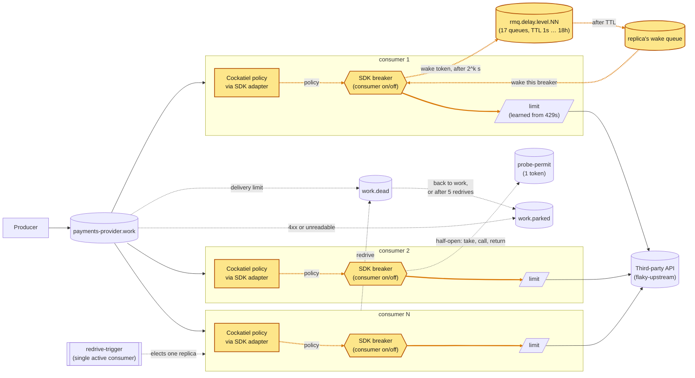

# A reliability framework with RabbitMQ
> [Main overview](https://github.com/lsfera/reasoning-over-circuit-breaker/blob/main/README.md) | [Next: 05 · A platform control plane](https://github.com/lsfera/reasoning-over-circuit-breaker/blob/article/05-platform-control-plane/README.md)


A producer, a broker, and a fleet of competing consumers, each calling its
dependencies through circuit breakers whose **open state and recovery timer
live in RabbitMQ**: "open" is a consumer that isn't consuming, and the timer
that ends it is a message the broker holds, built from queue TTLs and
dead-lettering as in
[NServiceBus's delayed delivery](https://docs.particular.net/transports/rabbitmq/delayed-delivery).
`article/02-in-process-breaker` keeps the breaker in memory with
[cockatiel](https://github.com/connor4312/cockatiel); the write-up of this one
is [docs/rabbitmq-held-breaker.md](docs/rabbitmq-held-breaker.md).

Article/04 keeps article/03's fleet-wide **probe permit**, **redrive** of
`work.dead`, **fleet view** as a Prometheus rule, and `429` backpressure. Its
reliability step is narrower: when a dependency policy trips, the consumer
stops consuming and RabbitMQ holds a wake token until it's time to probe.
That avoids the retry churn and dead letters caused by delivering work to an
open, rejecting breaker. Policies are still independent per replica; this is
not a fleet-wide breaker. The consumer is an **SDK**, and the application
built on it calls two dependencies, a third party and a PostgreSQL ledger,
each behind its own breaker. The diagram shows the third party's.



<sub>Amber: changed since article/03 — SDK-owned breaker lifecycle, application policy adapter, and broker-held wake timer.</sub>

## What the broker hardens

Most of the reliability here is RabbitMQ 4.3 behaviour, configured rather than
coded (`WorkQueue.ts`, `DelayedDelivery.ts`, `Permit.ts`, `Redrive.ts`, `Client.ts`, `infra/rabbitmq.conf`).
The consumer checks the broker's version from the AMQP handshake before declaring
queues or starting consumers; RabbitMQ 4.3.0 or newer is required. This check
does not use the Management API or require its additional permissions. An older
or unrecognized version produces a startup error and exits before queue setup.
The system leans on each of these:

| RabbitMQ feature | what it buys | since |
| --- | --- | --- |
| quorum queues, persistent messages | work, and a breaker's hold, survive a broker restart | 01 |
| publisher confirms, `mandatory` | a message counts as sent only once the broker holds it; an unroutable one fails the publish instead of vanishing | 01 |
| manual acks, `prefetch` | nothing leaves the queue until settled; a dead replica's deliveries go back, each counted as an attempt; prefetch is the concurrency limit | 01 |
| `x-delivery-limit` (3) | the attempt budget lives on the queue, so it survives a message moving between replicas | 01 |
| dead-lettering, `at-least-once` with `x-overflow: reject-publish` | exhausted work lands in `work.dead` and is never dropped in transit; `x-delivery-limit: -1` there, since the default 20 would drop at its cap | 01 |
| requeuing `nack` isn't counted, `reject` is | `release` when the dependency is to blame (a failed probe, a failure in a streak, a lost permit race), `requeue` for a failure that stands alone | 03 |
| `x-max-length: 1` + `reject-publish` | a one-token queue as the fleet-wide probe permit; a classic queue, since a quorum queue enforces the length loosely and let two seeds in | 03 |
| `x-single-active-consumer` | leader election for the redrive, with failover on disconnect | 03 |
| subscribing, cancelling, `prefetch: 1` | the breaker's state: closed is a consumer, open is none, half-open is one message at a time | **04** |
| per-queue `x-message-ttl` dead-lettering into topic exchanges | the delay chain: 17 levels, a durable hold of 1 s to 36 h with no plugin and no timer in the process | **04** |
| `x-expires` | a restarted replica's old wake queue is collected after 10 minutes | **04** |
| 5 s heartbeat | a one-sided partition is noticed in 10–15 s, not minutes under the 60 s default; 5 s is the shortest RabbitMQ recommends | **04** |
| a fixed memory watermark (1 GiB of 2), `connection.blocked` | flow control refuses publishes before the OOM killer takes the broker; publishing and consuming use separate connections, so an alarm doesn't stall acks; on this branch, alerted on from RabbitMQ's own metrics | 01 |

## The breaker

`packages/rmq-consumer/src/Breaker.ts`: each phase is a fact about the broker.

| phase | in the broker | leaves when |
| --- | --- | --- |
| **closed** | a work consumer at full prefetch (`MAX_IN_FLIGHT`) | its dependency's configured policy trips |
| **open** | *no* consumer; a wake token in the delay chain, addressed to this replica | the token comes back |
| **half-open** | a consumer with `prefetch: 1`; its first message is the probe | probe ok → closed; failed → open, longer |

- **What counts as a failure is the application's call**: each dependency has
  a `classify` over its call's value or error. For the third party, `byHttpStatus`: 2xx `ok`; 429
  `throttled`; any other 4xx but 408 `client_error` (up, refused this request:
  never trips); 5xx, 408, no connection and the SDK's timeout `failed`.
- **A `client_error` is parked at once** (`work.parked`,
  `x-egress-parked-reason: refused-<dependency>-<status>`), as is an unreadable
  delivery (`unreadable-<reason>`) or one the action rejects (`rejected-keyless`):
  a retry gets the same answer. A 4xx that is ours to fix (401, 403, 404)
  parks every message; the `status` label on `egress_consumer_calls_total`
  and a once-a-second log line show it.
- **Open is silence, not rejection.** Tripping drains the consumer and stops.
  Nothing is delivered, called, requeued or spun; the work waits in the queue.
- **The hold is a message**: `packages/rmq/src/DelayedDelivery.ts`, 17 levels,
  level *n* holding for 2ⁿ s. It counts to 36 h, so a 24-hour hold is one
  durable message, and survives a broker restart. A 5 s delay measured 5.21 s.
- **The token carries the attempt.** The hold is `initial · 2^attempt`, capped
  at `BREAKER_MAX_DELAY_SECONDS` (86,400) or the dependency's own ceiling, and
  jittered into its upper half. When a probe closes the breaker, the next hold
  sequence starts at attempt zero.
- **A dependency's failures are `release`d, not charged to the message.** A
  failed probe, or a failure that follows another at the same dependency,
  spends none of the message's four delivery attempts; charging them
  dead-lettered 2–3 healthy messages per outage in the first chaos run. A
  failure that stands alone is still charged.
- A replica keeps its policy state and settlement streak while closed.
  Restarted, it starts closed with a fresh policy; its old wake queue expires
  (`x-expires`, 10 minutes).

**Measured**, the same 20 s total outage (`pnpm run incident`, 5 replicas):

| | in-process (cockatiel) | held by RabbitMQ |
| --- | --- | --- |
| dead-lettered by the outage | **2,745** | **0** |
| calls that reached the failing third party | 50 | 55 |
| peak work-queue backlog | 1,973 | 4,020 (all of it kept) |
| every breaker closed, after restore | 23.0 s | 9.0 s |

Fifty failures cannot make 2,745 dead letters: an open cockatiel breaker
rejects locally, and each rejection spends a delivery attempt. One run each.

**Chaos**: `node infra/chaos-breaker.mjs` injects faults under a 200 → 1,000/s
spike (outage, hang, killed replicas, broker restarts, a killed permit holder
and redriver, overload) and grades per message: nothing lost, dead-letter queue
back where it started, one probe permit left. Every graded scenario passes,
about 45,000 messages each (`docs/runs/chaos-breaker-sdk.json`; a subset again
on Effect rc.117; all of them again with the 5 s heartbeat,
`docs/runs/chaos-breaker-heartbeat5.json`).


A 24 s outage, recorded with `infra/capture-incident.mjs` (4.10× real time,
[full recording](docs/media/incident.webm)): the work queue holds the backlog,
the dead-letter line stays flat, and after the restore every breaker closed
within 22 s, each as its hold ended.

## Shared through the broker

### The probe permit

`packages/rmq-consumer/src/Permit.ts`: a queue with `x-max-length: 1` and
`x-overflow: reject-publish`, seeded by every replica (the broker keeps one).
A half-open probe calls only with the token; without it, no call, the message
is released, and the hold repeats **at the same attempt**: a lost race says
nothing about the dependency.

- **One probe per replica, too.** Consumers that share a dependency each probe
  it; the permit goes to one probe of the process, and a sibling holds its
  message until that call finishes, then releases it. Without this, a 30-minute
  PostgreSQL outage held every replica for 1 s, 2,981 times; with it, the holds
  grew to the ledger's 300 s cap and 20 calls failed.
- **The token goes back as a publish, then an ack.** `x-max-length` counts only
  ready messages, so a seed while a probe holds the token would make two;
  publish-first collapses a duplicate on its next return (pinned in
  `packages/rmq/test/integration/Client.test.ts`).

Measured with every replica probing a hanging third party: peak concurrent
calls 5 → **1**, samples with all five probing together 56 → **0**.

### The redrive

`packages/rmq-consumer/src/Redrive.ts`: a `redrive-trigger` queue with
`x-single-active-consumer` elects one replica, which moves `work.dead` back to
`work` (keeping `message_id`, counting `x-egress-redrive-count`; after 5,
`work.parked`), at most 200 per pass. It runs while every dependency its
consumer lists is closed on that replica, on each closing and on a 30 s sweep.
A crash mid-pass duplicates, never loses.

## Monitoring

`infra/monitoring/rules.yml`:

- **Fleet view.** `egress:fleet_open_fraction`, per dependency, is the share of
  replicas open or half-open (samples under 10 s old; a removed container's
  last sample lingers). `EgressDependencyDown` fires after 30 s at half or more.
  No replica reads it back.
- **The broker's alarms.** A memory or disk alarm blocks every publishing
  connection, which no application can act on, so it is watched on RabbitMQ's
  own metrics: `RabbitMQMemoryAlarm`, `RabbitMQDiskAlarm` (critical),
  `RabbitMQMemoryHigh`, `RabbitMQDiskLow` (warning).

Alerts go through Alertmanager to `alert-sink`, which logs them
(`docker compose logs -f alert-sink`) in place of Slack or PagerDuty. An alert
exists only during a fault: expect an empty Alertmanager for about 45 s. Measured:
a third-party outage fired 43 s in and resolved 60 s after the restore; a
forced memory alarm fired in 35 s, publishing stopped, nothing was lost.

## A 429 is backpressure

- **`throttled`, not `failed`**: never trips; the message is released,
  uncharged, after a 100–400 ms hold that keeps its concurrency slot.
- **An AIMD limit** (`Limiter.ts`) per consumer: × 0.7 per `throttled`, + 1/limit
  per success, from `MAX_IN_FLIGHT` down to `LIMIT_MIN`. `ADAPTIVE_LIMIT=false`
  turns both off.

Against a third party serving 5 at once (50/s), offered 400/s for 30 s, three
runs:

| configuration | goodput | calls answered `429` | breaker openings |
| --- | --- | --- | --- |
| `429` is a failure | **13–15 /s** | ~1,200 | ~105 |
| throttled, limit fixed at 20 | **49 /s** | ~11,400 | 0 |
| throttled, adaptive limit (default) | **47 /s** | **~745** | 0 |

The classification is most of the win; the limit makes the fleet polite (94%
fewer `429`s) and doesn't shrink the backlog.

## What article 04 adds to article 03

Article/03 already coordinates probes, redrive and fleet visibility. Article/04
changes what an open breaker does with work: instead of continuing to consume
and reject deliveries, it cancels its subscription and lets RabbitMQ hold a
wake token. This targets retry churn, not a lack of fleet coordination.

In one comparison run with the same chaos scenarios, broker and third party,
both designs passed the tested correctness checks. The article/03 breaker
refused about 20,000 deliveries during a 40 s outage; the held breaker refused
**none**. Under 60% partial failure, 68 messages reached the dead-letter queue
with article/03, versus 3 with the held breaker. Third-party load and recovery
times were within noise. These are single-run observations, not a distribution.
The tradeoff is a 17-queue delay chain, added broker configuration, and
recovery that waits for the current hold to end; replicas still apply their
policies independently
(`docs/runs/compare-article3-cockatiel.json`, `compare-held.json`).

## The consumer as an SDK

`packages/rmq-consumer` is the SDK; `packages/consumer/src/main.ts` is an
application built on it and Cockatiel. Payments charge the third party, then
record in PostgreSQL; refunds only record.

Selected excerpt; app-specific service and message definitions are omitted.

```ts
import * as Consumer from "@egress/rmq-consumer";
import { CircuitState, ConsecutiveBreaker, SamplingBreaker } from "cockatiel";
import type { IBreaker } from "cockatiel";
import type { BreakerPolicy, BreakerPolicyState } from "@egress/rmq-consumer";
import { run } from "@egress/rmq-consumer/node";              // the one runtime-specific import
import { Effect, Layer, Match, Result, Schema } from "effect";
import { HttpClientError } from "effect/http";
import { SqlError } from "effect/sql";

const adaptCockatiel = (make: () => IBreaker): (() => BreakerPolicy) => () => {
  const policy = make();
  const stateOf = (state: BreakerPolicyState) =>
    state === "closed" ? CircuitState.Closed : CircuitState.HalfOpen;
  return {
    success: (state) => policy.success(stateOf(state)),
    failure: (state) => policy.failure(stateOf(state))
  };
};

/** 2xx ok; 429 full, not broken; any other 4xx but 408 refused this request; the rest, and a request that got no response, failing. */
const byHttpStatus = (result: Result.Result<number, HttpClientError.HttpClientError>): Consumer.Verdict =>
  Result.match(result, {
    onSuccess: (status) => ({
      reason: String(status),
      outcome: Match.value(status).pipe(
        Match.when((s) => s >= 200 && s < 300, () => "ok" as const),
        Match.when(429, () => "throttled" as const),
        Match.when((s) => s >= 400 && s < 500 && s !== 408, () => "client_error" as const),
        Match.orElse(() => "failed" as const),
      ),
    }),
    // A transport failure, or one of ours such as an invalid URL: the tag says which.
    onFailure: ({ reason }) => ({ outcome: "failed", reason: reason._tag }),
  });

/** Contention means "fewer at once"; a row the schema refuses is this message's fault; anything else is the database failing. */
const bySqlError = (result: Result.Result<void, SqlError.SqlError>): Consumer.Verdict =>
  Result.match(result, {
    onSuccess: () => ({ outcome: "ok", reason: "ok" }),
    onFailure: ({ reason }) => ({
      reason: reason._tag,
      outcome: Match.value(reason._tag).pipe(
        Match.when(
          Match.is("DeadlockError", "SerializationError", "LockTimeoutError", "StatementTimeoutError"),
          () => "throttled" as const,
        ),
        Match.when("ConstraintError", () => "client_error" as const),
        // A connection or authentication failure, a missing table (SqlSyntaxError), anything unknown.
        Match.orElse(() => "failed" as const),
      ),
    }),
  });

const ThirdParty = Consumer.Dependency("payments-api", {
  classify: byHttpStatus,
  breakerPolicy: adaptCockatiel(() => new SamplingBreaker({ threshold: 0.5, duration: 10_000 }))
});
const Database = Consumer.Dependency("ledger", {
  classify: bySqlError,
  breaker: { maxDelaySeconds: 300 },
  breakerPolicy: adaptCockatiel(() => new ConsecutiveBreaker(5))
});
const json = Consumer.accept(
  { "application/json": Consumer.text(Schema.fromJsonString(Schema.Unknown)) },
  { undeclared: "application/json", type: "egress.work" },
);

const payments = Consumer.For(Payment, json).bind(
  Effect.fnUntraced(function*(payment, metadata) {
    // The SDK runs this action in work.process, parented from this delivery's traceparent when present.
    const key = yield* keyOf(metadata);                     // Rejected (parked) without a message_id
    yield* ThirdParty((yield* PaymentsApi).charge(key));    // the HTTP child span forwards the current traceparent
    yield* Database((yield* Ledger).record(key, payment));
  }),
  [ThirdParty, Database],
);
const refunds = Consumer.For(Refund, json).bind(/* … */, [Database]);

run({
  consumers: { "payments-provider": payments, "refunds-provider": refunds },
  flags: { egressAddr, apiPath, databaseUrl },               // beside the SDK's, in one --help
  layer: ({ egressAddr, apiPath, databaseUrl }) =>
    Layer.mergeAll(PaymentsApi.layer(`${egressAddr}${apiPath}`), Ledger.layer(databaseUrl)),
});
```

The action stays in the Effect runtime: define it directly with
`Effect.fnUntraced` and compose dependencies with `yield*`, rather than running
effects with `Effect.runPromise` inside the action. Add spans at meaningful
boundaries (`Effect.withSpan` around the outbound HTTP request); Effect SQL
provides spans for database calls.

- **No runtime in the core.** `@egress/rmq-consumer` names no runtime, and
  bodies are `Uint8Array`, not `Buffer`. `@egress/rmq-consumer/node` supplies
  what a runtime must: the `/metrics` server (`platform`) and the process's main
  (`run`, `launch`). An application that extends the command builds it with
  `Consumer.command(app, platform)`. The broker client is
  `@cloudamqp/amqp-client`, whose protocol code is plain `Uint8Array`. The fleet
  and the `infra/` scripts run on Bun and Deno as well as node: with the
  producers and five consumers on Bun 1.4.2 (`docker-compose.bun.yml`) or Deno
  2.9.7 (`docker-compose.deno.yml`) and the harness run by the same runtime,
  every graded scenario passes, nothing lost, as it does on node
  (`docs/runs/chaos-breaker-node.json`, `docs/runs/chaos-breaker-bun.json`,
  `docs/runs/chaos-breaker-deno.json`). The client is patched
  (`patches/@cloudamqp__amqp-client@4.1.1.patch`): a broker that shut down with
  confirmed publishes still being written left their rejections unhandled, which
  ends the process on every runtime.
- **Explicit reading and judging.** Negotiation has no default; each media type
  maps to a Schema over the body's bytes: `Consumer.text(schema)` for a text
  format, `Consumer.bytes(decode)` for a binary one. Parking and redrive
  republish the bytes as they came, with their declared format. The classifiers
  above are the application's, not the SDK's; `bySqlError` reads the SQLSTATE
  class Effect puts on `SqlError.reason`.
- **One breaker per dependency.** A breaker registers or withdraws; one Gate per
  consumer derives its subscription from the dependencies it lists (any open:
  none; any half-open: prefetch 1; else full).
- **Hold per dependency.** `breaker: { initialDelaySeconds, maxDelaySeconds }`,
  defaulting to `BREAKER_*`. The ledger caps its hold at 300 s: while our own
  database is down every consumer waits.
- **Policy per dependency.** `breakerPolicy` takes a factory returning a
  small SDK `BreakerPolicy`; it is required, and the SDK makes one independent
  policy instance per replica while keeping the RabbitMQ probe/hold lifecycle.
  The `BreakerPolicy` contract has `success(state)` and `failure(state)`
  methods; `state` is `"closed"` or `"half-open"`, and `failure` returns
  whether a closed breaker should open. `adaptCockatiel` maps those states to
  Cockatiel's `CircuitState`:
  `breakerPolicy: adaptCockatiel(() => new SamplingBreaker({ threshold: 0.5, duration: 10_000 }))`.
  The factory must return a fresh policy object.
  The policy's `failure("closed")` result decides when the SDK opens; a failed
  half-open probe still reopens and extends the hold. `breaker` configures those
  RabbitMQ hold delays. The SDK tracks the settlement streak separately,
  so changing the policy does not change message retry accounting.
- **The types hold the lists.** A call to a dependency the consumer doesn't
  list, or a service no layer provides, fails to compile.

### Telemetry and metrics

The SDK also instruments its work and carries sampled traces across the broker:

- **Batch parent trace propagation.** Each producer tick has one root
  `work.publish` span; `sendBatch` stamps its W3C `traceparent` on each
  message. Consequently, messages in the same tick share a trace ID, with a
  separate `work.process` branch per delivery. The application forwards the
  parent context to the third party, where `payments-api.charge` remains in
  that trace. Without a traceparent, there is no parented `work.process` span;
  the application's outbound `payments-api.charge` span can still be exported
  as a root. Republish, redrive and parking preserve the trace header.
- **Database spans.** Effect SQL emits a `sql.execute` span for each ledger
  statement, with PostgreSQL and query attributes. It is nested under
  `work.process`, so a trace that reaches the consumer should show the database
  operation beneath the publisher's span.
- **Metrics are independent of tracing.** `--metrics` or
  `EXPOSE_METRICS=true` exposes `GET /metrics` on port 9464 by default
  (`--metrics-port` / `METRICS_PORT` changes the port). Both metrics and
  telemetry are off by default; the local Compose demo opts in explicitly.
- **OTLP tracing is opt-in.** `--telemetry` or `EXPOSE_TELEMETRY=true` enables
  the tracing layer, and an OTLP endpoint must also be set:
  `OTEL_EXPORTER_OTLP_TRACES_ENDPOINT` takes precedence over
  `OTEL_EXPORTER_OTLP_ENDPOINT`. The default sampling ratio is 1; configure
  `OTEL_TRACES_SAMPLER_ARG` between 0 and 1 when sampling at the application
  rather than at a collector.
- **The SDK's Prometheus series** include dependency call outcomes and reasons,
  discarded/unreadable deliveries, in-flight actions, each replica's breaker
  state and trips, lost probe permits, redrive outcomes, and the adaptive
  concurrency limit. Consumer and dependency labels distinguish the work;
  Prometheus's `instance` label distinguishes replicas.

**Chaos**: `node infra/chaos-app.mjs`, both consumers under a spike, a fault in
either dependency for about 40 s. Graded per message plus the ledger: every
charge recorded once, nothing recorded without a charge. All eight pass, with
bodies alternating JSON and protobuf (`--format=mixed`,
`docs/runs/chaos-app-mixed-formats.json`).

| scenario | fault | what happens |
| --- | --- | --- |
| `upstream-outage` | third party 503s | payments stop; **refunds keep all 5 consumers** |
| `db-down`, `db-crash` | PostgreSQL stopped, or killed | `ledger` opens; both consumers stop |
| `db-hang` | PostgreSQL paused | writes time out (2 s) → `failed` → opens |
| `db-connections-killed` | backends terminated every 2 s | the pool reconnects, no trip |
| `db-contention` | `payments` locked for 40 s | writes `throttled`, no trip; refunds untouched |
| `kill-replica-mid-write` | replicas killed mid-write | charges repeated, each recorded once |
| `both-down` | both, the ledger restored first | refunds resume while payments wait |

**What writing it exposed:**

- **A failure after a charge repeats the charge** (the whole action reruns;
  the key makes it a duplicate, not a second charge): 100–300 per database
  outage, ~1,000 under contention. Resuming mid-action needs per-message state;
  the SDK has none.
- **A probe runs the whole action**: a half-open ledger is probed by a payment
  that charges first.
- **The contract is declared twice**, by the producer and the application,
  once per format.
- **One `MAX_IN_FLIGHT` for every consumer**, and breaker tuning lives in code.

## Limits it accepts

None costs correctness: nothing is lost or charged for a dependency's failure.

- **Five breakers don't agree**: each applies its configured policy to its own
  calls.
- **A long hold is a late recovery**: up to one hold after the dependency is
  back, so the ceiling is how late you are willing to find out.
- **A redrive waits on the elected replica's breakers**, and moves 200 per pass.
- **A purged permit queue stalls recovery** until a replica restarts and reseeds.
- **Only `throttled` teaches the limit**; a dependency that sheds by slowing
  down or with `503`s reads as failing.
- **The limit paces the excess, it doesn't remove it**: the work queue is
  unbounded until a broker alarm blocks the producer.

## Running it

```bash
pnpm install
docker compose up -d                              # HOST_WORKSPACE_FOLDER: this repo's path on the host (macOS)
docker compose up -d --scale rmq-consumer=12      # resize the fleet
RATE_PER_SECOND=500 docker compose up -d rmq-producer
REFUNDS_WORK_FORMAT=json docker compose up -d rmq-producer-refunds   # refunds default to protobuf
```

From the devcontainer, by service name (from the host, `localhost`):
- RabbitMQ <http://rabbitmq:15672> (guest/guest), 
- Grafana <http://grafana:3000/d/system-monitor>, 
- Prometheus <http://prometheus:9090>,
- Alertmanager <http://alertmanager:9093>, 
- alert-sink <http://alert-sink:9095/alerts> (devcontainer only).

`flaky-upstream` is the third party; a POST replaces its behaviour, `{}`
restores it, and `/__audit?run=*` counts what it answered 200:

```bash
curl -X POST flaky-upstream:8080/__fail -d '{"rate":1.0}'                  # 503s
curl -X POST flaky-upstream:8080/__fail -d '{"rate":1.0,"status":422}'     # refused, not down
curl -X POST flaky-upstream:8080/__fail -d '{"rate":1.0,"mode":"hang"}'    # never answers
curl -X POST flaky-upstream:8080/__fail -d '{"delayMs":100,"capacity":5}'  # full: 429 beyond 5 at once
curl -X POST flaky-upstream:8080/__fail -d '{}'                            # healthy
```

`pnpm run incident` drives one outage and reports backlog, dead letters,
duplicates, openings and how far the replicas agreed (`MODE=hang`,
`CAPACITY=5 DELAY_MS=100`, `RATE`, `WINDOW_MS` shape it).

`node infra/telemetry-demo.mjs` generates a short 503 outage followed by
recovery traffic, then restores the fake upstream to healthy behavior. With
telemetry enabled, open the **LGTM Grafana** at
<http://localhost:3001/explore> and use Explore to inspect traces. This is the
Grafana included in the OTEL/LGTM backend, separate from the monitoring
Grafana on port 3000. Search recent `rmq-producer` traces for `work.publish`,
then follow the `consumer` `work.process`, `payments-api.charge` and
`sql.execute` spans. Set `WINDOW_MS`, `RECOVERY_MS`, `FLAKY_UPSTREAM` or
`TRACE_UI` to change the durations or endpoints. Do not run it during another
injected-failure scenario. Unless overridden, the script detects the fake
upstream on either the Compose network (`flaky-upstream:8080`) or the host
(`localhost:8080`).

## Layout

```
packages/
  config/        settings declared once, decoded at boot
  rmq/           @cloudamqp/amqp-client in Effect, work-queue conventions, the delay chain
  rmq-producer/  the load, in confirmed batches, JSON or protobuf (--format)
  rmq-consumer/  the SDK: Breaker, Dependency, Gate, Negotiation, Settle,
                 Permit, Redrive, Limiter, run by consumer.ts
  consumer/      the application (main.ts)
  tracing/       opt-in /metrics endpoint and OTLP tracing (`--telemetry` or `EXPOSE_TELEMETRY=true` plus an OTLP endpoint)
infra/
  flaky-upstream.mjs, alert-sink.mjs     the fake third party and alert receiver
  incident.mjs, chaos-*.mjs              one incident; the graded chaos suites
  telemetry-demo.mjs                     generates failure and recovery traces
  capture-incident.mjs                   records the dashboard (needs playwright-core)
  monitoring/, postgres/, rabbitmq.conf  rules, alerting, dashboard; the ledger schema; the broker's watermark
docs/            the write-up, its media, saved runs
```

**Effect 4 (4.0.0)**; see `AGENTS.md`. No build step: Node runs the
`src/*.ts` directly.

```bash
pnpm run check       # vendored version, typecheck, unit tests
pnpm run test:rmq    # needs Docker: RMQ client and consumer integration tests against a real broker
```

Tests run on Vitest, under node, Bun or Deno: `test` and `test:rmq` have
`:bun` and `:deno` variants (`test:rmq:deno`), and `test:runtimes` runs the
unit suites on all three. The run's runtime names its projects
(`unit:deno`), and a test worker on any other runtime fails the run.

> [Main overview](https://github.com/lsfera/reasoning-over-circuit-breaker/blob/main/README.md) | [Next: 05 · A platform control plane](https://github.com/lsfera/reasoning-over-circuit-breaker/blob/article/05-platform-control-plane/README.md)
