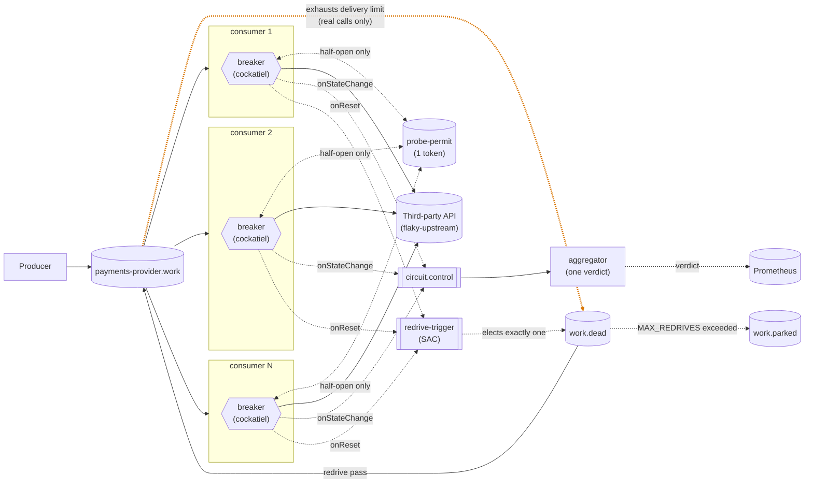

# Every dead letter earned it

One producer, one broker, a fleet of competing-consumer daemons, each with
its own [cockatiel](https://github.com/connor4312/cockatiel) circuit
breaker, a shared probe permit, a single aggregator publishing one
fleet-wide verdict, and a redrive for dead-lettered work. This is the sixth
step in a circuit-breaker article series, built on
`article/05-dead-letter-redrive`.

Every article since the first has named the same problem: a message can be
dead-lettered without the third party ever seeing it. This branch stops
that. `decide()` in `consumer.ts` had a doc comment defending the old
behaviour as "a telemetry fact, not a settlement fact"; it was both.



<sub>Amber: new or changed on this branch.</sub>

Each replica's breaker is its own instance; nothing connects the subgraphs.
`circuit.control` and `redrive-trigger` are both one-way fan-ins: every
replica publishes, but only the aggregator reads the first, and RabbitMQ
delivers the second to exactly one replica at a time.

## Counted attempts

One line in `decide()`:

```ts
// before (articles 1–5)
outcome === "ok" ? "accept" : "requeue"
// after (this branch)
outcome === "ok" ? "accept" : outcome === "open" ? "release" : "requeue"
```

`WORK_DELIVERY_LIMIT` is 3, and `requeue` counts toward it. Before, an
`open` outcome — the local breaker turned the message away, no call made —
requeued too, so three deliveries landing on open breakers, milliseconds
apart during an outage, dead-lettered a message the third party never saw.

`Client.ts`'s `Settlement` already had `release` for exactly this: a
nack-with-requeue RabbitMQ 4.3 doesn't count toward a quorum queue's
`x-delivery-limit`. `master`'s `Attempts.ts` draws the same line — "shed"
releases, "failed" counts. `failed` still requeues: a real call was made
and failed, which is what the budget is for.

**Measured:** a 40s outage (`rate=1.0`) that would have dead-lettered about
1,785 messages in its first 15s under article 5 kept `work.dead` at **zero
throughout**. The cost: the work queue grew instead — 6,800 messages at
40s and climbing — because a turned-away message now cycles between the
queue and an uncounted release for as long as the breaker stays open.

## The redrive

`packages/consumer/src/Redrive.ts`, wired in `consumer.ts`, ported from
`master`'s design:

- **Election.** A trigger queue with `x-single-active-consumer`: every
  replica binds, the broker delivers to one, and promotes another if it
  disconnects — the same broker guarantee the probe permit leans on.
- **A pass** drains `work.dead` with non-blocking `rmq.get`. For each
  message it re-checks the gate, publishes to `work` (incrementing
  `x-egress-redrive-count`) or, past `MAX_REDRIVES` (5), to `work.parked`,
  and only then acks the original — a crash in between duplicates rather
  than loses. A pass stops at 200 messages.
- **Gate.** The elected replica's own breaker must be closed — `master`'s
  choice. Gating on the aggregator's verdict is an option not taken here.
- **Triggers.** On `onReset`, once at startup, and every 30s while closed
  (`REDRIVE_SWEEP_MS`). The sweep was added after measuring `work.dead`
  sit at 1,225 for 20s+ with every breaker closed and nothing left to
  trigger a pass; `master`'s ADR 016 fixes the same stall the same way.
- **Idempotency.** A redrive republish keeps the original `message_id` —
  the producer's idempotency key — rather than letting `send` invent one.

Left out of the port: `master`'s origin-queue attribution, which separates
real work from malformed trigger messages in a shared dead-letter queue.
Here only real work reaches `work.dead`.

## The aggregator

Protecting the request path and telling the rest of the system about an
outage are different problems (`master`'s design essay). Sharing breaker
state *before* deciding whether to call puts a network round trip and a
shared failure domain in the hot path. So the aggregator reads events each
replica publishes *after* deciding, and never writes back into a breaker.

`packages/aggregator` is single-instance, no persistence:

- Binds one queue to `circuit.control` with `circuit.*`, covering every API.
- Keeps the latest `{state, at}` per instance, pruning any not heard from
  in `STALENESS_MS` (60s) so a dead replica's vote expires.
- `openFraction` is the share `open` or `half_open`; the verdict is `open`
  at `VERDICT_THRESHOLD` (0.5) or above. Both are pure functions in
  `Verdict.ts`, unit-tested without a broker.
- Exports `egress_fleet_verdict_state`, `egress_fleet_open_fraction` and
  `egress_fleet_known_replicas`, and logs every verdict change.

A restart starts from an empty registry, refilled as replicas transition.

## The permit

`Breaker.ts`'s module doc has the full reasoning. A queue with
`x-max-length: 1` and `x-overflow: reject-publish` holds one token; every
replica seeds it at startup and four of five get a nack, which `seedPermit`
treats as success. (An earlier version assumed the rejection was silent and
crash-looped four replicas on boot.) A plain single-active-consumer queue
doesn't fit: it hands over on disconnect, not when a replica's backoff
elapses.

In `HalfOpen`, a replica does a non-blocking `get` on that queue first:

- **Token** → make the real call, then requeue the token whatever the result.
- **Empty** → fail at once with `Breaker.NoPermit`, no network call.
  cockatiel treats it as a failed probe and backs off again.

## The breaker

One cockatiel `CircuitBreakerPolicy` per process, reused for its whole life
— a fresh one per call would never count failures.

- **Trips** after `BREAKER_THRESHOLD` (5) consecutive failures.
- **Half-opens** after `ExponentialBackoff` from `BREAKER_INITIAL_DELAY_MS`
  (1s) to `BREAKER_MAX_DELAY_MS` (30s), with cockatiel's default
  decorrelated jitter.
- **Four outcomes**, from `classify` in `Breaker.ts`:
  - `ok` — accept.
  - `client_error` — a 4xx other than 408/429: the third party is up and
    refused this request. A breaker success; dead-lettered at once, not
    retried. A half-open probe answered this way closes the breaker.
  - `failed` — 5xx, 408, 429, timeout, dropped connection: requeue,
    counted.
  - `open` — no call made (breaker open, or lost the permit race): release,
    uncounted, after a 100–400ms jittered hold so a replica doesn't spin
    against its own open breaker at the broker's redelivery rate.

## What this still doesn't fix

**A permanent outage grows the work queue without bound.** This branch's
own trade: `x-delivery-limit` used to move turned-away messages to
`work.dead` after three tries, an accidental cap on backlog. Now nothing
does.

**A trigger arriving mid-pass is dropped, not queued.**

**Redrive waits on the elected replica, not the fleet.** If it's the last
to close, every dead letter waits on its backoff — up to 30s after the
third party is healthy, while the rest of the fleet and the verdict already
say `closed`.

**The verdict's denominator is replicas that have transitioned, not the
fleet.** A replica that never left `closed` never publishes. Measured: the
verdict opened on the first two of five to trip (2/2 = 100%).
`egress_fleet_known_replicas` and a warning on each stale-replica drop make
this visible (`master`'s ADR 009 approach), not fixed.

**The verdict gates nothing.** Its only reader is Grafana.

**The aggregator is a single point of failure.** If it's down, breakers
still protect each replica, but there is no verdict, and it restarts empty.

**A failed `circuit.control` publish is lost.** Logged, not retried.

**Staleness (60s) and threshold (50%) are guesses**, not tuned values.

**Losing the permit race grows a replica's backoff** just as a failed probe
would; cockatiel can't tell them apart.

## Running it

```bash
pnpm install
docker compose up -d
docker compose up -d --scale rmq-consumer=12   # resize the fleet, no restart needed
```

- RabbitMQ: <http://localhost:15672> (guest/guest).
- Grafana: <http://localhost:3000/d/in-process-breaker/in-process-breaker-e28094-five-not-one>,
  anonymous access. Use this link: `:3000` alone lands on Grafana's welcome
  page. Two 401 toasts on first load (`/api/user/teams`, `/api/user/stars`)
  are Grafana's anonymous mode, harmless.
- Prometheus: <http://localhost:9090>.

From inside the devcontainer, `localhost` doesn't reach these ports; use
the service names (`rabbitmq`, `grafana`, `prometheus`, `flaky-upstream`).

## Injecting a failure

`flaky-upstream` stands in for the third party. Every POST replaces the
whole behaviour, so `{}` restores health:

```bash
curl -X POST localhost:8080/__fail -d '{"rate":1.0}'                # 503s
curl -X POST localhost:8080/__fail -d '{"rate":1.0,"status":422}'   # 422s: refused, not down
curl -X POST localhost:8080/__fail -d '{"rate":1.0,"mode":"hang"}'  # never answers
curl -X POST localhost:8080/__fail -d '{"rate":1.0,"mode":"reset"}' # drops the connection
curl -X POST localhost:8080/__fail -d '{"delayMs":1500}'            # slow, still correct
curl -X POST localhost:8080/__fail -d '{}'                          # healthy again
```

## The incident script

```bash
pnpm run incident
MODE=hang node infra/incident.mjs
STATUS=422 node infra/incident.mjs
```

Injects a failure for a fixed window, restores the third party, and
reports:

- peak backlog, total dead-lettered, time to drain, and processed/duplicate
  counts from `flaky-upstream`'s audit trail;
- breaker agreement: the share of ticks where every replica's
  `egress_consumer_breaker_state` matched, and the peak number open;
- verdict lag behind the first replica to trip (a negative lag is a
  polling artifact, not foresight);
- after the drain, how many dead letters were redriven, parked, or still
  dead when `REDRIVE_WAIT_MS` (40s) runs out.

## Load

```bash
RATE_PER_SECOND=500 docker compose up -d rmq-producer
```

The producer never reacts to anything. Combine with
`--scale rmq-consumer=N` and `incident.mjs`'s `RATE`/`WINDOW_MS`.

## Chaos testing

`infra/chaos-load.mjs` injects process and flaky-service faults under
sustained load, and judges first whether any confirmed message went
missing, then whether the breakers and aggregator behaved.

```bash
node infra/chaos-load.mjs --list
node infra/chaos-load.mjs                                    # every fault
node infra/chaos-load.mjs --faults=kill-one-consumer
node infra/chaos-load.mjs --rate=500 --spike=3000 --fault-seconds=25
```

Load comes from one forked publisher (`infra/chaos-publisher.mjs`); the
compose producer is stopped for the run. Correctness is per message: every
confirmed message must be in `flaky-upstream`'s processed set or still in
`work`, `work.dead` or `work.parked`, or the run stops. Faults:
`kill-one-consumer`, `kill-all-consumers`, `kill-aggregator`, `kill-broker`
(SIGKILLs RabbitMQ, the fault `master`'s ADR 016 was decided from) and
`flaky-storm` (`error` → `hang` → `reset` → healthy under one spike).

First full run (2026-09-19, ~350k confirmed messages): every fault passed
with zero unaccounted messages. Two observations, neither a correctness
bug:

- After `flaky-storm`, a breaker can stay open 90s+ past recovery:
  back-to-back failure modes push `ExponentialBackoff` near its 30s cap.
- The redriver never fired — `work.dead` stayed at 0. With this branch's
  fix only a message in flight just before a breaker trips can
  dead-letter; exercising the redriver under chaos needs a fault built for
  that.

## Layout

```
packages/
  config/        settings, declared once and decoded at boot
  rmq/           Effect wrapper over amqplib (Client.ts); queue names,
                 options and wire schemas shared by every process
                 (ControlPlane.ts)
  rmq-producer/  steady load onto <apiId>.work, message_id as idempotency key
  consumer/      the fleet: Breaker.ts (breaker + permit), Redrive.ts,
                 Upstream.ts (the HTTP call), consumer.ts (wiring, and decide())
  aggregator/    one verdict per apiId: Verdict.ts (pure), aggregator.ts (wiring)
  tracing/       /metrics route; OpenTelemetry, off unless OTEL_EXPORTER_OTLP_ENDPOINT is set
infra/
  flaky-upstream.mjs   the fake third party, with an audit trail
  incident.mjs         drives one incident and reports on it
  chaos-load.mjs       faults under load, judged on per-message correctness
  chaos-publisher.mjs  its load generator
  rabbitmq.conf        the broker's flow-control watermark
  monitoring/          Prometheus scrape config, Grafana dashboard
docker-compose.yml     the whole stack
```

Effect 4 (4.0.0-rc.116) — see `AGENTS.md` before writing Effect code. No
build step: packages run from `src/*.ts` through Node's type stripping.

## Verification

```bash
pnpm run check       # vendored-version check, typecheck, unit tests
pnpm run test:rmq    # needs Docker: AMQP behaviour against a real broker
```
