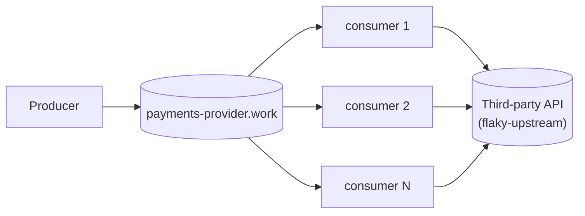

# The base scenario

One producer, one broker, a fleet of competing-consumer daemons calling a
third party directly. No circuit breaker anywhere in this branch — that's
deliberate. This is the starting point a circuit-breaker article series
builds up from, kept as a real, runnable branch rather than only a diagram.



Five daemons, each anonymous — no index, no identity, no coordination between
them. Each one decides for itself, per message, whether its own last call
worked. A failed call is handed back to the broker (`requeue`); the broker's
own `x-delivery-limit` (3 attempts) dead-letters it once that budget is
spent. Nothing here backs off when the third party degrades, nothing tells
the fleet what's happening, and nothing stops the producer. That absence —
not a bug, the actual starting condition — is what later articles add
pieces to fix.

## Running it

```bash
pnpm install
docker compose up -d
docker compose up -d --scale rmq-consumer=12   # resize the fleet, no restart needed
```

- RabbitMQ management UI: <http://localhost:15672> (guest/guest) — watch
  `payments-provider.work`'s depth climb during an outage and drain once it
  ends.
- Grafana: <http://localhost:3000> (admin/admin, default install — login is
  required, no anonymous access configured) — a small dashboard (queue
  depth, dead-letter growth, calls by outcome, active consumers).
- Prometheus: <http://localhost:9090>.

## Injecting a failure

`flaky-upstream` stands in for the third party. Every field is optional and a
POST replaces the whole behaviour, so `{}` restores health:

```bash
curl -X POST localhost:8080/__fail -d '{"rate":1.0}'                # 503s
curl -X POST localhost:8080/__fail -d '{"rate":1.0,"mode":"hang"}'  # never answers
curl -X POST localhost:8080/__fail -d '{"rate":1.0,"mode":"reset"}' # drops the connection
curl -X POST localhost:8080/__fail -d '{"delayMs":1500}'            # slow, still correct
curl -X POST localhost:8080/__fail -d '{}'                          # healthy again
```

## The incident script

```bash
pnpm run incident
MODE=hang node infra/incident.mjs
```

Injects a full failure, watches the work queue and dead-letter queue for a
fixed window (via RabbitMQ's own management API — no application counter
involved), restores the third party, and reports what actually happened:
peak backlog, total dead-lettered, time to drain, and a processed/duplicate
count read from `flaky-upstream`'s own per-message audit trail.

Measured, not assumed: the two failure modes look different. The default
(`error`, an instant 503) dead-letters almost as fast as it arrives — five
consumers clear a 200/s failure rate quickly enough that the *work* queue
never visibly backs up, and dead-lettering is the only symptom. `mode=hang`
holds every call open for the full 2s client timeout instead, which pins all
100 in-flight slots (5 consumers × `MAX_IN_FLIGHT=20`) and drops the fleet's
effective drain rate below the arrival rate — *that's* what makes the work
queue itself grow. Same absence of a breaker either way, two different
symptoms depending on how the third party fails. These are the numbers a
later article's "what a breaker buys you" comparison cites.

## Load

The producer's rate is configurable and never reacts to anything:

```bash
RATE_PER_SECOND=500 docker compose up -d rmq-producer
```

Combine with `--scale rmq-consumer=N` and `infra/incident.mjs`'s `RATE`/
`WINDOW_MS` env vars to drive a specific incident shape.

## Layout

```
packages/
  config/      @egress/config — settings declared once, decoded at boot
  rmq/         @egress/rmq — Effect wrapper over amqplib, plus the generic
               work-queue naming/options a producer and a consumer fleet share
  rmq-producer/  the load: a steady stream onto <apiId>.work, never backing off
  consumer/    the naive competing-consumer fleet — no circuit awareness,
               see src/consumer.ts for why that absence is the point
  tracing/     the /metrics HTTP route every process serves; OpenTelemetry
               tracing is wired but off unless OTEL_EXPORTER_OTLP_ENDPOINT is set
infra/
  flaky-upstream.mjs   the fake third party: configurable failures, an audit trail
  rabbitmq.conf        the broker's flow-control watermark
  incident.mjs         drives one incident, reports what happened
  monitoring/          Prometheus scrape config and the Grafana dashboard
docker-compose.yml     the whole stack
```

Built on **Effect 4 (4.0.0-rc.115)**, same as the full system this branch was
pruned from — see `AGENTS.md` for why that version matters when writing
Effect code here. No build step: every package runs straight off its
`src/*.ts` through Node's built-in type stripping.

## Verification

```bash
pnpm run check       # typecheck + unit tests
pnpm run test:rmq    # optional — needs Docker: AMQP behaviour against a real broker
```
