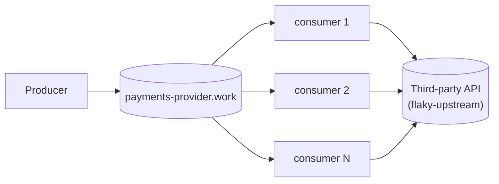

# The base scenario
> [Main overview](https://github.com/lsfera/reasoning-over-circuit-breaker/blob/main/README.md) | [Next: 02 · A breaker in every process](https://github.com/lsfera/reasoning-over-circuit-breaker/blob/article/02-in-process-breaker/README.md)


A producer, a broker, and a fleet of competing consumers calling a third party
directly, with **no circuit breaker**: each consumer judges only its own last
call, hands a failure back to the broker (`requeue`), and the broker's
`x-delivery-limit` (3 attempts) dead-letters whatever keeps failing. The
articles that follow build on this; `article/02-in-process-breaker` adds a
breaker.



## What an outage does

**Measured**, 200 msg/s, five consumers (`pnpm run incident`, one run each):

| outage | waiting in the work queue | dead-lettered | backlog cleared after restore |
| --- | ---: | ---: | ---: |
| 20 s, `error` | 0 | ≈ 4,000 | 0.0 s |
| 20 s, `mode=hang` | 3,720 | 200 | 0.4 s |
| 120 s, `mode=hang` | 22,620 | 1,500 | 1.2 s |

- **Work is lost as fast as the fleet can spend attempts.** An `error` answer is
  instant, so every message spends its 3 attempts as it arrives: about 200/s
  dead-lettered, nothing waiting.
- **A hang spends them slowly.** Each attempt holds one of 100 in-flight slots
  (5 consumers × `MAX_IN_FLIGHT` 20) for the 2 s timeout: about 10/s
  dead-lettered, while the other ~190/s pile up and drain in a second once the
  third party recovers. The backlog grows until then, or until the broker runs
  out of room. (The 120 s run started with 4,517 already dead-lettered,
  subtracted.)
- **No duplicates**: 0 across 22,848 processed calls over five incidents. The
  producer stamps each message's `message_id` (`<run>:<n>`) once, and the
  consumer sends it as the idempotency header, so a redelivery repeats the same
  request.


A 20 s `error` outage (3.71× real time, [full recording](docs/media/incident-error-mode.webm)):
the dead-letter queue climbs to 4,019 while the work queue stays empty.

## What it cannot overcome

None of these is a bug in `packages/rmq-consumer`; each follows from having no
breaker.

- **No shared verdict**: each replica judges only its own last call.
- **Nothing backs off**: the producer keeps its rate and consumers call at full
  concurrency, so a dead third party is hit as hard as a healthy one.
- **Dead letters have no way back**: they stay in `payments-provider.work.dead`
  until a human replays them, mixed with deliveries the consumer refused
  (malformed, no `message_id`).
- **Slow down and broken look alike**: `Upstream.ts` reduces a timeout, a
  refused connection, a 503 and a 429 to the same `"failed"`.
- **Nothing announces the outage**: you notice only by watching Grafana.
- **Replicas can't be compared**: the dashboard sums them, so one sick consumer
  and a sick third party look the same.

## Running it

```bash
pnpm install
docker compose up -d                              # HOST_WORKSPACE_FOLDER: this repo's path on the host (macOS)
docker compose up -d --scale rmq-consumer=12      # resize the fleet
RATE_PER_SECOND=500 docker compose up -d rmq-producer
```

From the devcontainer, by service name (from the host, `localhost`):
- RabbitMQ <http://rabbitmq:15672> (guest/guest)
- Grafana <http://grafana:3000/d/base-scenario>
- Prometheus <http://prometheus:9090>

`flaky-upstream` is the third party; a POST replaces its behaviour, `{}`
restores it, and `/__audit?run=*` counts what it answered 200:

```bash
curl -X POST flaky-upstream:8080/__fail -d '{"rate":1.0}'                  # 503s
curl -X POST flaky-upstream:8080/__fail -d '{"rate":1.0,"mode":"hang"}'    # never answers
curl -X POST flaky-upstream:8080/__fail -d '{"rate":1.0,"mode":"reset"}'   # drops the connection
curl -X POST flaky-upstream:8080/__fail -d '{"delayMs":1500}'              # slow, still correct
curl -X POST flaky-upstream:8080/__fail -d '{}'                            # healthy
```

`pnpm run incident` drives one outage and reports peak backlog, dead letters,
time to drain and duplicates (`MODE=hang`, `RATE`, `WINDOW_MS` shape it).

## Layout

```
packages/
  config/        settings declared once, decoded at boot
  rmq/           amqplib in Effect, work-queue conventions
  rmq-producer/  the load, in confirmed batches, never backing off
  rmq-consumer/  the naive competing-consumer fleet (consumer.ts)
  tracing/       /metrics, and OpenTelemetry when OTEL_EXPORTER_OTLP_ENDPOINT is set
infra/
  flaky-upstream.mjs          the fake third party, with an audit trail
  incident.mjs                drives one incident
  monitoring/, rabbitmq.conf  scrape config and dashboard; the broker's watermark
```

**Effect 4 (4.0.0-rc.117)**; see `AGENTS.md`. No build step: Node runs the
`src/*.ts` directly.

```bash
pnpm run check       # vendored version, typecheck, unit tests
pnpm run test:rmq    # needs Docker: against a real broker
```

> [Main overview](https://github.com/lsfera/reasoning-over-circuit-breaker/blob/main/README.md) | [Next: 02 · A breaker in every process](https://github.com/lsfera/reasoning-over-circuit-breaker/blob/article/02-in-process-breaker/README.md)
