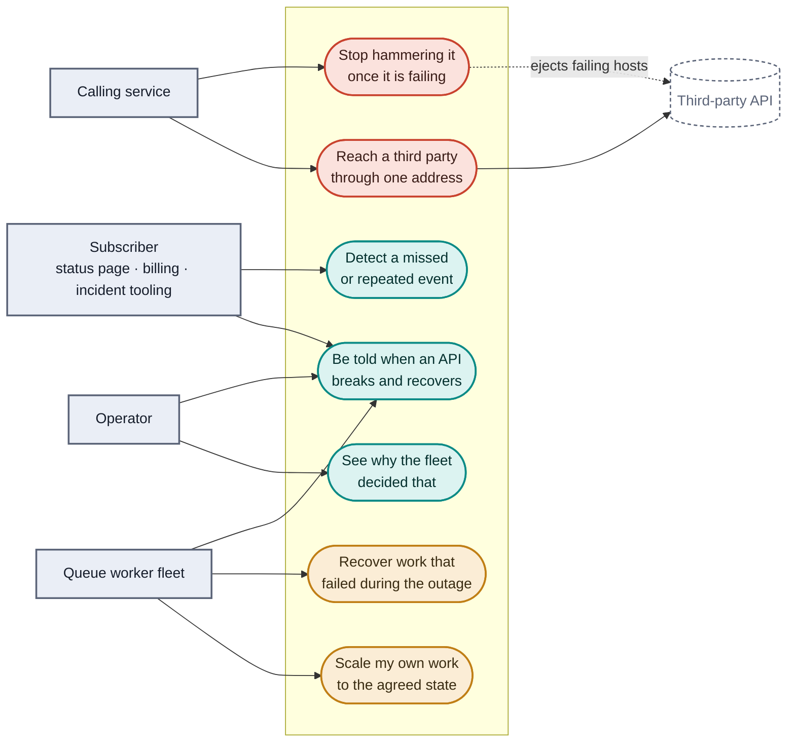

# Per-API egress circuit breaker events

Services call third-party APIs through a shared egress path. When one of those
third parties degrades, everything downstream needs to be **told** — per API,
as discrete events, reliably enough to act on.

That sounds like a circuit breaker, and a breaker is part of it. The
interesting half is that protecting the request path and telling the rest of
the system about it are different problems with different correct answers,
and most of the obvious designs conflate them.

Who wants what from it:



If you would rather read how this was arrived at than what it is,
[history/journey.md](history/journey.md) tells it as the sequence of forks —
starting from a producer, a queue and a fleet of daemons calling one flaky
third party, which is where it did start.

Red is enforcement, in the request path and immediate. Teal is publication,
off the request path and seconds later. Amber is what a *consumer* of those
events does with them — and it is a first-class actor here, not an
afterthought: the fleet that reacts to an outage is where the cost of getting
this wrong actually lands.

## The problem

Concretely, the requirement is: for each third-party API, publish an event
when it starts failing and when it recovers, to subscribers who were not in
the request path. Three constraints fall out of that, and every design below
lives or dies on them.

**One verdict per API, not one per proxy.** Egress runs behind more than one
proxy instance, and each one samples the upstream independently. That is
correct for protection — a replica should eject a host it can see is bad,
immediately, without asking anyone. It is wrong for notification: with ten
replicas and a degrading upstream you get up to ten `circuit_opened` events at
ten timestamps, then recoveries out of step. A subscriber sees an API flap
several times for a single incident and has to de-duplicate a distributed
system's internal disagreement on its own.

**Emission cannot sit in the request path.** At egress throughput no proxy
holds its p99 while making an outbound POST per event, and a degrading
upstream generates tens of thousands of per-request rejections when what a
subscriber wants is one `circuit_opened`. Whatever publishes has to coalesce,
buffer with a bound, and shed rather than backpressure into the proxy.

**The stream has to be a contract, not a feed.** Per-API ordering, a sequence
a subscriber can check, and enough state in each event that a consumer joining
mid-incident is not blind. Otherwise every subscriber reimplements
loss-detection, differently and mostly wrongly.

## Approaches, and where each one runs out

These are the real options, in roughly increasing order of how much you build.
Each is defensible; each fails one of the three constraints above.

They are also, deliberately, only the *architectural* options — the ones that
answer "where does the verdict come from". The per-call and per-queue
answers an engineer reaches for first — timeouts, retries, backoff, bulkheads,
prefetch ceilings, dead-lettering, redrive — are not alternatives to these and
this repo uses nearly all of them. [docs/approaches.md](docs/approaches.md)
reviews every layer together, with what each one cannot do.

**A breaker library in every service** — Resilience4j, Polly, opossum,
gobreaker. Mature, well understood, and the state lives in a variable in one
process. Ten instances of a service hold ten independent opinions about the
same third party, and two *different* services calling it learn separately.
There is also nothing to publish from: you would add an event path to every
service, in every language you run. Fails constraint one, at the worst
possible granularity.

  Simulated at this fleet's shape and this repo's timings, five daemons against
  an upstream failing 45% of the time agree with each other **17% of the time**,
  and send **370 probes in five minutes** at one that is fully down. The long
  version, with diagrams and the cases where a library is still the right
  answer, is [docs/breaker-library.md](docs/breaker-library.md).

**Publish straight from the proxy.** Envoy already emits discrete ejection
records (`outlier_detection.event_log_path`); point them at a webhook and
you are done in an afternoon. Except those records are *per replica*, so the
flapping above is exactly what subscribers get — and the most important
signal isn't in there at all: threshold saturation is a counter delta
(`*_overflow`), not an event. Fails constraints one and two.

**Share breaker state across replicas in Redis** so they agree before anyone
publishes. This is the tempting fix, and it puts a network round trip and a
shared failure domain in the hot path of the component whose entire job is
surviving other people's failures. Fails constraint two, in the direction that
hurts most.

**A batteries-included gateway — Apache APISIX.** Genuinely less to build:
`api-breaker` for breaking, `http-logger` to POST JSON to an endpoint (a
literal webhook sink, no bridge), etcd for cluster config, a forward-proxy
plugin for egress. The trade is that `api-breaker` is per-route and much
cruder than outlier detection — no per-host ejection, no success-rate
statistics — it is Lua/OpenResty, and `http-logger` fires *per request*, which
is precisely the hot-path coupling constraint two rules out.

**A service mesh.** Istio's outlier detection is Envoy's, configured through
`DestinationRule`, so the enforcement is the same quality. But it runs per
sidecar, which leaves the aggregation problem exactly where it was, and mesh
telemetry is metrics-shaped rather than a discrete per-API event contract.
Egress through a mesh means an egress gateway anyway, so you arrive at this
repo's topology having also adopted a mesh.

**Build the proxy — Pingora.** It would give precisely the breaker and event
semantics wanted, and Cloudflare's cache runs on it, so it is proven at scale.
But it is a library, not a proxy: no config plane, no admin API, no
clustering. River is not a product yet. That is a quarter of engineering to
arrive where Envoy starts.

| | One verdict per API | Off the request path | Event contract |
|---|---|---|---|
| Breaker library per service | no — per process | n/a | build it yourself, per language |
| Publish from the proxy | no — per replica | no | partial: saturation isn't an event |
| Shared state in Redis | yes | **no** — round trip in the hot path | still to build |
| APISIX | per route, not per host | no — `http-logger` is per request | yes, out of the box |
| Service mesh | no — per sidecar | yes | metrics, not events |
| Pingora | yes | yes | yes — and you build all of it |
| **Enforce locally, publish centrally** | yes | yes | yes |

## What this repo does instead

Split the two jobs and let each be correct on its own terms. Envoy enforces,
per replica, immediately, and never makes a call on behalf of an event. A
control-plane aggregator watches all the replicas, resolves their
disagreement into one state per API, and publishes.

| | Enforces | Publishes | Latency |
|---|---|---|---|
| Envoy, per replica | yes, immediately | no | sub-second |
| Aggregator, one machine per API | no — observational here (could push config; see [The fork this defers](docs/architecture.md#the-fork-this-defers)) | yes | seconds |


Five independent proxies, three different verdicts at the same instant — none
of them wrong, outlier detection is deliberately local per replica. The
aggregator counts votes against a quorum and waits for that count to hold for
`dwellMs` before publishing anything; disagreement never reaches a subscriber.

The console makes this visible. The coloured strip on each API is one block per
replica showing that replica's local view. Drive an upstream to a partial
failure rate and you will see the blocks disagree while the published state
stays steady.

### Three components, because the constraints say three

| | Owns |
|---|---|
| **Envoy** | enforcement: local, immediate, per replica. Never makes a call on behalf of an event. |
| **Aggregator** (this repo) | fleet-wide state per API, sequencing, coalescing, idempotency, retry, dead-lettering, load shedding. |
| **Broker / subscribers** | fanout, replay, subscriber state. |

Coalescing is most of the value: a degrading upstream produces tens of thousands
of per-request `UO` rejections, and what a subscriber wants is one
`circuit_opened`. The aggregator's buffers are bounded and shed load rather than
backpressuring into the proxy. In production the first hop is a broker (Kafka,
NATS) with webhook delivery as a consumer of it, so replay is the broker's
problem; `WebhookSink` here stands in for that hop.


Only the node in teal is doing anything at a given moment. The standby holds
one connection to Redis and nothing else — see
[High availability](docs/high-availability.md) for what makes that safe.

## Running it

```bash
pnpm install
pnpm start           # simulated 5-replica fleet
pnpm run check       # typecheck + 67 tests
pnpm run test:redis  # optional — needs Docker: HA coordination against a real Redis
pnpm run test:rmq    # optional — needs Docker: AMQP behaviour against a real broker
```

Then open <http://localhost:8088>. For the full thing — three real Envoy
replicas, two aggregators, a real broker and the daemon fleet — see
[Running against real Envoy](docs/operations.md#running-against-real-envoy).

Built on **Effect 4 (4.0.0-rc.113)**. Requires Node 22.6+ and TypeScript 7.
TypeScript runs natively via Node's type stripping, so there is still no build
step — but `tsc --noEmit` is now load-bearing, because Effect's guarantees are
type-level.

> Effect 4 is a release candidate. Versions are pinned exactly (`effect`,
> `@effect/platform-node` and `@effect/opentelemetry` ship in lockstep at the
> same version) because RC APIs still move — `ServiceMap` was renamed back to
> `Context` and `Effect.fork` became explicit `forkChild`/`forkScoped`/`forkIn`
> between beta and rc.112, and rc.113 moved every `Flag`, `Argument` and
> `Config` constructor to PascalCase (`Flag.string` → `Flag.String`,
> `Flag.integer` → `Flag.Int`, `Flag.choice` → `Flag.Literals`) and stopped
> exporting `Config.Port` as a schema.
>
> Note for anyone running `npm view effect version`: the `latest` dist-tag is
> the **v3** line. This repo tracks the `rc` tag, so "upgrade to latest" here
> means the newest `4.0.0-rc.*`, not `3.x` — which would not be an upgrade.

## Demo script

1. **Steady state.** Three APIs, five replicas, all `CLOSED`.
2. **Drag payments-provider to ~45%.** Replica blocks start diverging — the
   label reads "5 replicas disagree". The published state moves to `DEGRADED`
   once a quorum agrees, and *stays there*. One event, not five.
3. **Drag to 100%.** Every replica ejects every host. `OPEN`, reason
   `all endpoints ejected`.
4. **Watch it probe.** After the open window it moves to `HALF_OPEN`; the
   upstream is still dead so it fails the probe, returns to `OPEN`, and doubles
   its backoff. It does not hammer a dead upstream.
5. **Hit Restore.** Active health checks un-eject hosts, the next probe
   succeeds, and it closes. Total lifecycle ~20s.
6. **Check the right-hand panel** throughout: sequence gaps and duplicates both
   stay at zero. That is the delivery contract holding.
7. **Watch the daemon fleet react** (real-Envoy stack only): the five
   consumers stop pulling on `OPEN`, the work queue builds, and they ramp
   back `1 → 4 → 5` as it recovers — with no coordination between them. See
   [The RabbitMQ daemon fleet](docs/rmq-control-plane.md#the-fleet-as-it-runs).

A seventh thing worth trying by hand, because it is the state hardest to
reach on purpose: fail *some* of an API's endpoints rather than all of them.
`curl -X POST localhost:8080/__fail -d '{"rate":1.0}'` takes down one of
payments-provider's six, every replica ejects that host, and the fleet
reports `DEGRADED` at `4/6` healthy — partial ejection, which is what
`DEGRADED` exists to describe.


Six published events for an incident that produced tens of thousands of
per-request rejections and five replicas' worth of disagreement. The two
passes through `HALF_OPEN` are the same code path — only the backoff differs,
which is what keeps step ④ from hammering a dead upstream.

Run `pnpm run subscribe` in a second terminal for a consumer's view of the same
stream.

### Running it hands-free

```bash
pnpm run demo                    # payments-provider, against localhost:8088
pnpm run demo -- shipping-rates  # a different API
```

`packages/demo/src/driver.ts` drives exactly the steps above through the same
`/api/failure` route the console's slider calls, and narrates every published
transition as `/api/events` reports it — so a demo is one command in a second
terminal, and the console (or the [Grafana dashboard](docs/operations.md#metrics--monitoring)) is
what the audience actually watches. Nothing about the incident is scripted or
mocked: the driver only sets the failure rate and waits for the real aggregator
to publish, on the real wall clock. It ends by reading `/api/subscriber` and
failing loudly if a gap or duplicate shows up — the automated form of step 6.

Two details that only matter once the stack is real. `AGGREGATOR` takes a
comma-separated list, because only the leader publishes and which instance
that is depends on who won the lease — the driver asks each candidate and
drives the one that answers `isLeader`. And if `PROMETHEUS` is set, it also
asserts step 7 from the fleet's own metrics: that every daemon stopped on
`OPEN`, that the backlog it built drained afterwards, and that the per-API
sequence contract held on the AMQP transport too. Unset, that step is
skipped rather than failed.

```
== Drag payments-provider to 45% ==
  seq=1   CLOSED     -> DEGRADED   OUTLIER_EJECTION

== Drag payments-provider to 100% ==
  seq=2   DEGRADED   -> OPEN       ALL_ENDPOINTS_EJECTED

== Watch it probe — upstream is still dead, so this reopens with doubled backoff ==
  seq=3   OPEN       -> HALF_OPEN  OPEN_TIMEOUT_ELAPSED
  seq=4   HALF_OPEN  -> OPEN       PROBE_FAILED

== Hit Restore ==
  seq=5   OPEN       -> HALF_OPEN  OPEN_TIMEOUT_ELAPSED
  seq=6   HALF_OPEN  -> CLOSED     PROBE_SUCCEEDED

== Delivery contract, read from outside the process ==
  received=14 snapshots=8 duplicates=0 gaps=0
  gapless and non-repeating through the full incident.
```

Against the real stack, with `PROMETHEUS` set, it also prints the other half —
this is a verbatim run:

```
== The daemon fleet reacts — no coordination, same events ==
  target=0/5 pulling=0 work=290 dead-lettered=2343
  nothing is calling the dead upstream; the backlog is the point.

== Fleet: ramp back, drain, and the same contract on AMQP ==
  target=5/5 pulling=5 work=0 dead-lettered=2343 (deepest backlog seen: 2170)
  the same per-API sequence guarantee held on the AMQP transport too,
  checked by 5 consumers the publisher does not control.
```

## Layout

A pnpm workspace, one package per component. The split is deliberate: **the
decision logic is pure, the shell is Effect, and each has its own boundary
you can `pnpm --filter` independently.**

```
packages/
  domain/                    @egress/domain — pure, no Effect, no clock, no I/O
    src/Model.ts             vocabulary, Schema for the published event, error types
    src/Breaker.ts           the state machine — pure functions, total on (state, reports, now)
    test/Breaker.test.ts     12 tests, pure — no runtime, no clock, no mocks

  aggregator/                @egress/aggregator — depends on @egress/domain
    src/Aggregator.ts        service: tick loop over the pure machine, on a Schedule
    src/Coordination.ts      leader election + fencing-token checkpoints — see High availability
    src/Events.ts            EventBus (PubSub) + EventSink (webhook, declarative retry)
    src/Outbox.ts            durable outbox: what a subscriber that was down gets when it returns
    src/FleetSource.ts       service with two layers: simulated fleet, real Envoy (polling)
    src/EnvoyPushSource.ts   the third: Envoy's metrics-service sink pushing here, no build step
    proto/                   partial, wire-compatible schemas — only the fields this repo reads
    src/Http.ts              routes, SSE as a merged Stream, delivery-integrity tracking,
                             /metrics, and /livez + /readyz (liveness is the tick loop,
                             readiness is not leadership)
    src/Telemetry.ts         every Metric the app emits, in one place
    src/main.ts              layer composition, NodeRuntime.runMain
    public/index.html        operator console (unchanged — plain HTML/CSS/JS)
    test/Aggregator.test.ts   14 tests — full pipeline under TestClock, stats parsing,
                              and the delivery-integrity tracker as a pure function
    test/Coordination.test.ts  8 tests — fencing primitives, a real two-instance failover, a
                              re-promotion, a coordination outage, and a clean shutdown
                              handing the lease back
    test/Outbox.test.ts        3 tests, pure — ordering, partial commit, and which end the bound drops
    test/integration/          8 tests: Redis-backed HA and the durable outbox, opt-in
                               (`pnpm run test:redis`) — needs Docker

  subscriber/                @egress/subscriber — depends on @egress/domain
    src/subscriber.ts        standalone consumer; decodes with the producer's Schema

  rmq/                       @egress/rmq — Effect wrapper over amqplib (AMQP 0-9-1)
    src/Client.ts            the Rmq service; two silent client bugs guarded here
    src/ControlPlane.ts      circuit.control naming and both message codecs, shared by
                             publisher and consumers
    test/ControlPlane.test.ts  7 tests, pure — what this control plane will and will not read
    test/integration/        12 tests against a real broker, opt-in (`pnpm run test:rmq`)

  rmq-consumer/              @egress/rmq-consumer — the competing-consumer daemon fleet
    src/DaemonPolicy.ts      pure: (prior, circuit state, now) -> what fraction should be working
    src/DaemonState.ts       pure: the daemon's whole decision — one state, one reducer,
                             plus which connections should exist and what to do about it
    src/Contract.ts          pure: the per-API sequence guarantee, checked on the AMQP side
    src/daemon.ts            one daemon, one process; one connection, two SAC elections
    src/Redrive.ts           dead-letter recovery: bounded passes, own connection per pass
    src/Tally.ts             pure: what has been counted, and what the registry is still owed
    src/Telemetry.ts         every metric the fleet emits, in one place
    src/main.ts              one daemon, one process, plus /metrics
    test/DaemonPolicy.test.ts  11 tests, pure — no runtime, no broker; the ramp is gated on
                              elapsed time, so they pass the clock in rather than mock one
    test/DaemonState.test.ts   12 tests, pure — the reducer, the dedupes, and the plan
    test/Contract.test.ts      7 tests, pure — including the backwards-sequence case
    test/Tally.test.ts         5 tests, pure — including the counted-during-a-flush case

  rmq-producer/              @egress/rmq-producer — the load, on purpose not part of the fleet
    src/producer.ts          floods the work queue; never backs off, and never reads the circuit
    src/Telemetry.ts         its one counter
    src/main.ts              entrypoint plus /metrics

  tracing/                   @egress/tracing — the OpenTelemetry layer, and nothing else
    src/Tracing.ts           opt-in: no OTLP endpoint, no tracer, no cost

  config/                    @egress/config — how every process reads its settings
    src/Settings.ts          declared once, decoded at boot; a value a process cannot
                             use stops it before it opens a socket
    test/Settings.test.ts    7 tests, pure — every value that used to become NaN

  demo/                      @egress/demo — no dependency on the others, speaks only HTTP
    src/driver.ts            drives the demo script over HTTP, narrates transitions

infra/
  envoy/envoy.yaml           egress config: per-API clusters, outlier detection
  rabbitmq.conf              the broker's flow-control watermark, declared: it does not
                             read its own cgroup limit
  traffic-generator.mjs      keeps requests flowing through Envoy so /__fail means something
  scale-probe.mjs            what one instance costs at N APIs — ticks, poll, series, payloads
  chaos.mjs                  kill the leader, kill the elected prober; assertions, not a story
  instrument.mjs             what the stack costs while it does that — Docker's stats
                             stream, per container, inside declared limits
  monitoring/                Prometheus scrape config, alert rules + SLOs, Alertmanager
                             routing, and the provisioned Grafana dashboard
  alert-sink.mjs             stands in for Slack: logs what Alertmanager sends it

Dockerfile                   one image for every process here; deps at build time, no compile step
.dockerignore                keeps the host's node_modules (absolute symlinks) out of the build context
docs/                        the system as it is — one document per job, and what the
                             site publishes; see "Where to read next" below
history/                     how it got there: the journey, the long-form findings, and
                             what the broker taught. Kept out of docs/ because a record
                             stops being useful the moment it is edited to stay current
  runs/                      one JSON record per instrumented run; the baselines the
                             documentation quotes are kept, the rest are gitignored
  architecture.md            Envoy, its signals, ingestion, and the published event contract
  high-availability.md       the lease, fencing, epochs, the outbox, the partition
  rmq-control-plane.md       the RabbitMQ scenario: design, live runs, what the broker taught
  operations.md              running the stack, every metric, the dashboards, the alerts
  measurements.md            scale, chaos and the soak, with the commands behind each number
  what-if.md                 environments this was not measured against, and what breaks
  approaches.md              every option the constraint leaves open, and where each stops
  breaker-library.md         the first answer, measured against this fleet's shape
  adopting.md                scaling the fleet, and what to take into your own repo
  _config.yml, _layouts/     the same documents, served as a site — see "Reading this as a site"
  Dockerfile, nginx.conf     that site as an image, for reading it offline
  security.md                what is missing and what production must do, with line references
  effect-notes.md            what Effect bought, and what an RC pin costs
  decisions/                 decision records: what was chosen, and the measurement it rests on
  runbooks/                  one per alert — what fired, what to check, what to do about it
docker-compose.yml           wires infra/ and the packages/ entrypoints together, and
                             declares what each service may use — see ADR 014
.github/workflows/ci.yml     `pnpm run check` on every push, and both Docker-backed
                             suites (`test:redis`, `test:rmq`) in a second job — they
                             are opt-in locally, which makes them the ones most likely
                             to rot unnoticed
```

### Reading this as a site

Everything under `docs/` is also published as a GitHub Pages site — this file
included, which is why the build context is the repository root rather than
`docs/`. Four documents link into this README's sections, and a link that leaves
the site for its own front page is a strange thing to make a reader follow.
Built by `.github/workflows/pages.yml`. Enable it once, in **Settings → Pages → Source:
GitHub Actions**; nothing else needs configuring, because a project site is
served from `<owner>.github.io/<repo>/` and the layout derives the repository
links from that.

The documents are written for GitHub first and were not rewritten for the site.
Three of them contain `{{ ... }}` that is not Liquid — a `docker inspect -f`
format string, and mermaid's hexagon-node syntax — which Jekyll 3 silently
deletes, turning a documented command into `docker inspect -f ''`. That is why
the site builds from a workflow on Jekyll 4, which can switch Liquid off per
page, rather than from the `/docs` folder setting. `docs/Gemfile` says so at
the point where someone would otherwise simplify it back.

Links that leave `docs/` — source files, this README, the Dockerfile — have no
page on the site, so the layout rewrites them to the repository at their real
paths rather than letting them 404.

The site is also an image, so the documentation travels. Port 4000 because it
is Jekyll's own default and nothing in `docker-compose.yml` wants it — 8080
through 8085 and 8090 through 8096 belong to `flaky-upstream`:

```
pnpm run site                 # build it and serve on http://localhost:4000
pnpm run site:build           # just the image
SITE_PORT=4100 pnpm run site  # if 4000 is taken too
```

Mermaid is vendored into that image rather than loaded from a CDN — four of
these documents explain themselves with a diagram, and an image whose point is
reading offline cannot fetch a renderer at page load. Web fonts still come from
Google, so offline the pages fall back to Georgia and the system sans, which
they are designed to do.

**CI deploys what that image serves.** `.github/workflows/pages.yml` builds
`docs/Dockerfile`, copies the site straight out of the container, and publishes
that — so the published site and the one in your hand are one build rather than
two that are meant to agree. The only difference between them is `BASEURL`,
which a project site needs and `localhost` must not have.

Without Docker, Jekyll directly still works:

```
cd docs && bundle install && bundle exec jekyll serve
```

That path builds `docs/` alone, so this README is not part of it — only the
image and CI include it.

Cross-package imports go through `@egress/domain`'s `package.json#exports`
(`@egress/domain/Model.ts`, `@egress/domain/Breaker.ts`) rather than relative
`../../` paths, and `workspace:*` in each consumer's `package.json` is what
`pnpm install` resolves to a symlink — so a change to the state machine is a
change in one package, felt through a real dependency edge, not a shared
folder. There is still no build step: every package runs straight off its
`src/*.ts` via `--experimental-strip-types`, and `tsc --noEmit` at the root
typechecks every package in one pass (`packages/*/src` and
`packages/*/test` in `tsconfig.json`'s `include`). The root scripts
(`pnpm start`, `pnpm run demo`, `pnpm run subscribe`) call `node` on each
package's entrypoint directly rather than going through `pnpm --filter`:
this pnpm version does not strip a trailing `--` the way npm does, so
`pnpm --filter @egress/demo start -- shipping-rates` would hand the driver
the literal string `"--"` as its API id instead of `"shipping-rates"` —
direct invocation is what makes `pnpm run demo shipping-rates` (no `--`)
actually work.

`Breaker.step` is a total function of `(state, now, config)`. Everything hard to
reason about — concurrency, scheduling, delivery, retries — lives in the Effect
layer above it. That is why the logic deciding what subscribers get told can be
tested exhaustively with plain `assert`.

## What is a prototype, not production

Ordered by what would stop you first. Each one is a gap in this repo, not a
general caveat — where it has been measured, the number is here.

- **There is no security here at all, and it is written down rather than
  implied.** No authentication, no authorization, no TLS on any hop, and no
  secret handling — plus two inputs that shape decisions and accept anything
  that can reach them: the failure-injection route
  ([Http.ts:288](packages/aggregator/src/Http.ts#L288)) and the gRPC metrics
  sink ([EnvoyPushSource.ts:164](packages/aggregator/src/EnvoyPushSource.ts#L164)),
  which will believe whichever node id a caller claims. [docs/security.md](docs/security.md)
  is the full inventory: ten sections, every claim with a file and line, and one
  line each on what production would have to do. It was deliberately left as an
  inventory — a token check on one route while another accepts anonymous input
  moves the problem and leaves the next reader thinking the surface is secured.
- **HTTPS egress needs TLS interception** for any of the L7 signals to exist. If
  you proxy via `CONNECT` you get L4 only, `consecutive_5xx` is dead, and the
  breaker degrades to connection-level detection. Decide this early: it drives
  the whole certificate story.
- **One Redis is one Redis.** Leader election, failover and the Redis backend
  are real, deployed and watched working — `docker compose up` runs two
  aggregator instances against a shared Redis, killing the leader mid-incident
  is [an assertion now, not an anecdote](docs/measurements.md#chaos-on-demand-rather-than-by-hand),
  and AOF plus a named volume means a restart no longer starts the next leader
  from nothing. What is still prototype is *replication*. Losing that one
  instance costs the checkpoints — a new leader resumes from nothing rather
  than from where the last one stopped — but no longer costs correctness,
  because the fencing token carries an epoch and a coordinator that lost its
  state cannot hand a stale leader a token that outranks the live one. A real
  deployment wants Redis with replication, or a different backing store
  entirely (etcd, a Postgres advisory lock) behind the unchanged
  `LeaderElection`/`CheckpointStore` interfaces — those interfaces, not this
  Redis config, are the part meant to carry over.
- **One broker is a quorum of one.** The work and dead-letter queues are
  durable quorum queues with a delivery limit, and the broker has a volume, so
  messages survive a restart — [measured, 6,628 in and 6,628 out](docs/rmq-control-plane.md).
  Tolerating the loss of a *node* is what quorum queues are actually for, and
  that needs three of them. This repo runs one.
- **The console does not scale the way the control loop does.** `/api/stream`
  re-sends the whole state frame every 400ms, which is about 2.75 MB/s per
  connected browser at a thousand APIs while the tick loop itself barely
  notices the size — see [Measured limits](docs/measurements.md). A production
  console sends diffs or a page, and nothing in the control path would ever
  tell you it needed to.
- **Nothing here has run for longer than half an hour.** The soak is 27
  minutes, deliberately disrupted, and it rules out a fast leak and nothing
  more — RSS moved about 5 MiB. There is no multi-hour run, no run at 1000
  APIs beyond a sampling window, and RSS at that size is one reading rather
  than a curve.

### Five things that used to be on this list

Kept because a list of gaps is only trustworthy if you can see what leaves it.

- **There is distributed tracing now.** This said there was none, and that it
  was a choice rather than an omission. It is built: a `traceparent` rides the
  AMQP header, so a trace runs from the producer's publish through the daemon's
  third-party call, and an OpenTelemetry collector decides *at the tail* what to
  keep — errors, anything slow, anything requeued, and a small baseline. It is
  opt-in and off by default, because the reason for deferring it holds: every
  failure this repo has had was state-over-time, and metrics are what surface
  those. See [docs/decisions/003-tracing.md](docs/decisions/003-tracing.md).

- **The AMQP client is no longer an unmaintained dependency.** This said so for
  about a day: `rabbitmq-amqp-js-client` had no upstream commit since
  2026-06-25, its open issue #96 was the same silent link-crossing bug this
  repo serialized every operation to avoid, and three workarounds here were
  calibrated to that one build. The fix was not to pin it harder. The client is
  `amqplib` (AMQP 0-9-1) now — zero dependencies, its own types, maintained —
  and all three workarounds are gone rather than tightened. Nothing this repo
  depends on was ever an AMQP 1.0 feature: quorum queues, `x-delivery-limit`,
  single-active-consumer and `x-first-death-*` are all broker features. See
  [docs/decisions/004-downgrade-to-amqp-0-9-1.md](docs/decisions/004-downgrade-to-amqp-0-9-1.md).

- **Ingestion is push, and polling is the peer it was measured against.** This
  said "swap it for the push-based `envoy.service.metrics.v3.MetricsService`
  sink in production". That swap is done — see
  [Ingestion](docs/architecture.md#ingestion-push-or-poll-decided-by-measurement)
  — and the premise that made it a *later* problem, that a gRPC server needs
  generated stubs and therefore a build step, turned out to be false.
  `EnvoyFleetLayer` (polling) remains a first-class layer: it is what runs when
  you cannot reconfigure Envoy, and it is the control the push path was
  compared against.
- **Enforcement is observational, which is now a decision rather than an open
  question.** The aggregator publishes and never pushes config — see
  [docs/decisions/002-enforcement-authority.md](docs/decisions/002-enforcement-authority.md)
  for why, and the three conditions that would supersede it.
- **The Envoy and monitoring stack runs end to end.** "Docker cannot bind-mount
  the project directory here" had been true every time it was checked, and it
  was a false assumption: one environment variable pointing at a
  container-internal path, silently shadowing the correct one. `docker compose
  up` boots three real Envoy replicas, a real aggregator pair and a real
  broker, and drives a real incident through them — see
  [Running against real Envoy](docs/operations.md#running-against-real-envoy)
  for the exact failure mode and fix. `parseStats` still additionally has a
  pure unit test against realistic admin output, including the noise stats that
  must not be mistaken for clusters.

## Where to read next

This README is the entry point: the problem, the shape of the answer, and how
to run it. Everything below it is a document with one job.

| | |
| --- | --- |
| [history/journey.md](history/journey.md) | **How this design was arrived at.** Starts from a producer, a queue and a fleet of daemons calling one flaky third party, and walks the nine forks that turned it into what runs now — the options at each, and what was chosen. Read this one first. |
| [docs/architecture.md](docs/architecture.md) | Why Envoy, what it emits, how those signals get here (push or poll, decided by measurement), and the published event contract. |
| [docs/high-availability.md](docs/high-availability.md) | Two aggregators and one lease: fencing tokens, epochs, checkpoints, the durable outbox, and the one-sided partition. |
| [docs/rmq-control-plane.md](docs/rmq-control-plane.md) | The RabbitMQ daemon fleet: design, the live runs, the two elections, and everything the broker taught this repo. |
| [docs/operations.md](docs/operations.md) | Running the full stack, every metric it emits, the dashboards, and what to do when an alert fires. |
| [docs/measurements.md](docs/measurements.md) | Scale to 1000 APIs, the chaos harness, and the soak — with the commands that produced each number. |
| [history/findings.md](history/findings.md) | The long form of everything running it surfaced, including the four documented premises that turned out to be false. |
| [docs/security.md](docs/security.md) | What is missing, with a file and line for each claim. An inventory, deliberately not a set of half-measures. |
| [docs/effect-notes.md](docs/effect-notes.md) | What Effect bought here, and what an RC pin costs. |
| [docs/decisions/](docs/decisions/) | Decision records: what was chosen, and the measurement it rests on. |
| [docs/runbooks/](docs/runbooks/) | One per alert — what fired, what to check, what to do. |
