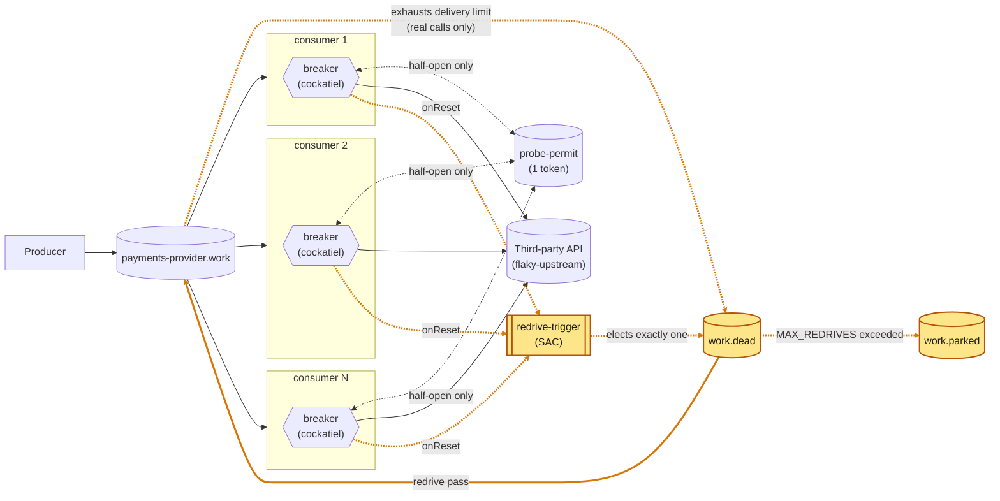

# Every dead letter earned it, and has a way back

A fleet of competing consumers, each with its own
[cockatiel](https://github.com/connor4312/cockatiel) breaker and a shared
probe permit. Fourth step of the series, built on `article/03-probe-permit`.

Two dead-letter problems until now: a message could be dead-lettered
without the third party ever seeing it (1,975 in one 15s outage in
article 3), and nothing brought it back. This branch fixes both: only real
calls count toward the delivery limit, and one elected replica redrives
the rest.



<sub>Amber: new or changed on this branch.</sub>

Breakers share nothing. Every replica publishes to `redrive-trigger`;
RabbitMQ delivers to one.

30s of `503`s then 10s of `422`s against 5 replicas, recorded 2026-09-24
with `infra/capture-incident.mjs` (5.79× real time,
[video](docs/media/dead-letter-redrive-incident.webm)).


In earlier recordings the dead-letter panel moved during an outage; here it
stays at 0 through outage and recovery. The price is backlog: 6,920 at
peak. It moves only for the `422`s — 1,985 in 10s, each refused on its
first delivery.

## Counted attempts

`decide()` now *releases* an `open` outcome (breaker turned the message
away, no call made) instead of requeuing it. RabbitMQ 4.3 doesn't count a
release toward `x-delivery-limit` (3); it does count a requeue, so three
deliveries onto open breakers used to dead-letter a message the third
party never saw. `failed` still requeues — a real call spends the budget.
`master`'s `Attempts.ts` draws the same line.

**Measured:** 1,785 dead-lettered in a 15s outage before; zero in a 40s
outage after. The work queue grows instead (6,800 at 40s, still climbing).

## The redrive

`Redrive.ts`, ported from `master`:

- **Election:** a trigger queue with `x-single-active-consumer` — the
  broker delivers to one replica and promotes another if it disconnects.
- **A pass** `get`s from `work.dead`, re-checks the gate per message,
  publishes to `work` (bumping `x-egress-redrive-count`) or, past
  `MAX_REDRIVES` (5), to `work.parked`, then acks. A crash in between
  duplicates, never loses. At most 200 per pass.
- **Gate:** the elected replica's own breaker is closed.
- **Triggers:** `onReset`, startup, and a 30s sweep. Without the sweep
  `work.dead` sat at 1,225 for 20s+ with every breaker closed; `master`'s
  ADR 016 fixes the same stall the same way.
- **Idempotency:** the republish keeps the original `message_id`.

## The permit and the breaker

Unchanged from article 3 except the `open` outcome above. One token in a
queue with `x-max-length: 1` and `reject-publish`; a half-open replica
probes only if it `get`s it, and hands it back after. Breaker: 5
consecutive failures trip it, half-open after 1s–30s exponential backoff.
`classify` (`Breaker.ts`) gives four outcomes: `ok` accept, `client_error`
(4xx except 408/429) dead-letter at once, `failed` requeue, `open` release
after a 100–400ms hold.

## What this still doesn't fix

- **A long outage grows the work queue without bound.** The delivery limit
  used to cap it by accident.
- **Redrive waits on the elected replica's breaker**, up to 30s after the
  rest of the fleet has closed. Nothing knows what the fleet thinks.
- **A trigger arriving mid-pass is dropped.**
- **Losing the permit race grows backoff** like a failed probe.

## Running it

```bash
pnpm install
docker compose up -d
docker compose up -d --scale rmq-consumer=12   # resize the fleet, no restart needed
```

- RabbitMQ: <http://localhost:15672> (guest/guest).
- Grafana: <http://localhost:3000/d/in-process-breaker/in-process-breaker-e28094-five-not-one>
  (anonymous; two 401 toasts on first load are harmless). New panels:
  "Parked queue depth" and "Redrives".
- Prometheus: <http://localhost:9090>.

Inside the devcontainer use service names (`rabbitmq`, `grafana`, …); a
gitignored `.env.local` with them is read by `pnpm run incident`.

## Injecting a failure

`flaky-upstream` is the third party; each POST replaces its behaviour:

```bash
curl -X POST localhost:8080/__fail -d '{"rate":1.0}'                # 503s
curl -X POST localhost:8080/__fail -d '{"rate":1.0,"status":422}'   # 422s: refused, not down
curl -X POST localhost:8080/__fail -d '{"rate":1.0,"mode":"hang"}'  # never answers
curl -X POST localhost:8080/__fail -d '{"rate":1.0,"mode":"reset"}' # drops the connection
curl -X POST localhost:8080/__fail -d '{"delayMs":1500}'            # slow, still correct
curl -X POST localhost:8080/__fail -d '{}'                          # healthy again
```

## The incident script

```bash
pnpm run incident
MODE=hang node infra/incident.mjs
STATUS=422 node infra/incident.mjs
```

Injects a failure, restores, and reports peak backlog, dead-lettered,
drain time, audit counts, breaker agreement, and what redrive moved or
parked. Unless `STATUS` is set, it ends with a 422 phase.
`infra/capture-incident.mjs` records the dashboard (needs `playwright-core`).

## Load

```bash
RATE_PER_SECOND=500 docker compose up -d rmq-producer
```

The producer never backs off.

## Chaos testing

`infra/chaos-load.mjs` injects faults under load and fails if any
confirmed message is neither processed nor still queued.

```bash
node infra/chaos-load.mjs --list
node infra/chaos-load.mjs                                    # every fault
node infra/chaos-load.mjs --faults=kill-one-consumer
node infra/chaos-load.mjs --rate=500 --spike=3000 --fault-seconds=25
```

Faults: `kill-one-consumer`, `kill-all-consumers`, `kill-broker`,
`flaky-storm`. First run (2026-09-19, ~350k messages): all passed, zero
unaccounted. `work.dead` stayed at 0, so the redriver never fired under
chaos; after `flaky-storm` a breaker can stay open 90s+ at its backoff cap.

## Layout

```
packages/
  config/        settings, declared once and decoded at boot
  rmq/           Effect wrapper over amqplib (Client.ts); queue names,
                 options and wire schemas shared by every process
                 (ControlPlane.ts)
  rmq-producer/  steady load onto <apiId>.work, message_id as idempotency key
  consumer/      the fleet: Breaker.ts (breaker + permit), Redrive.ts,
                 Upstream.ts (the HTTP call), consumer.ts (wiring, and decide())
  tracing/       /metrics route; OpenTelemetry, off unless OTEL_EXPORTER_OTLP_ENDPOINT is set
infra/
  flaky-upstream.mjs   the fake third party, with an audit trail
  incident.mjs         drives one incident and reports on it
  capture-incident.mjs records the dashboard through one
  chaos-load.mjs       faults under load, judged on per-message correctness
  chaos-publisher.mjs  its load generator
  rabbitmq.conf        the broker's flow-control watermark
  monitoring/          Prometheus scrape config, Grafana dashboard
docker-compose.yml     the whole stack
```

Effect 4 (4.0.0-rc.116) — see `AGENTS.md` before writing Effect code. No
build step: packages run from `src/*.ts` through Node's type stripping.

## Verification

```bash
pnpm run check       # vendored-version check, typecheck, unit tests
pnpm run test:rmq    # needs Docker: AMQP behaviour against a real broker
```
