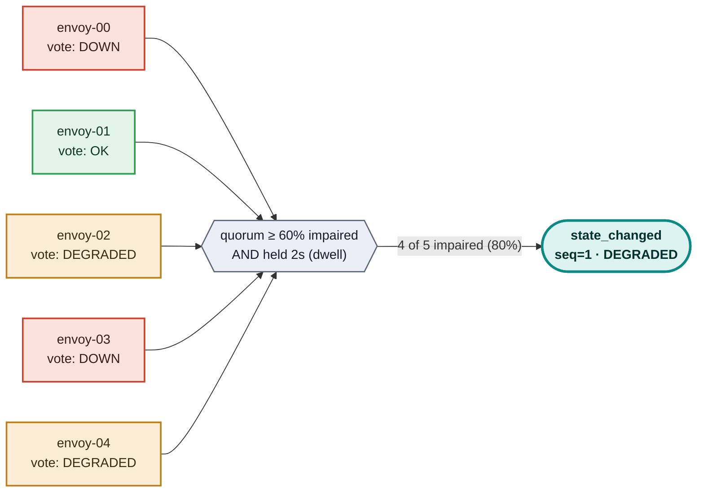
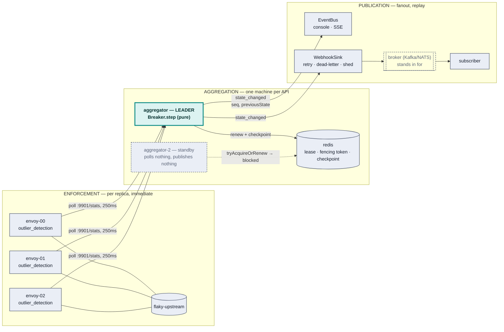
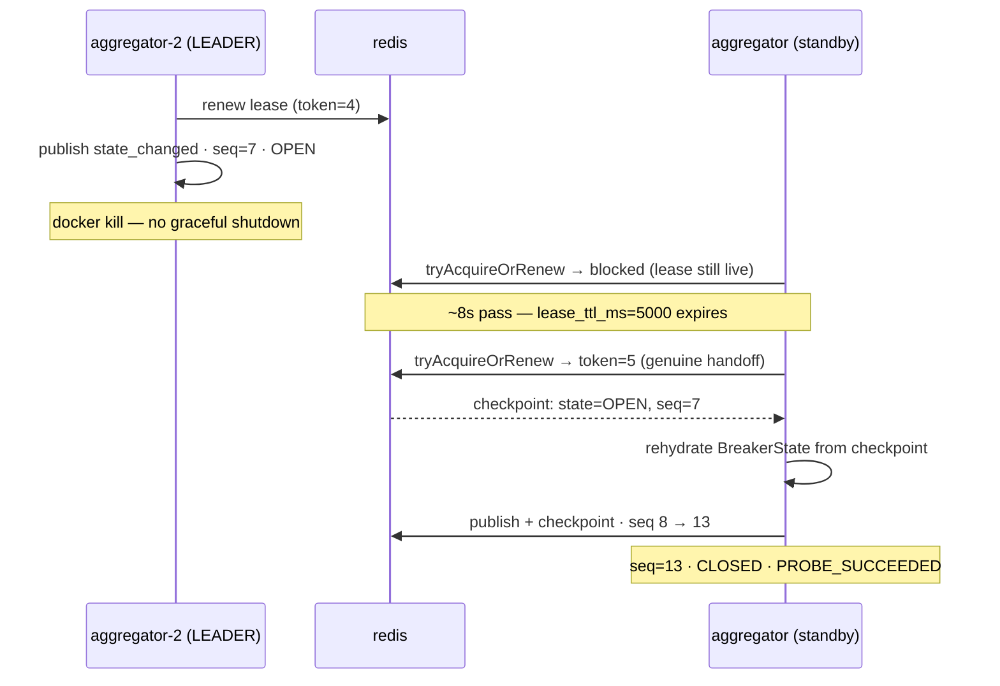

# Per-API egress circuit breaker events

Services call third-party APIs through a shared egress path. When one of those
third parties degrades, everything downstream needs to be **told** — per API,
as discrete events, reliably enough to act on.

That sounds like a circuit breaker, and a breaker is part of it. The
interesting half is that protecting the request path and telling the rest of
the system about it are different problems with different correct answers,
and most of the obvious designs conflate them.


Who wants what from it:


Red is enforcement, in the request path and immediate. Teal is publication,
off the request path and seconds later. Amber is what a *consumer* of those
events does with them — and it is a first-class actor here, not an
afterthought: the fleet that reacts to an outage is where the cost of getting
this wrong actually lands.

## The problem

Concretely, the requirement is: for each third-party API, publish an event
when it starts failing and when it recovers, to subscribers who were not in
the request path. Three constraints fall out of that, and every design below
lives or dies on them.

**One verdict per API, not one per proxy.** Egress runs behind more than one
proxy instance, and each one samples the upstream independently. That is
correct for protection — a replica should eject a host it can see is bad,
immediately, without asking anyone. It is wrong for notification: with ten
replicas and a degrading upstream you get up to ten `circuit_opened` events at
ten timestamps, then recoveries out of step. A subscriber sees an API flap
several times for a single incident and has to de-duplicate a distributed
system's internal disagreement on its own.

**Emission cannot sit in the request path.** At egress throughput no proxy
holds its p99 while making an outbound POST per event, and a degrading
upstream generates tens of thousands of per-request rejections when what a
subscriber wants is one `circuit_opened`. Whatever publishes has to coalesce,
buffer with a bound, and shed rather than backpressure into the proxy.

**The stream has to be a contract, not a feed.** Per-API ordering, a sequence
a subscriber can check, and enough state in each event that a consumer joining
mid-incident is not blind. Otherwise every subscriber reimplements
loss-detection, differently and mostly wrongly.

## Approaches, and where each one runs out

These are the real options, in roughly increasing order of how much you build.
Each is defensible; each fails one of the three constraints above.

**A breaker library in every service** — Resilience4j, Polly, opossum,
gobreaker. Mature, well understood, and the state lives in a variable in one
process. Ten instances of a service hold ten independent opinions about the
same third party, and two *different* services calling it learn separately.
There is also nothing to publish from: you would add an event path to every
service, in every language you run. Fails constraint one, at the worst
possible granularity.

**Publish straight from the proxy.** Envoy already emits discrete ejection
records (`outlier_detection.event_log_path`); point them at a webhook and
you are done in an afternoon. Except those records are *per replica*, so the
flapping above is exactly what subscribers get — and the most important
signal isn't in there at all: threshold saturation is a counter delta
(`*_overflow`), not an event. Fails constraints one and two.

**Share breaker state across replicas in Redis** so they agree before anyone
publishes. This is the tempting fix, and it puts a network round trip and a
shared failure domain in the hot path of the component whose entire job is
surviving other people's failures. Fails constraint two, in the direction that
hurts most.

**A batteries-included gateway — Apache APISIX.** Genuinely less to build:
`api-breaker` for breaking, `http-logger` to POST JSON to an endpoint (a
literal webhook sink, no bridge), etcd for cluster config, a forward-proxy
plugin for egress. The trade is that `api-breaker` is per-route and much
cruder than outlier detection — no per-host ejection, no success-rate
statistics — it is Lua/OpenResty, and `http-logger` fires *per request*, which
is precisely the hot-path coupling constraint two rules out.

**A service mesh.** Istio's outlier detection is Envoy's, configured through
`DestinationRule`, so the enforcement is the same quality. But it runs per
sidecar, which leaves the aggregation problem exactly where it was, and mesh
telemetry is metrics-shaped rather than a discrete per-API event contract.
Egress through a mesh means an egress gateway anyway, so you arrive at this
repo's topology having also adopted a mesh.

**Build the proxy — Pingora.** It would give precisely the breaker and event
semantics wanted, and Cloudflare's cache runs on it, so it is proven at scale.
But it is a library, not a proxy: no config plane, no admin API, no
clustering. River is not a product yet. That is a quarter of engineering to
arrive where Envoy starts.

| | One verdict per API | Off the request path | Event contract |
|---|---|---|---|
| Breaker library per service | no — per process | n/a | build it yourself, per language |
| Publish from the proxy | no — per replica | no | partial: saturation isn't an event |
| Shared state in Redis | yes | **no** — round trip in the hot path | still to build |
| APISIX | per route, not per host | no — `http-logger` is per request | yes, out of the box |
| Service mesh | no — per sidecar | yes | metrics, not events |
| Pingora | yes | yes | yes — and you build all of it |
| **Enforce locally, publish centrally** | yes | yes | yes |

## What this repo does instead

Split the two jobs and let each be correct on its own terms. Envoy enforces,
per replica, immediately, and never makes a call on behalf of an event. A
control-plane aggregator watches all the replicas, resolves their
disagreement into one state per API, and publishes.

| | Enforces | Publishes | Latency |
|---|---|---|---|
| Envoy, per replica | yes, immediately | no | sub-second |
| Aggregator, one machine per API | no — observational here (could push config; see [The fork this defers](#the-fork-this-defers)) | yes | seconds |



Five independent proxies, three different verdicts at the same instant — none
of them wrong, outlier detection is deliberately local per replica. The
aggregator counts votes against a quorum and waits for that count to hold for
`dwellMs` before publishing anything; disagreement never reaches a subscriber.

The console makes this visible. The coloured strip on each API is one block per
replica showing that replica's local view. Drive an upstream to a partial
failure rate and you will see the blocks disagree while the published state
stays steady.

### Three components, because the constraints say three

| | Owns |
|---|---|
| **Envoy** | enforcement: local, immediate, per replica. Never makes a call on behalf of an event. |
| **Aggregator** (this repo) | fleet-wide state per API, sequencing, coalescing, idempotency, retry, dead-lettering, load shedding. |
| **Broker / subscribers** | fanout, replay, subscriber state. |

Coalescing is most of the value: a degrading upstream produces tens of thousands
of per-request `UO` rejections, and what a subscriber wants is one
`circuit_opened`. The aggregator's buffers are bounded and shed load rather than
backpressuring into the proxy. In production the first hop is a broker (Kafka,
NATS) with webhook delivery as a consumer of it, so replay is the broker's
problem; `WebhookSink` here stands in for that hop.



Only the node in teal is doing anything at a given moment. The standby holds
one connection to Redis and nothing else — see
[High availability](#high-availability) for what makes that safe.

## Running it

```bash
pnpm install
pnpm start           # simulated 5-replica fleet
pnpm run check       # typecheck + 49 tests
pnpm run test:redis  # optional — needs Docker: HA coordination against a real Redis
pnpm run test:rmq    # optional — needs Docker: AMQP behaviour against a real broker
```

Then open <http://localhost:8088>. For the full thing — three real Envoy
replicas, two aggregators, a real broker and the daemon fleet — see
[Running against real Envoy](#running-against-real-envoy).

Built on **Effect 4 (4.0.0-rc.112)**. Requires Node 22.6+ and TypeScript 5.9+.
TypeScript runs natively via Node's type stripping, so there is still no build
step — but `tsc --noEmit` is now load-bearing, because Effect's guarantees are
type-level.

> Effect 4 is a release candidate. Versions are pinned exactly (`effect` and
> `@effect/platform-node` ship in lockstep at the same version now) because RC
> APIs still move — `ServiceMap` was renamed back to `Context`, and `Effect.fork`
> was replaced by explicit `forkChild`/`forkScoped`/`forkIn`, between beta and
> rc.112.

## Why Envoy for the data plane

Having ruled out the alternatives above, the reason it is Envoy specifically:
it is the only option in this class with genuinely independent layers, which
matters because "circuit breaking" on egress is really several different
problems that get given one name:

- **`circuit_breakers` thresholds** — `max_connections`,
  `max_pending_requests`, `max_requests`, `max_retries`,
  `max_connection_pools`, per priority. This is *bulkheading*: it caps resource
  consumption and detects nothing. `track_remaining: true` turns overflow into a
  gauge instead of a bare counter.
- **`outlier_detection`** — the actual breaker. Ejects hosts on
  `consecutive_5xx`, `consecutive_gateway_failure`,
  `failure_percentage_threshold`, or success-rate deviation. The `enforcing_*`
  knobs let ejection ramp in gradually rather than flipping on at 100%.
- **Active health checking** — an out-of-band probe per host, which is what
  makes `successful_active_health_check_uneject_host` mean anything. Without
  it that flag is inert and a recovered upstream serves its full
  `base_ejection_time × ejection_count` sentence anyway; with it, a host that
  passes its next check is un-ejected immediately. Measured on the running
  stack: **3.1s to un-eject six hosts carrying ~25s of accumulated backoff.**
- **`retry_budget`** — caps concurrent retries as a fraction of active requests.
  Without it, outlier ejection plus retries amplifies load onto whatever hosts
  are left. Not in `infra/envoy/envoy.yaml`, which uses the older `max_retries`
  threshold; a budget is the better shape at real fleet size.
- **`adaptive_concurrency` filter** — infers a concurrency limit from observed
  latency (a gradient controller against a periodically recalculated minimum
  RTT) instead of a hand-picked static number. It sits in the shared
  `http_filters` chain ahead of the router, so it applies fleet-wide across
  every cluster on the listener. For third-party egress, where you do not know
  the upstream's real capacity, that adapts where a fixed `max_requests`
  threshold would either be too conservative or trip too late. It is a
  request-shedding layer, not a breaker: it does not eject hosts or feed
  `ReplicaReport`, so it does not show up in the aggregator's published states —
  only `circuit_breakers` overflow and `outlier_detection` do.

These layers are also why the config is worth reading rather than copying:
`infra/envoy/envoy.yaml` turns each of them on deliberately, and the section
on [running against real Envoy](#running-against-real-envoy) explains what
each one is doing in the demo. The alternatives to Envoy itself are covered
in [Approaches, and where each one runs out](#approaches-and-where-each-one-runs-out).

## Demo script

1. **Steady state.** Three APIs, five replicas, all `CLOSED`.
2. **Drag payments-provider to ~45%.** Replica blocks start diverging — the
   label reads "5 replicas disagree". The published state moves to `DEGRADED`
   once a quorum agrees, and *stays there*. One event, not five.
3. **Drag to 100%.** Every replica ejects every host. `OPEN`, reason
   `all endpoints ejected`.
4. **Watch it probe.** After the open window it moves to `HALF_OPEN`; the
   upstream is still dead so it fails the probe, returns to `OPEN`, and doubles
   its backoff. It does not hammer a dead upstream.
5. **Hit Restore.** Active health checks un-eject hosts, the next probe
   succeeds, and it closes. Total lifecycle ~20s.
6. **Check the right-hand panel** throughout: sequence gaps and duplicates both
   stay at zero. That is the delivery contract holding.
7. **Watch the daemon fleet react** (real-Envoy stack only): the five
   consumers stop pulling on `OPEN`, the work queue builds, and they ramp
   back `1 → 4 → 5` as it recovers — with no coordination between them. See
   [The RabbitMQ daemon fleet](#the-rabbitmq-daemon-fleet).

A seventh thing worth trying by hand, because it is the state hardest to
reach on purpose: fail *some* of an API's endpoints rather than all of them.
`curl -X POST localhost:8080/__fail -d '{"rate":1.0}'` takes down one of
payments-provider's six, every replica ejects that host, and the fleet
reports `DEGRADED` at `4/6` healthy — partial ejection, which is what
`DEGRADED` exists to describe.

```mermaid
flowchart LR
  classDef ok fill:#e2f5e8,stroke:#2e9e52,stroke-width:2px,color:#123423;
  classDef deg fill:#fbedd6,stroke:#c07f16,stroke-width:2px,color:#3a2c12;
  classDef down fill:#fbe2dd,stroke:#c9432f,stroke-width:2px,color:#3a1c17;
  classDef gate fill:#eaeef6,stroke:#5b6478,stroke-width:1.5px,color:#161d2b;
  classDef out fill:#dcf3f1,stroke:#0c8b86,stroke-width:3px,color:#04302e,font-weight:bold;

  subgraph LIFECYCLE["published state — one event per real transition, ~20s end to end"]
    direction LR
    c0["① CLOSED<br/>5 replicas agree"]:::ok
    d1["DEGRADED<br/>seq=1 · OUTLIER_EJECTION"]:::deg
    o2["OPEN<br/>seq=2 · ALL_ENDPOINTS_EJECTED"]:::down
    h3["HALF_OPEN<br/>seq=3 · OPEN_TIMEOUT_ELAPSED"]:::gate
    o4["OPEN<br/>seq=4 · PROBE_FAILED<br/>backoff 4s → 8s"]:::down
    h5["HALF_OPEN<br/>seq=5"]:::gate
    c6["CLOSED<br/>seq=6 · PROBE_SUCCEEDED"]:::ok

    c0 -->|"② failure 45% — replicas diverge<br/>quorum 60%, held for dwellMs"| d1
    d1 -->|"③ failure 100%<br/>every replica ejects every host"| o2
    o2 -->|"④ openMs elapses"| h3
    h3 -->|"upstream still dead"| o4
    o4 -->|"⑤ Restore — active health<br/>checks un-eject hosts"| h5
    h5 -->|"probeSuccesses healthy observations"| c6
  end

  panel(["⑥ subscriber's view<br/>received=14 · gaps=0 · duplicates=0"]):::out
  LIFECYCLE -.->|"every state_changed, checked outside the process"| panel
```



Six published events for an incident that produced tens of thousands of
per-request rejections and five replicas' worth of disagreement. The two
passes through `HALF_OPEN` are the same code path — only the backoff differs,
which is what keeps step ④ from hammering a dead upstream.

Run `pnpm run subscribe` in a second terminal for a consumer's view of the same
stream.

### Running it hands-free

```bash
pnpm run demo                    # payments-provider, against localhost:8088
pnpm run demo -- shipping-rates  # a different API
```

`packages/demo/src/driver.ts` drives exactly the steps above through the same
`/api/failure` route the console's slider calls, and narrates every published
transition as `/api/events` reports it — so a demo is one command in a second
terminal, and the console (or the [Grafana dashboard](#metrics--monitoring)) is
what the audience actually watches. Nothing about the incident is scripted or
mocked: the driver only sets the failure rate and waits for the real aggregator
to publish, on the real wall clock. It ends by reading `/api/subscriber` and
failing loudly if a gap or duplicate shows up — the automated form of step 6.

Two details that only matter once the stack is real. `AGGREGATOR` takes a
comma-separated list, because only the leader publishes and which instance
that is depends on who won the lease — the driver asks each candidate and
drives the one that answers `isLeader`. And if `PROMETHEUS` is set, it also
asserts step 7 from the fleet's own metrics: that every daemon stopped on
`OPEN`, that the backlog it built drained afterwards, and that the per-API
sequence contract held on the AMQP transport too. Unset, that step is
skipped rather than failed.

```
== Drag payments-provider to 45% ==
  seq=1   CLOSED     -> DEGRADED   OUTLIER_EJECTION

== Drag payments-provider to 100% ==
  seq=2   DEGRADED   -> OPEN       ALL_ENDPOINTS_EJECTED

== Watch it probe — upstream is still dead, so this reopens with doubled backoff ==
  seq=3   OPEN       -> HALF_OPEN  OPEN_TIMEOUT_ELAPSED
  seq=4   HALF_OPEN  -> OPEN       PROBE_FAILED

== Hit Restore ==
  seq=5   OPEN       -> HALF_OPEN  OPEN_TIMEOUT_ELAPSED
  seq=6   HALF_OPEN  -> CLOSED     PROBE_SUCCEEDED

== Delivery contract, read from outside the process ==
  received=14 snapshots=8 duplicates=0 gaps=0
  gapless and non-repeating through the full incident.
```

Against the real stack, with `PROMETHEUS` set, it also prints the other half —
this is a verbatim run:

```
== The daemon fleet reacts — no coordination, same events ==
  target=0/5 pulling=0 work=290 dead-lettered=2343
  nothing is calling the dead upstream; the backlog is the point.

== Fleet: ramp back, drain, and the same contract on AMQP ==
  target=5/5 pulling=5 work=0 dead-lettered=2343 (deepest backlog seen: 2170)
  the same per-API sequence guarantee held on the AMQP transport too,
  checked by 5 consumers the publisher does not control.
```

## Metrics & monitoring

Every metric is plain `effect` `Metric` (`packages/aggregator/src/Telemetry.ts`) — the aggregator's
tick loop, the webhook sink, and the subscriber route all update the same
in-process registry, and `GET /metrics` formats it as Prometheus text. That
endpoint is live on the same port in both modes (`--source=sim` or
`--source=envoy`), so `curl localhost:8088/metrics` works the instant
`pnpm start` is up — no extra process, no extra port.

| Metric | What it shows |
|---|---|
| `egress_circuit_state` | Published state per API, 0=CLOSED…3=HALF_OPEN — a stepped line, not an inference from logs |
| `egress_circuit_healthy_endpoints` / `_total_endpoints` | Fleet-averaged endpoint counts per API |
| `egress_circuit_reporting_replicas` | Replicas still within `replicaTimeoutMs` — what quorum is computed against |
| `egress_circuit_ejections_active` | Ejected hosts summed across replicas — the one signal that separates "outlier detection ejected a host" from "membership changed" |
| `egress_circuit_transitions_total` | Published `state_changed` events, by API/state/reason |
| `egress_circuit_snapshots_total` | Periodic full-state republishes, by API |
| `egress_fleet_poll_duration_ms` | Time to poll and parse every replica once per tick |
| `egress_aggregator_ticks_total` | Control-loop iterations per instance — the liveness signal. A zero rate means the loop is gone, which no other metric distinguishes from a quiet system |
| `egress_aggregator_coordination_errors_total` | Ticks that could not reach the coordinator and stood down |
| `egress_aggregator_is_leader` | 1 if this instance currently holds the publishing lease, 0 otherwise — see [High availability](#high-availability) |
| `egress_aggregator_fencing_conflicts_total` | Checkpoint writes rejected because a newer lease holder already took over, by API |
| `egress_webhook_delivered_total` / `_failed_total` / `_dead_lettered_total` | Sink outcomes, by API |
| `egress_webhook_delivery_duration_ms` | Successful-delivery latency, including retries |
| `egress_webhook_outbox_depth` | Events waiting in the durable outbox for a subscriber that is not taking them, by API — zero in every healthy minute, so a non-zero reading is the whole signal |
| `egress_webhook_outbox_replayed_total` / `_dropped_total` | Events delivered from the outbox after an earlier failure, and events discarded because the per-API bound was hit |
| `egress_subscriber_events_received_total` / `_gaps_total` / `_duplicates_total` | The delivery contract, read from outside the process — same numbers the console's right-hand panel shows, as counters |

And from the daemon fleet — the same in-process `effect` registry, served on
`METRICS_PORT` by every daemon and by the producer:

| Metric | What it shows |
|---|---|
| `egress_daemon_circuit_state` | The state each daemon *received*, against `egress_circuit_state`, the state the aggregator *published*. They should be indistinguishable |
| `egress_daemon_target_active` / `_self_active` / `_fleet_size` | The agreed active count, and whether this particular daemon is one of them |
| `egress_daemon_calls_total` | Third-party calls through the egress listener, by outcome |
| `egress_daemon_in_flight` / `_queued` | Concurrency against the per-daemon ceiling, and deliveries parked behind it — unsettled, which is where backpressure becomes the broker's problem |
| `egress_daemon_dead_lettered_total` | Work rejected onto `<apiId>.work.dead` because its call failed |
| `egress_daemon_redriven_total` | Dead-lettered work replayed onto the work queue after recovery — the two together are the round trip |
| `egress_daemon_undecodable_total` | Messages the fleet could not read — a control event failing the published schema, a malformed election trigger — rejected onto the canonical dead-letter queue rather than logged and dropped |
| `egress_daemon_control_events_total` / `_gaps_total` / `_duplicates_total` | The same per-API sequence contract, checked on the AMQP transport by five processes the publisher does not control |
| `egress_daemon_probes_total` | `HALF_OPEN` probes this daemon was elected by the broker to run |
| `egress_producer_published_total` | Arrival rate, against the fleet's completion rate — the difference is the queue |

### Watching it live

```bash
docker compose up prometheus grafana
```

Grafana at <http://localhost:3000> (anonymous, pre-provisioned — no login) opens
straight to the **Egress circuit breaker** dashboard: a state timeline per API,
healthy/total endpoints, transitions, webhook delivery and latency, the two
delivery-contract stat tiles that should read zero through an entire incident,
an aggregator-leadership timeline (one line per instance — see
[High availability](#high-availability)) and its fencing-conflict counter, and
— scraped directly from each Envoy's own `/stats/prometheus` — the raw
per-replica healthy-host count, so you can see the disagreement the console's
replica strip visualizes, in a second tool, at the same time.

[infra/monitoring/alerts.yml](infra/monitoring/alerts.yml) evaluates alongside
it — six rules, each one there because something went wrong in a way that
looked fine from outside. `ControlLoopStalled` is the one that matters most;
see the note on transient dependency outages under
[What the build surfaced](#what-the-build-surfaced). No Alertmanager is wired,
so they surface in Prometheus's own `/alerts`; routing them to a human is a
deployment concern.

A **RabbitMQ daemon fleet** row sits underneath it, so the reaction is on the
same screen as the cause: work-queue and dead-letter depth (from RabbitMQ's
own `rabbitmq_prometheus`, enabled by default in the management image on
15692), arrival rate against completion rate, each daemon's own view of the
circuit state, and the AMQP-side delivery-contract tiles. The panel worth
knowing is **agreed target vs actually pulling** — every daemon derives the
same target from the same events, so those two lines track each other, and
when they stop tracking, a daemon has gone deaf while still looking healthy.
Finding that by hand once is what put the panel there.

Prometheus scrapes every 2s, so an incident you trigger in the console shows
up within a point or two. It used to also scrape `host.docker.internal:8088`
so the same stack could watch a `pnpm start` sim fleet on the host; that target
is gone, because the compose aggregator publishes 8088 to the host and the
result was Prometheus scraping one process under two instance labels — see
[What the build surfaced](#what-the-build-surfaced) for what that did to the
`SplitBrain` alert.

### Alerting, and what to do when one fires

Six rules in [infra/monitoring/alerts.yml](infra/monitoring/alerts.yml), each
one written because something here failed in a way that looked fine from
outside, plus two SLO burn-rate alerts. They now go somewhere:
Prometheus → Alertmanager → a receiver. The receiver in this stack is
[infra/alert-sink.mjs](infra/alert-sink.mjs), which logs what it is sent —
deliberately not Slack or PagerDuty, because this repo cannot own anyone's
credentials and the property worth demonstrating is that a firing rule leaves
Prometheus. Swap the webhook URL in
[alertmanager.yml](infra/monitoring/alertmanager.yml) for a real integration
and nothing else changes.

Alertmanager also does the two things that make alerts readable during an
incident: grouping (by alert and API, so a fleet-wide problem is one
notification), and **inhibition** — while `ControlLoopStalled` is firing,
everything downstream of it is also true and none of it is the cause.

Every rule carries a `runbook_url` pointing into
[docs/runbooks/](docs/runbooks/), one per alert, each starting from what was
actually observed rather than from the metric's name. The link travels with the
notification, so it arrives where the alert does.

The **SLOs** are the two things this system promises a subscriber: that
published events arrive (99.9%, multi-window burn rate at 14.4× and 6×), and
that the per-API sequence is intact. The second one is written down honestly as
what it is — a property whose error budget is zero, so `DeliveryContractBroken`
pages on the first occurrence and the ratio exists only so the *size* of a
violation is visible in the same units as the delivery one.

Verified by breaking it: `docker compose stop redis` at 08:37:53, the rule
pending at +30s, firing at +150s (its `for: 2m`), and the notification in the
sink's log with its runbook path attached. Redis back, and `RESOLVED` followed.

```
FIRING   critical/NoLeaderElected — No aggregator holds the publishing lease (runbook: docs/runbooks/NoLeaderElected.md)
RESOLVED critical/NoLeaderElected — No aggregator holds the publishing lease (runbook: docs/runbooks/NoLeaderElected.md)
```

Tracing is not wired. `@effect/opentelemetry` publishes the exact version this
repo pins, so that is a decision rather than a limitation —
[docs/decisions/003-tracing.md](docs/decisions/003-tracing.md) records why, and
which path here would actually earn a trace.

## Event contract

```json
{
  "specversion": "1.0",
  "type": "egress.circuit.state_changed",
  "source": "egress-proxy/control-plane",
  "subject": "api://payments-provider",
  "id": "01J8...",
  "time": "2026-09-02T14:22:31.004Z",
  "data": {
    "apiId": "payments-provider",
    "sequence": 47,
    "previousState": "CLOSED",
    "state": "OPEN",
    "reason": "ALL_ENDPOINTS_EJECTED",
    "healthyEndpoints": 0,
    "totalEndpoints": 6,
    "observedSince": "2026-09-02T14:22:18.900Z",
    "reportingReplicas": 9
  }
}
```

Four properties the middleware hop depends on:

- **Partitioned by `apiId`,** never by event type. Ordering per API is the only
  ordering subscribers need and the only one that is cheap to guarantee.
  `WebhookSink` sends it as `ce-partitionkey`; on Kafka it is the message key.
- **Full state, not a delta.** A subscriber that joins mid-incident or drops a
  message can sync from any single event. `sequence` plus `previousState` makes
  loss detectable rather than silent.
- **Snapshots as well as transitions.** `egress.circuit.snapshot` republishes
  current state per API on a timer, so a late subscriber is not blind until the
  next incident. On a compacted Kafka topic keyed by `apiId` this gives
  current-state-on-subscribe for free. Snapshots deliberately repeat the current
  sequence; only `state_changed` carries the gapless guarantee.
- **`DEGRADED` is a published state, not an inference.** Binary open/closed
  throws away real information once an API has many endpoints: "3 of 10 hosts
  ejected" and "the API is gone" call for different reactions. The extra state
  costs almost nothing in the machine and saves every subscriber from deriving
  it from `healthyEndpoints` — badly, and in three different ways.

`WebhookSink` never blocks the control loop: bounded retry with backoff, a
dead-letter list, and load shedding above a concurrency ceiling.

## What Envoy actually emits

Half the aggregator exists because the signals differ in kind:

| Signal | Source | Discrete event? |
|---|---|---|
| Host ejected / un-ejected | `outlier_detection.event_log_path`, JSON lines | yes |
| Health-check state change | health check event log | yes |
| Per-request breaker rejection | gRPC Access Log Service, response flag `UO` | yes |
| Threshold saturation | `*_overflow` stats counters | **no** |

That last row is the sharp edge: "the circuit breaker tripped" is not an event in
Envoy, it is a counter delta. `ReplicaReport.overflowTotal` is monotonic for
exactly that reason, and the breaker edge-detects on it.

The state machine is fed from cluster stats, which map onto `ReplicaReport`
one-for-one:

```
cluster.<api>.membership_healthy / membership_total   -> healthy / total
cluster.<api>.outlier_detection.ejections_active      -> ejectionsActive
upstream_rq_pending_overflow + upstream_cx_overflow
  + upstream_rq_retry_overflow                        -> overflowTotal
```

## Running against real Envoy

```bash
docker compose up --build
```

Every process this repo runs — both aggregators, the producer, the five
daemons, the demo driver — runs from one image built by the [Dockerfile](Dockerfile),
with its dependencies already inside it. What boots is an artifact rather than
a directory plus an install.

Needs `$HOST_WORKSPACE_FOLDER` set to this repo's path *on the Docker host*,
not inside whatever container you're running this from — the infrastructure
fixtures still bind-mount from the repo (`infra/envoy/envoy.yaml`,
`flaky-upstream.mjs`, the traffic generator, the Prometheus and Grafana
config), and Docker's file-sharing permission check is keyed on the host path,
not a container-internal one. In a
devcontainer this is normally already exported correctly; overriding it with
a container-internal path (e.g. `/workspace`) produces "mounts denied...not
shared from the host" even though Docker itself is working fine. If your own
shell can't reach the published ports afterward (`curl localhost:8088`
hangs or refuses), you're likely on a different Docker network than the
compose project's — every service here also joins the host devcontainer's
own external `devcontainer` network for exactly that reason, so
`curl http://aggregator:8088/metrics` from a shell on that same network
works without needing a published port at all.

Startup used to be ordered around a one-shot `deps` service, because eight
containers racing `pnpm install` against one bind-mounted `node_modules` made
the losers fail on pnpm's store lock. Building an image deletes the problem
rather than sequencing it: dependencies are installed once, at build time, in
a layer that is rebuilt only when a manifest changes. Cold start is now a
container start.

There is still no compile step, and that is deliberate — every process runs
TypeScript directly through node's type stripping, which is why `tsc --noEmit`
is load-bearing in CI rather than cosmetic. The cost of that choice is that
the runtime version matters, so the base image is pinned **by digest** rather
than by the moving `node:22-alpine` tag (currently v22.23.2), as are Envoy,
RabbitMQ, Redis, Prometheus and Grafana. An image that moves is an image
nobody can reproduce.

Every long-running service also carries `restart: unless-stopped`, which is
what makes the crash-fast stance in `rmq-consumer/src/main.ts` coherent —
letting exactly one library race through an `uncaughtException` handler and
treating everything else as fatal only makes sense if "fatal" means "comes
back", and without a policy it meant "stays dead".

Worth knowing exactly what that does and does not cover, because the demo
depends on the distinction: Docker treats an operator `docker kill` as a
manual stop and does **not** restart it — which is precisely what the SAC
failover step below needs, since the point is that the killed prober stays
gone and the broker promotes another. The policy covers the other case, a
process that exits on its own. (The policy being applied is verifiable with
`docker inspect -f '{{.HostConfig.RestartPolicy.Name}}'`; synthesising a real
crash from outside is not, because PID 1 ignores `SIGKILL` from inside its
own namespace.)

Three Envoy replicas share the upstreams, so they diverge on their own.
`infra/traffic-generator.mjs` runs as part of this stack for a reason worth being
explicit about: outlier detection only reacts to requests it actually sees, so
without traffic flowing through the egress listener, setting a failure rate on
`flaky-upstream` changes nothing at all. The generator sends a steady trickle
through every replica so a real outage shows up the way production traffic
would.

It is configured with exactly one address, `EGRESS_ADDR` — the same one any
real client would be given — and never hardcodes replica names. `envoy` is a
DNS alias shared by all three `envoy-*` containers (`docker-compose.yml`), so
resolving that one hostname is what discovers the replicas; the generator
fans out to whatever comes back. Topology awareness stays where it belongs:
the aggregator, which polls `envoy-00/01/02`'s admin ports individually
because per-replica polling is its actual job — nothing that merely *calls*
the API needs to know there are three of them, or what they're named.

Drive one, by hand:

```bash
curl -X POST localhost:8080/__fail -d '{"rate":1.0}'
```

or hands-free, the same driver used for the sim fleet:

```bash
pnpm run demo:envoy                    # payments-provider
pnpm run demo:envoy -- shipping-rates  # a different API
```

This posts to `flaky-upstream`'s `/__fail` instead of the console's
`/api/failure` — real Envoy has no failure-injection hook of its own, it only
reacts to what the upstream actually returns — but everything downstream
(waiting on `/api/events`, the delivery-contract check) is the identical code
path. There is also a fully containerized version that needs nothing on the
host but Docker: `docker compose --profile demo run --rm demo` — it runs from
the same image every other service does, so it needs no install of its own.

### The RabbitMQ daemon fleet

`docker compose up` also brings up the scenario in
[docs/rmq-control-plane.md](docs/rmq-control-plane.md): a `rabbitmq` broker,
one `rmq-producer` publishing 200 messages/second onto
`payments-provider.work`, and five `rmq-daemon-*` containers draining it —
one third-party call per message, through the same egress listener, with no
knowledge of Envoy's topology. The aggregator publishes every transition to
the `circuit.control` exchange (`--rmq=rabbitmq:5672`), and each daemon
decides *for itself* whether to keep consuming, from its own index and the
agreed state alone.

Five separate containers rather than one process simulating five, for the
same reason there are three real Envoy replicas: the daemons have to be
independently killable, and the `HALF_OPEN` prober is elected by RabbitMQ's
`x-single-active-consumer` across real connections.

Work whose third-party call fails is **retried three times and then parked on
`<apiId>.work.dead`** — and then, when the circuit closes again, replayed.
The budget is the broker's, not the daemon's: the work queue is a quorum queue
carrying `x-delivery-limit`, so RabbitMQ counts the redeliveries and
dead-letters the message itself with `reason "delivery_limit"`. That matters
because the client cannot count — it reports `deliveryCount: 0` on every
delivery, and an in-process counter would be lost the moment the message moved
to another daemon. Three rather than more because RabbitMQ redelivers
immediately, with no backoff, so each extra attempt is more load on a third
party that is already failing; what ends the amplification is the circuit
opening, which stops the daemons consuming at all. The budget resets on
redrive, since a replayed message is a new message — three attempts per
outage, not three ever. Measured, pinned by a test, and written up in
[docs/decisions/001-amqp-client.md](docs/decisions/001-amqp-client.md).

**Every queue in the fleet dead-letters to that one canonical queue** — the
work queue, both SAC election queues, and each daemon's own control queue.
The dead-letter queue itself is the only exception, because a queue that
dead-letters to itself is a cycle. This closes a second silent-loss path that
looked nothing like the first: a control event that failed the published
schema used to be logged and accepted, so the only trace of a version skew
between the aggregator and the fleet was a line in `docker logs`. It is now
rejected, which means the message that could not be read is still in your
hands. `egress_daemon_undecodable_total` counts them.

Preserving one unreadable message is right; preserving every one is not, and
the arithmetic is unkind. Control events fan out to *every* daemon's own
queue, so a schema mismatch between publisher and fleet is not one bad
message — it is every message multiplied by the fleet size, arriving on one
queue at the full event rate. Each daemon therefore preserves a bounded
sample (20) and accepts the rest, saying so once in its log;
`egress_daemon_undecodable_total` keeps counting past the bound, so the rate
stays visible after the samples stop. Measured: 25 malformed events in, 20
on the dead-letter queue, all 25 in the metric.

One canonical queue only works if whatever drains it can tell the messages
apart, and RabbitMQ 4 supplies exactly that: a dead-lettered message arrives
annotated with `x-first-death-queue` and `x-first-death-reason`. The redrive
below replays only what was dead-lettered from the *work* queue and leaves
everything else, so a poison control message is never replayed as work.

**Replayable is not the same as replayed**, though, and a dead-letter queue
nobody drains is a slower way of losing things. So `REDRIVE_ON_CLOSE` turns
on self-healing: on the transition back to `CLOSED`, one daemon replays the
dead-lettered messages onto the work queue in bounded passes until it is
empty. Which daemon is the broker's decision, on a second
`x-single-active-consumer` queue — the same mechanism as the prober election
and separate from it, because five daemons each replaying the same backlog
would turn a recovery into a fivefold burst at a third party that has just
come back. A pass stops on whichever comes first: the per-pass cap, the queue
running dry, the circuit leaving `CLOSED`, or a hard deadline.

It is off by default in code and on in `docker-compose.yml`, and that split is
deliberate: whether a two-minute-old payment attempt is still worth making is
a question about the workload, not about the transport. Observed on the
running stack — a 2,070-message dead-letter backlog, drained in one pass three
seconds after recovery:

```
daemon-2: redriving payments-provider.work.dead (max 5000 per pass)
daemon-2: redrive finished — 2070 replayed (drained)
```

Everything but the per-daemon control queue is a **durable quorum queue**, and
neither half of that was true to begin with: a broker restart used to empty
the dead-letter queue silently, because the first daemon back redeclares it
with the same name and arguments. `durable` decides what survives the broker
process; `x-queue-type` decides what survives losing the node the queue lives
on, and a quorum queue cannot be transient, so the two are one decision. The
control queue stays a classic transient queue on purpose — it is one daemon's
live subscription, and a daemon that comes back relearns the circuit state
from the aggregator's next snapshot, so keeping those events buys nothing
while a queue outliving its daemon costs something. The election queues are
always empty, which makes quorum free for them and means an election survives
a node loss rather than vanishing with it.

The broker now has a volume too, so the data directory outlives the container
and not just the process. What this stack still cannot demonstrate is the
part quorum queues are actually for: **one broker is a quorum of one.** The
durability and the delivery limit are real on a single node; tolerating the
loss of a node needs three of them, and that is a deployment topology this
repo does not run.

```bash
# watch the fleet react — target=<k>/5 is the agreed active count
docker compose logs -f rmq-daemon-0 rmq-daemon-3

# take the upstream down; the queue depth is the story
curl -X POST localhost:8080/__fail -d '{"rate":1.0}'
open http://localhost:15672        # guest / guest

# kill whichever daemon the broker elected as prober, mid-incident
docker kill workspace-rmq-daemon-1-1

# every daemon serves the same /metrics route the aggregator does
docker compose exec prometheus wget -qO- http://rmq-daemon-0:9464/metrics
```

`infra/envoy/envoy.yaml` carries the config discussed:

- **Several endpoints per cluster** — six for payments-provider, four for
  shipping-rates, three for tax-calc, matching the simulated fleet exactly so
  the two `FleetSource` layers can reach the same states rather than merely
  producing the same record shape. With one host per cluster a replica can
  only ever report `0/1` or `1/1`, so `healthy < total` is unreachable, no
  replica can vote `DEGRADED` from partial ejection, and
  `failure_percentage_*` never evaluates at all
  (`failure_percentage_minimum_hosts` is 3). `infra/flaky-upstream.mjs` serves
  one port per endpoint.
- **Active health checking** against `/__health`, which is what makes
  `successful_active_health_check_uneject_host` do anything. The health
  endpoint samples the same failing service normal traffic does rather than
  being a separate truth — a deterministic one would mark every host down at
  once and collapse `DEGRADED` into `OPEN`.
- **One cluster per API.** Every stat, outlier event and access-log record is
  keyed by cluster name, so cluster identity *is* API identity. Traffic through
  a `dynamic_forward_proxy` catch-all cannot produce per-API events — and worse,
  under DFP outlier detection works per resolved host while the
  `circuit_breakers` thresholds apply to the whole DFP cluster, so one noisy
  destination eats the request budget for all of them. Generate a cluster per
  known API from the control plane; reserve DFP for the long tail.
- **`circuit_breakers`** for bulkheading, with `track_remaining: true` so
  saturation is a gauge rather than a bare counter.
- **`outlier_detection`** with `failure_percentage_*` alongside
  `consecutive_5xx`, because ratio-based thresholds scale with replica count
  while consecutive counts get divided by fleet size.
- **`split_external_local_origin_errors`** to separate an upstream 503 from a
  local connect failure — for egress you almost always want to distinguish these.
- **`cluster_manager.outlier_detection.event_log_path`** for the discrete
  ejection stream.

### Two real aggregator instances, one shared Redis

`docker compose up` runs `aggregator` and `aggregator-2` — two separate
containers, both `--ha=redis` against the one `redis` service — not one.
This is the [High availability](#high-availability) design actually
deployed, not just tested in-process: exactly one of them holds
`egress_aggregator_is_leader=1` at a time, and it was verified by force —
inject a real failure, let the current leader publish into `OPEN`, then
`docker kill` its container outright:



The standby took over within `lease_ttl_ms`, rehydrated `payments-provider`
from its last Redis checkpoint (`OPEN`, not `CLOSED` — the state survived,
not just the fact that *something* is now leading), and kept publishing
from `sequence=7` onward, through the rest of the probe cycle to
`PROBE_SUCCEEDED` / `CLOSED` at `sequence=13` — no reset, no gap, no
duplicate, across a hard kill of a different OS process mid-incident. That
is the property `Coordination.test.ts` and `RedisCoordination.test.ts` prove
in a single test process; this is the same property, watched happen between
two real containers.

Prometheus scrapes both instances (`infra/monitoring/prometheus.yml`) with
Prometheus's own `instance` label distinguishing them, so
`egress_aggregator_is_leader` in Grafana shows exactly one of the two lines
at 1 and the other at 0, flipping on a real failover.

### Fleet state stays per replica, on purpose

Replicas are stateless behind an L4 load balancer, configured by xDS. That is
the whole HA story and it is the right one — but outlier detection state is per
instance. With 10 replicas, `consecutive_5xx: 5` means up to 50 failures
fleet-wide before every replica agrees. Two ways out: divide thresholds by
replica count and accept the variance, or use `failure_percentage_*`, which is
ratio-based and scales cleanly. This config does the latter.

The tempting third option is shared breaker state in Redis. Don't: that puts a
network round trip and a shared failure domain in the hot path of a
high-throughput proxy, which is what the breaker exists to avoid. Sharing
belongs in the aggregator, off the request path.

## What is a prototype, not production

- **Ingestion is push now, and polling is the peer it was measured against.**
  This bullet used to say "swap it for the push-based
  `envoy.service.metrics.v3.MetricsService` sink in production". That swap is
  done — see [Ingestion](#ingestion-push-or-poll-decided-by-measurement) — and
  the premise that made it a *later* problem, that a gRPC server needs
  generated stubs and therefore a build step, turned out to be false.
  `EnvoyFleetLayer` (polling) remains a first-class layer: it is what runs when
  you cannot reconfigure Envoy, and it is the control the push path was
  compared against.
- **Aggregator state is not a database, but leader election, failover and the
  Redis backend are real, deployed, and watched working.** `docker compose up`
  runs two aggregator instances against a shared Redis; killing the leader
  mid-incident is [an assertion now, not an anecdote](#chaos-on-demand-rather-than-by-hand).
  Redis runs with AOF and a named volume, so a restart no longer starts the
  next leader from nothing. **What is still prototype is replication: one Redis
  is one Redis.** Losing it costs the checkpoints — a new leader resumes from
  nothing rather than from where the last one stopped — but no longer costs
  correctness, because the fencing token carries an epoch and a coordinator
  that lost its state cannot hand a stale leader a token that outranks the live
  one. A real deployment wants Redis with replication, or a different backing
  store entirely (etcd, a Postgres advisory lock) behind the unchanged
  `LeaderElection`/`CheckpointStore` interfaces — those interfaces, not this
  Redis config, are the part meant to carry over.
- **One broker is a quorum of one.** The work and dead-letter queues are
  durable quorum queues with a delivery limit, and the broker has a volume, so
  messages survive a restart — [measured, 6,628 in and 6,628 out](docs/rmq-control-plane.md).
  Tolerating the loss of a *node* is what quorum queues are actually for, and
  that needs three of them. This repo runs one.
- **Enforcement is observational, and that is now a decision rather than an
  open question.** The aggregator publishes and never pushes config — see
  [docs/decisions/002-enforcement-authority.md](docs/decisions/002-enforcement-authority.md)
  for why, and the three conditions that would supersede it.
- **The console does not scale the way the control loop does.** `/api/stream`
  re-sends the whole state frame every 400ms, which is about 2.75 MB/s per
  connected browser at a thousand APIs while the tick loop itself barely
  notices the size — see [Measured limits](#measured-limits). A production
  console sends diffs or a page, and nothing in the control path would ever
  tell you it needed to.
- **No distributed tracing.** `@effect/opentelemetry` publishes the exact
  version this repo pins, so this is a choice:
  [docs/decisions/003-tracing.md](docs/decisions/003-tracing.md) records that
  every failure here has been state-over-time rather than trace-shaped, and
  names the one path (message → egress call → Envoy stats → circuit event)
  that would earn one.
- **The Envoy and monitoring stack *is* run end to end now — the earlier
  "Docker cannot bind-mount here" note was a false assumption, corrected by
  actually running it.** `docker compose up` boots three real Envoy
  replicas, a real aggregator pair, and drives a real incident through them
  (see the section linked above); what looked like a sandbox limitation was
  one environment variable pointing at the wrong path (see
  [Running against real Envoy](#running-against-real-envoy) for the exact
  failure mode and fix). `parseStats` is still additionally covered by a
  pure unit test against realistic admin output, including the noise stats
  that must not be mistaken for clusters, and the `/metrics` endpoint and
  every metric in [Metrics & monitoring](#metrics--monitoring) are verified
  in-process too — belt and suspenders, not a substitute for the real run.
- **There is no security here at all, and it is written down rather than
  implied.** No authentication, no authorization, no TLS on any hop, and no
  secret handling — plus two inputs that shape decisions and accept anything
  that can reach them: the failure-injection route
  ([Http.ts:288](packages/aggregator/src/Http.ts#L288)) and the gRPC metrics
  sink ([EnvoyPushSource.ts:164](packages/aggregator/src/EnvoyPushSource.ts#L164)),
  which will believe whichever node id a caller claims. [docs/security.md](docs/security.md)
  is the full inventory: ten sections, every claim with a file and line, and one
  line each on what production would have to do. It was deliberately left as an
  inventory — a token check on one route while another accepts anonymous input
  moves the problem and leaves the next reader thinking the surface is secured.
- **HTTPS egress needs TLS interception** for any of the L7 signals to exist. If
  you proxy via `CONNECT` you get L4 only, `consecutive_5xx` is dead, and the
  breaker degrades to connection-level detection. Decide this early: it drives
  the whole certificate story.

## Layout

A pnpm workspace, one package per component. The split is deliberate: **the
decision logic is pure, the shell is Effect, and each has its own boundary
you can `pnpm --filter` independently.**

```
packages/
  domain/                    @egress/domain — pure, no Effect, no clock, no I/O
    src/Model.ts             vocabulary, Schema for the published event, error types
    src/Breaker.ts           the state machine — pure functions, total on (state, reports, now)
    test/Breaker.test.ts     12 tests, pure — no runtime, no clock, no mocks

  aggregator/                @egress/aggregator — depends on @egress/domain
    src/Aggregator.ts        service: tick loop over the pure machine, on a Schedule
    src/Coordination.ts      leader election + fencing-token checkpoints — see High availability
    src/Events.ts            EventBus (PubSub) + EventSink (webhook, declarative retry)
    src/Outbox.ts            durable outbox: what a subscriber that was down gets when it returns
    src/FleetSource.ts       service with two layers: simulated fleet, real Envoy (polling)
    src/EnvoyPushSource.ts   the third: Envoy's metrics-service sink pushing here, no build step
    proto/                   partial, wire-compatible schemas — only the fields this repo reads
    src/Http.ts              routes, SSE as a merged Stream, delivery-integrity tracking,
                             /metrics, and /livez + /readyz (liveness is the tick loop,
                             readiness is not leadership)
    src/Telemetry.ts         every Metric the app emits, in one place
    src/main.ts              layer composition, NodeRuntime.runMain
    public/index.html        operator console (unchanged — plain HTML/CSS/JS)
    test/Aggregator.test.ts   14 tests — full pipeline under TestClock, stats parsing,
                              and the delivery-integrity tracker as a pure function
    test/Coordination.test.ts  8 tests — fencing primitives, a real two-instance failover, a
                              re-promotion, a coordination outage, and a clean shutdown
                              handing the lease back
    test/Outbox.test.ts        3 tests, pure — ordering, partial commit, and which end the bound drops
    test/integration/          8 tests: Redis-backed HA and the durable outbox, opt-in
                               (`pnpm run test:redis`) — needs Docker

  subscriber/                @egress/subscriber — depends on @egress/domain
    src/subscriber.ts        standalone consumer; decodes with the producer's Schema

  rmq/                       @egress/rmq — Effect wrapper over AMQP 1.0 (RabbitMQ 4 native)
    src/Client.ts            the Rmq service; two silent client bugs guarded here
    src/ControlPlane.ts      circuit.control naming, shared by publisher and consumers
    test/integration/        10 tests against a real broker, opt-in (`pnpm run test:rmq`)

  rmq-consumer/              @egress/rmq-consumer — the competing-consumer daemon fleet
    src/DaemonPolicy.ts      pure: (prior, circuit state, fleet size) -> target active count
    src/Contract.ts          pure: the per-API sequence guarantee, checked on the AMQP side
    src/daemon.ts            one daemon, one process; two connections, two SAC elections
    src/Redrive.ts           dead-letter recovery: bounded passes, own connection per pass
    src/producer.ts          floods the work queue; never backs off, on purpose
    src/Telemetry.ts         every metric the fleet emits, in one place
    src/main.ts              role dispatch — `daemon` or `producer` — plus /metrics
    test/DaemonPolicy.test.ts  11 tests, pure — no runtime, no broker; the ramp is gated on
                              elapsed time, so they pass the clock in rather than mock one
    test/Contract.test.ts      7 tests, pure — including the backwards-sequence case

  demo/                      @egress/demo — no dependency on the others, speaks only HTTP
    src/driver.ts            drives the demo script over HTTP, narrates transitions

infra/
  envoy/envoy.yaml           egress config: per-API clusters, outlier detection
  traffic-generator.mjs      keeps requests flowing through Envoy so /__fail means something
  scale-probe.mjs            what one instance costs at N APIs — ticks, poll, series, payloads
  chaos.mjs                  kill the leader, kill the elected prober; assertions, not a story
  monitoring/                Prometheus scrape config, alert rules + SLOs, Alertmanager
                             routing, and the provisioned Grafana dashboard
  alert-sink.mjs             stands in for Slack: logs what Alertmanager sends it

Dockerfile                   one image for every process here; deps at build time, no compile step
.dockerignore                keeps the host's node_modules (absolute symlinks) out of the build context
docs/rmq-control-plane.md    the RabbitMQ scenario: design, live run, and what it exposed
docs/decisions/              decision records: what was chosen, and the measurement it rests on
docs/runbooks/               one per alert — what fired, what to check, what to do about it
docs/security.md             what is missing and what production must do, with line references
docker-compose.yml           wires infra/ and the packages/ entrypoints together
.github/workflows/ci.yml     `pnpm run check` on every push, and both Docker-backed
                             suites (`test:redis`, `test:rmq`) in a second job — they
                             are opt-in locally, which makes them the ones most likely
                             to rot unnoticed
```

Cross-package imports go through `@egress/domain`'s `package.json#exports`
(`@egress/domain/Model.ts`, `@egress/domain/Breaker.ts`) rather than relative
`../../` paths, and `workspace:*` in each consumer's `package.json` is what
`pnpm install` resolves to a symlink — so a change to the state machine is a
change in one package, felt through a real dependency edge, not a shared
folder. There is still no build step: every package runs straight off its
`src/*.ts` via `--experimental-strip-types`, and `tsc --noEmit` at the root
typechecks every package in one pass (`packages/*/src` and
`packages/*/test` in `tsconfig.json`'s `include`). The root scripts
(`pnpm start`, `pnpm run demo`, `pnpm run subscribe`) call `node` on each
package's entrypoint directly rather than going through `pnpm --filter`:
this pnpm version does not strip a trailing `--` the way npm does, so
`pnpm --filter @egress/demo start -- shipping-rates` would hand the driver
the literal string `"--"` as its API id instead of `"shipping-rates"` —
direct invocation is what makes `pnpm run demo shipping-rates` (no `--`)
actually work.

`Breaker.step` is a total function of `(state, now, config)`. Everything hard to
reason about — concurrency, scheduling, delivery, retries — lives in the Effect
layer above it. That is why the logic deciding what subscribers get told can be
tested exhaustively with plain `assert`.

## What the build surfaced

Thirteen things worth knowing — twelve found by running the thing, one by
reading it afterwards:

- **A reason code cannot be derived from averaged endpoint counts.** With four of
  five replicas seeing zero healthy hosts, the mean rounds to 1, so "all
  endpoints gone" silently became false. The check is now
  `votes.DOWN === live.length` — unanimous, not merely quorate.
- **Ejection backoff outlives the outage.** `base_ejection_time × ejection_count`
  walks up to the `max_ejection_time` cap, so a recovered upstream stays ejected
  long after it heals. The fix is not shorter timers, it is
  `successful_active_health_check_uneject_host` — and that flag does nothing
  on its own. It needs an actual `health_checks` block, which the config was
  missing for a long time while the README claimed the problem was solved.
  With one configured: six hosts carrying ~25s of accumulated ejection
  backoff (34 enforced ejections between them) came back **3.1s** after the
  upstream recovered.
- **Snapshots are not duplicates.** The first delivery-integrity check counted
  them as such, because they deliberately repeat the current sequence. Only
  `state_changed` is sequence-checked; snapshots exist precisely to be re-applied
  harmlessly.
- **`event_log_path` lives under `cluster_manager.outlier_detection`,** not on
  the cluster. Easy to get wrong from memory.
- **Fencing per-key is not fencing.** The first version of `CheckpointStore`
  rejected a stale write only if a *newer* write had already landed for that
  same API. That is not a fencing guarantee — it just means a stale leader
  wins by default on any API the new leader has not gotten to yet, which is
  the exact split-brain window fencing tokens exist to close. The fix is
  checking against the one shared lease-token counter, not a per-key value —
  see [High availability](#high-availability).
- **A healthy-looking process can be a deaf one.** A daemon in the RabbitMQ
  fleet stopped reacting to circuit events entirely — container up, CPU at
  0.01%, sockets and file descriptors identical to a healthy peer, and 64
  undelivered messages behind a consumer the broker still considered
  registered. Closing a consumer while the broker has deliveries in flight
  strands them, and enough strandings stall *every* link on that connection.
  Two fixes came out of it: the daemon now keeps its control plane on a
  connection that never closes a link, and it logs a heartbeat independent
  of the event stream — because until then every log line it produced was
  emitted while handling an event, so "gone deaf" and "nothing happened"
  looked identical. See
  [docs/rmq-control-plane.md](docs/rmq-control-plane.md).
- **Backpressure is about *when you ack*, not how much you buffer.** The
  first daemon accepted each message on arrival and fired its third-party
  call afterwards, so draining a 50k backlog meant tens of thousands of
  concurrent requests from one process — the herd the fleet policy exists to
  prevent, self-inflicted. Capping concurrency and dropping the excess was
  worse (32,000 messages shed in one drain). Deferring the AMQP accept until
  the call settles is what actually works: credit stops refilling, the
  broker stops pushing, and the backlog stays in the queue where it is
  visible.
- **A documented sandbox limitation turned out to be a misconfigured
  environment variable.** "Docker cannot bind-mount the project directory
  here" had been true every time it was checked — until `HOST_WORKSPACE_FOLDER`
  got explicitly re-exported to a container-internal path while debugging
  something unrelated, silently shadowing the correct host path the
  devcontainer had already set. The fix was not a workaround, it was
  removing the override — three real Envoy replicas, two real aggregator
  instances, and a real Redis now run end to end (see
  [Running against real Envoy](#running-against-real-envoy)). The lesson
  travels further than this one variable: re-verify an environment
  assumption before designing around it, especially one written down as
  fact by an earlier pass over the same repo.
- **A demoted leader that comes back is not a cold start, and that broke the
  one guarantee this repo is about.** Rehydrating `sequence` from the Redis
  checkpoint only ever fired for APIs an instance had never seen — which is
  right on a fresh takeover and wrong on a *re*-takeover, because the
  instance still holds its own breakers in memory from last time while
  whoever led in between has already published past them. The result is two
  different payloads under one sequence number: exactly the break
  `/api/subscriber` exists to detect, invisible to every test because both
  failover tests used a freshly built instance. Losing the lease now drops
  the registry, so re-promotion takes the rehydrate path that was already
  tested, and `Coordination.test.ts` keeps one instance alive across a full
  demotion to pin it.
- **There is no way to tell this AMQP client "this attempt failed, try
  again".** `requeue()` sends `modified{delivery_failed: false}` and
  `discard()` sends `modified{delivery_failed: true, undeliverable_here:
  true}` — nothing in between. RabbitMQ increments AMQP 1.0's
  `delivery-count` only for a delivery marked failed, so releasing the same
  message three times returns `delivery_count: 0` three times, and a
  redelivery budget that outlives the message moving to another consumer
  cannot be built. Same shape as the link-credit finding: the lever is
  genuinely absent rather than merely undocumented, so the daemons
  dead-letter on the first failure and a test pins the behaviour in case a
  client release changes it. **Amended 2026-09-05**: that is a fact about the
  client, not about the system — a quorum queue with `x-delivery-limit` makes
  the *broker* count attempts and dead-letter at the limit, through this same
  client (measured: four deliveries, then `reason "delivery_limit"`). The
  lever was in the queue the whole time. See
  [docs/decisions/001-amqp-client.md](docs/decisions/001-amqp-client.md).
- **The check that proves the contract had no test, and a blind spot for the
  one bug most likely to break it.** `/api/subscriber` is what this README
  points at to claim the stream is gapless and non-repeating. It counted a
  *repeated* sequence as a duplicate and a *skipped* one as a gap — and let a
  sequence going **backwards** fall through both branches, uncounted. That is
  exactly the shape a leadership bug produces: an instance resuming from
  stale in-memory state republishes numbers a later leader already used. So
  the demotion bug found the same day would have been invisible to the very
  check that exists to catch it, and the function had no unit test at all
  despite being pure, twenty lines, and load-bearing. It has six now. The
  lesson is not "write more tests" — it is that a verification mechanism is
  itself code, and an untested one is a claim, not a proof.
- **A one-minute dependency outage killed the control plane permanently, and
  every health signal stayed green.** The Redis calls used `Effect.promise`,
  which turns a rejected promise into a *defect* rather than a failure — and a
  defect out of the tick terminates `Effect.repeat`, so the loop was simply
  gone. Measured on the running stack: 55 seconds without Redis stopped the
  loop after seven more ticks, it never restarted when Redis returned, and a
  total upstream failure afterwards published nothing at all. Both instances,
  because a shared dependency fails for everyone at once. Meanwhile both
  processes served HTTP 200, `/api/state` still reported `isLeader: true` with
  three APIs, and every gauge held its last value — which is indistinguishable
  from a system where nothing is happening. Three things were wrong and all
  three are worth naming: an expected failure was modelled as a defect; the
  loop had no supervision, so its death was unobservable; and there was no
  metric that moves when the loop runs, so nothing could have alerted. Now:
  coordination failures are typed and a tick that cannot reach the coordinator
  stands down and retries (an instance that cannot confirm it holds the lease
  must not act as leader), a defect logs fatally and exits so the restart
  policy does its job, and `egress_aggregator_ticks_total` plus a
  `ControlLoopStalled` alert make the silence audible. Same 55-second outage
  after the fix: the loop kept ticking, recovered on its own, and published
  the next incident at `sequence=102` with no gap.
- **The guarantee this repo is about stopped one hop short of the party it is
  for.** Inside the aggregator the per-API sequence is gapless and strictly
  ordered, proven by tests at three levels. At the edge it was not: a webhook
  that failed its three retries went into a 200-entry in-memory list that
  exists to be *read*, not replayed, and that dies with the process. So a
  subscriber down for longer than about a second lost whatever happened while
  it was away, permanently, and nothing in the system disagreed — the
  aggregator's own counters called it delivered-then-dead-lettered and moved
  on. `Outbox.ts` is the durable half: the same `RedisLike` port the lease
  uses, replay in order on the instance that holds the lease, bounded per API.
  The failure mode worth naming is the one the drain deliberately refuses:
  skipping a stuck event to deliver the ones behind it would manufacture
  exactly the gap this system exists to prevent, and it would look like
  progress.
- **"Stands down and retries next tick" was only true if the call came back.**
  The aggregator's answer to an unreachable coordinator — demote, count it, try
  again — had only ever been tested by stopping Redis for everyone. Pointing
  *one* instance's `redis` at a black hole while the other kept working
  produced something else entirely: the client queues commands against a
  connection it cannot establish and retries a request across twenty
  reconnection attempts, so the promise never settled and the tick that was
  supposed to fail fast simply blocked. Measured: **two ticks in twenty-five
  seconds and then nothing**, a single coordination error, and the instance
  neither leading nor standing down. `/livez` was right about it — 503, a
  control loop that has stopped — which is the Phase 4 endpoint earning itself
  inside a week. Coordination calls are bounded at 1s now, well under
  `leaseTtlMs` so a leader can fail a call and still renew in time, and the
  Redis client is configured to fail rather than queue. Same partition
  afterwards: 4 ticks/s sustained, one error per tick, and the other instance
  holding the lease throughout.
- **The alert for the worst failure this system can have fired because
  Prometheus was scraping one process twice.** `SplitBrain` — two aggregators
  believing they hold the lease — went off with exactly one leader running. The
  scrape config had a `host.docker.internal:8088` target so the same monitoring
  stack could also watch a sim fleet started on the host, with a comment
  calling it "harmless if nothing is listening there". It stopped being
  harmless the moment something was: the compose aggregator publishes 8088 to
  the host, so that target and `aggregator:8088` were the *same process* under
  two instance labels, and `sum(egress_aggregator_is_leader)` read 2. The
  target is gone, and the fleet-wide rules aggregate `by (deployment)` so a
  future mixed setup cannot reproduce it. The lesson is not about Prometheus:
  an alert that fires falsely on its first outing teaches everyone to ignore
  the one thing it exists to say.
- **The gauge that says who leads was *absent* on the instance that could not
  lead, rather than zero.** `egress_aggregator_is_leader` is only written after
  an acquire attempt returns, so an instance that has never reached the
  coordinator publishes no series at all — and `max(egress_aggregator_is_leader)
  == 0`, which is how anyone would write the "nobody is leading" alert, cannot
  fire on a metric that does not exist. Found while watching the partitioned
  instance above: the gauge did not drop, it vanished. The stand-down path sets
  it to 0 explicitly now.
- **A lease that is only ever surrendered by expiring turns every deploy into
  an outage-shaped event.** `LeaderElection.release` was written in the first
  version of `Coordination.ts` and never called from anywhere — grepping the
  aggregator for `.release(` returned nothing — so leadership moved only when
  a lease timed out. Correct for a crash; paid on every planned stop, forever.
  Measured on the running stack: `docker kill` of the leader put the standby
  in charge after 4952 ms, the full `leaseTtlMs`, while a `docker compose
  stop` now does it in 234 ms. The interesting part is not the twenty-fold
  difference, it is that nothing was broken — the primitive existed, the
  interface exposed it, the tests passed, and no code path connected the two.
  A capability nobody calls is indistinguishable from one nobody built.
- **A dead-letter queue that does not outlive the broker is a dead-letter
  queue in name only.** Every queue the RabbitMQ fleet declared was
  transient, because `durable: false` was hardcoded in the client wrapper —
  a default nobody had ever decided on. Rejecting a failed message therefore
  preserved it exactly as long as the broker process lived: measured on the
  running stack, a dead-letter queue holding 24 messages held **0** after
  `docker compose restart rabbitmq`. What makes it worth naming is that
  nothing looks wrong afterwards — the first daemon back redeclares the queue
  with the same name and the same arguments, so a dead-letter queue that lost
  everything and one that never received anything are the same queue from the
  outside, in the management UI and in the metrics alike. Messages were also
  published without the durable header, which on its own would have moved the
  loss one level down and left the fix looking like it worked. The decision
  is now explicit and made in one place (`ControlPlane.ts`, so the producer
  and the daemons cannot disagree): work and dead-letter queues are durable
  because nothing can reconstruct them, control and election queues stay
  transient because a restarting daemon relearns the state from the next
  snapshot. A real broker restart is in the test suite now, asserting both
  halves — the contrast is the point.
- **A fencing token that can go backwards is not a fence.** The lease token
  came from Redis `INCR`, so a coordinator that lost its own state — a
  restart without persistence, a failover to an empty replica — began issuing
  from 1 again. A leader paused across that moment still held token 5, and
  the checkpoint script's `attempted < current` test then read `5 < 1`, which
  is false: the stale leader was waved through and overwrote the live one's
  checkpoints. The same split brain as the per-key fencing bug above, reached
  with no race at all — just by making the counter smaller. Tokens are now
  `<epoch>:<counter>`, the epoch minted by whichever coordinator finds no
  state to inherit, and they are ordered only within an epoch: a token from
  before the wipe is not a low number, it is an unrecognisable one. The Lua
  script requires the epoch *and* the counter to have survived together,
  deliberately — an epoch that outlived its counter would let the counter
  restart inside an epoch that stale leaders still recognise, which is the
  same bug wearing a disguise. Pinned against a real Redis by deleting its
  keys mid-test.

## What Effect actually bought here

Not ceremony — four concrete things:

- **`TestClock` replaced a shell script.** Verifying open → probe → backoff →
  reopen → close used to mean `sleep 6` between `curl`s, which was slow and
  flaky. The tick loop is `Effect.repeat(Schedule.spaced(...))` rather than
  `setInterval`, so tests drive 100 seconds of simulated time in milliseconds,
  deterministically.
- **Retry policy became a value.** `WebhookSink` delivery is
  `Effect.retry({ schedule: Schedule.exponential("100 millis"), times: 3 })`
  instead of a hand-rolled loop with a counter, a sleep and a try/catch.
- **`PubSub` replaced manual subscriber bookkeeping.** SSE clients are Streams
  that end with the request scope; there is no `Set` of response objects to
  clean up and no `clearInterval` to remember.
- **Two bugs surfaced.** Type-checking caught the Envoy stats parser indexing
  possibly-undefined regex groups under `noUncheckedIndexedAccess`. `TestClock`
  caught the aggregator publishing `observedSince: "1970-01-01T00:00:00.000Z"`
  for any API that had not yet changed state — a real wire-format bug that
  wall-clock time had been hiding. `Breaker.initial` now seeds from the real
  clock, and the test anchors `TestClock` to a realistic instant so epoch leakage
  stays detectable rather than becoming a legitimate value.

The state machine itself is *not* written in Effect, and that is the point.
Effect earns its place at the boundaries.

### Effect 4 RC, read from the `.d.ts` files

The published migration write-ups describe beta.5 and the API has moved since,
so these were taken from the installed types rather than from summaries:

- `ServiceMap` is `Context` again — the blog would have sent you into a wall
- `Effect.fork` is gone: `forkChild` / `forkScoped` / `forkIn` / `forkDetach`
- `Effect.zipRight` → `Effect.andThen`
- `Stream.repeatEffect` → `Stream.fromEffectSchedule`
- `HttpServerResponse.json` returns an `Effect` (encoding can fail);
  `jsonUnsafe` is the plain constructor
- `Schema.decodeUnknownEffect` does not exist; only `decodeUnknownOption` takes
  `unknown`
- `Effect.catchAll` is `Effect.catch` — and `catchCause` is *not* the
  drop-in it looks like, because it swallows defects as well as failures
- `Schema` is core now, not `@effect/schema`
- There is no `Runtime.runFork(runtime)` to bridge a callback back into the
  fiber tree the way v3 allowed; a `Queue` the callback writes to and a fiber
  that drains it is the shape that replaces it

`tsconfig.json` sets `erasableSyntaxOnly`, so the compiler enforces
strip-types compatibility rather than leaving it to discipline. It also sets
`noUnusedLocals`, `noUnusedParameters`, `noImplicitOverride` and
`noFallthroughCasesInSwitch` — with no build step and no linter in this repo,
`tsc` is the only automated thing that reads the source, so it may as well be
asked the questions a linter would. Turning them on found three dead imports
immediately, one of them left behind by the refactor in the same commit.

## Tuning

`defaultConfig` in `packages/domain/src/Model.ts`, exposed as a `Context.Reference` so
it has a default but any test can override it for one call with
`Effect.provideService(Config, ...)`. Values are set for a live demo, not
production — `openMs` in particular is 4s so recovery is watchable.

| | | |
|---|---|---|
| `quorum` | 0.6 | fraction of replicas that must agree |
| `dwellMs` | 2000 | how long a candidate state must persist before publishing |
| `minStateMs` | 3000 | floor between published transitions; debounces flapping |
| `openMs` / `maxOpenMs` | 4s / 16s | probe backoff, doubles on each failed probe |
| `probeSuccesses` | 3 | consecutive healthy observations needed to close |
| `snapshotMs` | 15000 | periodic full-state republish per API |

`dwellMs` and `minStateMs` are not cosmetic. Without them a marginal upstream
generates an event storm, and every subscriber ends up debouncing it themselves
— badly, and differently from each other.

## Ingestion: push or poll, decided by measurement

Two layers produce the same `ReplicaReport` and nothing downstream can tell
them apart, which is the claim `FleetSource` was written to make good on:

- **`--source=envoy`** polls each replica's admin `/stats?format=json` every
  tick.
- **`--source=envoy-push`** runs the gRPC server Envoy's
  `envoy.stat_sinks.metrics_service` pushes to, on `--push-port` (9900).

`docker compose up` uses push. That is a measured decision, not a preference —
on this stack (three replicas, three APIs, 250ms tick, 250ms
`stats_flush_interval`), injecting a total upstream failure and timing from
*Envoy's own stat moving* to *the aggregator reporting it*:

| | ingestion lag (3 runs) | Envoy CPU | aggregator CPU (leader + standby) |
| --- | --- | --- | --- |
| poll | 165 / 194 / 196 ms | 4.29% | 3.11% + 0.21% |
| push | 30 / 139 / 113 ms | 3.88% | 1.37% + 0.90% |

Push roughly halves the lag, which is what you would expect: polling waits up
to a full tick and then pays an HTTP round trip and a JSON parse, while a push
is already in memory when the tick reads it. The Envoy-side difference is
inside the noise at this size — serialising every stat on each flush is not
free, and a fleet with far more stats than this one should measure again
before assuming the same answer.

Three things this cost to get right, none of them in the docs:

**A gRPC server did not need a build step.** That belief is why the polling
layer was written first. `@grpc/proto-loader` reads `.proto` at runtime, and
protobuf addresses fields by number — so
[`proto/`](packages/aggregator/proto) holds deliberately *partial* schemas
carrying only the fields this repo reads, and Envoy's real messages decode
against them without vendoring Envoy's api tree or its dependencies.

**One sink per aggregator, not one cluster with two endpoints.** A stats sink
names one gRPC cluster. Put both instances in that cluster and Envoy
load-balances the stream, so each aggregator sees *some* replicas and computes
a quorum from a partial fleet — data that is wrong rather than absent.
`infra/envoy/envoy.yaml` declares two sinks, and both instances see all three
replicas (`reportingReplicas: 3` on each).

**The node identifier arrives once.** Envoy opens one stream per sink and
sends `identifier` only in the first message, so it is remembered per call.
Reading it off each message works perfectly in a test with one message and
loses every replica's identity in production. It comes from `--service-node`,
which each replica now sets — a polling aggregator names replicas itself from
the URL it dialled, but a replica that pushes has to say who it is.

Verified end to end on the push path: `CLOSED → OPEN
(ALL_ENDPOINTS_EJECTED) → HALF_OPEN → OPEN (PROBE_FAILED) → HALF_OPEN → CLOSED
(PROBE_SUCCEEDED)`, all three replicas reporting throughout.

## High availability

One aggregator publishing means one process is a single point of failure.
Two aggregators publishing independently is worse: nothing stops them from
handing out conflicting sequence numbers for the same API, which is exactly
the contract this whole design exists to protect. `Coordination.ts` closes
that gap with two primitives, both required together:

- **`LeaderElection`** — exactly one instance may publish at a time. Each
  tick calls `tryAcquireOrRenew(instanceId, ttl)`; a non-leader does not
  poll, does not step the state machine, and does not publish — it only
  keeps trying to acquire. Every genuine handoff (not a renewal) produces a
  **fencing token** that strictly increases.
- **`CheckpointStore`** — whichever instance takes over next must resume
  `sequence` and `openBackoffMs` from where the last one left off, not from
  `Breaker.initial`. A newly-leading instance rehydrates each API it hasn't
  seen yet from its last checkpoint before its first tick runs.

The subtlety worth calling out, because it is easy to get wrong: fencing has
to be checked against the *same shared counter* `LeaderElection` issues
from, not a per-API "last write wins" value. An earlier version of this
fenced each API's checkpoint independently — which is wrong, because it only
stops a stale writer *after* someone else has already written that specific
key. A stale leader mid-GC-pause can still win on any API the new leader
hasn't published for yet, which is precisely the split-brain case fencing
tokens exist to prevent. Checking against the shared lease token instead
closes the window for every API at once, the instant a handoff happens —
`Coordination.test.ts`'s "a stale token is rejected even for an API no one
has checkpointed yet" test is that exact bug, pinned down.

There is a second way to lose the same guarantee, and it needs no race
either. The token was a bare counter from `INCR`, so a coordinator that lost
its own state — a restart with no persistence, a failover to an empty
replica — started issuing from 1 again, and `attempted < current` comparing a
surviving leader's 5 against a fresh 1 is false. The stale writer wins.
Tokens are therefore `<epoch>:<counter>`: the epoch is minted once, by
whichever coordinator finds nothing to inherit, and tokens are ordered only
*within* an epoch. Across epochs they are incomparable by design, which is
the stronger and simpler property — a token issued before the wipe is not a
low number, it is an unrecognisable one.
`test/integration/RedisCoordination.test.ts` deletes the lease keys mid-test
and asserts that the leader still holding a pre-wipe token can no longer
write, while the instance that actually holds the lease can.

Two things make that survivable as a *deployment* and not only as a design.

**A planned stop hands the lease back.** `LeaderElection.release` existed from
the first version of this file and nothing ever called it, so leadership only
ever moved when a lease expired — correct for a crash, and a waste on every
deploy. The tick loop now surrenders the lease as it stops. Measured on the
running stack, leader down to standby publishing:

| how the leader went away | standby leads after |
| --- | --- |
| `docker kill` (crash — nobody said goodbye) | 4952 ms (the full `leaseTtlMs`) |
| `docker compose stop` (SIGTERM — a deploy) | **234 ms** |

The crash number is unchanged, and should be: waiting out the lease is the
only safe answer when the previous holder never spoke. Releasing is
best-effort by construction — it runs while the process is going away, so an
unreachable coordinator just means the lease expires the old way.

**`/livez` and `/readyz` are different questions.** Liveness is "is the
control loop still running", answered from the timestamp of the last tick
against three tick intervals (or five seconds, whichever is longer) — the
failure it catches is the one that actually happened here, a loop that died
while the process kept serving HTTP 200 with every gauge frozen. Readiness is
"can this instance serve requests", and it is deliberately **not** leadership:
a standby serves the same read-only API and is one lease away from leading, so
marking it unready would take it out of rotation for doing its job — and
during a rolling deploy it would take out the pair, since the leader is
stopping and the standby would be "not ready". Readiness waits for one
completed pass, so `/api/state` answers with the fleet rather than an empty
registry.

```
$ curl -s aggregator-2:8088/readyz
{"started":true,"isLeader":true,"lastTickAgoMs":73,"staleAfterMs":5000,"live":true,"instanceId":"aggregator-2"}
$ curl -s aggregator:8088/readyz     # the standby: ready, and not the leader
{"started":true,"isLeader":false,"lastTickAgoMs":205,"staleAfterMs":5000,"live":true,"instanceId":"aggregator-1"}
```

`main.ts` supports both backends: `InMemoryCoordinationLayer` by default
(one instance that always wins its own lease — not a special case, just
what solo mode produces), or `--ha=redis --redis=<url>` for
`RedisCoordinationLayer`, written against a deliberately minimal `RedisLike`
port (one `eval` method) so that any real client — `ioredis`, `node-redis`
— plugs in with a one-line adapter, rather than pinning a dependency the
default path does not need.

Both are run for real, not just reasoned about, at increasing levels of
integration:

1. `Coordination.test.ts` runs two independent "instances" against one
   shared in-memory coordinator in a single process — a real failover
   without a second machine, plus the harder case: an instance that led,
   *lost* the lease, and is promoted again with its own breakers still warm.
   That one must resume from the checkpoint rather than from what it
   remembers, and it is kept alive across the whole demotion precisely so a
   fresh build cannot hide the bug.
2. `test/integration/RedisCoordination.test.ts` (`pnpm run test:redis`,
   opt-in — needs Docker) spins up a real `redis:7-alpine` container via
   Testcontainers and proves the same properties, including the exact
   fencing bug above, by Redis's own Lua execution rather than by re-reading
   the script.
3. `docker compose up` runs it as an actual deployment — two real
   `aggregator` containers against one real `redis` container, with a hard
   `docker kill` of the leader used to confirm the failover live. See
   [Two real aggregator instances, one shared Redis](#two-real-aggregator-instances-one-shared-redis).

### Delivery that outlives the subscriber

Everything above is about the aggregator surviving. This is about the
*guarantee* surviving, which is a different question and had a different
answer: inside the process the per-API sequence is gapless and strictly
ordered, and at the last hop it was not. A webhook that failed its three
retries went into a 200-entry in-memory list — a diagnostic, not a ledger —
which dies with the process. A subscriber down for a minute lost that minute,
and nothing in the system disagreed.

[`Outbox.ts`](packages/aggregator/src/Outbox.ts) is the durable half, and it
is deliberately the same shape as `CheckpointStore`: one `RedisLike` port, one
`eval`, scripts that read and write in one round trip, and an in-memory
implementation that is what solo mode actually runs rather than a mock. Four
rules, each of which is a way to get this wrong:

- **The leader drains it, and only the leader.** The outbox is shared state;
  two instances replaying it would deliver every event twice, which is
  precisely the break the sequence contract exists to make visible.
- **In order, stopping at the first failure.** A drain that skipped a stuck
  event to deliver the ones behind it would manufacture the gap this system
  exists to prevent — and it would look like progress.
- **Committed only after delivery.** A crash mid-pass replays rather than
  loses; the `idempotency-key` header was already there for exactly this.
- **Bounded, dropping the oldest.** A subscriber that stays down does not get
  to consume the aggregator's memory on its way out. Dropping the oldest
  leaves the subscriber with a gap it can *see* — its own integrity check
  counts it — rather than a state it wrongly trusts.

Draining is forked, not awaited, and the sink refuses to run two passes at
once: a subscriber that hangs rather than refusing must cost the control loop
nothing, and a 250ms tick against a 2s timeout would otherwise stack passes
faster than they finish.

`test/integration/Outbox.test.ts` drives it against a real Redis and a real
HTTP subscriber that refuses, then recovers, then falls over again mid-drain:
five events kept while it was down, five replayed in order when it came back,
each committed exactly once.

## Measured limits

Every number in this repo before this section came from three APIs and three
replicas, which is enough to demonstrate the properties and useless for
predicting anything. `--apis=N` replaces the named APIs with N synthetic ones
(`--source=sim` only) and [`infra/scale-probe.mjs`](infra/scale-probe.mjs)
samples a running instance:

```bash
node --experimental-strip-types packages/aggregator/src/main.ts \
  --source=sim --apis=1000 --replicas=10 --port=8098 --no-webhook &
node infra/scale-probe.mjs http://127.0.0.1:8098 15
```

| APIs × replicas | ticks/s | mean poll | Prometheus series | `/metrics` | `/api/state` | RSS |
| --- | --- | --- | --- | --- | --- | --- |
| 3 × 3 | 4.00 | 0.04 ms | 88 | 7.5 KB in 1.9 ms | 1.8 KB in 2.7 ms | — |
| 50 × 10 | 3.93 | 0.12 ms | 840 | 50 KB in 3.5 ms | 55 KB in 1.5 ms | 199 MB |
| 200 × 10 | 3.93 | 0.54 ms | 3,240 | 186 KB in 5.8 ms | 221 KB in 2.2 ms | 272 MB |
| 1000 × 10 | 3.73 | 2.42 ms | 16,040 | 911 KB in 22.6 ms | 1.1 MB in 5.3 ms | 462 MB |

**The control loop is not the thing that breaks.** A 333× increase in APIs
costs the tick loop 7% of its cadence (4.00 → 3.73 ticks/s) and the poll 2.4ms.
Stepping a thousand breakers is arithmetic on small objects, and it shows.

**What grows is the observability surface**, which is a cost paid in someone
else's system. Sixteen thousand series per instance at 1000 APIs, and a 911 KB
scrape — against this repo's own 2s Prometheus interval, roughly 455 KB/s per
instance, doubled because there are two. Sixteen series per API is the number
to plan with.

**The console breaks first, and by a distance.** `/api/stream` re-sends the
whole state frame every 400ms, so at 1000 APIs each connected browser costs
about **2.75 MB/s** — an order of magnitude more than everything else here put
together. Nothing in the control path notices, which is exactly why it would
be found late. A production console at this size sends diffs, or a page of
APIs, not the fleet.

A soak, of the short kind that is honest to call a soak: 27 minutes on the
compose stack, deliberately not a quiet window — it contained two chaos runs, a
one-sided Redis partition, a Redis outage and several rebuilds. Aggregator RSS
went 98.7 → 103.4 MiB and 99.2 → 105.4 MiB, a daemon 95.7 → 97.1 MiB, with
6,619 ticks, zero gaps and zero duplicates recorded across all of it, and both
queues drained at the end. That rules out a fast leak under disruption and
nothing more: hours, not minutes, is what would say anything about a slow one.

None of the rest was measured beyond one process on one machine either: no
multi-hour run at 1000 APIs, no memory profile over days, and RSS at that size
is a single reading rather than a curve.

### Chaos, on demand rather than by hand

The two adversarial tests this README describes were each performed once,
watched in the logs, and written up — which is a claim with a date on it
rather than a proof, because nothing re-runs it.
[`infra/chaos.mjs`](infra/chaos.mjs) is the same two experiments with
assertions and an exit code:

```bash
node infra/chaos.mjs leader   # kill the publishing leader mid-incident
node infra/chaos.mjs prober   # kill the daemon the broker elected to probe
```

Run against the compose stack on 2026-09-06:

- **leader** — circuit opened in 2.5s, leader killed at `sequence=18`, standby
  took over in **5063 ms** (the crash path: a killed process hands nothing
  back, so this is the full `leaseTtlMs`, and it is the number
  [releasing the lease on shutdown](#high-availability) improves on for
  *planned* stops), rehydrated the API from its checkpoint, resumed at 19, and
  the surviving subscriber saw **0 duplicates and 0 gaps** across the kill.
- **prober** — `rmq-daemon-0` was elected by the broker and killed;
  `rmq-daemon-3` was promoted **7099 ms** later, and the circuit reached
  `CLOSED` **16719 ms** after the kill with its original prober gone.

The harness needed its own correction first, and it is a good example of why
absolute counters lie: the first version summed gaps and duplicates across
both instances, and the run after a kill reported duplicates falling 4 → 0 and
`-535` events delivered. That is not a contract violation, it is a restarted
process with fresh in-memory counters. It reads the surviving instance, before
and after, now.

### The partition nobody had tried

Every previous coordinator test stopped Redis for *everyone*, which is the
easy case: nobody leads, and the whole fleet stands down together. The
asymmetric one — this instance cannot reach Redis, the other one can — is
where a lease-based design actually goes wrong, and it had never been run.
`extra_hosts: ["redis:127.0.0.1"]` on one instance produces it exactly: one
process's coordinator is a black hole, everything else is untouched.

What it found is in [What the build surfaced](#what-the-build-surfaced): the
tick did not stand down, it hung. After the fix, the same partition gives 4
ticks/s sustained on the partitioned instance, one coordination error per tick,
`is_leader` reading 0, and the healthy instance holding the lease throughout —
no split brain, and no silence either.

## The fork this defers

> **Answered, 2026-09-05: observational.** See
> [docs/decisions/002-enforcement-authority.md](docs/decisions/002-enforcement-authority.md)
> — the aggregator publishes and never pushes config, because enforcement is
> already local and immediate in Envoy, and making the aggregator
> authoritative would put it in-band for every request. The reasoning below
> is what the decision rests on; it is no longer an open question.

One question decides how much more there is to build: **must the aggregator's
`OPEN` be authoritative, or are the events purely observational?**

If Envoy's local enforcement is sufficient and subscribers only need to be told,
this prototype is roughly the whole system: a read-only aggregator, no xDS path,
considerably less to build and to operate.

If the open state must be enforced fleet-wide, three things follow:

1. **The xDS push path.** Push a route with `direct_response` 503 rather than
   dropping endpoints — cleaner, and it returns a stable body callers can key on.
2. **Leader-elected aggregator state** — done regardless of which side of this
   fork gets taken, since two aggregators publishing sequences for the same
   API is a contract violation, not a race, even in the purely observational
   case. See [High availability](#high-availability).
3. **A single owner for `HALF_OPEN` probing.** While an API is nominally closed,
   let Envoy handle local un-ejection (`base_ejection_time` backoff,
   `max_ejection_time`, `successful_active_health_check_uneject_host`). Once the
   control plane has declared it open, control-plane config is what is live, so
   probing becomes a weighted route sending a few percent through and watching.
   Do not let both probe at once.
