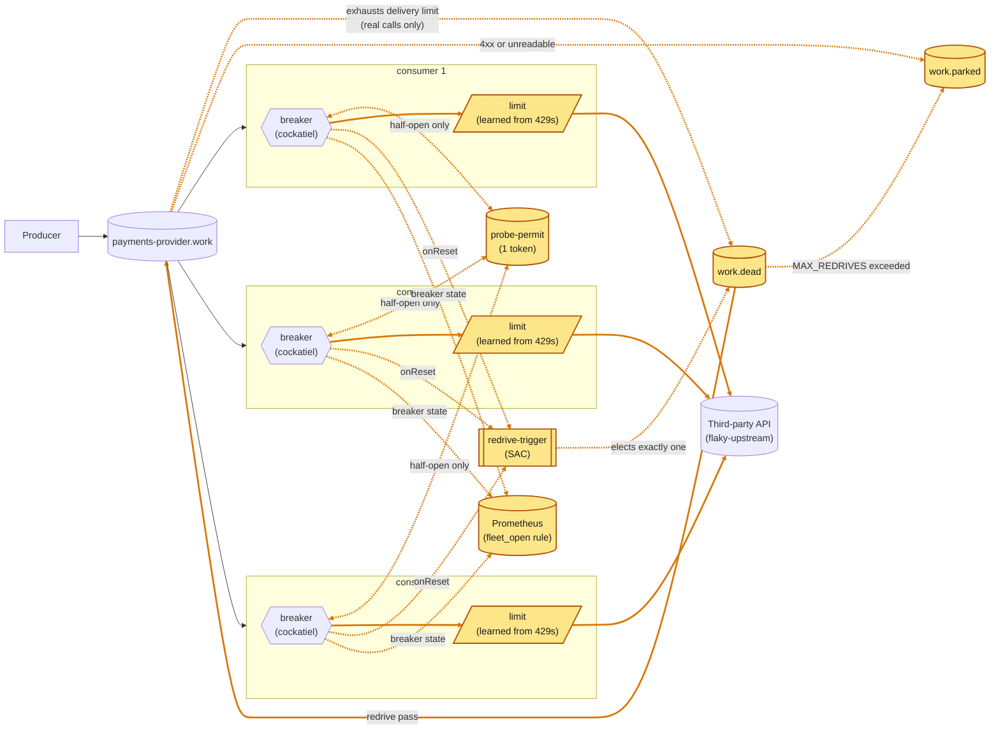

# RabbitMQ does the coordinating

A fleet of competing consumers, each with its own
[cockatiel](https://github.com/connor4312/cockatiel) breaker. Third step of
the series, built on `article/02-in-process-breaker`.

Article 2 left three problems that need the replicas to coordinate:

- one replica's successful half-open probe can burst `maxInFlight` calls
  at a third party that has been back for milliseconds, on every replica
  at once;
- a message can be dead-lettered without the third party ever seeing it
  (1,975 in one 15s outage);
- nothing brings dead letters back.

None of them needs new infrastructure. RabbitMQ already has the pieces: a
one-message queue for a token, a settlement that doesn't count toward the
delivery limit, and a single-active-consumer election. And the fleet's
view of the third party is a Prometheus rule over the breaker gauges every
replica already exports.

A fourth problem is a third party that is full, not broken, and says so
with a `429`. A breaker treats that as an outage. The answer is to classify
it as backpressure, and to let each replica learn a concurrency limit from
it (*A 429 is backpressure*, below).

For a fleet of consumers calling a third party, this is where the series
stops needing new infrastructure. Article 4
(`article/04-platform-control-plane`) is the design at platform level, for
when other systems must act on the verdict or many services share one egress
path.



<sub>Amber: new or changed on this branch.</sub>

Breakers share nothing. Only a half-open breaker touches the permit. Every
replica publishes to `redrive-trigger`; RabbitMQ delivers to one.

30s of `503`s then 10s of `422`s against 5 replicas, recorded 2026-09-24
with `infra/capture-incident.mjs` (5.79× real time,
[video](docs/media/dead-letter-redrive-incident.webm)).


In article 2's recording the dead-letter panel moved during an outage; here
it stays at 0 through the outage and the recovery. The price is backlog:
6,920 at peak. It moves only for the `422`s — 1,985 in 10s, each refused on
its first delivery. The permit changes nothing a dashboard shows; it was
checked separately (below).

## The permit: a one-token queue

A queue with `x-max-length: 1` and `x-overflow: reject-publish`. Every
replica seeds a token at startup; RabbitMQ keeps the first and *nacks* the
rest, which `seedPermit` treats as success. (An earlier version assumed
the rejection was silent and crash-looped four replicas on boot.)

A half-open replica does a non-blocking `get` first:

- **Token** → make the real call, then hand the token back whatever the
  result: publish a fresh one, then ack the one held.
- **Empty** → fail at once with `Breaker.NoPermit`, no network call;
  cockatiel treats it as a failed probe and backs off.

**Measured:** 20 concurrent `withPermit` calls against the live broker:
exactly one reached a real call every time, and the other 19 failed instantly.

That measured the permit, not the fleet using it, and the fleet wasn't using
it. Cockatiel moves Open → HalfOpen inside `execute()`, just before running
the probe. `consumer.ts` checked the state *before* `execute()`, so every
probe read Open and went straight to the third party. Across 616,643 polls of
the permit queue during a hanging outage, the token was never taken. The
check now runs inside the function handed to `execute()`, and a test pins
cockatiel's behaviour. With every replica open against a hanging third party,
counting in-flight calls on half-open replicas every 100 ms for 90 s (from 5 s
into the outage, once calls made before the trip had timed out):

| | before the fix | after |
| --- | --- | --- |
| peak probes in flight at once | 6 | **1** |
| samples with 5 or more | 15 of 814 | 0 of 815 |

**Why publish-then-ack, not `nack`:** `x-max-length` counts only *ready*
messages. Measured on RabbitMQ 4.3: a seed is refused while the token is
ready, but accepted while a probe holds it, so a replica starting mid-probe
made a second permit, and a requeuing `nack` kept both for good. The return
publish is refused while a duplicate is ready, so the duplicate collapses on
its next return; a crash between publish and ack leaves two tokens, never
none.

A single-active-consumer queue doesn't fit here: it hands over on
disconnect, not when a replica's backoff elapses.

## Counted attempts: release, don't requeue

`decide()` *releases* an `open` outcome (breaker open or permit lost, no
call made). RabbitMQ 4.3 doesn't count a release toward `x-delivery-limit`
(3); it does count a requeue, so three deliveries onto open breakers used
to dead-letter a message the third party never saw. `failed` still
requeues — a real call spends the budget. `master`'s `Attempts.ts` draws
the same line.

**Measured:** 1,785 dead-lettered in a 15s outage before; zero in a 40s
outage after. The work queue grows instead (6,800 at 40s, still climbing).

## The redrive: single-active-consumer

`Redrive.ts`, ported from `master`:

- **Election:** a trigger queue with `x-single-active-consumer` — the
  broker delivers to one replica and promotes another if it disconnects.
- **A pass** `get`s from `work.dead`, re-checks the gate per message,
  publishes to `work` (bumping `x-egress-redrive-count`) or, past
  `MAX_REDRIVES` (5), to `work.parked`, then acks. A crash in between
  duplicates, never loses. At most 200 per pass.
- **Gate:** the elected replica's own breaker is closed.
- **Triggers:** `onReset`, startup, and a 30s sweep. Without the sweep
  `work.dead` sat at 1,225 for 20s+ with every breaker closed; `master`'s
  ADR 016 fixes the same stall the same way.
- **Idempotency:** the republish keeps the original `message_id`.
- **Poison skips the dead-letter queue.** A message the third party
  refused (4xx) or the consumer cannot read (wrong format, not a work
  message, no `message_id`) goes straight to `work.parked`, stamped
  `x-egress-parked-reason`. Through the dead-letter queue it would be
  redriven five times for the same answer. The dead-letter queue keeps
  only what an outage failed, which is what a redrive can fix.

## The breaker

As in article 2: 5 consecutive failures trip it, half-open after 1s–30s
exponential backoff. `classify` (`Breaker.ts`) gives five outcomes: `ok`
accept, `throttled` (a `429`, while the limit adapts) release after a
100–400ms hold, `client_error` (4xx except 408/429) parked at once,
`failed` requeue, `open` release after a 100–400ms hold. A 4xx that is
really ours (401, 403, 404) parks every message it touches; the
`status` label on `egress_consumer_calls_total` shows it.

## The fleet view: a Prometheus rule

`infra/monitoring/rules.yml`:

- `egress:fleet_open_fraction` — the share of replicas whose breaker is open
  or half-open, counting only samples under 10s old;
- `egress:fleet_open` — 1 at half or more;
- alert `EgressThirdPartyDown` after 30s of that.

No extra process, no heartbeat: a replica counts while it is scraped.
Nothing reads it back. The freshness filter is there because a removed
container's last sample stays visible for Prometheus's 5-minute lookback —
measured, six series for five replicas after a rebuild, diluting a full
outage to 5/6. **Measured:** a 100% outage read 1.0 and fired the alert
after 30s; it read 0 again after restore.

## A 429 is backpressure

A third party that is full rather than broken answers `429`. Three
findings, in order of how much they matter:

1. **Classify the `429` as "slow down", not "failed".** Counting it as a
   failure trips every breaker and delivers a quarter of what the third
   party can take. Releasing it uncounted delivers 98%.
2. **A limit learned from `429`s makes the fleet polite, not faster.** It
   cuts the calls the third party has to refuse by 94%, costs about 4% of
   throughput, and leaves the backlog as it was.
3. **A failure-*rate* breaker doesn't pay** against a partial failure. It
   refused 7,000–9,000 calls that would have succeeded to avoid about 750
   that wouldn't.

A third party serving 5 at once, 100ms each (50/s), offered 400/s for 30s,
recorded 2026-09-24 with `infra/capture-incident.mjs --capacity=5`
(4.38× real time, [video](docs/media/429-backpressure-incident.webm));
the concurrency-limit panel is spliced under the queues.


Recorded with the since-removed failure-rate rule still in the breaker. No
call failed in this run, so the rule never counted anything. From
Prometheus: 46–50 successful calls a second against the 50/s ceiling, and
764 calls answered `429`. The fleet's summed limit fell from 100 to 7–12
and was back to 100 four seconds after restore. The backlog peaked at
9,533. No breaker opened, the fleet never read open, and nothing was
dead-lettered.

### The classification

A `429` means the third party is up and full. Counted as `failed`, it trips
the streak breaker like an outage would, and every open breaker refuses work
the third party could have done. As `throttled` it is released (not charged
to the message's delivery budget), held 100–400ms, and never counts toward
tripping. `master`'s ADR 010 learned this the hard way: a shed treated as a
failure dead-lettered 22,226 healthy messages.

### The limit

`Limiter.ts` (~40 lines, pure) sizes a `Semaphore` in `consumer.ts`. AIMD,
TCP's rule for an unknown capacity: a `429` multiplies the limit by 0.7,
each success adds `1/limit`. Starts at `MAX_IN_FLIGHT`, floor `LIMIT_MIN`
(1). No new queue. `ADAPTIVE_LIMIT=false` turns it off, and the
classification with it: a `429` is then a plain failure (the first row
under *Measured*).

- **Only a `429`.** A `5xx` means broken, which is the breaker's business,
  so the limiter ignores a coin-flip failure like the 30% below.
- **The slot is held through the 100–400ms hold**, or the next message
  spends it on another `429` (see *Measured*).

### Measured

A third party serving 5 calls at once, 100ms each (a 50/s ceiling), offered
400/s for 30s against 5 replicas. Three runs per configuration, 2026-09-24,
with `pnpm run incident` (`CAPACITY=5 DELAY_MS=100 WINDOW_MS=30000`, producer
at `RATE_PER_SECOND=400`). Goodput counts distinct messages answered 200,
from the third party's own audit.

| configuration | goodput | calls answered `429` | refused locally | open at peak | fleet open (ticks) | peak backlog |
| --- | --- | --- | --- | --- | --- | --- |
| `429` is a failure (`ADAPTIVE_LIMIT=false`) | **13 · 11 · 14 /s** | 572 · 510 · 578, counted as failed | 11,930 · 12,701 · 11,911 | 5 of 5 | 29/61 · 31/55 · 29/45 | 9,457 · 9,114 · 9,086 |
| `429` throttled, limit fixed at 20 (`LIMIT_MIN=20`) | **49 · 49 · 49 /s** | 11,458 · 11,440 · 11,557 | 0 | 0 | 0 | 8,000 · 8,070 · 8,175 |
| `429` throttled, adaptive limit (default) | **47 · 47 · 47 /s** | **750 · 740 · 739** | 0 | 0 | 0 | 7,983 · 8,445 · 8,485 |

- **The classification is most of it:** 11–14/s against a ceiling of 50
  when a `429` trips breakers, 49/s when it doesn't, with no limit at all.
  The first row used to be measured only with the failure-rate rule on.
  Without it the result is the same.
- **The limit is politeness:** 94% fewer `429`s (~11,500 → ~740), which
  matters against a real API's quota or ban. It costs 2/s of goodput.
- **It doesn't shrink the backlog:** 8,000–8,500 either way, since the
  excess still has to wait somewhere.
- **The fleet's limit settles above the ceiling:** summed over 5 replicas it
  averaged 9.1–9.3 in the later half, with a low of 6–7, against a third
  party that serves 5.

An earlier build that freed the slot *before* the 100–400ms hold, instead of
holding it through, was measured at 49/s with 6,067–6,778 `429`s: the next
message spent the freed slot on another `429`. Holding it is what makes the
limit polite. That build isn't reproducible from this branch.

Also from earlier builds, not re-run: at a 200/s ceiling, 127/s counting a
`429` as a failure, 196/s with a fixed limit, and 185/s adaptive.

### A failure-rate rule doesn't pay

Tried and removed. cockatiel's `SamplingBreaker` beside the streak rule,
opening when either would, at `BREAKER_FAILURE_RATE` 0.25 over 10s. Each
row a 30s injected failure against the fleet, the 30% rows three times:

| injected | rate rule | open at peak | fleet open (ticks) | failed calls | refused locally | peak backlog |
| --- | --- | --- | --- | --- | --- | --- |
| 10% | off | 0 of 5 | 0 / 42 ticks | 704 | 0 | 7 |
| 10% | 0.25 | 0 of 5 | 0 / 37 ticks | 649 | 0 | 0 |
| 30% | off (×3) | 2 of 5 | **0** / 39, 50, 42 | 2,620 / 2,596 / 2,616 | 1,032 / 1,846 / 734 | 29 / 51 / 23 |
| 30% | 0.25 (×3) | 5 of 5 | **26 / 47, 20 / 45, 24 / 45** | 1,744 / 1,935 / 1,945 | 9,983 / 8,929 / 9,698 | 1,718 / 1,069 / 1,097 |
| 60% | off | 5 of 5 | 32 / 51 | 774 | 12,652 | 4,455 |
| 60% | 0.25 | 5 of 5 | 29 / 50 | 685 | 12,833 | 4,374 |

At 30% it opened the fleet on about half the ticks and cut the failing
calls reaching the third party by ~28% (~2,600 → ~1,875). Those ~750
avoided failures cost 7,000–9,000 more calls refused locally — most would
have succeeded — a 20–70× deeper backlog, and a breaker that flaps. At 10%
it changed nothing; at 60% the streak rule already opened everything; at
the conventional 0.5 it looked like "off". A per-replica breaker cannot
shed only the share that would fail.

## What this still doesn't fix

- **The five breakers still don't agree.** The permit stops the recovery
  burst, not independent tripping.
- **Redrive waits on the elected replica's breaker**, up to 30s after the
  rest of the fleet has closed; the fleet view is for people and alerts,
  not for the redriver.
- **A long outage grows the work queue without bound.** The delivery limit
  used to cap it by accident. Pacing a full third party doesn't shrink it
  either: the peak backlog was the same with or without the limit
  (8,000–8,500).
- **Losing the permit race grows backoff** like a failed probe — cockatiel
  can't tell them apart.
- **The permit is one more dependency:** if its token is lost, half-open
  probes fail until a restart reseeds it.
- **A trigger arriving mid-pass is dropped.**
- **Only a `429` teaches the limit.** A third party that sheds by slowing
  down or with `503`s gets no help. Expected, not measured.
- **The floor can exceed the ceiling:** five replicas, each at least
  `LIMIT_MIN` 1, summed to 6–9 against a ceiling of 5.
- **Replicas learn independently**; nothing sees the fleet's limit but the
  dashboard.
- **A load-independent partial failure** has no good answer here: the
  streak breaker misses it, and a rate rule sheds the good traffic too.

## Running it

```bash
pnpm install
docker compose up -d
docker compose up -d --scale rmq-consumer=12   # resize the fleet, no restart needed
```

- RabbitMQ: <http://localhost:15672> (guest/guest).
- Grafana: <http://localhost:3000/d/in-process-breaker/in-process-breaker-e28094-five-not-one>
  (anonymous; two 401 toasts on first load are harmless). New panels:
  "Fleet open", "Parked queue depth", "Redrives" and "Concurrency limit
  per replica".
- Prometheus: <http://localhost:9090>.

Inside the devcontainer use service names (`rabbitmq`, `grafana`, …); a
gitignored `.env.local` with them is read by `pnpm run incident`.

## Injecting a failure

`flaky-upstream` is the third party; each POST replaces its behaviour:

```bash
curl -X POST localhost:8080/__fail -d '{"rate":1.0}'                # 503s
curl -X POST localhost:8080/__fail -d '{"rate":1.0,"status":422}'   # 422s: refused, not down
curl -X POST localhost:8080/__fail -d '{"rate":1.0,"mode":"hang"}'  # never answers
curl -X POST localhost:8080/__fail -d '{"rate":1.0,"mode":"reset"}' # drops the connection
curl -X POST localhost:8080/__fail -d '{"delayMs":1500}'            # slow, still correct
curl -X POST localhost:8080/__fail -d '{"delayMs":100,"capacity":5}' # full, not broken: 5 at once (50/s), 429 beyond
curl -X POST localhost:8080/__fail -d '{}'                          # healthy again
```

## The incident script

```bash
pnpm run incident
MODE=hang node infra/incident.mjs
STATUS=422 node infra/incident.mjs
RATE_PER_SECOND=400 docker compose up -d rmq-producer && CAPACITY=5 DELAY_MS=100 node infra/incident.mjs
```

Injects a failure, restores, and reports peak backlog, dead-lettered,
drain time, audit counts, breaker agreement, fleet-open timing, calls by
outcome, and what redrive moved or parked. With `CAPACITY` set, also
goodput and the fleet's summed limit. Unless `STATUS` or `CAPACITY` is set,
it ends with a 422 phase. `infra/capture-incident.mjs` records the dashboard
(needs `playwright-core`).

## Load

```bash
RATE_PER_SECOND=500 docker compose up -d rmq-producer
```

The producer never backs off.

## Chaos testing

`infra/chaos-load.mjs` injects faults under load and fails if any
confirmed message is neither processed nor still queued.

```bash
node infra/chaos-load.mjs --list
node infra/chaos-load.mjs                                    # every fault
node infra/chaos-load.mjs --faults=kill-one-consumer
node infra/chaos-load.mjs --rate=500 --spike=3000 --fault-seconds=25
```

Faults: `kill-one-consumer`, `kill-all-consumers`, `kill-broker`,
`flaky-storm`. First run (2026-09-19, ~350k messages): all passed, zero
unaccounted. `work.dead` stayed at 0, so the redriver never fired under
chaos; after `flaky-storm` a breaker can stay open 90s+ at its backoff cap.

A fifth fault, `upstream-overload`: 20 at once (200/s) under a 500/s spike.
No breaker or fleet-open may fire, and nothing may dead-letter. It failed 2
of 2 with `ADAPTIVE_LIMIT=false` and passed with it on. Re-run 2026-09-24,
without the rate rule: passed, 10,585 confirmed, 0 unaccounted.

## Layout

```
packages/
  config/        settings, declared once and decoded at boot
  rmq/           Effect wrapper over amqplib (Client.ts); queue names,
                 options and wire schemas shared by every process
                 (ControlPlane.ts)
  rmq-producer/  steady load onto <apiId>.work in confirmed batches, message_id as idempotency key
  consumer/      the fleet: Breaker.ts (breaker + permit),
                 Limiter.ts (the concurrency limit learned from 429s), Redrive.ts,
                 Upstream.ts (the HTTP call), consumer.ts (wiring, and decide())
  tracing/       /metrics route; OpenTelemetry, off unless OTEL_EXPORTER_OTLP_ENDPOINT is set
infra/
  flaky-upstream.mjs   the fake third party, with an audit trail
  incident.mjs         drives one incident and reports on it
  capture-incident.mjs records the dashboard through one
  chaos-load.mjs       faults under load, judged on per-message correctness
  chaos-publisher.mjs  its load generator
  rabbitmq.conf        the broker's flow-control watermark
  monitoring/          Prometheus scrape config and rules, Grafana dashboard
docker-compose.yml     the whole stack
```

Effect 4 (4.0.0-rc.116) — see `AGENTS.md` before writing Effect code. No
build step: packages run from `src/*.ts` through Node's type stripping.

## Verification

```bash
pnpm run check       # vendored-version check, typecheck, unit tests
pnpm run test:rmq    # needs Docker: AMQP behaviour against a real broker
```
