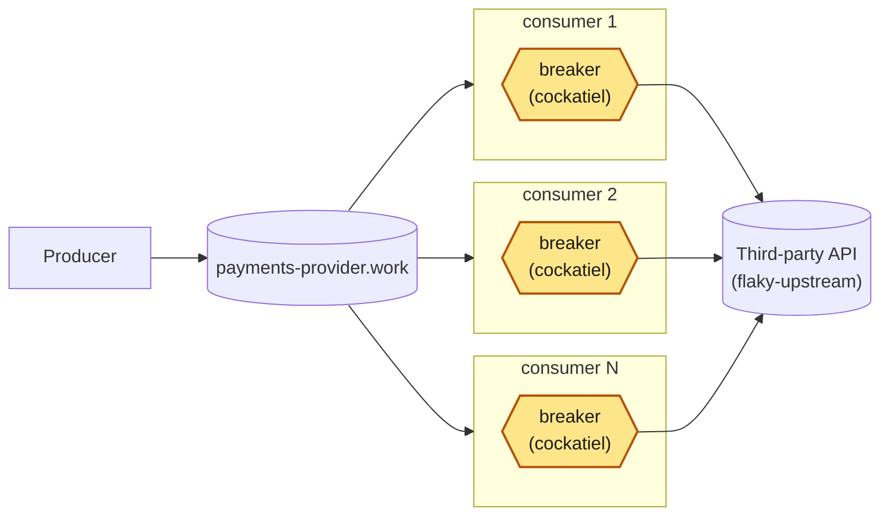

# In-process breaker: five, not one

A producer, a broker, and a fleet of competing consumers, each wrapping its
calls to the third party in its own
[cockatiel](https://github.com/connor4312/cockatiel) circuit breaker. Every
replica stops calling a dead third party; **nothing makes the five agree**.
`article/01-base-scenario` has no breaker; `article/03-rabbitmq-coordination`
coordinates these through the broker.



<sub>Amber: new on this branch.</sub>

## The breaker

`packages/rmq-consumer/src/Breaker.ts`: one cockatiel `CircuitBreakerPolicy`
per process, reused for its whole life (a fresh one per call would never count
a failure).

| outcome | when | breaker | message |
| --- | --- | --- | --- |
| `ok` | 2xx | success | accepted |
| `client_error` | a 4xx other than 408 and 429 | success | dead-lettered at once |
| `failed` | 5xx, 408, 429, an unexpected 1xx/3xx, no answer in 2 s, a failed connection | failure | requeued |
| `open` | the breaker turned the call away: **no call made** | none | requeued after a 100–400 ms hold |

- **Trips** after `BREAKER_THRESHOLD` (5) failures in a row; **re-opens** on an
  `ExponentialBackoff` from `BREAKER_INITIAL_DELAY_MS` (1 s) to
  `BREAKER_MAX_DELAY_MS` (30 s), jittered, doubling per failed probe.
- **The hold on `open`** stops a replica spinning against its own breaker at the
  broker's redelivery rate, which would move the hammering to the broker.
- **A `client_error` is dead-lettered on its first call** and doesn't count
  against the breaker: the third party answered. A 4xx that is ours to fix (401,
  403, 404) therefore dead-letters every message; the `status` label on
  `egress_consumer_calls_total` and a once-a-second log line show it.

## What an outage does

**Measured**, a 15 s `error` outage at 200 msg/s, five replicas, thirteen runs:

| | range |
| --- | ---: |
| breaker openings across the fleet | 26 – 28 (median 27) |
| ticks with all five replicas in one state | 32 – 78% (median 56%) |
| all closed, after restore | 10.5 – 29.4 s (median 22 s) |
| peak ready in the work queue | 1,458 – 1,496 |
| dead-lettered | 1,577 – 2,246 |
| calls that reached the third party and failed | 52 – 59 |
| attempts turned away by an open breaker | 7,600 – 10,500 |

A later re-run on a rebuilt stack landed just outside some ranges (25 openings,
79% agreement, closed 8.9 s after restore, 7,518 turned away): read them as a
spread, not bounds.

The breaker does its one job: each replica stops after five failures, about 11
failed calls per replica per incident, and all five were open at once in every
run. It can't make them agree: they trip and recover on their own clocks, so
one outage costs about 27 openings, not one.


A 15 s outage (3.71× real time, [full recording](docs/media/incident-in-process-breaker.webm)):
all five open within 2 s of each other, 1,826 dead-lettered, and after the
restore they close out of step over about 7 s.

## What it cannot overcome

Each follows from five independent breakers; none is a bug in `Breaker.ts`.

- **No coordination**: each breaker knows only its own calls; the fleet took
  9–29 s to be fully closed again.
- **Messages die without reaching the third party**: `decide()` counts `open`
  like `failed` against `WORK_DELIVERY_LIMIT` (3). With 52–59 real failures per
  incident against 1,577–2,246 dead letters, **at least 96%** were killed by
  their own replica's breaker, indistinguishable from real failures.
- **Recovery is uncoordinated too**: each half-open probe runs on its own clock,
  and one replica's result tells the other four nothing.
- **A successful probe can release a herd** (from cockatiel's source, not
  measured): up to 19 in-flight calls wait on the trial and then fire together;
  across the fleet up to `maxInFlight × replicas`.
- **Turned-away volume scales with fleet size**, not health: 7,518 – 10,457
  attempts per incident in six measured runs.
- **Dead letters have no way back**: nothing redrives `payments-provider.work.dead`.
- **Nothing announces the outage**, and `onBreak` fires per replica: paging on it
  would ring about 27 times for one outage.

## Running it

```bash
pnpm install
docker compose up -d                              # HOST_WORKSPACE_FOLDER: this repo's path on the host (macOS)
docker compose up -d --scale rmq-consumer=12      # resize the fleet
RATE_PER_SECOND=500 docker compose up -d rmq-producer
```

From the devcontainer, by service name (from the host, `localhost`):
- RabbitMQ <http://rabbitmq:15672> (guest/guest)
- Grafana <http://grafana:3000/d/in-process-breaker>
- Prometheus <http://prometheus:9090>

`flaky-upstream` is the third party; a POST replaces its behaviour, `{}`
restores it, and `/__audit?run=*` counts what it answered 200:

```bash
curl -X POST flaky-upstream:8080/__fail -d '{"rate":1.0}'                  # 503s
curl -X POST flaky-upstream:8080/__fail -d '{"rate":1.0,"status":422}'     # refused, not down
curl -X POST flaky-upstream:8080/__fail -d '{"rate":1.0,"mode":"hang"}'    # never answers
curl -X POST flaky-upstream:8080/__fail -d '{"rate":1.0,"mode":"reset"}'   # drops the connection
curl -X POST flaky-upstream:8080/__fail -d '{}'                            # healthy
```

`pnpm run incident` drives one outage and reports backlog, dead letters,
duplicates, openings, how far the replicas agreed and when the last closed
(`MODE=hang`, `RATE`, `WINDOW_MS` shape it; replica states come from
`PROMETHEUS`).

## Layout

```
packages/
  config/        settings declared once, decoded at boot
  rmq/           amqplib in Effect, work-queue conventions
  rmq-producer/  the load, in confirmed batches, never backing off
  rmq-consumer/  the fleet, each replica with its own breaker (Breaker.ts)
  tracing/       /metrics, and OpenTelemetry when OTEL_EXPORTER_OTLP_ENDPOINT is set
infra/
  flaky-upstream.mjs          the fake third party, with an audit trail
  incident.mjs                one incident, including whether the breakers agreed
  monitoring/, rabbitmq.conf  scrape config and dashboard; the broker's watermark
```

**Effect 4 (4.0.0-rc.116)**; see `AGENTS.md`. No build step: Node runs the
`src/*.ts` directly.

```bash
pnpm run check       # vendored version, typecheck, unit tests (Breaker.test.ts against the real library)
pnpm run test:rmq    # needs Docker: against a real broker
```
