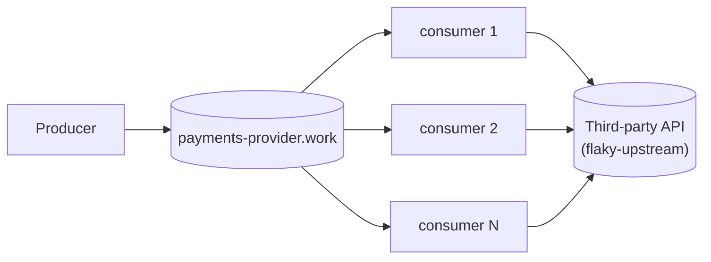

# The base scenario

One producer, one broker, a fleet of competing-consumer daemons calling a
third party directly.



Each daemon decides for itself, per message, whether its own last call
worked. A failed call is handed back to the broker (`requeue`); the broker's
own `x-delivery-limit` (3 attempts) dead-letters it once that budget is
spent.

## Running it

The compose file bind-mounts config from the repo through
`HOST_WORKSPACE_FOLDER`. It defaults to `.`, so on Linux and Windows there is
nothing to set. On macOS, where Docker runs in a VM, set it to this repo's path
*on the Mac* (inside a devcontainer, that is not the path you see).

```bash
pnpm install
docker compose up -d
docker compose up -d --scale rmq-consumer=12   # resize the fleet, no restart needed
```

- RabbitMQ management UI: <http://localhost:15672> (guest/guest) — watch
  `payments-provider.work`'s depth climb during an outage and drain once it
  ends.
- Grafana: <http://localhost:3000/d/base-scenario>
  Panels: work-queue depth, dead-letter-queue depth, calls by outcome,
  active consumers. Plain `:3000` lands on Grafana's Welcome screen, not this
  dashboard — use the direct link, or `Dashboards` in the left nav.
- Prometheus: <http://localhost:9090>.

## Injecting a failure

`flaky-upstream` stands in for the third party. Every field is optional and a
POST replaces the whole behaviour, so `{}` restores health:

```bash
curl -X POST localhost:8080/__fail -d '{"rate":1.0}'                # 503s
curl -X POST localhost:8080/__fail -d '{"rate":1.0,"mode":"hang"}'  # never answers
curl -X POST localhost:8080/__fail -d '{"rate":1.0,"mode":"reset"}' # drops the connection
curl -X POST localhost:8080/__fail -d '{"delayMs":1500}'            # slow, still correct
curl -X POST localhost:8080/__fail -d '{}'                          # healthy again
```

Every call answered 200 is recorded by its idempotency key (`<run>:<n>`), so you
can check what got through: `curl 'localhost:8080/__audit?run=*'` for totals, or
`?run=<id>` for one run's processed and duplicate counts.

## The incident script

```bash
pnpm run incident
MODE=hang node infra/incident.mjs
```

Injects a full failure, watches the work and dead-letter queues for a fixed
window (over AMQP, straight from the broker), restores the third party, and
reports peak backlog, total dead-lettered, time to drain, and a
processed/duplicate count from `flaky-upstream`'s audit trail.

### What it measured

A 20s outage at 200 msg/s with five consumers. In the recording below
(recorded 2026-09-24, 3.71× real time, also as
[video](docs/media/incident-error-mode.webm)) the dead-letter queue climbs to
4,019 while the work queue stays empty:


| `mode=hang` outage | Waiting in work queue | Dead-lettered | Backlog cleared after restore |
| --- | ---: | ---: | ---: |
| 20s | 3,720 | 200 | 0.4s |
| 120s | 22,620 | 1,500 | 1.2s |

For comparison, an `error` outage of 20s dead-letters ≈ 4,000 with nothing
waiting, and drains in 0.0s.

Both modes lose work at the rate the fleet can burn through delivery attempts,
and that rate is very different. With `error` an attempt is instant, so every
message uses its 3 attempts as fast as it arrives: about 200/s dead-lettered,
nothing waiting. With `mode=hang` an attempt holds one of the 100 in-flight
slots (5 consumers × `MAX_IN_FLIGHT=20`) for the full 2s client timeout, so the
fleet burns through attempts slowly: a steady ≈ 10 messages/s dead-lettered
(200 more every 20s, the whole 120s), while the other ≈ 190/s pile up in the
work queue. Those are not lost yet — after 120s only 1,500 of ≈ 24,000 arrivals
are dead-lettered — and they drain in about a second once the third party
recovers. The two do not converge with a longer outage: the backlog keeps
growing until the third party comes back or the broker runs out of room. (One
run each. The 120s run started with 4,517 messages already in the dead-letter
queue, subtracted above; `incident.mjs` prints the queue's absolute depth.)

Duplicates: 0 across 22,848 processed calls over five incidents. The producer
stamps each message once with an AMQP `message_id` of `<run>:<n>`, and the
consumer sends it as the third party's idempotency header, so a broker
redelivery repeats the same request.

### What this branch cannot overcome

There is no circuit breaker here. Each limit below follows from that, none is a
bug in `packages/rmq-consumer`.

1. **No coordination between consumers.** Each replica decides for itself
   whether its own last call worked; there is no shared verdict on the third
   party's health.
2. **Nothing backs off.** The producer publishes at a fixed rate and consumers
   call at full concurrency regardless of outcome, so a dead third party is
   hit as hard as a healthy one for the whole outage.
3. **Dead-lettered work has no way back.** The 4,000 messages above stay in
   `payments-provider.work.dead` until a human replays them. That queue also
   holds deliveries the daemon refuses (malformed body, no `message_id`), so
   replaying starts with telling what is worth replaying.
4. **A timeout and a real failure look identical.** `Upstream.ts` reduces a
   timeout, a refused connection, a 503 and a 429 to the same `"failed"`, so
   "slow down" cannot be told from "broken".
5. **Nothing announces the outage.** Metrics leave each process, but no event
   does; the only way to notice is to be watching Grafana.
6. **No comparison between replicas.** Prometheus scrapes each replica, but the
   dashboard sums them, so "one consumer is unhealthy" and "the third party is
   unhealthy" are indistinguishable.

## Load

The producer's rate is configurable and never reacts to anything:

```bash
RATE_PER_SECOND=500 docker compose up -d rmq-producer
```

Combine with `--scale rmq-consumer=N` and `infra/incident.mjs`'s `RATE`/
`WINDOW_MS` env vars to drive a specific incident shape.

## Layout

```
packages/
  config/      @egress/config — settings declared once, decoded at boot
  rmq/         @egress/rmq — Effect wrapper over amqplib, plus the generic
               work-queue naming/options a producer and a consumer fleet share
  rmq-producer/  the load: a steady stream onto <apiId>.work in confirmed batches,
                 never backing off
  rmq-consumer/  the naive competing-consumer fleet, see src/consumer.ts
  tracing/     the /metrics HTTP route every process serves; OpenTelemetry
               tracing is wired but off unless OTEL_EXPORTER_OTLP_ENDPOINT is set
infra/
  flaky-upstream.mjs   the fake third party: configurable failures, an audit trail
  rabbitmq.conf        the broker's flow-control watermark
  incident.mjs         drives one incident, reports what happened
  monitoring/          Prometheus scrape config and the Grafana dashboard
docker-compose.yml     the whole stack
```

Built on **Effect 4 (4.0.0-rc.116)** — see `AGENTS.md` for why that version
matters when writing Effect code here. No build step: every package runs
straight off its `src/*.ts` through Node's built-in type stripping.

## Verification

```bash
pnpm run check       # vendored-version check, typecheck, unit tests
pnpm run test:rmq    # optional — needs Docker: AMQP behaviour against a real broker
```
