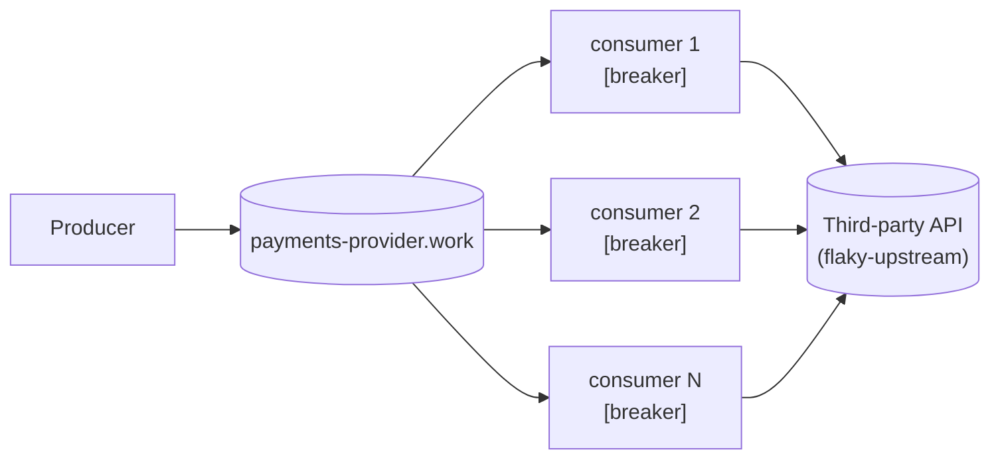

# In-process breaker — five, not one

One producer, one broker, a fleet of competing-consumer daemons — each one
now wrapping its calls to the third party in its own [cockatiel](https://github.com/connor4312/cockatiel)
circuit breaker. This is the second step in a circuit-breaker article series,
built on the `article/01-base-scenario` branch (no breaker at all). It's
still deliberately incomplete: five replicas mean five breakers, and nothing
here makes them agree with each other.



## The breaker

`packages/consumer/src/Breaker.ts` wraps every third-party call in a
cockatiel `CircuitBreakerPolicy`, one instance per process, created once and
reused for the process's whole life (cockatiel's own docs are explicit that
a breaker only works if the same instance sees every execution — a fresh one
per call would never accumulate a failure count).

- **Trip condition**: `ConsecutiveBreaker(BREAKER_THRESHOLD)` — opens after
  `BREAKER_THRESHOLD` (default 5) calls fail in a row. This is the direct
  in-code version of "a threshold on recent failures, never a single
  failure" from Part 1 of the article series.
- **Re-open timing**: `ExponentialBackoff` from `BREAKER_INITIAL_DELAY_MS`
  (default 1000ms) up to `BREAKER_MAX_DELAY_MS` (default 30000ms), doubling
  each time a half-open probe still fails. cockatiel's default backoff
  generator is already decorrelated-jitter — "exponential backoff and
  jitter" is what `new ExponentialBackoff()` gives you without extra
  configuration, not something layered on top.
- **Three outcomes now, not two**: `"ok"` (accept), `"failed"` (a real call
  was attempted and failed, requeue — same as article 1), and `"open"` (the
  breaker rejected the call itself; **no call reached the third party**,
  requeue after a short jittered hold).

That hold (100–400ms, `OPEN_REQUEUE_DELAY_MIN_MS`/`MAX_MS` in
`consumer.ts`) exists because an open breaker rejects instantly — with no
hold, a rejected message goes straight back onto the queue and straight back
to the same consumer, which can spin against its own in-memory breaker at
whatever rate the broker will redeliver. The third party stops being
hammered; without the hold, the *broker* takes its place. Same shape as the
100–400ms jittered hold the pre-breaker daemon this series later removed
used for a shed `429`.

## What this still doesn't fix

Five consumers means five breakers, each formed only from the calls that one
process happened to make. They will trip at different moments, recover at
different moments, and briefly disagree about whether the same third party
is up — watch the "Breaker state per replica" panel on the dashboard during
an incident, or read `infra/incident.mjs`'s own `breaker agreement` line at
the end of a run. Coordinating that into one fleet-wide verdict is a
different, harder problem — the next branch in this series, not this one.

## Running it

```bash
pnpm install
docker compose up -d
docker compose up -d --scale rmq-consumer=12   # resize the fleet, no restart needed
```

- RabbitMQ management UI: <http://localhost:15672> (guest/guest) — watch
  `payments-provider.work`'s depth and `payments-provider.work.dead`'s
  growth.
- Grafana: <http://localhost:3000/d/in-process-breaker/in-process-breaker-e28094-five-not-one>
  — anonymous viewer access, no login needed. (Plain `:3000` lands on
  Grafana's own "Welcome" screen, not this dashboard — Grafana 13's
  anonymous Viewer role can't be granted the permission a *default home
  dashboard* needs, so there's no way to make `:3000` redirect here without
  requiring login. Use the direct link, or `Dashboards` in the left nav.)
  Panels: breaker state per replica, work-queue depth, dead-letter-queue
  depth, calls by outcome, breaker trips, active consumers.
- Grafana's own nav bar fires two calls (`/api/user/teams`,
  `/api/user/stars`) that need a real signed-in user and 401 for an
  anonymous session — a known rough edge in Grafana's anonymous-auth mode,
  not something this compose file controls. It shows as a stray toast on
  first load; the dashboard and its data are unaffected.
- Prometheus: <http://localhost:9090>.

## Injecting a failure

`flaky-upstream` stands in for the third party. Every field is optional and a
POST replaces the whole behaviour, so `{}` restores health:

```bash
curl -X POST localhost:8080/__fail -d '{"rate":1.0}'                # 503s
curl -X POST localhost:8080/__fail -d '{"rate":1.0,"mode":"hang"}'  # never answers
curl -X POST localhost:8080/__fail -d '{"rate":1.0,"mode":"reset"}' # drops the connection
curl -X POST localhost:8080/__fail -d '{"delayMs":1500}'            # slow, still correct
curl -X POST localhost:8080/__fail -d '{}'                          # healthy again
```

## The incident script

```bash
pnpm run incident
MODE=hang node infra/incident.mjs
```

Injects a full failure, watches the work queue and dead-letter queue for a
fixed window, restores the third party, and reports peak backlog, total
dead-lettered, time to drain, and a processed/duplicate count from
`flaky-upstream`'s own audit trail — same as article 1's version, plus one
thing this branch actually has to measure: at every poll tick it also reads
each replica's `egress_consumer_breaker_state` from Prometheus
(`PROMETHEUS`, default `http://localhost:9090`) and reports what fraction of
ticks saw every replica in the *same* state, and the peak number open at
once. That's the concrete, measured version of "five independent breakers
disagree" — produced by this branch's own run, not asserted.

## Load

The producer's rate is configurable and never reacts to anything:

```bash
RATE_PER_SECOND=500 docker compose up -d rmq-producer
```

Combine with `--scale rmq-consumer=N` and `infra/incident.mjs`'s `RATE`/
`WINDOW_MS` env vars to drive a specific incident shape.

## Layout

```
packages/
  config/      @egress/config — settings declared once, decoded at boot
  rmq/         @egress/rmq — Effect wrapper over amqplib, plus the generic
               work-queue naming/options a producer and a consumer fleet share
  rmq-producer/  the load: a steady stream onto <apiId>.work, never backing off
  consumer/    the competing-consumer fleet, each with its own in-process
               breaker (src/Breaker.ts) — see src/consumer.ts for what that
               still doesn't coordinate
  tracing/     the /metrics HTTP route every process serves; OpenTelemetry
               tracing is wired but off unless OTEL_EXPORTER_OTLP_ENDPOINT is set
infra/
  flaky-upstream.mjs   the fake third party: configurable failures, an audit trail
  rabbitmq.conf        the broker's flow-control watermark
  incident.mjs         drives one incident, reports what happened including
                        whether the fleet's breakers agreed with each other
  monitoring/          Prometheus scrape config and the Grafana dashboard
docker-compose.yml     the whole stack
```

Built on **Effect 4 (4.0.0-rc.115)**, same as the full system this branch was
pruned from — see `AGENTS.md` for why that version matters when writing
Effect code here. No build step: every package runs straight off its
`src/*.ts` through Node's built-in type stripping.

## Verification

```bash
pnpm run check       # typecheck + unit tests, including Breaker.test.ts against the real library
pnpm run test:rmq    # optional — needs Docker: AMQP behaviour against a real broker
```
