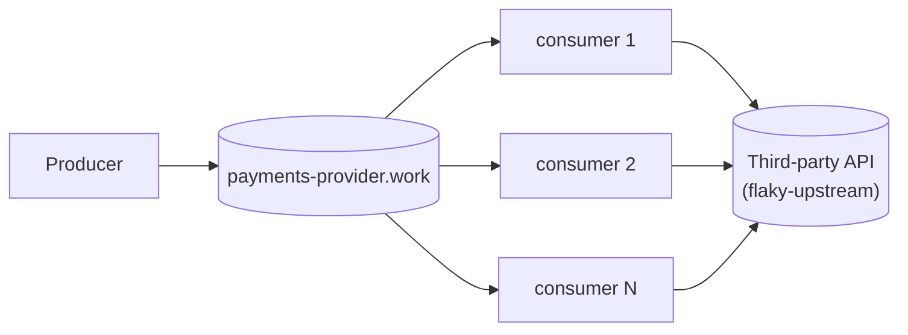

# 01 · No breaker

Each consumer judges only its own last call; the broker's delivery limit dead-letters what keeps failing.

```mermaid
flowchart LR
  producer["Producer"] --> queue[("payments-provider.work")]
  queue --> c1["consumer 1"]
  queue --> c2["consumer 2"]
  queue --> c3["consumer N"]
  c1 --> api[("Third-party API\n(flaky-upstream)")]
  c2 --> api
  c3 --> api
```

From the README of `article/01-base-scenario`.
