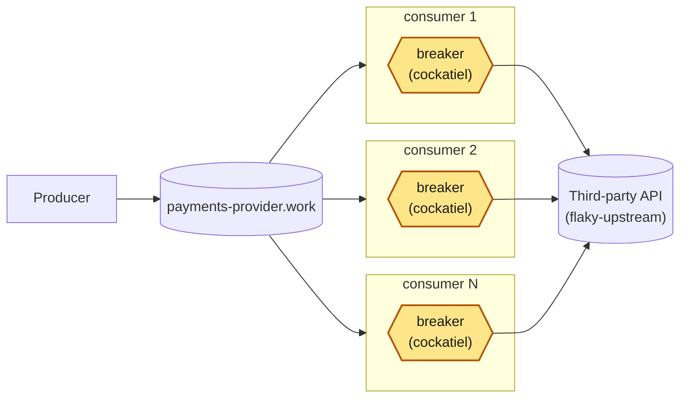

# 02 · A breaker in every process

Each replica wraps its calls in its own cockatiel breaker; nothing makes the five agree.

Amber: new on that branch. From the README of `article/02-in-process-breaker`.
