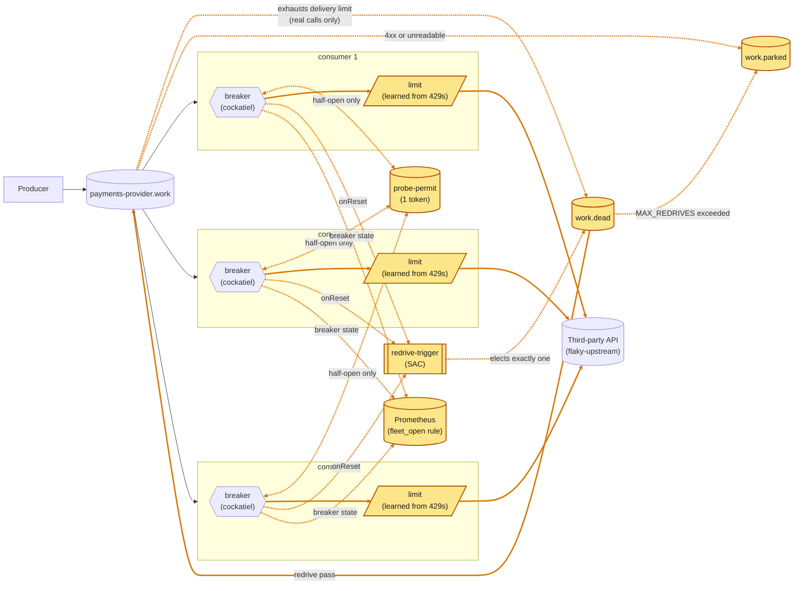

# 03 · Breakers coordinated through the broker

The same in-process breakers, sharing a one-token probe permit, a redrive of the dead-letter queue and a fleet view.

Amber: new on that branch. From the README of `article/03-rabbitmq-coordination`.
