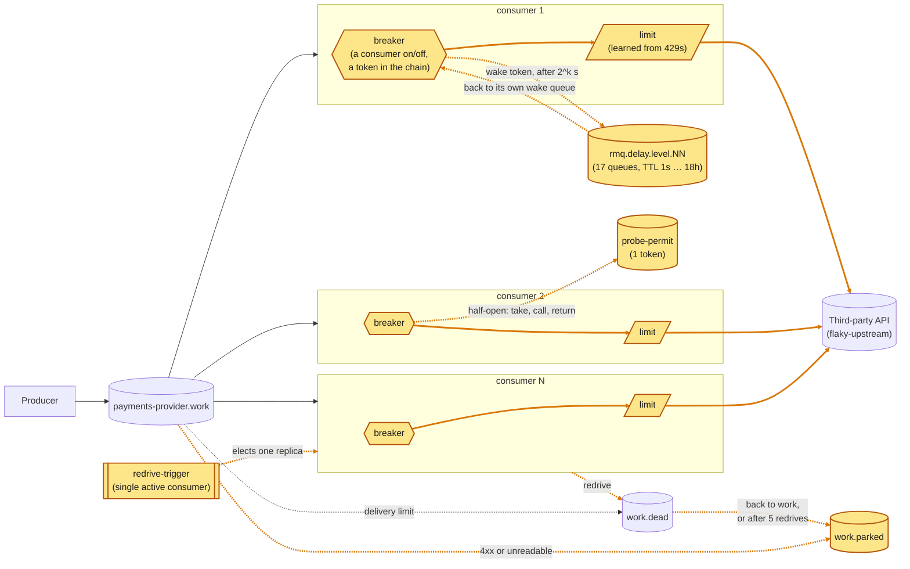

# 04 · A breaker held by the broker

No breaker state in the process: open is a consumer that stopped consuming, and the timer that ends it is a message in a delay chain.

Amber: new on that branch. From the README of `article/04-rabbitmq-only-breaker`.
