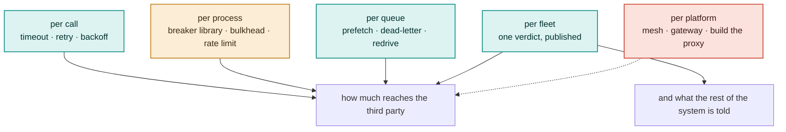

# Answering the actual question

The design in this repository began as an interview question, and the question
matters for reading everything else here — because it fixes both the picture
you start from and the one thing you are not allowed to do about it.

**Given** the system in [where it starts](../history/journey.md#0-where-it-starts): a
producer, a broker, a fleet of competing consumers, and a third-party API they
all call.

**Design reliability around it, given that the flaky service is outside your
control.**

That constraint is the whole exercise. It is worth spelling out what it
removes, because it eliminates entire families of answer before any design
begins:

- **You cannot ask whether it is healthy.** No health endpoint you trust, no
  status feed, no capacity you were promised. Everything you know about it, you
  learn from calls you made yourself — and every one of those calls is load on
  something that may already be failing.
- **You cannot make it faster.** The only variable on your side is how much you
  send it.
- **You cannot be told when it recovers.** You have to find out, which means
  calling it, which costs the thing in the first point.

Everything below is a way of spending those three facts. They are grouped by
the scope they act at, because that turns out to be what separates them — and
because the first three groups are **not alternatives to the fourth**. This
repository uses most of them at once.

Only one of those rows reaches the second box.

## Per call

**Timeout.** Bounds how long one call may hold a worker. Necessary, and cheap.

*Limitation:* it cannot reduce load, and set aggressively it *increases* it —
a timeout that fires and triggers a retry turns one slow call into two. It
bounds your exposure, not the upstream's. Here: 2s on every egress call.

**Retry.** Recovers the genuinely transient — one dropped connection, one 503
from one host behind a balancer.

*Limitation:* a retry is another call. Under a real outage, retries multiply
load at the exact moment the dependency can least take it, and the picture in
[section 1 of the journey](../history/journey.md#1-what-the-picture-hides) is that
happening by default. Worse, an in-process attempt counter is lost the moment
the message moves to another consumer — so "three attempts" quietly becomes
three attempts *per consumer*. Here the daemon republishes on a failed call
rather than requeuing, carrying an attempt count and a per-attempt
idempotency key forward in headers, rather than relying only on the broker's
`x-delivery-limit` — which stays on the queue as a backstop for a delivery
that never gets that far, not as the primary counter. This is close to the
retry-queue ladder further down, and paid for the same reason: see
[ADR 016](decisions/016-the-retry-budget-travels-with-the-message.md) for the
measurement that forced it and what it cost.

**Backoff and jitter.** Spreads retries out in time so they do not arrive as a
wall.

*Limitation:* it still assumes retrying is the right thing to do, and it
coordinates nothing — N consumers that failed at the same moment back off by
the same schedule and converge on the same instant again unless each jitters
independently. Backoff makes a herd politer; it does not stop it being a herd.
This repository backs off at the *breaker* rather than the call, and doubles
`openBackoffMs` on each failed probe.

## Per process

**A breaker library.** The first answer, and the one with the most literature.
Analysed in full in [a breaker library in every service](breaker-library.md).

*Limitation:* the state is a variable in one process. Measured at this fleet's
shape, five daemons against an upstream failing 45% of the time agree with each
other 17% of the time and send 370 probes in five minutes at one that is fully
down. There is also nothing to publish from.

**Bulkhead.** Cap the concurrency any one dependency may consume, so a slow
third party cannot exhaust the workers a healthy one needs.

*Limitation:* it protects *you*, not the upstream. N processes each with a
bulkhead of *k* still send *N × k* concurrent calls, and the third party
experiences the product, not the factor.

**Local rate limit.** Cap outbound calls per second, per process.

*Limitation:* the same multiplication, plus a worse problem — you have to pick
a number, and the correct number is a property of a system you were told you
do not control and cannot ask. A rate limit set from guesswork is either
throttling a healthy dependency or not throttling a failing one.

## Per queue

This group is where the given picture already has leverage, and it is
underrated: the queue is the one component that can hold work without doing it.

**Prefetch as the concurrency ceiling.** The broker refuses to hand over an
*n+1*th message until one is settled, so concurrency is enforced by the thing
holding the work rather than by a counter in the consumer — see
[ADR 011](decisions/011-the-ceiling-belongs-to-the-broker.md).

*Limitation:* it bounds how much is in flight. It does not decide whether any
of it should be.

**Dead-lettering.** A message that has exhausted its attempts leaves the work
queue instead of cycling forever.

*Limitation:* a dead-letter queue nobody drains is a slower way of losing
things — which is why this repository has a redrive at all.

**Redrive on recovery.** Replay the dead-letter queue once the dependency is
back, in bounded passes, from one elected consumer.

*Limitation:* it needs to know recovery happened. That is not a queue
primitive; it is precisely the verdict the next group exists to produce.

**Delay queues.** Hold retries for a fixed interval instead of releasing them
immediately.

*Limitation:* backoff again, in the broker rather than the process, with the
same blindness — the delay is a constant chosen in advance, not a response to
what the dependency is doing now.

**Arbitrary delays from a binary cascade.** RabbitMQ has no "deliver at" for a
message, only a TTL and somewhere to dead-letter it when the TTL expires.
[NServiceBus's RabbitMQ transport](https://docs.particular.net/transports/rabbitmq/delayed-delivery)
builds any delay out of those two primitives. It declares 28 levels, each a
topic exchange and a queue of the same name (`nsb.v2.delay-level-27` down to
`nsb.v2.delay-level-00`). The queue at level *n* has `x-message-ttl` of 2ⁿ
seconds and dead-letters into the exchange of level *n − 1*. A message's delay
is written into its routing key as 28 binary digits followed by the destination,
so ten seconds is `0.0.…0.1.0.1.0.destination`. At each level a `1` routes the
message into that level's queue to wait out its TTL, and a `0` routes it
straight past to the next exchange. It leaves level 0 through a final
`nsb.v2.delay-delivery` exchange bound to each destination. Any whole number of
seconds up to 2²⁸ − 1 (about 8.5 years) takes at most 28 hops. Each queue holds
messages with one TTL only, so the one that expires next is always at the
head, which is what makes TTL-based expiry dependable there.

*Limitation:* it answers "when", never "whether". Every delay is decided by
the publisher at publish time, so a thousand messages that failed together are
released together, however the dependency is doing by then. The precision is
a second, and a message's wait also includes each queue's expiry scan. Moving
work between brokers gets harder: a delayed message is a message part-way
through 28 queues, and Particular documents that a shovel cannot move them. And
it rests on dead-lettering, which quorum queues do *at most once* unless the
source queue is declared with `x-dead-letter-strategy: at-least-once` (which
also requires `x-overflow: reject-publish`). This stack's own work queue is the
default: the broker's
`rabbitmq_global_messages_dead_lettered_delivery_limit_total` counter reads
`dead_letter_strategy="at_most_once"`, so a dead-lettering the broker cannot
complete drops the message instead of retrying it.

**A cascade of retry queues for backoff.** The simpler variant of the same
idea: a fixed ladder of queues, for example `work.retry.1s`, `work.retry.10s`,
`work.retry.1m` and `work.retry.10m`, each with its own `x-message-ttl`,
dead-lettering back into the work queue. A consumer whose call fails publishes
the message to the next rung and acks the original, so the delay grows with
each attempt without any consumer holding it. One queue per rung keeps every
TTL at the head of its own queue. The alternative, per-message TTLs on a single
queue, does not: RabbitMQ only expires a message when it reaches the head, so a
ten-minute retry ahead of a one-second one holds the short one back for ten
minutes.

*Limitation:* everything the per-call backoff already had, plus three costs of
its own. The schedule is still blind: it is fixed per rung and ignores the
upstream's state, and all the messages that failed in the same second reach
the same rung together, so they come back together. A TTL cannot jitter a
single message without per-message TTLs, which brings back the head-of-line
problem above. The retry budget stops belonging to the broker: republishing
resets `x-delivery-count`, so the attempt count has to travel in a header the
consumer maintains, which is what
[`x-delivery-limit`](#per-call) was chosen to avoid. And the queues multiply: the
number of rungs times the number of APIs, each with its own dead-lettering to
reason about. Where it does fit here is narrower than backoff in general.
Settling with `requeue` puts a message straight back on the queue, and
[`packages/rmq/src/Client.ts`](../packages/rmq/src/Client.ts) already warns that
repeated undelayed requeues become a hot loop. A single short rung would give
failures that say nothing about the third party, such as a refused connection
to the local proxy, a pause before the next attempt that does not spend the
message's budget. Deciding *whether* to call stays with the breaker.

## Per fleet

Everything above reduces or reschedules load. None of it produces **one answer
to "is this API up" that anything outside the calling process can act on** —
and the given picture has four parties who need that answer: the consumer
fleet, the producer, whoever is on call, and whatever the business does when a
payment provider is down.

**Share breaker state in Redis.** The tempting fix: let the consumers agree
before any of them acts.

*Limitation:* it puts a network round trip and a shared failure domain in the
hot path of the component whose entire job is surviving other people's
failures. It fails the constraint in the direction that hurts most.

**Publish from the proxy.** If an egress proxy is already doing outlier
detection, point its ejection events at a webhook.

*Limitation:* those records are per replica, so subscribers receive the
disagreement rather than a verdict — and the signal that matters most,
threshold saturation, is a counter delta rather than an event, so it is not in
the feed at all.

**Enforce locally, decide centrally, publish once.** What this repository does.
Each proxy replica ejects hosts on its own evidence, off the hot path; an
aggregator takes a quorum of what the replicas see and runs one breaker per
API; the verdict is published as a gapless per-API sequence that the consumer
fleet, a status page and anything else act on.

*Limitation — and it is real:* it is three components and a leader election to
answer a question a library answers in one line. The aggregator is a new thing
that can be down, which is why its `OPEN` is
[observational rather than authoritative](decisions/002-enforcement-authority.md):
if the control plane dies, enforcement is still happening in the proxies, and
the fleet holds its last known target rather than stopping.

## Per platform

Included because they come up, and dismissed because they change the question
rather than answer it. A service mesh puts the same Envoy outlier detection in
a sidecar and leaves the aggregation problem exactly where it was. A gateway
like APISIX gives a coarser per-route breaker and a logger that fires per
request, which is the hot-path coupling the constraint rules out. Building the
proxy gives exactly the semantics wanted and costs a quarter of engineering to
arrive where Envoy starts. All three are covered in the
[README's comparison](../README.md#approaches-and-where-each-one-runs-out).

## The review, in one table

The column that matters is the third one.

| | What it fixes | What it cannot fix | Used here |
|---|---|---|---|
| Timeout | unbounded waits | load — may increase it | yes, 2s |
| Retry | transient failures | multiplies load in an outage | yes, budget held by the broker |
| Backoff / jitter | retry bursts | still retrying blindly | at the breaker, not the call |
| Breaker library | one process calling a dead API | agreement, publishing, `DEGRADED` | no — [why](breaker-library.md) |
| Bulkhead | your workers | the upstream sees *N × k* | prefetch does this per channel |
| Local rate limit | your outbound rate | picking the number | no |
| Prefetch ceiling | how much is in flight | whether it should be | yes |
| Dead-lettering | poison messages cycling | getting the work back | yes |
| Redrive | recovering the backlog | knowing recovery happened | yes, elected to one consumer |
| Binary delay cascade | any delay from TTL + dead-letter | whether to send at all; at-most-once dead-lettering by default | no |
| Retry-queue ladder | growing backoff held by the broker | blind schedule, no per-message jitter, budget moves to a header | no |
| Shared state in Redis | agreement | a round trip in the hot path | no |
| Publish from the proxy | telling someone | per-replica flapping; saturation is not an event | no |
| **Aggregate and publish** | **one verdict, off the hot path** | **it is three components** | **yes** |

The first eleven rows are not alternatives to the last. They are what the last
one sits on top of, and a design that reaches for the control plane without
them is answering a question nobody asked.

What none of the first eleven can do — individually or together — is make the
verdict a **fact the rest of the system can act on**, rather than an
implementation detail of whichever process happened to make the last call.
That is the question the constraint forces, and it is the only one the last
row answers.
