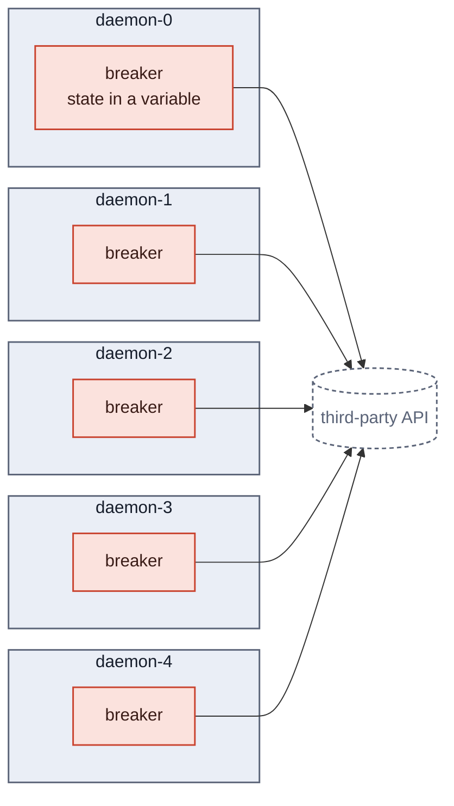
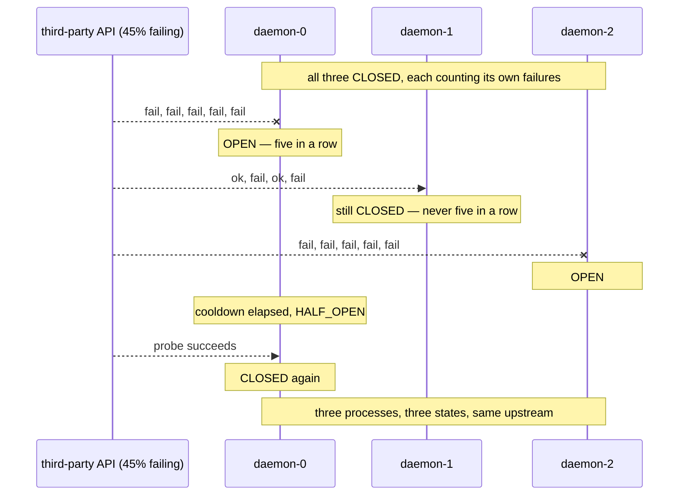
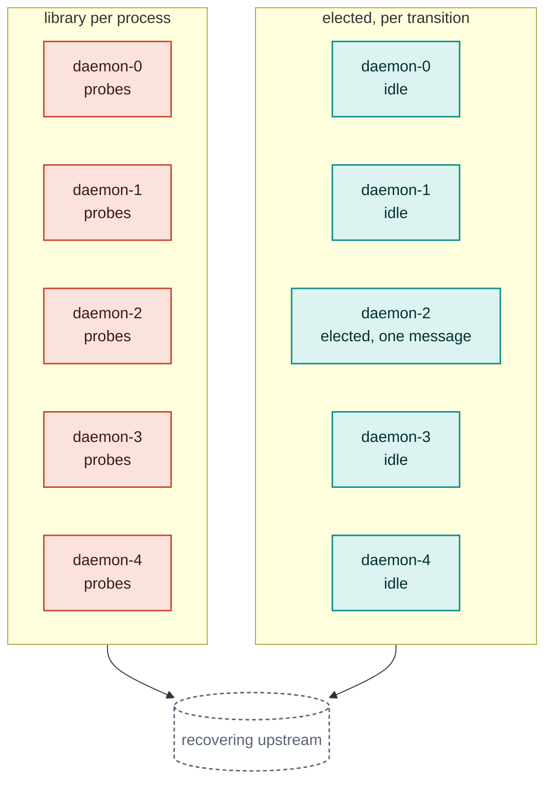
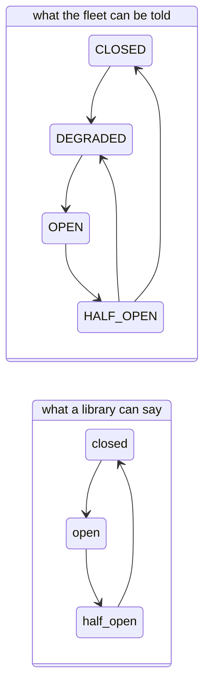

# A breaker library in every service

Resilience4j, Polly, opossum, gobreaker. The first answer, the mature answer,
and the one this repository is implicitly arguing against — so it deserves more
than the paragraph it gets in the README's comparison table.

This document takes it seriously: what it is, what it gets right, and where it
runs out **in this system's shape** — three Envoy replicas, five competing
daemons per API, upstream clusters of three to six endpoints, and a published
event contract other people's code depends on.

## What it is

Each process wraps its outbound calls in a breaker. The breaker counts
failures, opens, short-circuits for a cooldown, half-opens, probes, closes.
State is a variable in that process.

There is no line between the breakers in that diagram, and that is the whole
analysis. Everything below follows from its absence.

## What it gets right

Worth saying plainly, because the rest of this document is critical:

- **The hot path is clean.** No network call, no shared store, no coordination
  round trip between the decision and the request. That is the constraint this
  repository's Redis-based alternative fails, and the library passes it for
  free.
- **It is mature.** These libraries have been in production for a decade. The
  state machine is not the interesting part of anyone's system.
- **It needs no infrastructure.** No proxy, no aggregator, no broker, no lease.
- **It is correct for one caller.** If exactly one process calls the third
  party, a library breaker is the right answer and everything here is overkill.

The failures below are not failures of the libraries. They are failures of
*one breaker per process* as an architecture, at this fleet size.

## Pitfall 1 — five processes, five opinions, measured

The README says ten instances hold ten independent opinions. Here is what that
costs at this system's actual shape, simulated over five minutes: five daemons,
ten calls a second each, breakers configured exactly as this repo's are — open
for 4s, three consecutive successes to close, five consecutive failures to
open.

| upstream failing | calls reaching it | failed calls | fleet unanimous | probes |
|---|---|---|---|---|
| 20% | 14,688 | 2,994 | 89% | 8 |
| **45%** | **4,774** | **2,207** | **17%** | **260** |
| 80% | 567 | 442 | 95% | 368 |
| 100% | 395 | 395 | 100% | 370 |

The row that matters is 45%, because that is the failure rate this repository's
own demo drives — partial degradation, the realistic case, and the one a status
page exists to describe.

**The fleet agrees with itself 17% of the time.** For the other 83%, some
daemons are open, some are closed, some are probing, and which is which changes
every few seconds. There is no answer to "is payments-provider up?" because
five processes hold five different answers and none of them is wrong.

The aggregated design answers the same question once. Under the same 45%, the
quorum settles on `DEGRADED` and publishes **one** transition in five minutes —
[measured in what-if.md](what-if.md#what-if-the-flaky-api-is-behind-a-load-balancer)
— and every daemon acts on that one verdict.

This is not an argument that fewer calls reach the upstream. It is an argument
that the number of calls that do is **decided** rather than emergent.

## Pitfall 2 — the probe storm

Look at the last column again. At 100% failure, five library breakers send
**370 probes in five minutes** at an upstream that is already down — one per
breaker per cooldown, forever, with nothing arranging them.

This repository elects exactly one prober per transition, through the broker's
own `x-single-active-consumer`, and that prober takes exactly one message.

A recovering service is the least able to absorb a burst, and five independent
breakers guarantee it gets one — synchronised by nothing except having failed
at roughly the same time. The same pathology scaled up is why this repository's
redrive is elected to a single daemon rather than run by all five.

## Pitfall 3 — there is no DEGRADED to be in

A library breaker is binary: the circuit is open or closed. It has one input,
the outcome of calls it made itself, and one decision, whether to make more.

The upstream clusters here have three to six endpoints, and Envoy ejects them
individually. Three of six healthy is a real, stable, *useful* state — the fleet
runs at reduced concurrency rather than stopping — and it is the state this
system spends most of an incident in. A library breaker cannot represent it,
because it cannot see hosts at all. It sees a success rate and must round it to
a boolean.

This is the same collapse as
[an upstream behind a load balancer](what-if.md#what-if-the-flaky-api-is-behind-a-load-balancer),
arrived at from the other direction: there, the gradient is lost because Envoy
sees one endpoint; here, because the library sees none. In both cases the
middle state disappears and the system oscillates between the two extremes
instead of settling in the accurate one.

## Pitfall 4 — nothing to publish, in every language you run

The breaker's state is a local variable. Nothing outside the process can read
it, and nothing is emitted when it changes.

To get the event contract this repository publishes — `state_changed` with a
per-API sequence, a previous state, a reason, and enough context for a
subscriber joining mid-incident — you would add, to every service:

- a hook on every breaker transition,
- a publisher, with retries and a delivery guarantee,
- a sequence per API that survives restarts,
- and the same again in every language in the estate.

Then you would have *N* publishers for one API, each with its own sequence, and
a subscriber unable to tell a gap from another instance's opinion. The delivery
contract this repository spends most of its complexity on —
[gapless, non-repeating, per API](decisions/007-message-contracts.md) — is not
merely unimplemented in the library approach. It is **unimplementable** while
the publisher count equals the process count.

## Pitfall 5 — the state dies with the process

A variable does not survive a restart. In an estate that deploys, that means:

- a rolling deploy mid-incident resets every breaker it touches, and the new
  process starts by calling the failing upstream to find out what the old one
  already knew;
- autoscaling adds instances that begin closed, so scaling *up* during an
  incident increases load on the failing dependency;
- a crash-looping service probes on every start.

This repository's equivalent state is checkpointed to Redis under a fencing
token, so a leader can be replaced mid-incident and the sequence continues
rather than restarting — which is the whole subject of
[high-availability.md](high-availability.md).

## Pitfall 6 — two services calling the same API learn separately

Everything above is about five instances of *one* service. An estate has many
services calling the same third party. With a library, each learns
independently, from its own traffic, at its own rate — and a low-traffic
service may never accumulate enough evidence to open at all, so it keeps
calling a dependency the rest of the estate has already given up on.

Nothing in the library approach can share that. It is not a configuration gap;
there is no channel.

## Where it is still the right answer

Being fair to it, because most systems are not this one:

- **One process calls the dependency.** No fleet, no aggregation problem.
- **The dependency is internal and already meshed.** Something else is already
  doing this at the infrastructure layer.
- **Nobody outside the calling service needs to know.** If no status page, no
  queue depth policy and no billing logic depends on the verdict, the event
  contract is cost with no benefit.
- **The call is not the system's main work.** A breaker around a once-a-day
  export does not need a control plane.

The line is not fleet size alone — it is whether the verdict is **an
implementation detail of one process, or a fact the rest of the system acts
on.** This repository exists because the daemon fleet, the status page and the
work queue all act on it.

## Summary

| | Library per process | This repository |
|---|---|---|
| Hot path | clean | clean |
| Infrastructure | none | Envoy, aggregator, broker, Redis |
| Verdict per API | one per process — 17% agreement at 45% failure | one, published |
| Probes at a dead upstream | 370 per 5 min, unarranged | one per transition, elected |
| Partial degradation | not representable | `DEGRADED`, and the fleet acts on it |
| Survives restart | no | checkpointed, fenced |
| Cross-service learning | none | every subscriber, same stream |
| Event contract | build per service, per language | gapless sequence per API |
| Right when | one caller, private verdict | a fleet, and the verdict is a fact |

The numbers in this document come from a five-minute simulation of this
system's fleet shape with this system's timing parameters. The method, and
everything it assumes, is in the commit that added this page.
