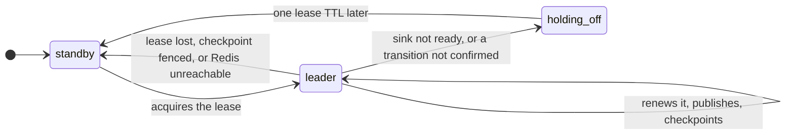

# High availability

Two aggregators run against one Redis. Exactly one publishes; the other only
tries to take the lease. Two instances publishing would hand out conflicting
sequence numbers for the same API, which is the one thing the contract forbids.

## Lease, fencing token, checkpoint

`Coordination.ts` provides two services built on one shared counter:

- **`LeaderElection`**: every tick calls `tryAcquireOrRenew(instanceId, ttl)`
  (5 s). A non-leader does not poll, step or publish. Every genuine handoff,
  never a renewal, issues a **fencing token** `<epoch>:<counter>`.
- **`CheckpointStore`**: after publishing, the leader saves each API's
  `sequence` and `openBackoffMs` under its token, and a newly promoted instance
  resumes from them rather than from `CLOSED` at zero. A save is refused unless
  its token is the current one.

What an instance does each tick, from `Aggregator.ts`:

Stepping down for the broker releases the lease, so the standby takes over on
its next tick, and holds off for a lease TTL so a flapping broker is not a fight
over the lease every tick. An instance whose own sink is not ready does not try
to acquire at all. Every way out of `leader` interrupts its in-flight publishes and
resets the broker connection, so nothing unconfirmed lands after a successor
has moved on.

Two ways fencing went wrong before it was right:

- **Per-key fencing** only stops a stale writer after someone else has written
  that key, so a paused leader could still win every API the new leader had not
  published for yet. The check is against the one lease counter.
- **A bare counter** restarts at 1 when Redis loses its state, and a surviving
  stale leader's 5 then outranks the live one's 1. The epoch is minted by
  whichever coordinator finds nothing to inherit; tokens from different epochs
  are incomparable, so the stale one is fenced.

## The fence is on the checkpoint, so the events carry the lease

The leader publishes and then checkpoints, so a checkpoint never runs ahead of
what the broker confirmed. That means a leader paused past its lease can still
publish once when it resumes, before its save is refused. A successor that
re-derives an event its predecessor published but never checkpointed also reuses
that sequence, possibly with another state.

So every event carries `data.lease`, and `supersedes` (in
`packages/domain/src/Model.ts`) ranks by it before the sequence:

- a newer lease wins whatever its sequence; an older one loses whatever its
  sequence;
- within one lease, a transition must move the sequence forward and a snapshot
  must not move it back;
- a new epoch is accepted, since a coordinator that lost its state restarts
  sequences. A leader still holding an old-epoch token is fenced at its next
  checkpoint.

The daemons apply this and count what they ignore in
`egress_daemon_control_stale_total`.

## Failover, measured

| How the leader went away | Standby leads after |
|---|---|
| `docker kill` (a crash) | 4,952 ms — the full lease TTL |
| `docker compose stop` (a deploy: the lease is released on shutdown) | 234 ms |

A killed leader mid-incident at `sequence=127`: the standby took over, resumed
the API from its checkpoint as `OPEN`, and published 128 onward with nothing
published twice.

**A burst of transitions**: a tick carries at most one transition per API. The
leader delivers and checkpoints the first alone, which proves the lease still
holds, then awaits the rest together (32 at a time) and starts no more once one
has failed. A shared dependency failing across many APIs costs the tick two
confirms' latency, not one per API, inside the loop that renews the lease, and
a leader deposed mid-tick still publishes only one stale transition.

**One-sided partition**: one aggregator cannot reach Redis, the other can. Every
coordination call has a 1 s timeout under the 5 s lease, so the cut-off instance
stands down each tick (`is_leader` 0) instead of hanging, and the healthy one
holds the lease throughout.

**Liveness is not leadership.** `/livez` is the tick loop (three tick intervals
or 5 s, whichever is longer). `/readyz` waits for one completed pass and is true on the standby too:
marking a standby unready would take the pair out of rotation during a rolling
deploy.

## What each loss costs

| What is lost | What stops | What carries on | Says so |
|---|---|---|---|
| The leader | nothing, after the lease TTL (≤ 5 s) | the standby publishes from the checkpoint | `NoLeaderElected` if both |
| Both aggregators, or Redis | every event; the leader stands down without Redis | Envoy's local ejection; after 60 s each daemon falls back to a quarter of its fleet ([ADR 019](decisions/019-a-daemon-that-does-not-know.md)) | `NoLeaderElected`, `ControlLoopStalled`, `DaemonsOnFallback` |
| RabbitMQ | work and control both; the leader steps down (its sink is not ready) | Envoy; daemons retry the connection for up to about 8 minutes, then restart | `NoLeaderElected` (the leader steps down), `egress_aggregator_control_plane_ready` at 0 |
| One Envoy replica | its share of traffic and its vote | the quorum over the replicas still reporting ([ADR 009](decisions/009-what-the-quorum-is-a-quorum-of.md)) | `FleetShrunk` |
| A daemon | its share of the work; its unacked deliveries return to the queue | the rest, by position; SAC promotes another floor or elected daemon | `FloorUnheld` only if no floor is re-elected within 2 minutes |
| A webhook subscriber | its deliveries | the outbox, bounded at 500 per API | the outbox metrics |

The daemons' reconnect budget (`RECOVERY_BUDGET_MS`) is shorter than their
control queues' `x-expires`, so a daemon that recovers finds its queue; a test
checks the two.

## The outbox

Inside the aggregator the sequence is gapless; the webhook's last hop was not. A
delivery that fails its retries is appended to a per-API outbox in Redis
(`Outbox.ts`), and the leader drains it:

- **only the leader drains**, or every event would be delivered twice;
- **nothing overtakes it**: deliveries for one API run one after another, and
  while the outbox holds anything for that API a new event is appended behind
  it rather than posted. Posting it directly would deliver 8 before a stuck 7;
- **in order, stopping at the first failure**, since skipping a stuck event
  manufactures a gap;
- **committed only after delivery**, by position: `peek` returns where its
  first entry sits, and the drain commits the position it reached. A count
  would trim undelivered entries if the bound dropped the oldest mid-drain;
- **bounded at 500 per API, dropping the oldest**, so a subscriber that stays
  down sees a gap it can detect rather than a state it wrongly trusts.

Redis is the only backend, even for one instance: a lease held in one
process's memory excludes nothing, so a second instance would lead beside it.
The unit tests drive an in-memory double of the same interfaces
(`test/support/InMemory.ts`); `pnpm run test:redis` runs the real ones against
a real Redis.
