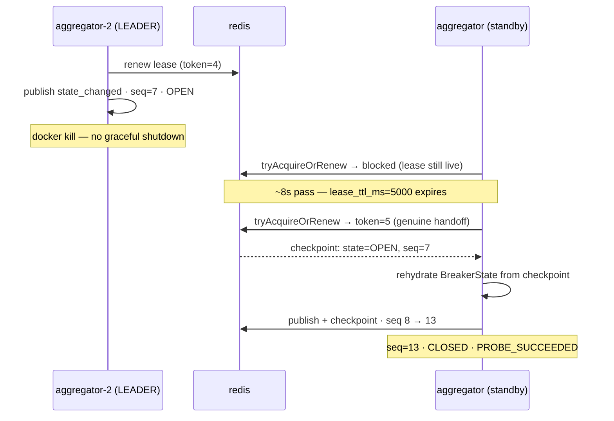

# High availability

Two aggregators, one shared Redis, and the rules that make exactly one of them
allowed to publish. Everything here is deployed in `docker compose up`, not
only tested in-process.

## High availability

One aggregator publishing means one process is a single point of failure.
Two aggregators publishing independently is worse: nothing stops them from
handing out conflicting sequence numbers for the same API, which is exactly
the contract this whole design exists to protect. `Coordination.ts` closes
that gap with two primitives, both required together:

- **`LeaderElection`** — exactly one instance may publish at a time. Each
  tick calls `tryAcquireOrRenew(instanceId, ttl)`; a non-leader does not
  poll, does not step the state machine, and does not publish — it only
  keeps trying to acquire. Every genuine handoff (not a renewal) produces a
  **fencing token** that strictly increases.
- **`CheckpointStore`** — whichever instance takes over next must resume
  `sequence` and `openBackoffMs` from where the last one left off, not from
  `Breaker.initial`. A newly-leading instance rehydrates each API it hasn't
  seen yet from its last checkpoint before its first tick runs.

The subtlety worth calling out, because it is easy to get wrong: fencing has
to be checked against the *same shared counter* `LeaderElection` issues
from, not a per-API "last write wins" value. An earlier version of this
fenced each API's checkpoint independently — which is wrong, because it only
stops a stale writer *after* someone else has already written that specific
key. A stale leader mid-GC-pause can still win on any API the new leader
hasn't published for yet, which is precisely the split-brain case fencing
tokens exist to prevent. Checking against the shared lease token instead
closes the window for every API at once, the instant a handoff happens —
`Coordination.test.ts`'s "a stale token is rejected even for an API no one
has checkpointed yet" test is that exact bug, pinned down.

There is a second way to lose the same guarantee, and it needs no race
either. The token was a bare counter from `INCR`, so a coordinator that lost
its own state — a restart with no persistence, a failover to an empty
replica — started issuing from 1 again, and `attempted < current` comparing a
surviving leader's 5 against a fresh 1 is false. The stale writer wins.
Tokens are therefore `<epoch>:<counter>`: the epoch is minted once, by
whichever coordinator finds nothing to inherit, and tokens are ordered only
*within* an epoch. Across epochs they are incomparable by design, which is
the stronger and simpler property — a token issued before the wipe is not a
low number, it is an unrecognisable one.
`test/integration/RedisCoordination.test.ts` deletes the lease keys mid-test
and asserts that the leader still holding a pre-wipe token can no longer
write, while the instance that actually holds the lease can.

**The fence is on the checkpoint, not on the broker.** A leader paused past
its lease that resumes still publishes the event it was about to, before its
checkpoint save is refused and it steps down. A successor that re-derives an
event its predecessor published but never checkpointed reuses that sequence,
possibly with a different state. So every event carries the publishing
leader's lease (`data.lease`, the same epoch and counter), and a reader ranks
by it before the sequence (`supersedes` in `packages/domain/src/Model.ts`): a
newer lease wins whatever its sequence, an older one loses whatever its
sequence, and a new epoch is accepted, since a coordinator that lost its state
restarts sequences and would otherwise be ignored for good. The daemons apply
this and count what they ignore in `egress_daemon_control_stale_total`. Until
2026-09-24 they applied every event and only counted duplicates, so the paused
leader's one event was obeyed until the next snapshot, up to 15 s later.

Two things make that survivable as a *deployment* and not only as a design.

**A planned stop hands the lease back.** `LeaderElection.release` existed from
the first version of this file and nothing ever called it, so leadership only
ever moved when a lease expired — correct for a crash, and a waste on every
deploy. The tick loop now surrenders the lease as it stops. Measured on the
running stack, leader down to standby publishing:

| how the leader went away | standby leads after |
| --- | --- |
| `docker kill` (crash — nobody said goodbye) | 4952 ms (the full `leaseTtlMs`) |
| `docker compose stop` (SIGTERM — a deploy) | **234 ms** |

The crash number is unchanged, and should be: waiting out the lease is the
only safe answer when the previous holder never spoke. Releasing is
best-effort by construction — it runs while the process is going away, so an
unreachable coordinator just means the lease expires the old way.

**`/livez` and `/readyz` are different questions.** Liveness is "is the
control loop still running", answered from the timestamp of the last tick
against three tick intervals (or five seconds, whichever is longer) — the
failure it catches is the one that actually happened here, a loop that died
while the process kept serving HTTP 200 with every gauge frozen. Readiness is
"can this instance serve requests", and it is deliberately **not** leadership:
a standby serves the same read-only API and is one lease away from leading, so
marking it unready would take it out of rotation for doing its job — and
during a rolling deploy it would take out the pair, since the leader is
stopping and the standby would be "not ready". Readiness waits for one
completed pass, so `/api/state` answers with the fleet rather than an empty
registry.

```
$ curl -s aggregator-2:8088/readyz
{"started":true,"isLeader":true,"lastTickAgoMs":73,"staleAfterMs":5000,"live":true,"instanceId":"aggregator-2"}
$ curl -s aggregator:8088/readyz     # the standby: ready, and not the leader
{"started":true,"isLeader":false,"lastTickAgoMs":205,"staleAfterMs":5000,"live":true,"instanceId":"aggregator-1"}
```

`main.ts` supports both backends: `InMemoryCoordinationLayer` by default
(one instance that always wins its own lease — not a special case, just
what solo mode produces), or `--ha=redis --redis=<url>` for
`RedisCoordinationLayer`, written against a deliberately minimal `RedisLike`
port (one `eval` method) so that any real client — `ioredis`, `node-redis`
— plugs in with a one-line adapter, rather than pinning a dependency the
default path does not need.

Both are run for real, not just reasoned about, at increasing levels of
integration:

1. `Coordination.test.ts` runs two independent "instances" against one
   shared in-memory coordinator in a single process — a real failover
   without a second machine, plus the harder case: an instance that led,
   *lost* the lease, and is promoted again with its own breakers still warm.
   That one must resume from the checkpoint rather than from what it
   remembers, and it is kept alive across the whole demotion precisely so a
   fresh build cannot hide the bug.
2. `test/integration/RedisCoordination.test.ts` (`pnpm run test:redis`,
   opt-in — needs Docker) spins up a real `redis:8-alpine` container via
   Testcontainers and proves the same properties, including the exact
   fencing bug above, by Redis's own Lua execution rather than by re-reading
   the script.
3. `docker compose up` runs it as an actual deployment — two real
   `aggregator` containers against one real `redis` container, with a hard
   `docker kill` of the leader used to confirm the failover live. See
   [Two real aggregator instances, one shared Redis](#two-real-aggregator-instances-one-shared-redis).

## Two real aggregator instances, one shared Redis

`docker compose up` runs `aggregator` and `aggregator-2` — two separate
containers, both `--ha=redis` against the one `redis` service — not one.
This is the [High availability](#high-availability) design actually
deployed, not just tested in-process: exactly one of them holds
`egress_aggregator_is_leader=1` at a time, and it was verified by force —
inject a real failure, let the current leader publish into `OPEN`, then
`docker kill` its container outright:



The standby took over within `lease_ttl_ms`, rehydrated `payments-provider`
from its last Redis checkpoint (`OPEN`, not `CLOSED` — the state survived,
not just the fact that *something* is now leading), and kept publishing
from `sequence=7` onward, through the rest of the probe cycle to
`PROBE_SUCCEEDED` / `CLOSED` at `sequence=13` — no reset, no gap, no
duplicate, across a hard kill of a different OS process mid-incident. That
is the property `Coordination.test.ts` and `RedisCoordination.test.ts` prove
in a single test process; this is the same property, watched happen between
two real containers.

Prometheus scrapes both instances (`infra/monitoring/prometheus.yml`) with
Prometheus's own `instance` label distinguishing them, so
`egress_aggregator_is_leader` in Grafana shows exactly one of the two lines
at 1 and the other at 0, flipping on a real failover.

## Delivery that outlives the subscriber

Everything above is about the aggregator surviving. This is about the
*guarantee* surviving, which is a different question and had a different
answer: inside the process the per-API sequence is gapless and strictly
ordered, and at the last hop it was not. A webhook that failed its three
retries went into a 200-entry in-memory list — a diagnostic, not a ledger —
which dies with the process. A subscriber down for a minute lost that minute,
and nothing in the system disagreed.

[`Outbox.ts`](../packages/aggregator/src/Outbox.ts) is the durable half, and it
is deliberately the same shape as `CheckpointStore`: one `RedisLike` port, one
`eval`, scripts that read and write in one round trip, and an in-memory
implementation that is what solo mode actually runs rather than a mock. Four
rules, each of which is a way to get this wrong:

- **The leader drains it, and only the leader.** The outbox is shared state;
  two instances replaying it would deliver every event twice, which is
  precisely the break the sequence contract exists to make visible.
- **In order, stopping at the first failure.** A drain that skipped a stuck
  event to deliver the ones behind it would manufacture the gap this system
  exists to prevent — and it would look like progress.
- **Committed only after delivery.** A crash mid-pass replays rather than
  loses; the `idempotency-key` header was already there for exactly this.
- **Bounded, dropping the oldest.** A subscriber that stays down does not get
  to consume the aggregator's memory on its way out. Dropping the oldest
  leaves the subscriber with a gap it can *see* — its own integrity check
  counts it — rather than a state it wrongly trusts.

Draining is forked, not awaited, and the sink refuses to run two passes at
once: a subscriber that hangs rather than refusing must cost the control loop
nothing, and a 250ms tick against a 2s timeout would otherwise stack passes
faster than they finish.

`test/integration/Outbox.test.ts` drives it against a real Redis and a real
HTTP subscriber that refuses, then recovers, then falls over again mid-drain:
five events kept while it was down, five replayed in order when it came back,
each committed exactly once.

## The partition nobody had tried

Every previous coordinator test stopped Redis for *everyone*, which is the
easy case: nobody leads, and the whole fleet stands down together. The
asymmetric one — this instance cannot reach Redis, the other one can — is
where a lease-based design actually goes wrong, and it had never been run.
`extra_hosts: ["redis:127.0.0.1"]` on one instance produces it exactly: one
process's coordinator is a black hole, everything else is untouched.

What it found is in [What the build surfaced](../history/findings.md): the
tick did not stand down, it hung. After the fix, the same partition gives 4
ticks/s sustained on the partitioned instance, one coordination error per tick,
`is_leader` reading 0, and the healthy instance holding the lease throughout —
no split brain, and no silence either.
