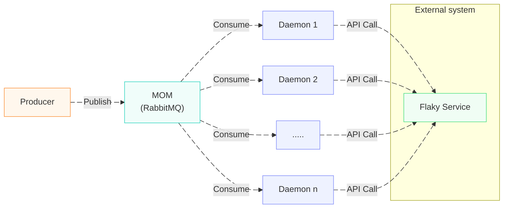
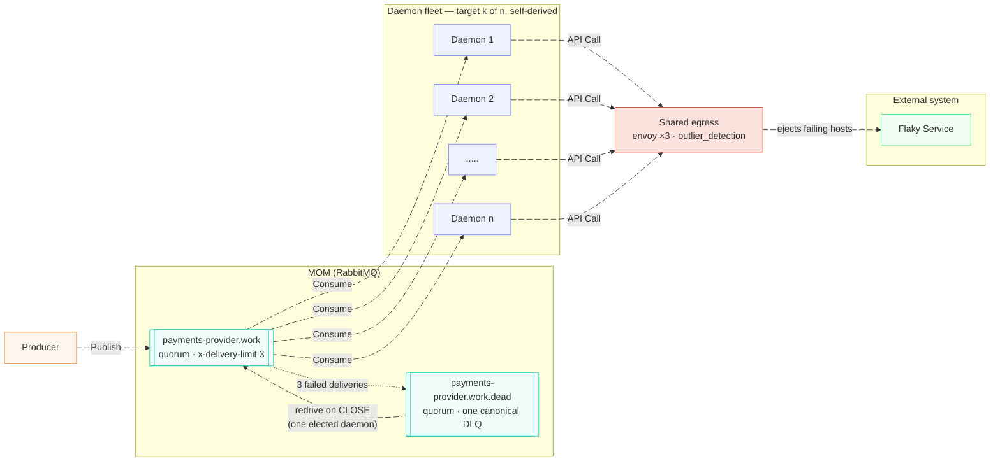
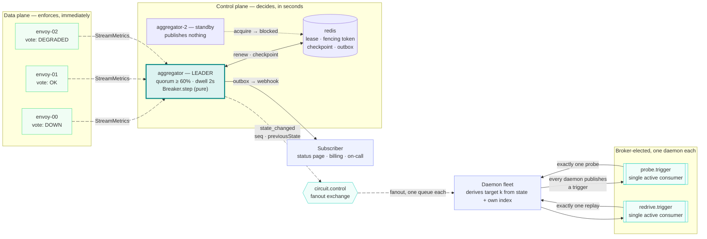

# The journey: from five daemons and a flaky service to a control plane

This is the design history of this repo, told as the sequence of questions it
was forced to answer. It starts from the picture everyone draws first, and
ends at what `docker compose up` runs today.

Each step has the same three parts, because that is how each one actually
happened: **what the running system did that the picture did not predict**,
**which options were genuinely available**, and **which one was taken and what
it cost**. Where a number appears, it was measured on this stack and the
command that produced it is in the [README](../README.md).

---

## 0. Where it starts

This picture, and one constraint — **the flaky service is outside your
control** — is the whole of what was given. Every option that constraint
leaves open, and where each one stops, is reviewed in
[the approaches](approaches.md); this document is the path actually taken
through them.

Nothing here is wrong. This is a correct picture of a work fleet, and it is
the architecture you should draw if the external system is healthy. Every
arrow is real and still exists in the final design.

What it does not say is what happens to any of those arrows when the box on
the right stops answering — and that turns out to be nine separate decisions,
not one.

## 1. What the picture hides

Start the flaky service failing and watch the same diagram run.

**Nothing stops.** The queue has depth, the daemons have capacity, and neither
of them knows anything about the third party. `n` daemons keep pulling and
keep calling. The failure does not reduce load on the failing service; it
*increases* it, because failed work is retried and a retry is another call.
This is the thundering herd, and it arrives without anyone deciding on it —
it is the default behaviour of the picture above.

**The queue becomes a load-holding device pointed at something that is
already down.** That is the property a queue is for, and here it works
against you: the backlog that builds during the outage is the exact shape of
the burst that will be delivered the instant anything recovers.

**Every daemon learns separately and disagrees.** Daemon 1 has seen four
timeouts, daemon 4 has seen none because its last three messages happened to
hit the one healthy host. Neither has a view of the whole, and there is
nothing in the diagram that could give them one.

**Nobody outside the fleet is told.** The status page, the billing pipeline
and whoever is on call learn about the outage from its consequences.

Those are four different problems and they have four different right answers.
The rest of this document is those answers, in the order the build was forced
to confront them.

---

## 2. Where "the service is down" gets decided

The same question, cut by *what you would have to build* rather than by where
detection happens, is in the README's
[Approaches, and where each one runs out](../README.md#approaches-and-where-each-one-runs-out)
— including the two options that do not arise here, publishing straight from
the proxy and a batteries-included gateway.

**The options.**

*A breaker library in every daemon* — Resilience4j, Polly, opossum,
gobreaker. Mature, boring, and the state lives in a variable in one process.
It fails at the granularity: `n` daemons hold `n` independent opinions about
one third party, and a second service calling the same API learns nothing from
any of them. There is also nothing to publish from — you would add an event
path to every daemon, in every language you run.

*Shared breaker state in Redis* so the daemons agree before anyone acts. The
tempting fix, and it puts a network round trip and a shared failure domain in
the hot path of the component whose whole job is surviving other people's
failures.

*At the shared egress proxy.* Every daemon already reaches the third party
through one address. Envoy's `outlier_detection` ejects failing hosts per
replica, immediately, with no coordination and nothing in the request path but
the proxy that was already there.

**What we did.** The proxy detects and enforces. It does not publish.

The insight that reorganised everything else: *protecting the request path*
and *telling the rest of the system* are different problems with different
correct answers, and almost every obvious design conflates them. Enforcement
must be local, immediate and uncoordinated. Notification must be fleet-wide,
coalesced and sequenced. One component cannot be good at both.

**What it cost.** A third component — the aggregator — that watches the
proxies and owns the fleet-wide verdict. And the constraint that the egress
path must be a proxy the daemons share, which is a deployment decision, not a
library choice. HTTPS egress needs TLS interception before any of this
works at L7 at all; `CONNECT` gives you L4 and no `consecutive_5xx`.

## 3. Whose "down" counts, when there are three of them

**The problem, discovered by running it.** Three Envoy replicas sample the
upstream independently, which is correct for protection and useless as a
signal: at any instant one votes DOWN, one OK and one DEGRADED. Publishing on
any one of them makes a subscriber see an API flap several times for a single
incident, and de-duplicate a distributed system's internal disagreement on
its own.

**The options.** First replica to say so (flapping). Unanimity (never fires
during a partial outage, which is most outages). Average the replicas'
numbers (see below). Quorum with a dwell.

**What we did.** Count votes against a quorum — 60% impaired — and require
that count to *hold* for `dwellMs` before publishing anything. Disagreement
never reaches a subscriber.

**What it cost, and the bug that came with it.** Averaging looked equivalent
and is not. With four of five replicas seeing zero healthy hosts, the mean
rounds to 1, so "all endpoints gone" silently became false and the reason code
came out wrong. The check is now `votes.DOWN === live.length` — unanimous,
not merely quorate — and the general lesson stuck: a fleet's verdict is a
count of opinions, never an average of measurements.

## 4. How the fleet finds out

**The options.** Have each daemon poll a status endpoint (now the control
plane is in the daemon's hot path, and a daemon that cannot reach it is
blind). Push configuration to the daemons (that is xDS, and it makes the
aggregator authoritative — see below). Or publish onto the message broker the
daemons are *already connected to*.

**What we did.** A `circuit.control` fanout exchange on the same RabbitMQ the
work flows through. Each daemon binds its own queue. Events carry a monotone
`sequence` per API and a `previousState`, and the aggregator republishes a
snapshot every `snapshotMs` so a daemon that starts mid-incident is not blind.

The daemon then decides *for itself* what to do, from the agreed state and its
own index. There is no per-daemon command, no scheduler, and no coordination
between daemons at all — five processes derive the same target from the same
two inputs. That is what makes the fleet arbitrarily resizable and what makes
[`DaemonPolicy`](../packages/rmq-consumer/src/DaemonPolicy.ts) a pure function
of `(prior, circuitState, fleetSize, now)`.

**The fork this left open, and how it closed.** Must the aggregator's `OPEN`
be *enforced* fleet-wide, or is it observational? Answered in
[decisions/002](decisions/002-enforcement-authority.md): observational. The
aggregator publishes and never pushes config, because enforcement is already
local and immediate in Envoy, and making the aggregator authoritative would
put it in-band for every request — a control plane whose failure takes the
data plane with it. The events are advice that a well-behaved consumer acts
on. That is a weaker guarantee, deliberately.

**What it cost.** The daemons' compliance is voluntary. A daemon with a bug,
or one that never receives the event, keeps calling the third party. The
mitigation is that the fleet is observable — `egress_daemon_*` metrics per
daemon — rather than that it is compelled.

## 5. Who is allowed to publish

**The problem.** One aggregator is a single point of failure. Two aggregators
publishing independently is *worse* than one: they hand out conflicting
sequence numbers for the same API, which breaks the one contract this design
exists to provide.

**The options.** Active/active with per-API partitioning (now you need a
partition assigner, which is the same problem one level down). Active/passive
with a lease. Consensus (an entire Raft implementation for a value that
changes every few seconds).

**What we did.** A Redis lease with a fencing token.
[`Coordination.ts`](../packages/aggregator/src/Coordination.ts): exactly one
instance publishes; a non-leader polls nothing, steps nothing and publishes
nothing. Every genuine handoff mints a strictly increasing token, and a
`CheckpointStore` lets the next leader resume `sequence` from where the last
one stopped rather than from zero.

**Three things this got wrong first, all found by reading or running rather
than by designing.**

*Fencing per key is not fencing.* The first version rejected a stale write
only if a newer write had already landed for that same API — so a stale
leader mid-GC-pause wins by default on every API the new leader has not
gotten to yet. That is precisely the window fencing tokens exist to close.
Checking against the one shared lease counter closes it for every API at
once, the instant a handoff happens.

*A bare counter is not a token across a wipe.* `INCR` from a Redis that lost
its state starts at 1 again, and `attempted < current` comparing a surviving
leader's 5 against a fresh 1 is false — the stale writer wins. Tokens are
`"<epoch>:<counter>"` now: ordered within an epoch, deliberately
*incomparable* across one. A token issued before the wipe is not a low number,
it is an unrecognisable one.

*A lease nobody hands back makes every deploy wait for a timeout.* The
`release` capability existed and was never called. `docker kill` costs the
full TTL — **4952 ms** — and there is no avoiding that, because a killed
process says nothing. But a planned stop had been paying it too. Releasing on
shutdown makes a `docker compose stop` hand over in **234 ms**. The interesting
part is not the twenty-fold difference; it is that a deploy is the common case
and it had been priced as a crash.

## 6. Who probes, when the answer must be exactly one

**The problem.** `HALF_OPEN` means *one* call to the third party to see if it
is back. Not one per daemon. The state whose entire contract is "exactly one"
is the state a five-daemon fleet is worst at.

**The options.** Let every daemon probe (defeats the point). Elect by lowest
index (works until daemon 0 is the one that died, which is the case that
matters). Take a distributed lock in Redis (a second failure domain, for a
decision the broker is already capable of making). Let the broker elect.

**What we did.** RabbitMQ's `x-single-active-consumer` on a **dedicated
trigger queue**, separate from the work queue. Every daemon publishes a probe
trigger on entering `HALF_OPEN` — so one still arrives when some daemons are
down — SAC delivers all of them to the one consumer it elected, and that
daemon drops the repeats by sequence. Several triggers in, one probe out.

The trigger queue is separate from the work queue on purpose. SAC on the work
queue would mean one daemon does *all* the work in every state, which is a
different and much worse system.

**What it cost.** The election is the broker's, so its speed is the broker's:
killing the elected prober mid-incident promotes another in **7099 ms**, and
the circuit still reaches `CLOSED` **16719 ms** after the kill. Slower than a
lock you control, and it needs no second failure domain to be up.

## 7. What happens to the work that failed

**The problem.** The picture at the top has no answer for a message whose API
call failed. In practice there are only bad answers available by default:
ack and drop it (silent loss), or nack-requeue it (a poison loop that
hammers the failing service hardest at the worst moment).

**The options.** Retry in the daemon with backoff (amplification, and the
retry state dies with the daemon). Drop and reconcile later (someone else's
problem, usually a human's). Dead-letter and replay.

**What we did.** Failed work is retried a bounded number of times and then
parked on one canonical dead-letter queue; when the circuit closes again, one
daemon replays it.

**The discovery that changed the design.** The budget could not live in the
daemon. The AMQP 1.0 client in use at the time reported `deliveryCount: 0` on
every delivery — so the daemon could not know how many times a message had been
tried — and an in-process counter is lost the moment the message moves to
another daemon,
which is exactly what happens during the outage. This had been written down
as "there is no way to say *this attempt failed, try again*", and the
write-up was wrong. The budget belongs to the *queue*: a quorum queue with
`x-delivery-limit` makes RabbitMQ count redeliveries and dead-letter the
message itself with `reason "delivery_limit"`. Three attempts, enforced by
the broker, surviving any daemon's death.

Three rather than more, because RabbitMQ redelivers immediately with no
backoff — every extra attempt is more load on a third party that is already
failing. What ends the amplification is not the retry budget at all; it is
the circuit opening and the daemons stopping. And the budget **resets on
redrive**, because a replayed message is a new message: three attempts per
outage, not three ever.

**The replay is its own election.** Five daemons each replaying the same
backlog would turn a recovery into a fivefold burst at a service that just
came back — so redrive runs on a *second* SAC queue, the same mechanism as
the prober and separate from it. A pass stops on whichever comes first: the
per-pass cap, the queue running dry, the circuit leaving `CLOSED`, or a hard
deadline. Observed on the running stack: a 2,070-message backlog drained in
one pass, three seconds after recovery.

**What it cost.** A whole second control path (two elections, a dead-letter
queue, an annotated redrive that must replay work and not poison control
messages — `x-first-death-queue` makes that possible). And a policy question
that cannot be answered by the transport: `REDRIVE_ON_CLOSE` is off in code
and on in compose, because whether a two-minute-old payment attempt is still
worth making is a property of the workload.

## 8. How fast the work comes back

**The problem, and it is the subtle one.** Cutting the fleet to zero on
`OPEN` is easy. Restoring it is where the thundering herd actually lives: the
instant `CLOSED` arrives, five daemons resume at full rate against a service
that has been up for one second, with a backlog waiting for them.

**The options.** Snap back to the full fleet (the herd, precisely). Ramp per
daemon on observed successes (more principled-sounding, and wrong here — a
success count is *per daemon*, so the busy ones ramp while the idle ones hold
and the fleet stops agreeing about its own size). Ramp on a shared clock.

**What we did.** `RAMP_SCHEDULE = [1, 4, 16]` then the full fleet, with each
rung held for `RAMP_DWELL_MS` before the next is allowed. The first rung is
immediate — a circuit that just closed should do work now, at one daemon —
and every rung after it is earned by holding the current one without
relapsing.

Time specifically, because every daemon has to derive the *same* target from
the same inputs with no coordination, and a clock is the only input all of
them share.

**The bug this replaced.** The ramp used to advance one rung per *control
message*, which made its pace an accident of the aggregator's `snapshotMs`.
Measured on the running stack, it produced `1 → 4 → 5` in about fifteen
seconds: a ramp in shape and barely one in duration. A recovering third party
was getting more load because a snapshot happened to arrive, not because the
current rung was working.

## 9. The hop past the aggregator

**The problem.** Everything above protects the state *inside* the control
plane. The subscriber is outside it, and the guarantee stopped one hop short:
an event that failed delivery while the subscriber was down was buffered in
memory, and the leader's own restart lost it.

**What we did.** A durable outbox in Redis
([`Outbox.ts`](../packages/aggregator/src/Outbox.ts)), bounded per API, drained
by the leader only. Bounded rather than unbounded because a subscriber that
has been down for a day is not a subscriber whose backlog you should still be
holding.

**What it cost.** Redis now holds event *bodies*, which is a data-at-rest
question it did not have before — noted in [security.md](security.md) §7.

---

## 10. What only appeared once it ran

None of these is in the design. All of them changed it. Each row is the short
form; [findings.md](findings.md) is the full write-up of every one, with the
measurements.

| Discovered | What it was |
| --- | --- |
| **The client creates links unsafely, silently** | Concurrent link creation in the pinned AMQP client corrupts state with no error. Fixed in the client wrapper, not at the call sites — see [decisions/001](decisions/001-amqp-client.md). |
| **Closing a consumer with deliveries in flight kills the connection** | Which is what "stop consuming" does on every `OPEN`. The daemon's connection lifetimes are built around this. |
| **`transfer after detach`** | Thrown synchronously from inside a socket callback, unreachable from application code, because the AMQP 1.0 client kept its rhea container private. It needed a narrowly filtered `uncaughtException` guard until [the move to amqplib](decisions/004-downgrade-to-amqp-0-9-1.md) removed the throw and the guard together. |
| **Queues were not durable, and nobody noticed** | A broker restart silently emptied the dead-letter queue, because the first daemon back redeclared it identically. `durable` and `x-queue-type` are one decision, not two. |
| **The daemon fleet was invisible** | A daemon went deaf to the control plane while looking perfectly healthy. That was an *observability* bug before it was anything else; the fleet has its own `/metrics` now. |
| **A control loop can die while the process serves 200s** | Found by a counter that stopped moving. `/livez` now fails on tick staleness — liveness is the loop, not the socket. |
| **A one-sided partition hangs rather than stands down** | "Stands down and retries" was documented and false: ioredis queued the commands and the tick blocked — two ticks in twenty-five seconds. A coordination timeout plus `enableOfflineQueue: false` turned a hang into an error, which is a thing a system can react to. |
| **`is_leader` went absent, not zero** | A partitioned instance stopped reporting the gauge instead of reporting 0. Absent and false are different, and alerts have to say which they mean. |
| **The most severe alert fired falsely** | `SplitBrain`, with exactly one leader — Prometheus was scraping the same process through two targets. An alert that cries wolf about split brain is worse than no alert. |
| **A chaos harness that lied** | It summed counters across a restart and reported duplicates falling 4 → 0 and −535 events delivered. Absolute counters across a process death are not a measurement. |
| **A gRPC receiver needs no build step** | The belief that it did is why ingestion was written as polling first. `@grpc/proto-loader` reads `.proto` at runtime and protobuf addresses fields by number, so deliberately *partial* schemas decode Envoy's real messages. Push halves the ingestion lag: 30/139/113 ms against 165/194/196 ms. |
| **Ejection backoff outlives the outage** | `base_ejection_time × ejection_count` keeps a recovered upstream ejected. The fix is an active health check, not shorter timers — six hosts carrying ~25s of accumulated backoff came back **3.1s** after recovery. |

The pattern worth naming: **four of these were documented premises that turned
out to be false**, and every one of them was overturned by running the system
rather than by thinking about it harder. The retry budget was the most
expensive — a whole capability was written off as impossible in a document,
and it was one queue argument away.

---

## 11. Where it landed

The work path, with everything the first diagram left out:

The daemons still consume and still call. What changed is that `k` is now a
number the fleet agrees on, and there is somewhere for failed work to go.

The control loop that sets `k`:

Read left to right, that is the whole answer: **three replicas enforce and
disagree, one elected process resolves the disagreement into a sequenced
event, the broker fans it out, and each daemon decides for itself what to do
with it.**

---

## 12. What it cost

Nine decisions, five processes where there was one, three failure domains
(broker, Redis, proxy) where there were two, and two elections that exist only
to make "exactly one" true.

Against that, the properties the first diagram cannot have:

- One verdict per API, not one per proxy replica, and never during disagreement.
- A sequence a subscriber can check — measured across kills: **0 gaps, 0
  duplicates**, and 6,628 → 6,628 messages conserved through a full outage.
- Failed work that is parked rather than lost or looped, with the budget
  enforced by the broker and reset per outage.
- A recovery that ramps `1 → 4 → 16 → n` on a shared clock instead of
  arriving all at once.
- Failover in **234 ms** on a deploy, **4952 ms** on a crash, with the
  sequence resuming rather than restarting.

**What it is not.** The control plane is observational — a daemon that ignores
the event still calls the third party. One broker is a quorum of one, so the
durability is real and the node-loss tolerance is not. There is no
authentication anywhere ([security.md](security.md)). And the console is the
first thing that breaks at scale, at ~2.75 MB/s per connected viewer with 1000
APIs, while the control loop itself gives up 7% of its cadence over a 333×
increase in APIs.

The full inventory of what is prototype and what is production-shaped is in
the README's [What is a prototype, not production](../README.md#what-is-a-prototype-not-production).
