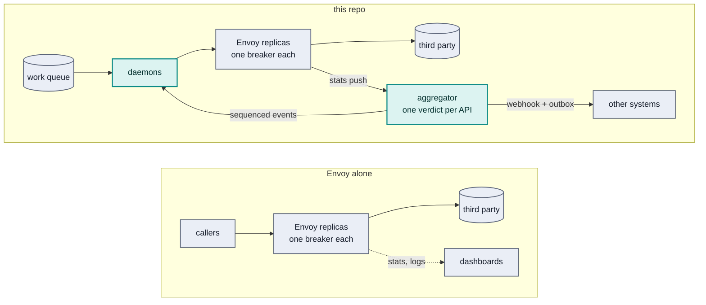

# Off the shelf

What to try before building any of articles 2–5: products that already make an
opinionated choice about egress circuit breaking. Checked against their docs on
2026-09-30. Each is judged on the README's three constraints: **one verdict per
API** (not per replica), **off the request path**, and **an event contract**
other systems can act on.

The short version: each product below decides per replica, node, route or
process, or does not say. None publishes a fleet-wide, per-API verdict as a
sequenced event stream. If enforcement is all you need, pick one of these and
stop.

## Service meshes, used for egress

The breaker is the proxy's own endpoint ejection. Istio applies it to external
hosts declared to the mesh; Linkerd documents it for in-mesh services only.

| | Licence | Where the breaker lives | Verdict | Events |
|---|---|---|---|---|
| [Istio](https://istio.io/latest/docs/ambient/usage/egress-gateway/) | OSS; commercial from Solo.io and others | `DestinationRule` outlier detection and connection pools, on the sidecar or the ambient waypoint that acts as egress gateway | per proxy | metrics |
| [Linkerd](https://linkerd.io/2-edge/reference/circuit-breaking/) | OSS; enterprise builds from Buoyant | failure accrual per endpoint, set by annotations on a meshed `Service`; egress (`EgressNetwork`, since 2.17) gets routing and policy, and the docs describe no breaker for it | per proxy | metrics |

AWS App Mesh reached end of support on 2026-09-30. AWS points to ECS Service
Connect and VPC Lattice, which are for traffic between your own services, not
to third parties.

Choose one when the mesh is already there: egress policy then costs a few
resources, not a project.

## Gateways, put in front of third parties

| | Licence | Where the breaker lives | Verdict | Events |
|---|---|---|---|---|
| [Envoy Gateway](https://gateway.envoyproxy.io/docs/tasks/traffic/circuit-breaker/) | OSS | `BackendTrafficPolicy`: circuit-breaker thresholds and passive health checks (outlier detection off by default since v1.3) | per proxy | metrics |
| [Kong Gateway](https://developer.konghq.com/gateway/traffic-control/health-checks-circuit-breakers/) | OSS; Konnect is commercial | passive health checks per upstream target; they only eject, so re-enabling needs active checks | per node | logs, metrics |
| [Apache APISIX](https://apisix.apache.org/docs/apisix/plugins/api-breaker/) | OSS; API7 Enterprise is commercial | `api-breaker` plugin per route: trips on N unhealthy statuses, retries after 2, 4, 8… s up to a maximum (the README's table) | per route, per node | per request (`http-logger`) |
| [Azure API Management](https://learn.microsoft.com/en-us/azure/api-management/backends) | commercial | one circuit-breaker rule per backend: failure count or percentage in an interval, trip duration, optionally honours `Retry-After`; not on the Consumption tier | per gateway instance: the docs say instances do not synchronize | Azure Monitor |

Choose one when many services call the same third parties and you want one place
for keys, quotas and the breaker.

## Egress proxies for API consumption

| | Licence | Where the breaker lives | Verdict | Events |
|---|---|---|---|---|
| [Lunar.dev](https://github.com/TheLunarCompany/lunar) | MIT core, free for non-production use; production features in paid tiers | retries, rate limits, priority queues and circuit breakers as policies on outgoing API calls, no code changes | per proxy | traffic metrics |

The closest to this repo's problem: third-party APIs as the thing being
managed, with quotas and cost alongside failure.

## AI gateways, for third-party model APIs

A breaker here removes a failing provider or model from the pool for a cooldown
and falls back to another.

| | Licence | Breaker |
|---|---|---|
| [Agent Router](https://theagentrouter.ai/docs/0.4/capabilities/traffic/provider-fallback/) (formerly Envoy AI Gateway) | OSS, an Agentic AI Foundation project | provider fallback, triggered by Envoy Gateway's retry policies |
| [LiteLLM proxy](https://docs.litellm.ai/docs/proxy/reliability) | OSS; enterprise edition | a deployment that fails more than `allowed_fails` times in a minute cools down for `cooldown_time` |
| [Portkey](https://portkey.ai/docs/product/ai-gateway/circuit-breaker) | MIT gateway (fallbacks, retries, load balancing); the circuit breaker is in the hosted plans | per routing strategy, open for a cooldown of at least 30 s |

Choose one when the third party is a model provider: fallback across providers
is the feature a generic breaker lacks.

## In the process, or in the workflow

- **Resilience libraries** — Resilience4j (JVM), Polly (.NET), and their kin in
  every language. A breaker per process: article 2, and its limits.
- **Durable execution** — Temporal (OSS, and Temporal Cloud), Restate. Retries
  with backoff per activity and state that survives a crash, but no breaker
  shared across workers. [ADR 012](decisions/012-durable-workflows.md) says why
  a one-call unit of work does not need one.

## What none of them gives

- **One verdict per API across replicas.** Each proxy, node or process decides
  for itself; ten replicas are ten breakers. Azure API Management says so
  outright; the hosted AI gateways do not document how their state is shared.
- **A sequenced event stream.** State reaches the outside world as metrics or
  logs. A producer, a status page or a billing system that must act on "this API
  is down" has to derive it from those, and each derives its own.
- **Consumers that stop at the source.** The breaker fails the calls callers
  still attempt. Stopping the queue consumers that would make them is left to
  you.

Those three are what articles 3–5 build; the README's list says when they are
worth it.

## Envoy alone, and what this repo adds

This repo starts from the Envoy answer above — the proxy that Istio, Envoy
Gateway and Agent Router configure — and keeps all of it as the enforcement
layer ([architecture](architecture.md#envoy-enforces)). Each replica ejects
failing hosts (`outlier_detection`), probes them back (active health checks),
bounds pending and active requests (`circuit_breakers`), sheds with a `429`
(`adaptive_concurrency`), and retries only failures that never reached the
third party. What it adds sits beside Envoy, never in its request path:

| | Envoy alone | This repo |
|---|---|---|
| Who decides an API is down | each replica, for its own traffic | the aggregator: a 60% quorum of replicas' votes, held for a dwell time |
| States | a host is ejected or not | `CLOSED`, `DEGRADED` (some hosts out), `OPEN`, `HALF_OPEN`, per API |
| What the outside world sees | per-replica stats and ejection logs | a per-API event stream: gapless sequence, full state, the leader's lease |
| Surviving its own failure | nothing to survive: no state beyond each replica | two aggregators, a lease with fencing, checkpoints, an outbox |
| Callers during an outage | keep calling; each call fails fast | stop at the source: the fleet drains nothing while `OPEN` |
| Recovery | active health checks put a host back | one elected probe, a ramp from one daemon to all, a redrive of the dead letters |
| Proxy overload | a `503` like any other failure | a `429`, released uncounted, and the daemon's own limit backs off |
| Cost | configuration | an aggregator pair, Redis, the event stream and a daemon fleet |

The Envoy side is unchanged: take the aggregator away and every call is still
protected, which is why its `OPEN` is observational and never pushed back into
Envoy ([ADR 002](decisions/002-enforcement-authority.md)).
