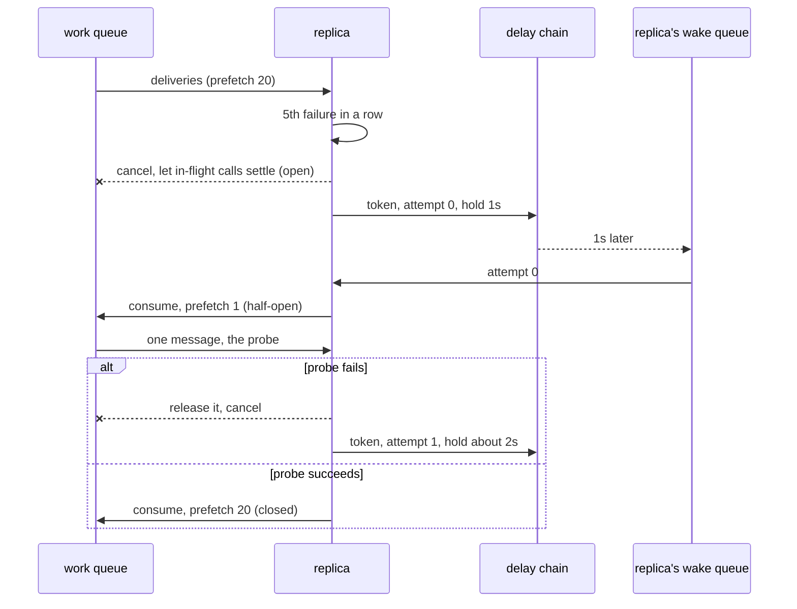
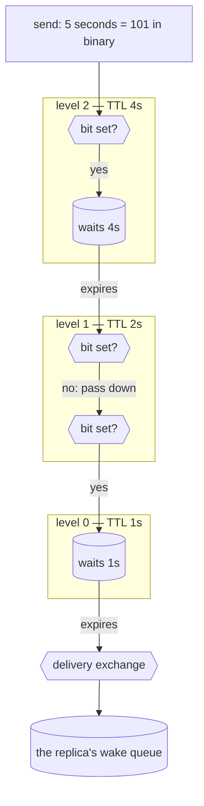

# A circuit breaker with no memory: keeping the open state in RabbitMQ

*Part 4 of the circuit-breaker series. Part 2 put a breaker inside each
consumer. This one moves everything that breaker remembered into the broker.*

*Since written, the consumer has become an SDK with one breaker per
dependency; the README covers what was built on this.*

The breaker in part 2 was a library object. Its state — closed, open,
half-open, how long until the next probe — lived in the memory of five
processes, and the only thing it could do with a message while open was reject
it, wait a hundred milliseconds, and hand it back.

That worked, and it cost something we had not counted. In a 20-second total
outage, five replicas made 50 calls that reached the failing third party. The
dead-letter queue grew by **2,745**.

Nothing was wrong with those 2,745 messages. An open breaker rejects locally
and requeues, a requeue spends one of the message's four delivery attempts,
and a message rejected four times is dead-lettered. Fifty real failures
cannot account for 2,745 dead letters; that is the mechanism the numbers point
to (I did not instrument the old build to watch it).

The fix is not a better hold. It is to stop rejecting. An open breaker should
receive nothing, and the thing that ends the silence should be a message the
broker keeps, so that it can be as long as it needs to be — a minute, or a day.

## Open is a consumer that isn't there

RabbitMQ already has a way to say "no more work for this process": cancel the
consumer. Messages stay in the queue, no delivery reaches the replica, no call
is made, nothing is requeued and nothing spins. The breaker becomes three
facts about the broker:

| phase | what the broker sees | leaves when |
| --- | --- | --- |
| **closed** | a work consumer at full prefetch | 5 calls in a row fail |
| **open** | *no* consumer; a wake token is in flight, addressed to this replica | the token comes back |
| **half-open** | a consumer with prefetch 1 — the first message it gets is the probe | probe succeeds → closed; fails → open again, longer |



The only thing a process still keeps while closed is the counter that decides
to trip: how many of its own calls have failed in a row. Everything after that
is in RabbitMQ. The token carries the attempt number, so the growing hold —
`initial · 2^attempt`, capped, jittered into its upper half so replicas that
tripped together do not return together — is read off the message, not off a
variable.

## The timer is the part I borrowed

A token has to come back after an arbitrary time without any consumer holding
it. RabbitMQ has per-queue message TTL and dead-lettering, and Particular
built [delayed delivery for NServiceBus](https://docs.particular.net/transports/rabbitmq/delayed-delivery)
out of exactly those two. It is a binary counter made of queues.

Level *n* is a queue whose messages all expire after exactly 2ⁿ seconds and
dead-letter into level *n−1*. A delay is written in binary in the routing key,
and each level's exchange asks one question: is my bit set? If so the message
waits in this level's queue; if not it is passed straight down. Because every
message in a queue shares one TTL, the next to expire is always the head, which
is the case per-queue TTL handles exactly and a single queue of mixed TTLs
would not.



Seventeen levels count to 131,071 seconds, just over 36 hours, so **a
24-hour hold is one ordinary durable message** — no consumer, no unacked slot,
no timer in anyone's memory. The levels are quorum queues, so it survives a
broker restart. Resolution is one second, which is fine for a breaker.

Measured against a real broker: a 5-second delay (waits in two levels, passes
through one) arrived at 5.2 s. A **100-second** delay (binary 1100100: levels 6,
5 and 2), sent, then the broker restarted ten seconds in, arrived at 100.1 s
and 100.5 s in two runs, once each.

## Chaos

A breaker that behaves in a demo is the easy half. I ran it the way the earlier
reliability work was run: real faults, injected under a traffic spike, judged
first on correctness and only then on what the breaker did.

**The bar** is per message, not from broker counters (the management API's
totals drift whenever a channel closes). Every message carries `message_id:
<run>:<n>`. The publisher reports exactly which *n* the broker confirmed; the
flaky third party reports which *n* it answered 200; and after the fleet has
drained, whatever was confirmed but never processed is either in the dead-letter
queue or lost. Nothing may be lost, and the dead-letter queue may not grow.

Each scenario runs 200 messages a second, spikes to 1,000/s the moment the
fault goes in, holds the fault for 40 seconds, restores it, and waits for every
breaker to close and the queue to empty — about 45,000 messages each.

| scenario | fault |
| --- | --- |
| `outage` | the third party answers 503 to everything |
| `outage-hang` | it accepts the call and never answers (2 s client timeout) |
| `kill-open-replica` | `docker kill` a replica while its breaker is open, restart it 3 s later |
| `kill-broker-while-open` | restart RabbitMQ with all five tokens in the chain |
| `delay-survives-broker-restart` | a 100 s delay across a broker restart |
| `partial` | 60% of calls fail — informational, no correctness claim |

Later scenarios and the application's own suite are in the README.

Every replica's log is then read back and each transition checked against the
machine (closed → open → half-open → closed or open). Not one illegal
transition in any scenario.

### Results

One run each. One rule shapes them: a failed probe, or a failure that
follows another at the same dependency, is `release`d, with no strike against
the message's four attempts. A failure that stands alone is still charged. It
trades some poison-message protection during an outage for not dead-lettering
healthy messages while the breaker is still opening.

| | sent | processed | duplicates | lost | dead-lettered | openings | peak tokens | longest hold | all closed after restore |
| --- | --- | --- | --- | --- | --- | --- | --- | --- | --- |
| `outage` | 46,861 | 46,861 | 0 | 0 | **0** | 38 | 5 | 32 s | 26 s |
| `outage-hang` | 45,704 | 45,704 | 0 | 0 | **0** | 71 | 5 | 16 s | 19 s |
| `kill-open-replica` | 48,914 | 48,914 | 0 | 0 | **0** | 35 | 5 | 36 s | 36 s |
| `kill-broker-while-open` | 46,194 | 46,194 | 0 | 0 | **0** | 34 | 5 | 27 s | 38 s |
| `delay-survives-broker-restart` | 1 | 1 | 0 | 0 | 0 | — | — | 100 s | — |
| `partial` (informational) | 46,207 | 46,207 | 0 | 0 | 12, all redriven | 93 | 5 | 19 s | 18 s |

This is the run with the 5 s heartbeat ([the run](runs/chaos-breaker-heartbeat5.json)); the
other graded scenarios (`restart-during-probe`, `kill-permit-holder`, `redrive-failover`, `overload`) passed
in it too. Earlier runs, with a 1 s heartbeat, passed the same way
([after the release rule](runs/chaos-breaker-after-fix.json), [Effect rc.116](runs/chaos-breaker-rc116.json)).

A killed replica comes back closed, and the token addressed to its
predecessor goes to a queue nobody reads: wake queues are named by a fresh
random id per process, not the hostname a restarted container keeps, which
would let a stale token wake it early (reasoned, not tested).

The broker's consumer count on the work queue matched the number of replicas
not open in 56 of 61 one-second samples in `outage` (43 of 58 when calls hang),
the misses being scrape lag: a sanity check that an open breaker has no
consumer, not a proof.

## The incident on screen

A 24-second total outage against the running stack, recorded from the Grafana
dashboard on 2026-10-02, at the compose producer's ordinary 200/s. The
dead-letter and parked queues were emptied first, so both lines start at zero.

The panels that matter here: the broker's consumer count on the work queue,
which now *is* the fleet's state, and the wake tokens in the delay chain, one
line per level. The concurrency limit at the bottom stays at 20: a `503`
outage teaches it nothing.

The [recording](media/incident.webm) runs the whole incident, start to finish.

**1 · Steady.** Five closed breakers, five consumers, no tokens, fleet closed.


**2 · The outage begins.** All five open within a millisecond of each other
(the replicas' own logs). The fleet view turns open, the consumer count on the
work queue falls to zero, and five tokens appear in the delay chain. While the
holds are still one or two seconds, replicas wake together and race for the
probe permit; the losers show in the bottom-right panel (here mostly later, when
several holds ended together after the restore). A lost race holds again at
the same length, so it does not add to the backoff.


**3 · The third party is restored.** The backlog is about 4,500 messages, held in
the queue, not spinning through it. No consumers. Tokens are still in flight,
because the holds have grown to 8–16 s; the replicas do not yet know.


**4 · Recovered.** The breakers came back at different moments: 1.4, 4.4, 6.5,
17.6 and 21.3 s after the restore, as each hold ended; in an earlier recording
all five closed within 4 s. The backlog drained as they did, and no dead
letters appeared.


## What it costs, and what it doesn't fix

- **A long hold is a late recovery.** A hold of *h* seconds means a replica
  notices the recovery up to *h* seconds late (19–38 s after the restore in
  the chaos runs). With a 24-hour ceiling, a day-long outage can leave a
  replica dark for most of another day. The ceiling is how late you are
  willing to find out, and it is now set per dependency: the ledger caps its
  hold at 300 s.
- **A lost token is a stuck breaker.** Delete a wake queue or purge a delay
  level, and that replica stays open until it restarts. A re-send timer would
  need token identity to discard the late duplicate, so the hole is documented
  rather than half-closed.
- **It does not see a partial failure.** At 60% failures it flapped (83
  openings) and dead-lettered 11 healthy messages. A failure-rate breaker was
  tried and dropped: it cost 7,000–9,000 good calls to avoid about 750 bad
  ones (article 3). The redrive added since brings such messages back.
- **Five replicas are still five breakers.** They trip and recover at their
  own moments. The fleet view (a Prometheus rule) only feeds alerts; replicas
  acting on one verdict is article 5's platform-level design.
- **One run each.** Every number above is a single run, not a distribution.

## Reproduce

```bash
docker compose up -d
node infra/incident.mjs                      # one 20 s outage, prints the summary
node infra/chaos-breaker.mjs                 # all scenarios, saved under history/runs/
node infra/chaos-breaker.mjs --list          # or pick some with --scenarios=a,b
```

The scripts use the compose service names; from the host, point `BROKER`,
`FLAKY_UPSTREAM`, `PROMETHEUS` and `RABBITMQ_MANAGEMENT` at `localhost`. The
recording is `infra/capture-incident.mjs` (needs `playwright-core`). The run
above is [`runs/chaos-breaker-heartbeat5.json`](runs/chaos-breaker-heartbeat5.json);
`chaos-breaker-before-fix.json` predates the release rule.
