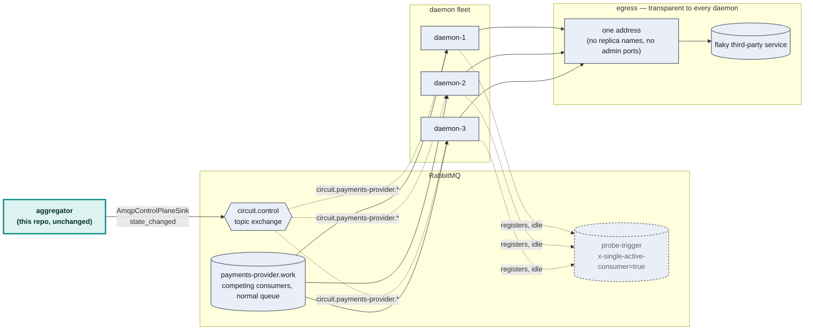
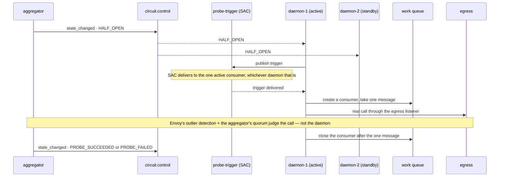

# RabbitMQ control plane

**Status: built and running end to end.** `packages/rmq` (the Effect client
+ `circuit.control` helpers), `packages/aggregator/src/
AmqpControlPlaneSink.ts` (the publisher side, mounted via `main.ts
--rmq=<host>:<port>`) and `packages/rmq-consumer` (the producer and the
daemon fleet) all exist, and `docker compose up` runs the whole scenario: one
producer flooding `payments-provider.work`, five daemon containers draining
it through the egress listener, and the aggregator publishing every
transition to `circuit.control`. The live run is written up under
[Verified end to end](#verified-end-to-end) below, including the two silent
client bugs it exposed.

## The scenario

A high-throughput RabbitMQ queue feeds several competing-consumer daemons,
each of which calls a flaky third-party service per message. When that
service degrades, the daemon fleet needs to back off — without a thundering
herd on the way down (every daemon retrying in lockstep) or on the way back
up (every daemon resuming at full throughput against a barely-recovered
service). This repo's circuit breaker events are the natural trigger for
those compensating actions; this document is about *how* they'd drive them.

## Architecture



Two things worth being explicit about, because they're the parts most likely
to be built wrong on a first pass:

- **The coordination queue (`probe-trigger`) is not the work queue.** `x
  -single-active-consumer` guarantees exactly one active consumer — apply
  that to the *work* queue and you've disabled the N-way parallelism the
  whole fleet exists for. It's scoped to a separate, always-idle queue used
  only to elect a prober during `HALF_OPEN`.
- **The daemons never learn Envoy's topology.** Same invariant as
  `infra/traffic-generator.mjs` in the main repo: one configured egress
  address, no replica names, no admin ports. Replica-level detail stays
  exactly where it already lives — the aggregator's `FleetSource.ts`.
- **Each daemon holds two connections, not one.** The control plane sits on
  a connection that only ever opens links; the work consumer and the probe
  sit on a second one the daemon destroys and rebuilds as the circuit moves.
  That looked like an implementation detail until a live run proved it is
  the difference between a daemon that survives an incident and one that
  goes silently deaf — see
  [closing a consumer with deliveries in flight](#closing-a-consumer-with-deliveries-in-flight-kills-the-connection).

## State → action mapping

A note on terminology first: this design was originally drafted in AMQP
0-9-1 terms ("prefetch"), but the client this repo actually uses speaks AMQP
1.0, and **AMQP 1.0 has no prefetch** — RabbitMQ's own comparison of the two
protocols doesn't call it a rename, it lists 0-9-1's "simple: consumer
prefetch" against 1.0's "sophisticated: link flow control and session flow
control" as different mechanisms entirely. AMQP 1.0's closest analogue,
**link credit**, isn't exposed by the pinned client at all (checked its
actual `Consumer` type and the hardcoded receiver link configuration, not
assumed — see below). So the mapping below is built on primitives that were
verified live rather than on credit control: opening and closing a consumer,
SAC election, and — for per-daemon flow control only — the timing of message
settlement, which is the one credit-adjacent lever this client leaves
reachable.

| Circuit state | Daemon fleet action | Mechanism (verified) |
|---|---|---|
| `CLOSED` | All daemons active | Every daemon consumes the work queue on its own work connection |
| `DEGRADED` | Fewer daemons active | Daemons above the target retire their work connection; the rest keep consuming |
| `OPEN` | No daemons active | Every daemon retires its work connection — the *control* connection and its subscription stay up untouched |
| `HALF_OPEN` | Exactly one daemon probes | SAC promotion on `probe-trigger`; the elected daemon opens a one-shot connection, takes a single message, and closes the consumer immediately |
| → `CLOSED` (recovery) | Ramp the active-daemon count back up (1→…→N) | Consumption resumed gradually, not all at once — never a snap to full, which is the actual thundering-herd risk on the way *back* |
| any state, per daemon | Cap concurrent third-party calls | The work handler parks at `maxInFlight` and holds its delivery unsettled, so credit stops refilling and the broker stops pushing |

Judgment of `PROBE_SUCCEEDED` vs `PROBE_FAILED` is **not** reimplemented
here — it stays with Envoy's outlier detection and the aggregator's existing
quorum logic. The elected daemon's only job during `HALF_OPEN` is to
guarantee one real call happens through the egress listener; the aggregator
decides what that call meant, exactly as it already does today.

## The `HALF_OPEN` election, end to end



If the elected daemon dies mid-probe, RabbitMQ's own SAC promotion hands the
role to a different registered consumer — no heartbeat, no hand-rolled
election, confirmed below.

## What's actually verified, and how

**Client**: [`rabbitmq-amqp-js-client`](https://github.com/coders51/rabbitmq-amqp-js-client)
— AMQP 1.0, RabbitMQ 4.x's native protocol support, not the older AMQP 0-9-1
that a library like `amqplib` speaks. Its own README describes it as an
early-stage project, which turned out to matter (see the gap below), so it
was verified directly rather than trusted from its docs.

Everything this design leans on is pinned by
`packages/rmq/test/integration/Client.test.ts` — run it with
`pnpm run test:rmq` (opt-in, needs Docker; not part of `pnpm test`). It
drives the real `@egress/rmq` service against a real
`rabbitmq:4.0-management-alpine` container via Testcontainers, and covers
five things:

```
✔ concurrent publisher creation routes each message to its own binding
✔ concurrent consumer creation binds each consumer to its own queue
✔ x-single-active-consumer elects one consumer and promotes another when it closes
✔ closing a consumer stops delivery without closing the connection
✔ closing a consumer with deliveries in flight stalls the whole connection
```

The third and fourth are the primitives the `OPEN`/`HALF_OPEN` mechanism is
built on: SAC really does elect exactly one of several registered consumers
and promote a different one when the active one closes (no election code of
our own), and closing a consumer really does stop delivery while leaving the
connection up. The other three pin client bugs, described below, and each was
confirmed to fail with its fix removed.

### Concurrent link creation is broken in this client — and silently

`AmqpControlPlaneSink` publishes each API to its own `circuit.<apiId>`
routing key via a dedicated `Publisher` per apiId, created lazily on first
delivery. The aggregator's very first tick reports on all three APIs at
once, so the first real run created three publishers *concurrently* — three
forked deliveries, each calling `createPublisher` on the same connection at
nearly the same moment.

That broke it: every message, regardless of apiId, arrived on the *first*
publisher's queue. A minimal repro nailed it down —
`Promise.all([conn.createPublisher(a), conn.createPublisher(b), conn.createPublisher(c)])`
on one connection, then one `publish` per handle, and all three messages
landed on `a`'s queue. Sequential creation (`await` each one before starting
the next) never showed the problem; only concurrent creation did.

Consumers turned out to be affected the same way, and worse: three
`createConsumer` calls in flight at once, on three different queues, left
all three consumers receiving the *first* queue's messages. So this is not
a publisher quirk — it is a race in link setup on a shared connection,
plausible for an early-stage client, and the kind of thing that only shows
up under the load shape a real system produces (every API reporting on one
tick; a daemon fleet starting N consumers at once). Both failure modes are
**silent** — no error, just plausible-looking traffic going to the wrong
place.

**Fix**: the guard lives in `@egress/rmq`'s `Client.ts`, not at any call
site — one semaphore permit owned by the connection, serializing every
operation that touches it. This is not about sharing a connection between
daemons: each daemon is its own process with its own connection, as in
production. It is about one process opening several links on its own
connection at once, which is ordinary — the aggregator creates a publisher
per API on the same tick, and a single daemon opens a control-plane
consumer, a SAC probe-trigger consumer and a trigger publisher on its
control connection at startup. At this repo's volumes the serialization
costs nothing.

`packages/rmq/test/integration/Client.test.ts` (`pnpm run test:rmq`,
opt-in, needs Docker) pins both failure modes against a real broker, along
with SAC election/promotion and cancel/resume. The two concurrency tests
were confirmed to *fail* with the semaphore temporarily removed and pass
with it restored — a regression test that passes either way would not be
worth having.

### Closing a consumer with deliveries in flight kills the connection

This one only appeared once real daemons were running, and it is the more
dangerous of the two because the symptom is *silence*, not misrouting.

After a few minutes of the live run below, one daemon stopped reacting to
`circuit.control` entirely. Its container was up, its CPU at 0.01%, its file
descriptors and TCP sockets identical to a healthy daemon's — and its
control queue had 64 undelivered messages sitting behind a consumer the
broker still considered registered. It had also taken the whole
`probe-trigger` queue down with it: as the SAC-elected consumer it was
holding the election while unable to consume, so no other daemon could be
promoted and no `HALF_OPEN` probe ran at all.

The cause is the probe's own shape. `HALF_OPEN` opens a consumer on a work
queue holding tens of thousands of messages, takes one, and closes. The
broker has already pushed a full credit window (rhea's default is 1000) of
deliveries by then; closing strands every one of them, and enough strandings
exhaust the session, taking down *every link on that connection* — including
the control-plane subscription that was never touched.

Reduced to a loop against a real broker: fill a queue with 4000 messages,
then repeatedly open a consumer, take one message, close. A long-lived
consumer on an unrelated queue on the same connection goes deaf on the
seventh cycle. No error, no close event, nothing in any log. The identical
loop with each probe on its own throwaway connection ran clean.

**Fix**: the daemon uses **two connections**, and which links live on which
is the whole point.

- The connection from the `Rmq` layer carries the control plane, and only
  ever *opens* links — the control-queue consumer, the SAC probe-trigger
  consumer, the trigger publisher — all created at startup and never closed.
  Nothing that can strand a delivery ever happens on it.
- Everything that churns gets a second connection that `daemon.ts` opens and
  destroys itself: the work consumer, torn down and rebuilt on every
  transition, and the one-message probe. Destroying the connection is what
  returns the stranded capacity, so the damage never accumulates.

`makeRmq` is exported from `Client.ts` alongside `RmqLive` for exactly this:
a connection is a scoped resource here, not a process-lifetime one. The test
above asserts both halves — that the shared-connection loop *does* stall
(so a future client release that fixes it will fail the test and tell us the
workaround can go), and that the per-probe connection does not.

A second lesson came with it: the daemon now logs a **heartbeat** every 15
seconds, independent of the control plane. Every log line it had until then
was emitted while handling a `circuit.control` message, so a daemon that had
gone deaf looked exactly like a daemon whose circuit simply had not moved.
That is why the bug survived several transitions before anyone noticed.

### A daemon can be its own thundering herd

Smaller in code, and it changed a conclusion this document had already drawn.

The first version accepted every message the moment it arrived and fired the
egress call afterwards. Draining a 50k backlog therefore meant tens of
thousands of concurrent `fetch` calls from a *single* daemon — the broker
pushes as fast as the handler returns, and a handler that only starts a
promise returns instantly. The fleet-level policy would have been scaling
daemons down while each surviving daemon hammered the recovering upstream
harder than it ever did healthy.

Capping concurrency and dropping the excess was the first fix, and it was
the wrong one: the daemons shed 32,000 messages draining one backlog, which
makes the throughput numbers meaningless and hides the pressure instead of
transmitting it.

The right lever turned out to be **when the message is settled**. AMQP 1.0
replenishes link credit on settlement, so:

- `@egress/rmq`'s `consume` now takes a handler that may return a promise,
  and accepts the delivery only once that promise settles;
- the daemon's work handler returns the egress call, and parks behind a
  `maxInFlight` gate (default 32, `MAX_IN_FLIGHT`) when saturated;
- a parked handler holds its delivery unsettled, credit stops refilling, and
  the broker stops pushing.

That is genuine backpressure all the way to the queue — the backlog stays in
the queue where it is visible, rather than in a process-local buffer or a
burst of concurrent requests. Nothing is dropped: after the fix the same
35,772-message backlog drained with 34 failures and no shedding at all.

Worth being precise about what this does and does not contradict: the
terminology note above is still right that this client exposes **no API to
set link credit**, and the receiver's link configuration is hardcoded (no
`credit_window` passthrough — `getConsumerReceiverLinkConfigurationFrom` in
the client's bundle). Settlement timing is the one credit-adjacent lever
that *is* reachable, and it is enough for backpressure even though it is not
enough to implement `DEGRADED` as credit reduction.

### Two ways the client takes the process down

Both surfaced only once the daemon was tearing connections down under load,
and both throw from inside a socket callback — where there is no listener to
attach, because the client creates a private rhea container per connection
and never exposes it.

- **`transfer after detach`.** Closing a *connection* from inside a message
  handler leaves the rest of the frames in that same TCP read addressing a
  link that no longer exists. Fixed by ordering: the probe closes its
  *consumer* inline (which is what stops delivery at the first message) and
  lets `reconcile` retire the connection later, from outside any handler.
- **`Receiver link is closed`.** A direct consequence of deferred
  settlement: `OPEN` tears down the work connection while calls are still in
  flight, and accepting those deliveries afterwards throws. Fixed in
  `Client.ts` — settlement on a vanished link is genuinely moot, since the
  broker requeues an unsettled delivery when the link goes.

A narrowly filtered `uncaughtException` handler in `rmq-consumer`'s
`main.ts` remains as a backstop for the first of these, and only for it;
every other uncaught exception is still fatal on purpose.

## Verified end to end

`docker compose up` runs the whole thing: `rabbitmq`, `rmq-producer` at
200 msg/s onto `payments-provider.work`, and `rmq-daemon-0`..`4` as five
separate containers. Failure is injected the same way the rest of the repo
does it, on the upstream rather than anywhere in this stack:

```bash
for p in 8080 8081 8082; do
  curl -sX POST http://flaky-upstream:$p/__fail -d '{"rate":1.0}'
done
```

What the live run showed:

- **All five daemons act on the same event, independently.** Each logs
  `seq=<n> (<reason>) <STATE> target=<k>/5 self=ACTIVE|idle`, and the five
  agree on target every time — no coordination between them, just the same
  event stream through the same pure `DaemonPolicy.step`.
- **`OPEN` really stops the calls.** Every daemon's `ok` counter freezes at
  the value it had when the transition landed, and the work queue's depth
  starts climbing in the management UI — the backlog is the *point*, it is
  what a fleet that stopped hammering a dead service looks like.
- **SAC picked the prober, and it was not index 0.** RabbitMQ elected
  `daemon-1`, which is the evidence that the election is the broker's and
  not our indexing: `activeIndices` would have chosen index 0 every time.
- **Killing the prober mid-incident promotes another.** `docker kill` on
  `daemon-1` during `OPEN`, and the next `HALF_OPEN` was probed by
  `daemon-4`. No election code, no heartbeat, no failover logic of ours.
- **Recovery ramps rather than snapping**, and drains cleanly. The observed
  progression was `target=0` → `1` (the `HALF_OPEN` prober) → `4` → `5`, one
  rung per event, exactly `RAMP_SCHEDULE`. The 35,772-message backlog that
  had accumulated during the outage drained to single digits with 34 failed
  calls across the fleet, no shedding, and `inFlight`/`queued` back at zero.

A representative slice of one daemon's log through the recovery:

```
seq=219 (PROBE_FAILED)        OPEN      target=0/5 self=idle   ok=0     failed=0
seq=220 (OPEN_TIMEOUT_ELAPSED) HALF_OPEN target=1/5 self=idle   ok=0     failed=0
seq=221 (PROBE_SUCCEEDED)     CLOSED    target=4/5 self=ACTIVE ok=0     failed=0
seq=221 (PROBE_SUCCEEDED)     CLOSED    target=5/5 self=ACTIVE ok=11305 failed=34
```

Every bug described above was found by this run, not by reading the client's
source.

## What's still missing

- **The ramp-back schedule advances per event, not per unit of time.** A
  "tick" is any `circuit.control` message for the API, so the pace is set by
  the aggregator's `snapshotMs` and by how often the state actually changes.
  In the live run that meant `1 → 4 → 5` in about fifteen seconds, which is
  a ramp in shape but barely one in duration. Gating each rung on elapsed
  time, or on a count of successful calls at the current rung, is the
  obvious next move and is not built.
- **`DEGRADED` was never reached in the live run.** Failing all three
  upstream ports goes straight to `ALL_ENDPOINTS_EJECTED`, and failing one
  of them still ended in `OPEN` because the backlog burst overwhelmed the
  survivors. The `DEGRADED → target = ceil(fleet/2)` path is covered by
  `DaemonPolicy.test.ts` but has not been watched happen against real
  daemons.
- **A failed call still accepts its message.** Settlement now waits for the
  call, but it accepts on failure as well as success, so a message lost to
  an outage is gone. Rejecting would requeue it straight back into the
  outage; a real deployment wants a dead-letter queue or a bounded
  redelivery budget instead, and neither is built.
- **The DEGRADED-as-credit-reduction idea is abandoned, on purpose, not
  worked around.** Checked the actual public surface rather than assumed it:
  `Consumer` exposes exactly `start()`/`close()`/`id`/`replyTo` — no method
  to grant or withdraw link credit after a consumer is created, which is the
  only lever AMQP 1.0 has for this (see the terminology note above —
  [RabbitMQ's own comparison](https://www.rabbitmq.com/blog/2024/08/05/native-amqp)
  treats 0-9-1 prefetch and 1.0 flow control as different mechanisms, not a
  rename). `DEGRADED` therefore scales the *number of active daemons* down,
  not any one consumer's credit.
