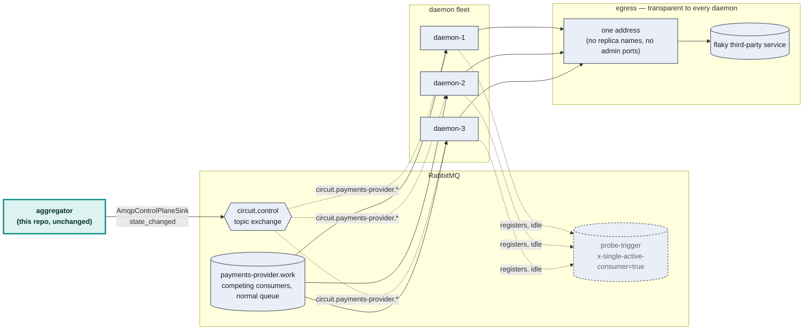
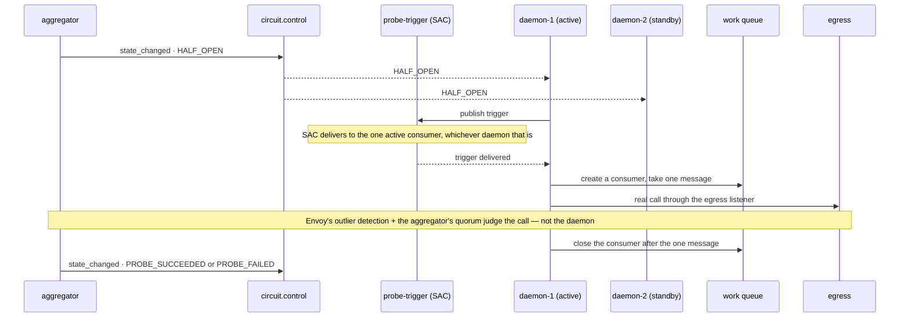

# RabbitMQ control plane: a design, not (yet) code

**Status: designed and partially verified against real infrastructure, not
built into this repo.** No package here implements the daemon side of this.
What follows is the design, diagrammed, plus what's actually been confirmed
to work versus what's still an assumption.

## The scenario

A high-throughput RabbitMQ queue feeds several competing-consumer daemons,
each of which calls a flaky third-party service per message. When that
service degrades, the daemon fleet needs to back off — without a thundering
herd on the way down (every daemon retrying in lockstep) or on the way back
up (every daemon resuming at full throughput against a barely-recovered
service). This repo's circuit breaker events are the natural trigger for
those compensating actions; this document is about *how* they'd drive them.

## Architecture



Two things worth being explicit about, because they're the parts most likely
to be built wrong on a first pass:

- **The coordination queue (`probe-trigger`) is not the work queue.** `x
  -single-active-consumer` guarantees exactly one active consumer — apply
  that to the *work* queue and you've disabled the N-way parallelism the
  whole fleet exists for. It's scoped to a separate, always-idle queue used
  only to elect a prober during `HALF_OPEN`.
- **The daemons never learn Envoy's topology.** Same invariant as
  `infra/traffic-generator.mjs` in the main repo: one configured egress
  address, no replica names, no admin ports. Replica-level detail stays
  exactly where it already lives — the aggregator's `FleetSource.ts`.

## State → action mapping

| Circuit state | Daemon action | Mechanism |
|---|---|---|
| `CLOSED` | Full prefetch | Consumer credit/prefetch set at creation |
| `DEGRADED` | Reduced prefetch | ⚠️ **Not supported by the pinned client as published** — see below |
| `OPEN` | Stop pulling new work | Close the consumer on the *work* queue only — the connection and the control-plane subscription both stay up |
| `HALF_OPEN` | Exactly one elected daemon probes | SAC promotion on `probe-trigger`; the elected daemon creates a work-queue consumer for one message, then closes it again |
| → `CLOSED` (recovery) | Ramp prefetch back up on a schedule (1→4→16→max) | Never a snap to full — snapping is the actual thundering-herd risk on the way *back*. Also blocked by the same gap as `DEGRADED`. |

Judgment of `PROBE_SUCCEEDED` vs `PROBE_FAILED` is **not** reimplemented
here — it stays with Envoy's outlier detection and the aggregator's existing
quorum logic. The elected daemon's only job during `HALF_OPEN` is to
guarantee one real call happens through the egress listener; the aggregator
decides what that call meant, exactly as it already does today.

## The `HALF_OPEN` election, end to end



If the elected daemon dies mid-probe, RabbitMQ's own SAC promotion hands the
role to a different registered consumer — no heartbeat, no hand-rolled
election, confirmed below.

## What's actually verified, and how

**Client**: [`rabbitmq-amqp-js-client`](https://github.com/coders51/rabbitmq-amqp-js-client)
— AMQP 1.0, RabbitMQ 4.x's native protocol support, not the older AMQP 0-9-1
that a library like `amqplib` speaks. Its own README describes it as an
early-stage project, which turned out to matter (see the gap below), so it
was verified directly rather than trusted from its docs.

Two claims carried real risk: that `x-single-active-consumer` behaves as
documented, and that closing a consumer truly stops delivery without
touching the connection. Both were checked against a real
`rabbitmq:4.0-management-alpine` container — three registered consumers on
one SAC queue, closing the active one outright, and close/recreate on a
normal queue — wrapped as an Effect service (`Context.Service` +
`Layer.effect` + `Data.TaggedError`, the same shape as this repo's
`FleetSource.ts`/`Coordination.ts`) rather than bare `async`/`await`, so the
connection lifecycle is `Effect.acquireRelease`-safe the same way the rest
of this codebase is:

```
=== Verification 1: x-single-active-consumer ===
SAC round 1 — receivers: daemon-A, messages: 5/5
PASS: exactly one consumer (daemon-A) received all 5 messages
--- closing daemon-A's consumer (this is what a dead daemon looks like) ---
SAC round 2 — receivers: daemon-B, messages: 5/5
PASS: RabbitMQ promoted a different consumer (daemon-B) automatically

=== Verification 2: consumer close/recreate (cancel/resume) ===
received before cancel: 3 (expect 3)
--- consumer.close() — this is what OPEN does ---
received while cancelled: 3 (expect still 3)
--- creating a new consumer on the same queue — this is what recovery does ---
received after resume: 6 (expect 6)
PASS: cancel/resume confirmed
```

That confirms the two RabbitMQ-native primitives the `OPEN`/`HALF_OPEN`
mechanism leans on, against the real broker this design would actually run
on. (One caveat in the interest of not overclaiming: this was a single clean
run against a freshly started broker — a second run reused a broker still
holding state from the first and hit a protocol error, which looks like
leftover queue/consumer state from not tearing down between runs rather than
a finding about the design; it wasn't chased further, so treat this as one
verified run, not "stable across repeated runs" the way the Redis HA
verification elsewhere in this repo is.)

## What's still missing

- **The DEGRADED action has no home in the pinned client.** Checked the
  actual public surface rather than assumed it: `Consumer` exposes exactly
  `start()`/`close()`/`id`/`replyTo` — no method to set or change
  credit/prefetch after a consumer is created. AMQP 1.0 models this as
  link credit, which `rabbitmq-amqp-js-client` does not yet expose (its own
  roadmap lists "credit/prefetch management for flow control" as in
  progress). Concretely: `CLOSED` (create at full credit), `OPEN` (close),
  and `HALF_OPEN` (create at minimal credit, close after one message) are
  all buildable today; `DEGRADED`'s live reduction *without* closing the
  consumer, and the gradual ramp-back on recovery, are not — both would
  currently have to be approximated by closing and recreating the consumer
  at a different credit level, which is a heavier operation than the design
  assumed and reintroduces some of the "reconnect cost" the design
  explicitly tried to avoid by preferring cancel over disconnect.
- **`AmqpControlPlaneSink`** — a peer to `packages/aggregator/src/Events.ts`'s
  `WebhookSink`, implementing the same `EventSink` interface, publishing to
  `circuit.control` instead of POSTing a webhook. Not written.
- **The daemon package itself** — connection handling, the state-machine
  reaction to `circuit.control` messages, the prefetch ramp schedule. Not
  written; would likely be `packages/rmq-consumer` if built, following this
  repo's existing `packages/domain` / `aggregator` / `subscriber` / `demo`
  split, using the same `Rmq` `Context.Service` shape the verification
  script above already sketches.
- **The ramp-back schedule** (1→4→16→max) is specified but its timing
  (gated on elapsed time? successful message count? both?) isn't pinned
  down — and now also blocked on the credit-control gap above.
- **No end-to-end run** wiring a real aggregator, a real `AmqpControlPlaneSink`,
  and real daemons together against the actual egress stack in this repo.
  The verification above is of RabbitMQ's primitives in isolation, not of
  the integrated system.
