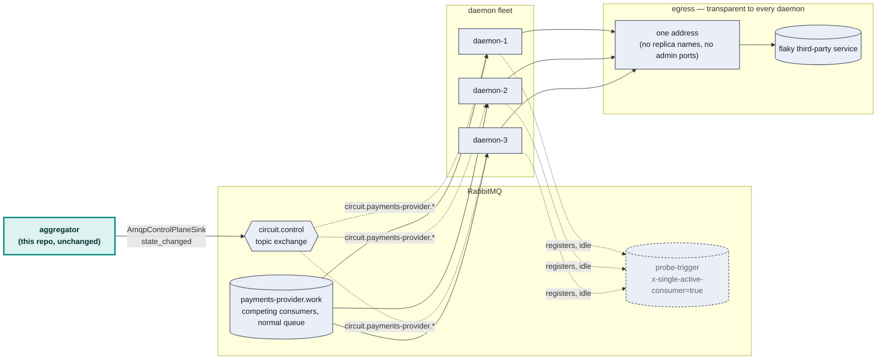
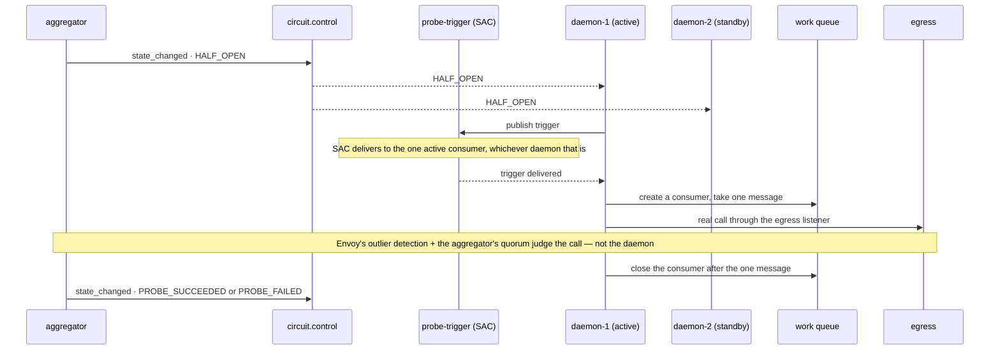

# RabbitMQ control plane

**Status: the publisher side is real, built, and running against a live
broker; the daemon fleet is not written yet.** `packages/rmq` (the Effect
client + `circuit.control` helpers) and `packages/aggregator/src/
AmqpControlPlaneSink.ts` (the sink itself, mounted via `main.ts --rmq=<host>:
<port>`) exist and are verified end to end below — a running aggregator
correctly publishes every API's events to its own routing key on a real
RabbitMQ 4.x broker. What follows the architecture section is the design for
the *consumer* side (the daemon fleet), diagrammed but not yet built as
`packages/rmq-consumer`.

## The scenario

A high-throughput RabbitMQ queue feeds several competing-consumer daemons,
each of which calls a flaky third-party service per message. When that
service degrades, the daemon fleet needs to back off — without a thundering
herd on the way down (every daemon retrying in lockstep) or on the way back
up (every daemon resuming at full throughput against a barely-recovered
service). This repo's circuit breaker events are the natural trigger for
those compensating actions; this document is about *how* they'd drive them.

## Architecture



Two things worth being explicit about, because they're the parts most likely
to be built wrong on a first pass:

- **The coordination queue (`probe-trigger`) is not the work queue.** `x
  -single-active-consumer` guarantees exactly one active consumer — apply
  that to the *work* queue and you've disabled the N-way parallelism the
  whole fleet exists for. It's scoped to a separate, always-idle queue used
  only to elect a prober during `HALF_OPEN`.
- **The daemons never learn Envoy's topology.** Same invariant as
  `infra/traffic-generator.mjs` in the main repo: one configured egress
  address, no replica names, no admin ports. Replica-level detail stays
  exactly where it already lives — the aggregator's `FleetSource.ts`.

## State → action mapping

A note on terminology first: this design was originally drafted in AMQP
0-9-1 terms ("prefetch"), but the client this repo actually uses speaks AMQP
1.0, and **AMQP 1.0 has no prefetch** — RabbitMQ's own comparison of the two
protocols doesn't call it a rename, it lists 0-9-1's "simple: consumer
prefetch" against 1.0's "sophisticated: link flow control and session flow
control" as different mechanisms entirely. AMQP 1.0's closest analogue,
**link credit**, isn't exposed by the pinned client at all (checked its
actual `Consumer` type, not assumed — see below). Rather than approximate
credit control by closing and recreating consumers, the mapping below is
built entirely on the two primitives already verified live: opening/closing
a consumer, and SAC election. No credit control anywhere.

| Circuit state | Daemon fleet action | Mechanism (verified) |
|---|---|---|
| `CLOSED` | All daemons active | Every daemon holds an open consumer on the work queue |
| `DEGRADED` | Fewer daemons active | Some daemons close their consumer, the rest stay open |
| `OPEN` | No daemons active | Every daemon closes its consumer — the connection and the control-plane subscription both stay up |
| `HALF_OPEN` | Exactly one daemon probes | SAC promotion on `probe-trigger`; the elected daemon opens a work-queue consumer for one message, then closes it again |
| → `CLOSED` (recovery) | Ramp the active-daemon count back up (1→…→N) | Consumers reopened gradually, not all at once — never a snap to full, which is the actual thundering-herd risk on the way *back* |

Judgment of `PROBE_SUCCEEDED` vs `PROBE_FAILED` is **not** reimplemented
here — it stays with Envoy's outlier detection and the aggregator's existing
quorum logic. The elected daemon's only job during `HALF_OPEN` is to
guarantee one real call happens through the egress listener; the aggregator
decides what that call meant, exactly as it already does today.

## The `HALF_OPEN` election, end to end



If the elected daemon dies mid-probe, RabbitMQ's own SAC promotion hands the
role to a different registered consumer — no heartbeat, no hand-rolled
election, confirmed below.

## What's actually verified, and how

**Client**: [`rabbitmq-amqp-js-client`](https://github.com/coders51/rabbitmq-amqp-js-client)
— AMQP 1.0, RabbitMQ 4.x's native protocol support, not the older AMQP 0-9-1
that a library like `amqplib` speaks. Its own README describes it as an
early-stage project, which turned out to matter (see the gap below), so it
was verified directly rather than trusted from its docs.

Two claims carried real risk: that `x-single-active-consumer` behaves as
documented, and that closing a consumer truly stops delivery without
touching the connection. Both were checked against a real
`rabbitmq:4.0-management-alpine` container — three registered consumers on
one SAC queue, closing the active one outright, and close/recreate on a
normal queue — wrapped as an Effect service (`Context.Service` +
`Layer.effect` + `Data.TaggedError`, the same shape as this repo's
`FleetSource.ts`/`Coordination.ts`) rather than bare `async`/`await`, so the
connection lifecycle is `Effect.acquireRelease`-safe the same way the rest
of this codebase is:

```
=== Verification 1: x-single-active-consumer ===
SAC round 1 — receivers: daemon-A, messages: 5/5
PASS: exactly one consumer (daemon-A) received all 5 messages
--- closing daemon-A's consumer (this is what a dead daemon looks like) ---
SAC round 2 — receivers: daemon-B, messages: 5/5
PASS: RabbitMQ promoted a different consumer (daemon-B) automatically

=== Verification 2: consumer close/recreate (cancel/resume) ===
received before cancel: 3 (expect 3)
--- consumer.close() — this is what OPEN does ---
received while cancelled: 3 (expect still 3)
--- creating a new consumer on the same queue — this is what recovery does ---
received after resume: 6 (expect 6)
PASS: cancel/resume confirmed
```

That confirms the two RabbitMQ-native primitives the `OPEN`/`HALF_OPEN`
mechanism leans on, against the real broker this design would actually run
on. (One caveat in the interest of not overclaiming: this was a single clean
run against a freshly started broker — a second run reused a broker still
holding state from the first and hit a protocol error, which looks like
leftover queue/consumer state from not tearing down between runs rather than
a finding about the design; it wasn't chased further, so treat this as one
verified run, not "stable across repeated runs" the way the Redis HA
verification elsewhere in this repo is.)

### A real concurrency bug, caught by running the actual sink

`AmqpControlPlaneSink` publishes each API to its own `circuit.<apiId>`
routing key via a dedicated `Publisher` per apiId, created lazily on first
delivery. The aggregator's very first tick reports on all three APIs at
once, so the first real run created three publishers *concurrently* — three
forked deliveries, each calling `createPublisher` on the same connection at
nearly the same moment.

That broke it: every message, regardless of apiId, arrived on the *first*
publisher's queue. A minimal repro nailed it down —
`Promise.all([conn.createPublisher(a), conn.createPublisher(b), conn.createPublisher(c)])`
on one connection, then one `publish` per handle, and all three messages
landed on `a`'s queue. Sequential creation (`await` each one before starting
the next) never showed the problem; only concurrent creation did. This
looks like a race in how `rabbitmq-amqp-js-client` (or the `rhea` engine
underneath) opens sender links on a shared connection — plausible for an
early-stage client, and exactly the kind of thing that doesn't show up
reading the source, only running it under the actual load shape (multiple
APIs reporting on the same tick) that the real aggregator produces.

**Fix**: every RMQ operation in `AmqpControlPlaneSink` — publisher lookup,
creation, and the send itself — now runs under one `Semaphore.withPermit`,
serializing all of it on the connection. Given this repo's publish volume
(a handful of events per incident, not per request), the cost is zero;
re-run against a fresh broker with three queues bound one per apiId, and
each received only its own events, including the same three-at-once startup
burst that surfaced the bug. The daemon fleet, when built, inherits the same
constraint: never create publishers or consumers concurrently on one
connection without serializing through something like this until upstream
confirms otherwise.

## What's still missing

- **The DEGRADED-as-credit-reduction idea is abandoned, on purpose, not
  worked around.** Checked the actual public surface rather than assumed it:
  `Consumer` exposes exactly `start()`/`close()`/`id`/`replyTo` — no method
  to grant or withdraw link credit after a consumer is created, which is the
  only lever AMQP 1.0 has for this (see the terminology note above —
  [RabbitMQ's own comparison](https://www.rabbitmq.com/blog/2024/08/05/native-amqp)
  treats 0-9-1 prefetch and 1.0 flow control as different mechanisms, not a
  rename). Rather than approximate credit reduction by closing and
  recreating consumers — heavier than the design assumed, and it
  reintroduces some of the reconnect cost the design chose cancel-over
  -disconnect specifically to avoid — the state → action mapping was
  rebuilt on only the two primitives verified above: `DEGRADED` scales the
  *number of active daemon consumers* down (some close, some stay open),
  not any one consumer's credit. `CLOSED`/`DEGRADED`/`OPEN`/`HALF_OPEN` and
  the ramp back to `CLOSED` are now all buildable on `open`/`close` and SAC
  alone — see the updated state table below.
- **The daemon package itself** — connection handling, the state-machine
  reaction to `circuit.control` messages, the active-count ramp schedule.
  Not written; would be `packages/rmq-consumer`, following this repo's
  existing `packages/domain` / `aggregator` / `subscriber` / `demo` split,
  and reusing `@egress/rmq`'s `Rmq` service directly rather than
  reimplementing the connection wrapper.
- **The ramp-back schedule** (1→4→16→max active daemons) is specified but
  its timing (gated on elapsed time? successful message count? both?) isn't
  pinned
  down.
- **No end-to-end run with real daemons.** The aggregator side is verified
  against a live broker (above); what's not yet verified is a real daemon
  fleet reacting to those events against the actual egress stack in this
  repo — that needs `packages/rmq-consumer` to exist first.
