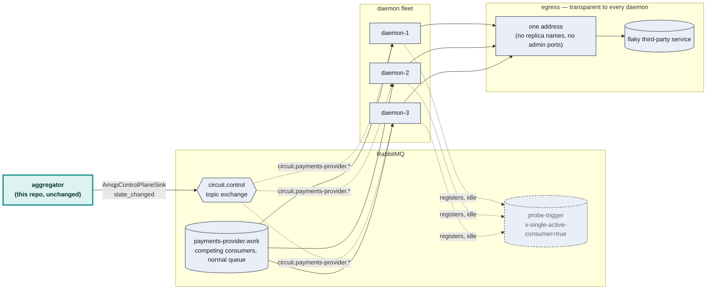
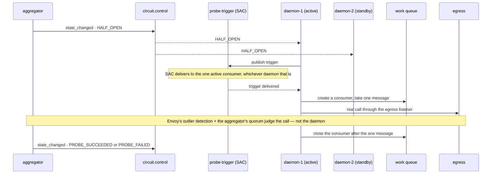
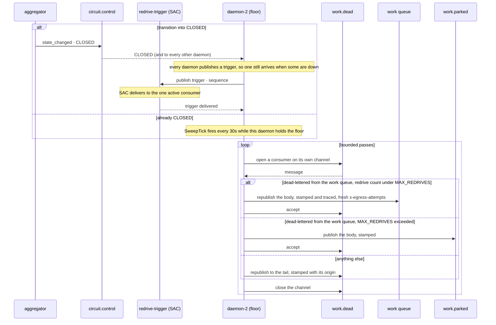

# RabbitMQ control plane

**Status: built and running end to end.** `packages/rmq` (the Effect client over
amqplib, plus the `circuit.control` helpers), `packages/aggregator/src/AmqpControlPlaneSink.ts`
(the publisher side, mounted via `main.ts --rmq=<host>:<port>`),
`packages/rmq-consumer` (the daemon fleet) and `packages/rmq-producer` (the load
that fills their queue, kept a separate component because it never reads the
circuit state). `docker compose up` runs the whole scenario: one producer
flooding `payments-provider.work`, the daemon fleet draining it through the
egress listener, and the aggregator publishing every transition to
`circuit.control`.

This describes the system as it is. What building it surfaced — the client bugs,
the dead-letter recovery, and the live runs that proved the fleet behaves — is
[history/what-the-broker-taught.md](../history/what-the-broker-taught.md), kept
separate because a record and a description age in opposite directions.

## The scenario

A high-throughput RabbitMQ queue feeds several competing-consumer daemons,
each of which calls a flaky third-party service per message. When that
service degrades, the daemon fleet needs to back off — without a thundering
herd on the way down (every daemon retrying in lockstep) or on the way back
up (every daemon resuming at full throughput against a barely-recovered
service). This repo's circuit breaker events are the natural trigger for
those compensating actions; this document is about *how* they'd drive them.

## Architecture



Two things worth being explicit about, because they're the parts most likely
to be built wrong on a first pass:

- **The coordination queue (`probe-trigger`) is not the work queue.** `x
  -single-active-consumer` guarantees exactly one active consumer — apply
  that to the *work* queue and you've disabled the N-way parallelism the
  whole fleet exists for. It's scoped to a separate, always-idle queue used
  only to elect a prober during `HALF_OPEN`.
- **The trigger on that queue is a declared message, like the event itself.**
  It carries the circuit sequence and nothing else, and the elected daemon
  turns several triggers back into one probe by keeping the highest sequence
  it has acted on. That makes the sequence's *orderability* load-bearing: it
  was hand-parsed with `Number(...)` for a while, which yields `NaN` on odd
  input, and every comparison against `NaN` is false — so a trigger nobody
  could order read as a new transition and probed again. It is a `Schema` now
  at both ends. See [decisions/007](decisions/007-message-contracts.md).
- **The daemons never learn Envoy's topology.** Same invariant as
  `infra/traffic-generator.mjs` in the main repo: one configured egress
  address, no replica names, no admin ports. Replica-level detail stays
  exactly where it already lives — the aggregator's `FleetSource.ts`.
- **Each daemon holds one connection, and a channel per consumer.** Four
  channels live for the process — the control-queue consumer, the two SAC
  election consumers, and the one every publish goes out on. The rest churn:
  the work consumer, rebuilt on every transition, the one-message probe, and a
  redrive pass. Closing a channel hands back everything it was holding unacked
  and touches nothing else on the connection.

  This was two connections per daemon until the client changed. Under AMQP 1.0
  a stranded delivery could stall every link sharing a connection, so anything
  that churned needed one of its own to destroy — the difference between a
  daemon that survives an incident and one that goes silently deaf. See
  [closing a consumer with deliveries in flight](../history/what-the-broker-taught.md#closing-a-consumer-with-deliveries-in-flight-kills-the-connection)
  for the run that proved it, and
  [decisions/004](decisions/004-downgrade-to-amqp-0-9-1.md) for why a channel
  is the right unit for the same job.

## State → action mapping

A note on terminology first: this design was originally drafted in AMQP
0-9-1 terms ("prefetch"), but the client this repo actually uses speaks AMQP
1.0, and **AMQP 1.0 has no prefetch** — RabbitMQ's own comparison of the two
protocols doesn't call it a rename, it lists 0-9-1's "simple: consumer
prefetch" against 1.0's "sophisticated: link flow control and session flow
control" as different mechanisms entirely. AMQP 1.0's closest analogue,
**link credit**, isn't exposed by the pinned client at all (checked its
actual `Consumer` type and the hardcoded receiver link configuration, not
assumed — see below). So the mapping below is built on primitives that were
verified live rather than on credit control: opening and closing a consumer,
SAC election, and — for per-daemon flow control only — the timing of message
settlement, which is the one credit-adjacent lever this client leaves
reachable.

| Circuit state | Daemon fleet action | Mechanism (verified) |
|---|---|---|
| `CLOSED` | All daemons active | Every daemon consumes the work queue on its own work connection |
| `DEGRADED` | Fewer daemons active | Daemons above the target retire their work connection; the rest keep consuming |
| `OPEN` | No daemons active | Every daemon retires its work connection — the *control* connection and its subscription stay up untouched |
| `HALF_OPEN` | Exactly one daemon probes | SAC promotion on `probe-trigger`; the elected daemon opens a one-shot connection, takes a single message, and closes the consumer immediately |
| → `CLOSED` (recovery) | Ramp the active-daemon count back up (1→…→N) | Consumption resumed gradually, not all at once — never a snap to full, which is the actual thundering-herd risk on the way *back* |
| any state, per daemon | Cap concurrent third-party calls | The work consumer's prefetch *is* `maxInFlight`, so the broker holds the next delivery until this daemon settles one |

Judgment of `PROBE_SUCCEEDED` vs `PROBE_FAILED` is **not** reimplemented
here — it stays with Envoy's outlier detection and the aggregator's existing
quorum logic. The elected daemon's only job during `HALF_OPEN` is to
guarantee one real call happens through the egress listener; the aggregator
decides what that call meant, exactly as it already does today.

## The `HALF_OPEN` election, end to end



If the elected daemon dies mid-probe, RabbitMQ's own SAC promotion hands the
role to a different registered consumer — no heartbeat, no hand-rolled
election, confirmed below.

## The redrive, end to end

Dead-lettered work is replayed onto the work queue by one daemon the broker
elects — the one holding `<apiId>.floor` — either on the transition back into
`CLOSED`, or every 30 seconds (`SweepTick`, `DaemonState.ts`) while the
circuit is already `CLOSED`. Off by default — `REDRIVE_ON_CLOSE=false` —
because whether stale work is still worth doing is a property of the
workload, not of this machinery.

The sweep exists because dead-lettering does not wait for the circuit to be
open: a broker restart advances `x-delivery-count` on deliveries that were
already outstanding, a rolling redeploy churns consumers mid-delivery, and
before [ADR 010's amendment](decisions/010-a-proxy-that-fails-on-its-own-behalf.md#amendment--2026-09-13)
an Envoy shed counted as a failed call. None of that is a recovery `CLOSED`
transition, so a redrive that fired only on that transition would leave those
messages stuck until the breaker happened to open and close again — which,
on a fleet that never trips, might be never. Both triggers share one atomic
claim (`redriveRunning` in `daemon.ts`) so a sweep landing mid-pass, or two
sweeps overlapping a long pass, is a no-op rather than a second consumer on
the same dead-letter queue.



The trigger fires on the *transition* into `CLOSED` from something else —
`reduce` checks `command.state === CLOSED && state.circuit !== CLOSED`, so a
snapshot repeating the current state every fifteen seconds does not replay
the queue forever. `SweepTick` needs no such guard: it carries no sequence to
dedupe on, runs unconditionally every 30 seconds while this daemon holds the
floor and the circuit is `CLOSED`, and is made safe to overlap the
transition-triggered pass by the `redriveRunning` claim instead.

### One pass

A pass opens its own channel on the daemon's single connection, consumes
`<apiId>.work.dead`, and decides per message:

- **Dead-lettered from the work queue, redriven fewer than `MAX_REDRIVES` (5)
  times** — republish the body onto the work queue, carrying its `message_id`
  (the idempotency key) forward and a fresh `x-egress-attempts` budget, and accept it off the
  dead-letter queue. Publish *then* accept, never the reverse: a crash between
  the two redelivers something already replayed, which is a duplicate, where
  accepting first would lose it outright. Duplicates are recoverable; losses
  are not.
- **Dead-lettered from the work queue, `MAX_REDRIVES` already reached** —
  published to `<apiId>.work.parked` instead, with a warning logged. Five
  outages' worth of a message failing every attempt is treated as poison
  rather than unlucky, so the sweep stops replaying it into an upstream it
  will only fail again.
- **Anything else** — republished to the *tail* of the dead-letter queue rather
  than released. Releasing puts it straight back at the head, where it starves
  everything behind it. One canonical dead-letter queue holds more than failed
  work — a control event that would not decode lands here too — and replaying
  that onto the work queue would be nonsense.

Provenance is the discriminator, and it has three sources in priority order: the
broker's own `x-first-death-queue` annotation while the message still has one,
this repo's `x-egress-origin-queue` stamp once an earlier pass has moved it and
the annotation is gone, and `"unknown"` for anything published straight onto the
queue by something else. Unattributable messages are kept, never guessed at.

### How a pass ends

Five ways, evaluated in this order every 200ms:

| Reason | Meaning |
|---|---|
| `circuit reopened` | `isClosed` went false — the upstream failed again mid-recovery |
| `cap reached` | `maxPerPass` messages moved (`REDRIVE_MAX`, default 5000) |
| `came full circle` | this pass met its own `x-egress-redrive-pass` stamp |
| `nothing left to replay` / `drained` | 2s without a replay, with or without parked messages |
| `deadline` | 60s hard ceiling on a single pass |

Only `cap reached` with at least one message moved starts another pass, up to 20.
Every other reason ends the run, because a pass that replayed nothing means
whatever is left is not work and more passes would only cycle it.

The pass stamp is what makes `came full circle` possible, and it is load-bearing:
without it a pass re-parks the same handful of messages tail to tail as fast as
the broker can deliver them — [measured at 17,703 republishes of two messages in
2.5 seconds](../history/what-the-broker-taught.md#one-dead-letter-queue-for-everything-and-how-to-drain-it-anyway). A
stamp from an *older* pass means only "something already decided this is not
work" and must be moved on rather than ending the lap, or one parked message at
the head makes every later redrive give up before replaying anything.

### What a replay carries, and what it resets

A replayed message keeps its `traceparent`, so it rejoins the trace that produced
it under a `work.redrive` span; RabbitMQ preserves application headers across
dead-lettering, and republishing the body alone threw that away. Only a message
that carried a parent pays for a span.

It also gets a **fresh call budget**. `x-egress-attempts` is what the daemon
spends on each call attempt now (see
[ADR 016](decisions/016-the-retry-budget-travels-with-the-message.md)), and a
redrive resets it — so the budget is three attempts per outage, not three
ever. That is deliberate and
[measured](../history/what-the-broker-taught.md#rejecting-a-message-preserves-it-only-if-the-queue-outlives-the-broker).
Redrives themselves *are* capped, by `x-egress-redrive-count`: past
`MAX_REDRIVES` (5) a message stops being replayed as work and is parked
instead — see [One pass](#one-pass) above. `x-egress-redrive-count` and
`x-egress-redrive-pass` are two different stamps; the former survives on the
message across passes, the latter is local to one pass.

### Why one daemon, and how it is held

Five daemons replaying the same backlog would make a recovery a fivefold burst at
an upstream that has just come back. The election is the broker's, on a second
`x-single-active-consumer` queue — the same mechanism as the `HALF_OPEN` prober,
with no heartbeat and no hand-rolled leader. Duplicate triggers for a transition
already acted on produce no actions: the reducer dedupes on sequence.

The pass consumer lives in the daemon's `redriveConsumer` ref, shared with
`reconcile` under one permit, so a state change retires the channel from the
other side. Teardown clears the ref only if it still points at *this* pass's
consumer — closing whatever the ref happens to hold would tear down a newer
pass's live consumer.

Replayed and parked counts are not published as application metrics — they
are read from RabbitMQ's own queue-flow metrics instead
(`rabbitmq_detailed_queue_messages_acked_total` on the dead-letter queue for
what a redrive moves, `rabbitmq_detailed_queue_exchange_messages_published_total`
on the parked queue for what it parks; see [operations.md](operations.md)).
The log line at the end of a run names the reason the pass stopped and how
many it moved and parked.

## The fleet as it runs

`docker compose up` also brings up the scenario in
the scenario above: a `rabbitmq` broker,
one `rmq-producer` publishing 200 messages/second onto
`payments-provider.work`, and five `rmq-daemon-*` containers draining it —
one third-party call per message, through the same egress listener, with no
knowledge of Envoy's topology. The aggregator publishes every transition to
the `circuit.control` exchange (`--rmq=rabbitmq:5672`), and each daemon
decides *for itself* whether to keep consuming, from its own index and the
agreed state alone.

Five separate containers rather than one process simulating five, for the
same reason there are three real Envoy replicas: the daemons have to be
independently killable, and the `HALF_OPEN` prober is elected by RabbitMQ's
`x-single-active-consumer` across real connections.

Work whose third-party call fails is **retried up to three times, then
dead-lettered onto `<apiId>.work.dead`** — and then, once the circuit closes
or the next sweep runs, replayed. The budget is the daemon's now, not the
broker's: each failed call republishes the message with `x-egress-attempts`
incremented (`Attempts.ts`), and the third failure publishes straight to
`<apiId>.work.dead` rather than going back to the queue. That is a reversal
of how this used to work — the work queue's own `x-delivery-limit: 3` used to
be the counter, because the client couldn't count and an in-process counter
would be lost the moment a message moved to another daemon. A header-carried
count has the same weakness, with one difference that makes it worth paying
for now: a broker `requeue` hands back the *original* message, with no way to
attach a header to it, and a per-attempt idempotency key only protects the
third party if every retry of an attempt carries the same one — see
[ADR 016](decisions/016-the-retry-budget-travels-with-the-message.md) for the
measurement that forced the change and what it gave up. `x-delivery-limit: 3`
stays on the queue as a backstop: a delivery that keeps coming back
*unsettled* — a daemon killed mid-call, a connection lost before the
republish — still gets dead-lettered by the broker once it exhausts that,
independent of anything the daemon's own header counted. Three rather than
more because RabbitMQ redelivers immediately, with no backoff, so each extra
attempt is more load on a third party that is already failing; what ends the
amplification is the circuit opening, which stops the daemons consuming at
all. The call budget resets on redrive, since a replayed message starts a
fresh outage — three attempts per outage, not three ever, up to
`MAX_REDRIVES` (5) outages before a message is parked instead of replayed
again. Measured, pinned by a test, and written up in
[docs/decisions/016-the-retry-budget-travels-with-the-message.md](decisions/016-the-retry-budget-travels-with-the-message.md).

**A refused request is parked, not retried.** Only a 5xx, a 408 or no
response at all spends the budget. A 429 is released uncounted, and any other
4xx is the third party refusing this request: retrying or redriving it sends
the same request for the same answer. So it goes straight to
`<apiId>.work.parked`, stamped `x-egress-origin-reason: refused-<status>`, and
counts as `outcome="refused"` in `egress_daemon_calls_total`. Until 2026-09-24
a 400 was a failure like any other: three calls, dead-lettered, then redriven
up to five times, about 15 calls for a request the third party had already
refused.

**Every queue in the fleet dead-letters to that one canonical queue** — the
work queue, both SAC election queues, and each daemon's own control queue.
The dead-letter queue itself is the only exception, because a queue that
dead-letters to itself is a cycle. This closes a second silent-loss path that
looked nothing like the first: a control event that failed the published
schema used to be logged and accepted, so the only trace of a version skew
between the aggregator and the fleet was a line in `docker logs`. It is now
rejected, which means the message that could not be read is still in your
hands. `egress_daemon_undecodable_total` counts them.

Preserving one unreadable message is right; preserving every one is not, and
the arithmetic is unkind. Control events fan out to *every* daemon's own
queue, so a schema mismatch between publisher and fleet is not one bad
message — it is every message multiplied by the fleet size, arriving on one
queue at the full event rate. Each daemon therefore preserves a bounded
sample (20) and accepts the rest, saying so once in its log;
`egress_daemon_undecodable_total` keeps counting past the bound, so the rate
stays visible after the samples stop. Measured: 25 malformed events in, 20
on the dead-letter queue, all 25 in the metric.

One canonical queue only works if whatever drains it can tell the messages
apart, and RabbitMQ 4 supplies exactly that: a dead-lettered message arrives
annotated with `x-first-death-queue` and `x-first-death-reason`. The redrive
below replays only what was dead-lettered from the *work* queue and leaves
everything else, so a poison control message is never replayed as work.

**Replayable is not the same as replayed**, though, and a dead-letter queue
nobody drains is a slower way of losing things. So `REDRIVE_ON_CLOSE` turns
on self-healing: on the transition back to `CLOSED`, and every 30 seconds
thereafter while it stays `CLOSED`, one daemon replays the dead-lettered
messages onto the work queue in bounded passes until it is empty — the
periodic sweep exists because dead-lettering keeps happening while `CLOSED`
too (a broker restart, a rolling redeploy), not only around an `OPEN`
excursion. Which daemon is the broker's decision, on a second
`x-single-active-consumer` queue — the same mechanism as the prober election
and separate from it, because five daemons each replaying the same backlog
would turn a recovery into a fivefold burst at a third party that has just
come back. A pass stops on whichever comes first: the per-pass cap, the queue
running dry, the circuit leaving `CLOSED`, or a hard deadline. A message
replayed `MAX_REDRIVES` (5) times without succeeding is parked on
`<apiId>.work.parked` instead of replayed again — see
[The redrive, end to end](#the-redrive-end-to-end) above.

It is off by default in code and on in `docker-compose.yml`, and that split is
deliberate: whether a two-minute-old payment attempt is still worth making is
a question about the workload, not about the transport. Observed on the
running stack — a 2,070-message dead-letter backlog, drained in one pass three
seconds after recovery:

```
daemon-2: redriving payments-provider.work.dead (max 5000 per pass)
daemon-2: redrive finished — 2070 replayed (drained)
```

Everything but the per-daemon control queue and the floor queue is a
**durable quorum queue**, and neither half of that was true to begin with: a
broker restart used to empty the dead-letter queue silently, because the first
daemon back redeclares it with the same name and arguments. `durable` decides
what survives the broker process; `x-queue-type` decides what survives losing
the node the queue lives on, and a quorum queue cannot be transient, so the
two are one decision. The election queues are always empty, which makes quorum
free for them and means an election survives a node loss rather than vanishing
with it.

The control and floor queues are **durable classic queues with `x-expires`**.
They are live subscriptions — a daemon that comes back relearns the circuit
state from the aggregator's next snapshot — and they used to be transient for
that reason. RabbitMQ 4.3 refuses a transient queue that is not exclusive, and
refuses it by closing the whole connection, so on the upgraded broker every
daemon crash-looped on connect. Neither can be exclusive: the floor queue is
shared by the fleet. Durable is the only option left, and it costs nothing
here. `x-expires` removes a queue ten minutes after its last consumer leaves,
which is the cleanup transience used to provide.

**A requeuing `reject` and a requeuing `nack` now mean different things, and
the client exposes both on purpose.** On RabbitMQ 4.0 both counted toward
`x-delivery-limit`. On 4.3.5 a requeuing `nack` does not: a message nacked
back onto a quorum queue with a limit of 3 was redelivered 8,954 times in
four seconds and never dead-lettered, where a requeuing `reject` still parks
it after four deliveries — the broker suite's delivery-limit test is what
caught the difference. The client's `Settlement` type splits on it
deliberately: `requeue` (`reject`) is for a delivery that was genuinely tried
and failed, spending its share of the backstop budget; `release` (`nack`) is
for a delivery held only for backpressure — a `429` that never reached the
third party — handed back with no strike against it. Using `reject` for a
shed request would dead-letter healthy work for no reason a redrive could
ever fix; see [ADR 016](decisions/016-the-retry-budget-travels-with-the-message.md).

The broker now has a volume too, so the data directory outlives the container
and not just the process. What this stack still cannot demonstrate is the
part quorum queues are actually for: **one broker is a quorum of one.** The
durability and the delivery limit are real on a single node; tolerating the
loss of a node needs three of them, and that is a deployment topology this
repo does not run.

```bash
# watch the fleet react — target=<k>/5 is the agreed active count
docker compose logs -f rmq-daemon

# take the upstream down; the queue depth is the story
curl -X POST localhost:8080/__fail -d '{"rate":1.0}'
open http://localhost:15672        # guest / guest

# kill whichever daemon the broker elected as prober, mid-incident
docker kill workspace-rmq-daemon-1

# every daemon serves the same /metrics route the aggregator does
docker compose exec prometheus wget -qO- http://rmq-daemon:9464/metrics
```

## What's still missing

- ~~**The ramp-back schedule advances per event, not per unit of time.**~~
  **Fixed.** It used to advance one rung per `circuit.control` message, so its
  pace was an accident of the aggregator's `snapshotMs` rather than a
  decision — a recovering third party got more load because a snapshot was due,
  not because the current rung was working. Rungs are now held for
  `RAMP_DWELL_MS`, and each daemon re-evaluates the policy on its own second,
  because a ramp gated on elapsed time still needs something to look at the
  clock. Measured on the running stack, from `PROBE_SUCCEEDED`:

  ```
  23:18:58.528  CLOSED  target=1/5   control=9
  23:19:02.884  ramp 1 -> 4          control=9
  23:19:07.893  ramp 4 -> 5          control=9
  ```

  `control=9` throughout: the ramp advanced with no control events at all,
  which is the whole point. The first interval reads as 4.4s rather than 5s
  because the rung clock starts at `HALF_OPEN` — one prober active *is* the
  first rung, and the transition to `CLOSED` does not restart it.

  The gate is time and not "N successful calls at this rung", which sounds
  more principled and is wrong here: every daemon must derive the same target
  from the same inputs, and a success count is per daemon, so the busy ones
  would ramp while the idle ones held and the fleet would disagree about its
  own size. A clock is the only input all five share.
- **The DEGRADED-as-credit-reduction idea is abandoned, on purpose, not
  worked around.** Checked the actual public surface rather than assumed it:
  `Consumer` exposes exactly `start()`/`close()`/`id`/`replyTo` — no method
  to grant or withdraw link credit after a consumer is created, which is the
  only lever AMQP 1.0 has for this (see the terminology note above —
  [RabbitMQ's own comparison](https://www.rabbitmq.com/blog/2024/08/05/native-amqp)
  treats 0-9-1 prefetch and 1.0 flow control as different mechanisms, not a
  rename). `DEGRADED` therefore scales the *number of active daemons* down,
  not any one consumer's credit. **Amended 2026-09-06**: amqplib does expose
  the lever, so this is a choice now rather than a constraint — and the same
  choice, for a better reason. Prefetch is fixed when a consumer is created,
  so lowering it live means cancelling and re-registering, which is the same
  operation as retiring a daemon at more risk. Scaling daemons stays the
  cheaper lever, and the one five processes can agree on with no coordination.
